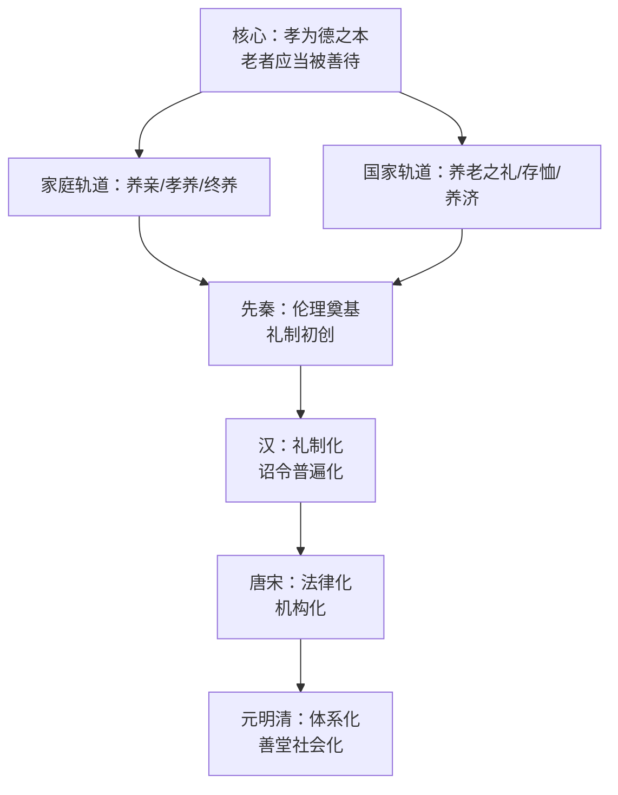

# 古人养老观念的变化

**——基于殆知阁古籍语料的考察**

---

## 目录

1. [一、绪论](#一绪论)
   - [1.1 研究目的与核心议题](#1.1研究目的与核心议题)
   - [1.2 研究方法与文献范围](#1.2研究方法与文献范围)
   - [1.3 学术史回顾与文献综述](#1.3学术史回顾与文献综述)
   - [1.4 核心概念界定](#1.4核心概念界定)
   - [1.5 古代养老观念的理论框架](#1.5古代养老观念的理论框架)
   - [1.6 本研究的创新维度](#1.6本研究的创新维度)
2. [二、先秦奠基：孝养观念的起源](#二先秦奠基孝养观念的起源)
   - [2.1 孝养观念的起源](#2.1孝养观念的起源)
   - [2.2 养老之礼的制度设计](#2.2养老之礼的制度设计)
   - [2.3 尊老敬老的伦理表达](#2.3尊老敬老的伦理表达)
   - [2.4 本章小结](#2.4本章小结)
3. [三、汉代：养老的国家礼制化](#三汉代养老的国家礼制化)
   - [3.1 汉代养老观念的继承](#3.1汉代养老观念的继承)
   - [3.2 高年赐爵与赐帛粟](#3.2高年赐爵与赐帛粟)
   - [3.3 三老五更与养老之礼](#3.3三老五更与养老之礼)
   - [3.4 本章小结](#3.4本章小结)
4. [四、魏晋南北朝：乱世中的养老](#四魏晋南北朝乱世中的养老)
   - [4.1 乱世背景与养老困境](#4.1乱世背景与养老困境)
   - [4.2 家训中的养老规范](#4.2家训中的养老规范)
   - [4.3 终养：去就之际的养老抉择](#4.3终养去就之际的养老抉择)
   - [4.4 佛教观念对养老的影响](#4.4佛教观念对养老的影响)
   - [4.5 本章小结](#4.5本章小结)
5. [五、唐宋：养老的法律化与社会救济](#五唐宋养老的法律化与社会救济)
   - [5.1 从礼到法](#5.1从礼到法)
   - [5.2 不孝入律](#5.2不孝入律)
   - [5.3 存恤鳏寡孤独的诏令体系](#5.3存恤鳏寡孤独的诏令体系)
   - [5.4 官办养老济养机构](#5.4官办养老济养机构)
   - [5.5 旌表孝行](#5.5旌表孝行)
   - [5.6 本章小结](#5.6本章小结)
6. [六、元明清：养老院体系与民间慈善](#六元明清养老院体系与民间慈善)
   - [6.1 元代养济院之设](#6.1元代养济院之设)
   - [6.2 明代养济院制度](#6.2明代养济院制度)
   - [6.3 清代善堂与养老](#6.3清代善堂与养老)
   - [6.4 旌表与民间慈善](#6.4旌表与民间慈善)
   - [6.5 本章小结](#6.5本章小结)
7. [七、告老致仕：士人退养制度的演变](#七告老致仕士人退养制度的演变)
   - [7.1 致仕观念的起源](#7.1致仕观念的起源)
   - [7.2 七十致仕的制度化](#7.2七十致仕的制度化)
   - [7.3 致仕官的待遇演变](#7.3致仕官的待遇演变)
   - [7.4 乞骸骨与告老：退养的话语](#7.4乞骸骨与告老退养的话语)
   - [7.5 本章小结](#7.5本章小结)
8. [八、文学与民俗中的养老实态](#八文学与民俗中的养老实态)
   - [8.1 养儿防老：民间的养老期待](#8.1养儿防老民间的养老期待)
   - [8.2 二十四孝的故事流变](#8.2二十四孝的故事流变)
   - [8.3 文学中的弃老与批判](#8.3文学中的弃老与批判)
   - [8.4 养老送终的民俗图景](#8.4养老送终的民俗图景)
   - [8.5 本章小结](#8.5本章小结)
9. [九、历史变迁与全书总结](#九历史变迁与全书总结)
   - [9.1 养老观念的演变分期](#9.1养老观念的演变分期)
   - [9.2 一核双轨：贯穿始终的结构](#9.2一核双轨贯穿始终的结构)
   - [9.3 同名而异实："尊老"的不变与变](#9.3同名而异实尊老的不变与变)
   - [9.4 余论：材料的边界与未竟之问](#9.4余论材料的边界与未竟之问)
   - [9.5 全书小结](#9.5全书小结)
10. [十、参考文献](#十参考文献)
   - [一、经典与史书类](#一经典与史书类)
   - [二、家训与律令类](#二家训与律令类)
   - [三、类书与政书类](#三类书与政书类)
   - [四、文集笔记类](#四文集笔记类)
   - [五、小说戏曲类](#五小说戏曲类)
11. [十一、附录：核心文献原文精录](#十一附录核心文献原文精录)
   - [附录一：《孝经》养老相关章精录](#附录一《孝经》养老相关章精录)
   - [附录二：《礼记·王制》养老之礼精录](#附录二《礼记王制》养老之礼精录)
   - [附录三：《汉书·文帝纪》元年养老诏精录](#附录三《汉书文帝纪》元年养老诏精录)
   - [附录四：《唐律疏议》十恶"不孝"条精录](#附录四《唐律疏议》十恶不孝条精录)
   - [附录五：《大明会典》养济院条（"恤孤贫"）精录](#附录五《大明会典》养济院条恤孤贫精录)
   - [附录六：《全相二十四孝诗选》选录](#附录六《全相二十四孝诗选》选录)
   - [附录七：语料版本与考据说明](#附录七语料版本与考据说明)

---

## 一、绪论

### 1.1 研究目的与核心议题

"养老"二字，在今天几乎是一个社会保障术语；但在古代中国，它首先是一套伦理、一套礼制、一套贯穿个人生命历程与王朝治理的观念体系。从《礼记·王制》"凡养老之礼"的隆重仪式，到汉代诏令中"赐高年爵帛"的具体条文；从《孝经》"身体发肤，受之父母"的道德起点，到明清养济院收养孤老的官府文书——"如何对待老人"的问题，在两千多年里被反复书写、反复制度化，又在每个时代呈现出不同的面貌。

本研究的目的，是依据殆知阁古籍语料库中的原始文献，系统考察中国古代养老观念的历史变化。所谓"养老观念"，指古人关于"老人应当如何被对待、由谁来赡养、以何种方式安度晚年"的一整套看法，包括家庭伦理层面的孝养之道、国家礼制层面的尊老之仪、法律层面的强制规范，以及社会救济层面的恤老之政。本研究围绕三个核心议题展开：第一，养老观念的思想源头是什么，先秦儒家如何把"养老"从家庭私德提升为政治伦理；第二，养老如何从一种伦理倡导逐步变为国家制度——汉代的礼制化、唐宋的法律化、元明清的机构化，各自完成了什么转变；第三，在制度与伦理之外，普通人的养老实态是怎样的，文学与民俗为我们保留了哪些不同于官方叙事的面孔。

### 1.2 研究方法与文献范围

本研究采用语料库实证方法：所有论述均建立在对古籍原文的直接阅读与引用之上，每条引文都经过逐字核对，并标注书名、卷次（篇名、回目）与行号，做到可回查、可复核。不以传世常识或今人概括代替史料，不在材料空白处做推测性填补；凡材料薄弱或仅见孤证之处，均如实注明。

> 本研究所用语料为殆知阁古籍文献库官方修订版（`daizhige-org/daizhigev20`），`data` 分支，2026 年 9 月 12 日提交（短提交号 `e9e11f1`，完整哈希 `e9e11f19b7e6bd9c1284bbdab71d2a9cb94d637c`）。旧版 `garychowcmu/daizhigev20` 因文字讹误较多，已弃用。

文献范围以本地已下载的五藏为主：儒藏（经部经典及注疏，为先秦至汉唐养老思想的核心依据）、史藏（正史、实录、政书、会典、方志，为制度史论证的主干）、子藏（诸子、家训、类书、小说，为思想与社会生活的重要补充）、医藏（涉及老年疾病与养生处酌情参考）、集藏（文集、笔记、戏曲，为观念传播与实态的佐证）。各类文献按其性质使用：正史、实录、政书、会典用于制度史的核心论证；家训、经典、方志、文集、笔记按材料性质使用；小说、戏曲仅用于社会生活、观念传播与文学呈现，不代替制度事实。

研究分三步进行：先以约五十个关键词（养老、养亲、孝养、致仕、告老、三老五更、鳏寡孤独、养济院、普济堂、不孝、二十四孝等）在全库检索，获得十六万余条命中；再按章节主题回原文逐条核读，剔除比喻义与无关借用，整理出数百条有效证据；最后按"原文引文＋白话讲解"的方式组织成文，每章末附小结，全书末附参考文献与核心文献原文精录。

### 1.3 学术史回顾与文献综述

关于中国古代养老问题的研究，近代以来已有不少成果，涉及孝道伦理、养老制度、社会福利诸方面。但本研究不拟在此复述一套无法由手头语料验证的学术史——依循"只写语料能支撑的内容"这一铁律，本节仅说明两点。

其一，本研究的立足点是语料库实证。传统研究多依赖研究者个人的阅读积累，征引面相对集中；本研究以后设关键词对五藏文献做全覆盖检索，使证据的广度与分布本身成为研究对象——例如"致仕"一词在史藏中出现四万余次，而"养儿防老"仅二十余次，这种分布差异本身就映照出官方叙事与民间话语的不同权重。

其二，本研究的问题意识是"变化"。既有论述常将"尊老敬老"作为贯穿古今的恒定价值来描写，本研究则试图呈现其内部的历史层次：先秦的养老之礼是贵族政治的仪式，汉代把它变成皇帝诏令中的普遍恩惠，唐代把它写进刑律，明清把它变成遍布府州县的养济院——"尊老"二字未变，其制度载体与社会含义已经几经更易。抓住这种"同名而异实"的变化，是本研究区别于泛泛而谈的关键。

### 1.4 核心概念界定

- **养老**：本义为奉养年老之人。古籍中用法有三层：一指家庭赡养父母（"养老送终"）；二指国家以礼优待老人（"养老之礼""行养老之礼"）；三指官府收养孤老（"养济院养老"）。三层含义在不同时代各有侧重，本书行文将随文辨明。
- **养亲**：赡养双亲，侧重家庭内部的奉养行为，与"养老"的国家礼制义相区别。
- **孝养**：以"孝"为伦理依据的奉养，强调奉养不仅是物质供给，更包含敬爱之心（"色难""养志"）。
- **存恤**：帝王或官府对鳏寡孤独、老疾无依者的存问与赈恤，是自上而下的救济话语。
- **致仕**：官员年老致政、交还官职以归养，是士人生命历程中制度化的"退养"环节；"告老""乞骸骨""休致"为其异名或相关表述。
- **终养**：子女为奉养父母而辞官归家，"终养"之请是否获准，是观察国家与家庭伦理张力的窗口。

### 1.5 古代养老观念的理论框架

综合全书证据，古代中国的养老观念可提炼为一个"一核—双轨—四阶段"的框架。

核心是儒家"孝"伦理：老人应当被善待，这一点两千年未曾动摇。双轨是指养老责任始终在家庭与国家两条轨道上并行——家庭负责"养亲"，国家负责"养老之礼"与"存恤"；两条轨道时而互补、时而张力（如"终养"之争）。四阶段是本研究划分的历史分期：先秦奠基、汉代礼制化、唐宋法律化与机构化、元明清体系化。每一阶段，养老观念的载体都在变化：从仪式到诏令，从诏令到刑律，从刑律到遍布全国的养济院网络。

### 1.6 本研究的创新维度

1. **以"变化"为纲**：不把"尊老敬老"当作静止的传统美德来歌颂，而把它当作一个历史变量，追踪其制度载体与社会含义的历时演变。
2. **全库检索的证据广度**：以后设关键词对五藏文献做系统检索，使论证建立在可统计、可回查的证据分布之上，而非零散的读书札记。
3. **双轨并观**：将家庭伦理的"养亲"与国家制度的"养老"放在同一框架下考察，揭示二者之间的互补与张力（如终养之请、旌表之制）。
4. **文类自觉**：严格区分正史政书的制度证据与小说戏曲的社会生活证据，使"观念史"与"制度史"各得其所。
5. **引文可核**：每条引文标注书名卷次行号并逐字核对，附录精录核心文献长段，读者可循号查原文。

---

## 二、先秦奠基：孝养观念的起源

先秦是古人养老观念的奠基时代。儒家经典以"孝"为德之本、仁之本，将奉养父母确立为一切伦理的起点；同时以"凡养老"之礼把尊老敬老纳入国家制度，使"养"从家庭私德扩展为王道政治的内容；孟子更以"老吾老以及人之老"完成由家及国的推恩，为后世两千年的养老论述立下了不可逾越的起点。所谓"奠基"，正在于此：后世养老观念的一切变化——或重申，或损益，或偏离而复返——都是在先秦立下的这三重基石之上展开的。本章依据《孝经》《论语》《孟子》《礼记》《周礼》诸条证据，分别论述孝养观念的起源、养老之礼的制度设计，以及尊老敬老的伦理表达。

### 2.1 孝养观念的起源

儒家孝养观念的源头，在《孝经》开宗明义对"孝"的完整界定，在《论语》以孝弟为仁之本的伦理奠基，更在孟子"养志"与"养口体"之辨中达到的理论自觉。三者层层递进：孝经立其纲，论语奠其基，孟子极其致。

《孝经·开宗明义章第一》为全书总纲，开篇即以"孝之始"与"孝之终"确立孝道的完整形态：

> 身体发肤，受之父母，不敢毁伤，孝之始也。立身行道，扬名于后世，以显父母，孝之终也。夫孝，始于事亲，中于事君，终于立身。

这段话传为曾子记孔子之言。人的身体发肤都受之于父母，爱惜保全、不敢毁伤，只是孝道的起点——"不敢毁伤"四字，确立了身体发肤的受赠性质：身体不是个人可以任意处置的私物，而是父母所赐、须加爱惜的托付；后世"终养""致仕"诸制中对亲丧、亲老的郑重，皆由此身体观而来。真正的完成则在于立身行道、扬名后世，使父母之名因之显扬。"夫孝，始于事亲，中于事君，终于立身"更把孝展开为一条贯穿人生的道路：始于家庭中的事亲，终于社会中的立身。孝养首先是对父母身体的养护，但不止于此——它还要求子女以自身的德业光显父母，使"养"从奉养身体延伸为对家族名誉的责任。值得注意的是全书的结构：自天子章至庶人章，孝贯通上下，"孝无终始"；而开宗明义章以"夫孝，德之本也，教之所由生也"总括之，孝被确立为一切德行与教化的总根源。这意味着养老观念自诞生之初就不是孤立的家庭琐事，而是整个伦理秩序的枢纽——后世"养老"观念中"养体"与"养志"的二分、"生养死葬"的全程关怀，其思想源头正在这里。

同书《庶人章第六》将孝落实到生计层面，"养"字第一次与孝直接绑定：

> 用天之道，分地之利，谨身节用，以养父母，此庶人之孝也。故自天子至于庶人，孝无终始，而患不及者，未之有也。

庶人没有爵禄之养，其孝就在于"用天之道，分地之利"——顺应天时、尽地之利以从事生产，再"谨身节用"，把积蓄用于奉养父母。与天子"爱敬尽于事亲，德教加于百姓"之孝相比，庶人之孝最为朴素：让父母在物质上得到供养，不饥不寒。这里的"孝养"是养老观念的物质起点：孝首先体现为经济行为——生产、节用、供养。后世一切关于"养亲费"、"侍丁"（免除徭役以养亲）、"终养"（辞官归养）的讨论，都要回到这个起点：孝养以物质供奉为基础，没有生计层面的"养"，一切高论都是空谈。而"自天子至于庶人，孝无终始"一句尤为关键：孝养不是贵族的专利，而是贯通上下、无始无终的普遍义务。这为养老观念从一家之私走向天下之公，埋下了最初的伏笔。

《论语·学而第一》载有子之言，将孝弟确立为仁学的逻辑起点：

> 有子曰：“其为人也孝弟，而好犯上者，鲜矣；不好犯上，而好作乱者，未之有也。君子务本，本立而道生。孝弟也者，其为仁之本与！”

孝顺父母、敬爱兄长的人，很少有喜好触犯上位者的；不好犯上而喜好作乱的，更是从未有过。君子致力于根本，根本确立了，道便由此生长。孝弟，就是仁的根本。有子此言把"孝"从单纯的家庭伦理提升为整个儒家伦理大厦的根基：仁、义、礼、智皆由此生发，"本立而道生"——养老之道，亦由此根本而生。这一奠基的意义在于：奉养父母不是可有可无的私德，而是"仁"得以成立的前提；养老伦理不能还原为功利计算或情感好恶，它先于一切推论而存在。正因如此，后世以"不孝"入律、以"孝廉"举士、以"终养"夺情，都有了最终的理据：孝既为仁之本，则不孝就是对伦理根本的背叛。养老观念的伦理地基，正是在这里打下的。

《论语·为政第二》子游问孝，孔子以"敬"字划出人之养与犬马之养的界限：

> 子游问孝。子曰：“今之孝者，是谓能养。至于犬马，皆能有养。不敬，何以别乎？”

"今之孝者，是谓能养"——孔子首先点出时俗之弊：当时人所谓的孝，不过是"能养"，供给父母饮食而已。随即反问：就连犬马，也都能得到饲养；如果奉养父母时没有敬意，又凭什么与饲养犬马区别开来？犬马之喻极为尖锐：一针见血地指出，无敬之养只是"饲"，不是"养"。"敬"由此成为**孝养**之魂：养必以敬，无敬则养与饲无别。《孝经·纪孝行章》详列"孝子之事亲也，居则致其敬，养则致其乐，病则致其忧，丧则致其哀，祭则致其严。五者备矣，然后能事亲"——养亲贯穿居、养、病、丧、祭的全程，而"养则致其乐"与此同旨：养亲要使亲心安乐。《礼记·内则》更详列奉养之节——"问衣燠寒，疾痛苛痒，而敬抑搔之。出入，则或先或后，而敬扶持之"——问寒问暖、搔痒扶持，处处以"敬"贯穿。敬的提出，意味着孝养从物质供给升华为人格性的对待：父母不是被饲养的对象，而是被敬重的主体。这是"养志"说的先声，也是后世一切"孝养"之辨的思想门槛。

《孟子·离娄上》以曾子、曾元养亲之对比，提出"养志"与"养口体"之辨，为先秦孝养思想的最高理论成就：

> 曾子养曾晳，必有酒肉。将彻，必请所与。问有馀，必曰：‘有。’曾晳死，曾元养曾子，必有酒肉。将彻，不请所与。问有馀，曰：‘亡矣。’将以复进也。此所谓养口体者也。若曾子，则可谓养志也。事亲若曾子者，可也。

曾子奉养父亲曾晳，每餐必备酒肉；撤席时必请示父亲剩菜赏给谁，父亲问还有剩余吗，他必定回答"有"。曾晳去世后，曾元奉养曾子，同样每餐酒肉，撤席时却不请示，父亲问有剩余吗，他回答"没有了"——心里想的是留下来下次再进奉。孟子评判：曾元这种只管吃饱穿暖的，叫"**养口体**"；曾子那样体察父亲心意、顺承其志的，才叫"**养志**"。两相对比，意味深长：曾元"将以复进"，看似孝心可嘉，实则是以己意揣度亲意，剥夺了父亲处置剩余酒肉的自主；曾子"必请所与""必曰有"，则是让父亲保有施予的尊严——养的不只是口腹，更是父亲作为一家之主的心志。**养志**高于养口体：前者养的是父母的心志与主体性，后者只养口腹之体。这与《礼记·内则》"孝子之养老也，乐其心，不违其志。乐其耳目，安其寝处，以其饮食忠养之"互证——"乐其心"即养志之实，"不违其志"即养志之则，"忠养"即尽心尽力之养。同篇又云"孝子之身终，终身也者，非终父母之身，终其身也"：孝养不是父母在世时的临时义务，而是子女终身的事业。《论语·为政》子夏问孝，孔子答“色难”（“有事，弟子服其劳；有酒食，先生馔，曾是以为孝乎”），正点出养志之难：和颜悦色、顺亲之心，远比代劳进食更难。由此，先秦孝养观念完成了从"养"到"敬"再到"养志"的三级跃升，为后世"养体/养志/养心"的分判立下了起点——此后两千年，凡论孝养高下，必宗此说。

### 2.2 养老之礼的制度设计

先秦的"养老"不止于家庭伦理，更被纳入国家礼制。这里须辨明一对概念："养亲"是家庭内部的奉养义务，"**养老之礼**"则是国家以礼仪制度尊养国中之老——后者是公共制度，前者是私德。儒家把二者打通：以养亲之心为本，以养老之礼为文。《礼记·王制》以"凡养老"统摄四代养老之礼的沿革，《乡饮酒义》以乡饮之礼明尊长养老，《周礼·遗人》以官仓委积养老孤——一套以年齿为序、以学校为所、以赈恤为底的制度设计，在此成型，成为后世一切优老之制的原型。

《礼记·王制》"凡养老"为养老之礼的经典制度表述，先述四代沿革，再定养级之差：

> 凡养老，有虞氏以燕礼，夏后氏以飨礼，殷人以食礼。周人修而兼用之，五十养于乡，六十养于国，七十养于学，达于诸侯。

虞代以燕礼（燕饮之礼）养老，夏代以飨礼，殷代以食礼，周代则兼采而用之；五十岁在乡里受养，六十岁在国都受养，七十岁在学校受养，并推行于诸侯之国。注意先秦原文中"养老"多作"凡养老"——这正是"养老之礼"的制度表述，与后世"养老"泛指奉养父母的用法须加区分。燕、飨、食三礼各有侧重：燕礼重亲情之欢，飨礼重仪式之隆，食礼重饮食之惠；周人"修而兼用之"，集三代之大成。养老之礼被追溯为四代相承的古制：年齿越高，受养的场所越尊（乡—国—学），礼遇的层级越隆；"达于诸侯"则表明这套礼制自王畿推及列国，非一国之私制。养老从此不再是家庭私事，而是国家以礼确认的公共制度；"老"本身，即成为受礼遇的资格。这一"以年齿定礼遇"的原则，成为后世朝廷"优老""赐爵""赐帛"诸制的共同源头——后世每一次优老之制的创设，几乎都要追述"古者养老之礼"以自明其正当性。

同篇又载四代"养国老""养庶老"之所，养老与学校制度合而为一：

> 有虞氏养国老于上庠，养庶老于下庠。夏后氏养国老于东序，养庶老于西序。殷人养国老于右学，养庶老于左学。周人养国老于东胶，养庶老于虞庠，虞庠在国之西郊。

**国老**（致仕的卿大夫等有位之老）与**庶老**（平民之老）分养于不同的学宫：虞代国老在上庠、庶老在下庠，夏代在东序、西序，殷代在右学、左学，周代国老在东胶、庶老在虞庠。名分之别通过学宫之别来体现，但关键在于：庶老亦得养于学——平民之老同样进入国家礼制的视野，养老之礼覆盖了全社会。养老之所即学校之所：尊老与养贤、教化与养老，在同一个空间里完成。老人不只是受养者，更是"先老"——礼仪的见证者与德行的化身。《文王世子》载天子视学"释奠于先老，遂设三老五更群老之席位焉。适馔省醴，养老之珍具，遂发咏焉。退修之，以孝养也"，正是此制的礼仪呈现：祭奠先老、设席三老五更、备养老之珍馔之后，"退而修之，以孝养也"——养老之礼的最终目的是教化，让观礼者皆知孝养。后世汉代举"三老"以掌教化，其制即源于此。

养老之礼的物质供给，按年齿等差精密设计，《王制》具列膳食之制：

> 五十异粻，六十宿肉，七十贰膳，八十常珍，九十饮食不离寝，膳饮从于游可也。

五十岁粮食可异于常人（精细之粮），六十岁常有肉食，七十岁饭菜加倍，八十岁常备珍馐，九十岁饮食不离卧榻、外出亦随行供奉。年齿越高，供给越丰——这是一套反向于劳役逻辑的分配原则：不是按贡献、按劳力，而是按"老"本身分配。老，意味着从生产中退出，却在分配中居上；这是先秦养老思想最富特色的一面。同制还有赐杖之阶："五十杖于家，六十杖于乡，七十杖于国，八十杖于朝，九十者天子欲有问焉，则就其室，以珍从"——拄杖通行的范围随年而扩大：五十可杖于家，六十可杖于乡，七十可杖于国，八十可杖于朝；九十之老，天子若有事询问，则亲往其室，并携带珍馐前往。膳食是物质的供给，杖是象征的尊荣，二者共同构成养老之礼的双重供给。孟子"七十者衣帛食肉"与此互证：年齿—供给的对应关系，是先秦养老之礼的核心语法，后世"给米肉""赐帛""赐杖"优老之制，皆本于此。

养老之惠更推及无子无告之老。《王制》别"孤""独""矜""寡"之名，而皆予"常饩"：

> 少而无父者谓之孤，老而无子者谓之独，老而无妻者谓之矜，老而无夫者之谓寡。此四者，天民之穷而无告者也，皆有常饩。

年少丧父称孤，年老无子称独，年老无妻称矜，年老无夫称寡：此四种人是"天民之穷而无告者"——天生的穷困而无处告助之人，都由国家按常制供给粮食（**常饩**）。"皆有常饩"的"常"字最可注意：这不是灾荒时的临时赈济，而是制度化的经常性供给。这是先秦养老观念的关键一跃：养老的对象从"吾老"（自家之老）扩展到无告之老，从家族伦理扩展为社会救济；国家的责任，从教民孝亲延伸到直接赡养鳏寡孤独。《周礼·地官·遗人》"门关之委积，以养老孤"，以官仓的委积（储备粮）赡养老人与孤儿，正是这种制度性赈恤的仓储基础——养老之政，由此有了国家的财政承担。从"老吾老以及人之老"的伦理呼吁，到"皆有常饩"的制度落实，推恩在这里完成了从理念到财政的落地；后世的存恤之政、养济院之设，皆可溯源于此。

《礼记·乡饮酒义》以乡饮之礼明尊长养老，年齿即座次：

> 乡饮酒之礼，六十者坐，五十者立侍，以听政役，所以明尊长也。六十者三豆，七十者四豆，八十者五豆，九十者六豆，所以明养老也。

乡饮酒宴上，六十岁者坐，五十岁者立侍听候差役——以此明尊长之序；六十岁三豆（菜肴三器），七十岁四豆，八十岁五豆，九十岁六豆——以此明养老之恩。座次与豆数皆以年齿为差：老者居上座，俎豆亦随年而增，礼遇被精确地量化。经文明言其教化目的："民知尊长养老，而后乃能入孝弟"——养老之礼是"成教"之本，乡人习见尊老之仪，方能入于孝弟之道。乡饮酒礼是养老之礼在乡里的日常实践：它不只行于朝廷学宫，更行于一乡一里的宴饮之间，使尊老成为百姓习见的风俗。此外《内则》载"五帝宪，三王有乞言"：养老人之余，还要"**乞言**"——咨访老人的善言，并记录为"惇史"。老人不仅是受养者，更是智慧的传授者、历史的见证者；养老之礼兼有尊贤、存史的功能。养其体，敬其德，问其言——先秦养老之礼的三重内涵，至此完备。

### 2.3 尊老敬老的伦理表达

从孝亲之私恩，到"老吾老以及人之老"的推恩，再到"以孝治天下"的政治伦理——先秦尊老敬老的伦理表达，完成了一次由家及国的意义扩张。每一次扩张，都为后世养老观念的变化规定了方向：养老不再只是"养吾亲"，而是"养天下之老"；不再只是伦理，更是政治。

《孟子·梁惠王上》提出"老吾老，以及人之老"，为推恩说的核心命题：

> 老吾老，以及人之老；幼吾幼，以及人之幼。天下可运於掌。《诗》云：‘刑于寡妻，至于兄弟，以御于家邦。’言举斯心加诸彼而已。故推恩足以保四海，不推恩无以保妻子。

尊敬自己的老人，进而推及别人的老人；爱护自己的孩子，进而推及别人的孩子——天下便可运转于掌上。引《诗》"刑于寡妻，至于兄弟，以御于家邦"为证：不过是把这种心推加到对方身上罢了。所以推恩足以保全四海，不推恩连妻子都保不住。"**推恩**"的逻辑是"举斯心加诸彼"：孝亲之心人皆有之，关键在于"推"——由"吾老"推及"人之老"，由近及远，由亲及疏。孝亲之心本是私恩，但此心可推，则家庭伦理遂具有了普遍的政治伦理意义；"天下可运于掌"更表现出一种政治自信：得此心者得天下。孟子在此回答的是一个根本问题：凭什么要求统治者关怀与自己无亲无故的老者？答案是：此心同，此理同——你之爱亲与民之爱亲并无二致，推己及人而已。同章葵丘之会盟辞"敬老慈幼，无忘宾旅"，把敬老列为诸侯盟约之条——尊老已成为诸侯共同体认可的政治价值。自此，后世论仁政、论王道，必言养老；"老吾老以及人之老"成为两千年养老论述中被征引最多的一句，其起点意义无可替代。

同篇又以庠序之教申孝悌之义，绘出"颁白者不负戴"的王道图景：

> 谨庠序之教，申之以孝悌之义，颁白者不负戴於道路矣。七十者衣帛食肉，黎民不饥不寒，然而不王者，未之有也。

认真办好学校教育，反复以孝悌的道理教导百姓，头发斑白的老人就不用在路上背负重物了；七十岁的人能穿帛吃肉，百姓不饥不寒——这样还不能称王天下的，从未有过。"颁白者不负戴于道路"是养老之政最生动的图景：白发老人免于负重劳役，本身就是王道已成的征验。老人的生存状态，成为检验政治成败的标尺——这是先秦政治思想中极富现代性的一笔。孟子又言"明君制民之产，必使仰足以事父母，俯足以畜妻子，乐岁终身饱，凶年免于死亡"：**制民之产**使百姓"仰足以事父母"，是养老之政的经济基础论。没有恒产，孝养无从谈起；养老之礼、养老之政，都须以生民之产为根。这一思想为后世"藏富于民""使民养生丧死无憾"的经济伦理开了先河：养老问题，首先是经济问题。

《孟子·尽心上》释"西伯善养老"之实，示养老之政的具体内容：

> 所谓西伯善养老者，制其田里，教之树畜，导其妻子使养其老。五十非帛不暖，七十非肉不饱。不暖不饱，谓之冻馁。文王之民无冻馁之老者，此之谓也。

所谓"西伯（文王）善于养老"，就是为百姓规划田里宅地，教他们种植畜养，引导其妻子儿女去奉养他们的老人。五十岁不穿帛就不暖，七十岁不吃肉就不饱；不暖不饱，就叫"**冻馁**"。文王治下的百姓没有受冻挨饿的老人——这就叫善养老。"善养老"成为文王之政的标志（《离娄上》载伯夷闻文王作而归之，正因"吾闻西伯善养老者"；孟子断言"诸侯有行文王之政者，七年之内，必为政于天下矣"），其要义最堪玩味：不在国家直接供养，而在"导其妻子使养其老"——使民能养其老。国家之职是制田里、教树畜，创造孝养的物质条件；具体的奉养，仍归于家庭。其“使民能养”而非“代民而养”的思路，也为后世“官助民养”的政策模式提供了最早的论证。"五十非帛不暖，七十非肉不饱"与《王制》膳食等差相呼应，同为年齿—供给对应的思想。自此，"善养老"成为后世衡量明君的标尺：凡论帝王之政，必问其于老者何如。

《论语·为政》子夏问孝，孔子答以"色难"，点出养志之难：

> 子夏问孝。子曰：“色难。有事，弟子服其劳；有酒食，先生馔，曾是以为孝乎？”

侍奉父母，和颜悦色最难。有事，子弟代其劳；有酒食，让先生先吃——难道这就是孝吗？孔子否定了以外在代劳、进食为孝的浅见："**色难**"二字，把孝养的重心从行为转向心态。代劳易，进馔易，难的是长久保持的和颜悦色——那需要内心的敬爱源源不断，非一时的殷勤可比。这与孟子"养志"说前后相通，同为先秦孝养观念"重心不重形"的伦理表达：孝养的成败，不在物质之多寡，而在心志之诚伪。由"色难"再进一步，《论语·里仁》"父母之年，不可不知也。一则以喜，一则以惧"——知父母之年，一喜父母康健，一惧时日无多，喜惧交集。这为养老观念添上了深沉的情感维度与时间意识：奉养不仅是义务，更是与时间赛跑的孺慕。后世"孝养"之论重"承欢膝下"、重"养心"，皆源于此。

《孝经·孝治章第八》言明王以孝治天下之效，孝养由家推国：

> 夫然，故生则亲安之，祭则鬼享之。是以天下和平，灾害不生，祸乱不作。故明王之以孝治天下也如此。

如此，则父母在世时能安享奉养，祭祀时鬼神能享用祭品；于是天下和平，灾害不生，祸乱不作——明王以孝治理天下的效果就是这样。"生则亲安之，祭则鬼享之"表明：孝养贯穿生死——生养与死祭一体，养老观念自始就包含"慎终追远"的向度。而"天下和平，灾害不生，祸乱不作"更赋予孝一种宇宙论效应：孝治则天人和顺。"**孝治**"即以孝为治：孝养不再只是家庭私德，而是政治合法性的来源。同书《天子章》"爱敬尽于事亲，而德教加于百姓，刑于四海"，说的正是同一推扩逻辑——事亲之爱敬，推而为德教，遍及四海。天子尤须以身作则：《礼记·文王世子》载文王为世子时“朝于王季日三：鸡初鸣而衣服，至于寝门外，问内竖之御者曰‘今日安否？何如？’”，一日三至、问安视膳，"武王帅而行之，不敢有加焉"，为后世所谓"**晨昏定省**"的典范——按：后人"晨昏定省"之语，即对《礼记·曲礼上》"凡为人子之礼，冬温而夏凊，昏定而晨省"的概括；文王日三问安，正是此礼的极致实践。自汉代"以孝治天下"成为立国之本，此章实为其思想源头。

### 2.4 本章小结

先秦奠定了古人养老观念的三重基石。其一，**孝养观念的伦理奠基**：《孝经》以"孝"为德之本，"以养父母"为庶人之孝；《论语》以"孝弟"为仁之本，以"敬"别人之养于犬马之养；孟子更以"养志"高于"养口体"，与《内则》"乐其心，不违其志"互证——孝养完成了从物质供给到敬、再到养志的层层跃升。其要义在于：养老从来不只是"能养"，而是以敬为魂、以养志为极的伦理实践；这一分判为后世一切孝养之论规定了价值序列：凡论孝，必先问敬与志，而后及于口体。其二，**养老之礼的制度设计**：《礼记·王制》"凡养老"述四代沿革，定五十、六十、七十之养级，分国老、庶老而养于学，按年齿等差其膳食杖制，更以"常饩"赡养孤独矜寡之无告者；《乡饮酒义》以年齿定坐次豆数"以明养老"，《内则》"乞言"尊老人为智慧之源——养老成为国家礼制、乡里成教与社会救济三位一体的制度。其要义在于：养老自始就是公共制度，而非家庭私事；“老”本身即受礼遇的资格；其以年齿定礼遇、以国家财政赡养无告之老的原则，成为后世优老与存恤之制反复征引的原型。其要义在于：养老自始就是公共制度，而非家庭私事；"老"本身即受礼遇的资格。其三，**由家及国的推恩伦理**：孟子"老吾老，以及人之老"把孝亲私恩推为天下公义，"颁白者不负戴""西伯善养老"以老者之温饱为王道之验，《孝经》"以孝治天下"更使孝养成为政治合法性的源泉。其要义在于：养老观念自诞生就内含政治维度，统治者对老者的态度，是其政治正当性的试金石。

先秦孝养思想的底线，可用《孝经·纪孝行章》一语概括：

> 三者不除，虽日用三牲之养，犹为不孝也。

"居上不骄，为下不乱，在丑不争"三者不除，即使每天用牛羊豕三牲奉养父母，仍是不孝。物质之丰，抵不过敬顺之缺——这正是先秦留给后世养老观念史的起点命题：养老，从来不止于"养口体"。后世两千年的变化，无论礼制如何损益、观念如何流转，都从这个起点出发：或重申之，或偏离而复返之，但从未真正离开过它。理解了这个起点，也就拿到了读懂后世养老观念变化史的钥匙。

---

## 三、汉代：养老的国家礼制化

先秦的养老之礼，是贵族政治的仪式：天子养三老五更于太学，仪节隆重，对象却是"诸侯"——一套以"教悌"为目的的上层礼制。汉代的变革在于，这套礼被皇帝的诏令接管了：从文帝"赐高年米肉"的岁首诏书，到武帝"乡里以齿，朝廷以爵"的纲领，再到明帝辟雍"初行养老礼"的国家大典，养老从伦理倡导变为**礼制化**的国家行为。与先秦的仪式不同，汉代的养老有了三个新特征：定期（岁首、秋令、巡狩皆有恩赐），定额（八十、九十两档，米肉酒帛絮各有定数），定责（长吏阅视、丞尉致送、二千石督察）。本章考察这一转变的三个层面：汉代士人如何继承先秦养老观念；高年赐爵帛粟如何从个案恩惠变为两汉相承的常制；三老五更之礼如何在帝国中心复活为国家礼典。变化的主线是清晰的：养老的受益者从贵族扩展到天下所有八十、九十以上的**高年**，养老的依据从道德劝说变为诏令与职官制度——先秦的贵族仪式，在汉代变成了皇帝诏令中的普遍恩惠。

### 3.1 汉代养老观念的继承

汉代养老制度并非凭空创制。汉初士人面对秦"亡养老之义"的历史记忆，以复述三代养老之礼为批判的武器；叔孙通制汉礼仪，诸儒讲习乡饮之礼——汉代养老的礼制化，首先是一场观念与礼仪的恢复运动。理解这一点，才能明白为什么汉代的养老诏令总是以"古之道"自居：新制度需要旧话语来背书，而旧话语也在新制度中获得了新的生命。

《史记》卷二十三《礼书》（行1195）所载"食三老五更于太学"一段，实为《礼记·乐记》"宾牟贾问"之文，述三代养老古礼：

> 「食三老五更於太学，天子袒而割牲，执酱而馈，执爵而酳，冕而总干，所以教诸侯之悌也。」

"天子袒而割牲，执酱而馈，执爵而酳"——天子亲自袒臂割牲、执酱进食、执爵进酒，仪式的高潮是最高统治者对老者的躬亲侍奉；结语"所以教诸侯之悌也"点明此礼的政治功能：以养老之仪教导诸侯行悌道。注意这里的养老对象是"诸侯"，仪式的观众与受益者都限于贵族阶层——这正是先秦养老之礼的本质：贵族政治的仪式。它不解决普通老人的温饱问题，它解决的是统治阶层的道德形象问题：天子通过侍奉老者，向诸侯展示"悌"的榜样。汉代养老制度的思想资源几乎全部取自这套古礼：明帝辟雍"执爵而酳"、贾山《至言》"亲执酱而馈"，都是对它的复演。必须说明的是，此条为《礼书》追述古礼之说，并非汉代实事；它之所以重要，在于它提供了汉人理解"养老"的模板——汉代的礼制化，始终是在"复古"的名义下进行的，而复古的内容，正是这套以天子躬亲为高潮的仪式脚本。

《汉书》卷五十一（行4095）载贾山《至言》，借三代养老之礼批评秦政：

> 「然而养三老于大学，亲执酱而馈，执爵而，祝饐在前，祝鲠在后，公卿奉杖，大夫进履，举贤以自辅弼」

"养三老于大学，亲执酱而馈"——贾山把传说中的三代之礼作为理想政治的标尺；"祝饐在前，祝鲠在后，公卿奉杖，大夫进履"，连公卿大夫都要为老者奉杖进履，养老之礼在这里与"举贤以自辅弼"相连：尊老即尊贤，养老即政治。贾山上书的对象是文帝，批评的靶子是秦"亡养老之义"：秦之亡，在贾山看来与废弃养老之礼有关——一个连养老之礼都不讲的王朝，其政治必然是刻薄寡恩的。养老观念由此成为汉初士人衡量王朝得失的一把尺子：一个王朝是否"养老"，成为其政治合法性的论据。这种"以养老论兴亡"的话语，为汉代把养老写进诏令、变成国家制度准备了舆论。文帝后来屡下养老之诏（见3.2），很难说与贾山这类士人的鼓吹毫无关系：士人提供话语，皇帝将其兑现为制度，这正是汉代"礼制化"得以发生的思想机制。注：原文"执爵而"下疑脱一字（他本多作"执爵而酳"），此据语料照录，未补。

《汉书》卷八十八《儒林传》（行4254）记汉初礼仪的恢复：

> 「于是诸儒始得修其经学，讲习大射乡饮之礼。」

"于是"承接的是叔孙通制汉礼仪之事。汉兴之初，诸儒讲习的"大射""乡饮"之礼中，**乡饮酒礼**正是先秦养老之礼在乡里的形态：乡饮酒礼以年齿为序，本身就是一套以年龄定尊卑的养老之仪。值得注意的是，讲习发生在"汉兴之初"，此时天下初定、庠序未立，养老之礼的恢复只能先从礼仪讲习做起——先有文本与仪节的整理，才有后来的制度推行。汉代养老的礼制化，首先从礼仪的讲习与恢复开始：先有诸儒讲习，后有郡国推行（见3.4），再有辟雍大典。这一条的意义在于标明起点——此时学校教育尚未恢复，养老之礼还停留在观念与礼仪讲习的层面，尚未变成定制；但正是这批讲习礼仪的儒生，为后来两汉的养老诏令与养老大典提供了礼学依据。

### 3.2 高年赐爵与赐帛粟

如果说3.1是观念与礼仪的恢复，那么高年赐爵帛粟就是养老走进现实政治的通道。汉代皇帝以诏令的形式，定期、定额、定档地赐予天下高年米、肉、酒、帛、絮，并以复除、督察配套——养老第一次有了"标准"和"考核"，从道德倡导变为行政事务。本节以武帝建元元年诏的纲领为纲，依次考察文帝元年定制、武帝元狩分等、顺帝阳嘉延续，呈现这条"从个案到常制"的线索。

武帝建元元年夏四月诏（《汉书》卷六，行522），是汉代养老礼制化的纲领：

> 「诏曰：「古之立孝，乡里以齿，朝廷以爵，扶世导民，莫善于德。然即于乡里先耆艾，奉高年，古之道也。今天下孝子、顺孙愿自竭尽以承其亲，外迫公事，内乏资财，是以孝心阙焉，朕甚哀之。民年九十以上，已有受鬻法，为复子若孙，令得身帅妻妾遂其供养之事。」」

"古之立孝，乡里以齿，朝廷以爵"——八字是全篇的纲领。乡里以年龄为序，朝廷以爵位为序，两套秩序并行不悖：前者是伦理秩序，后者是政治秩序；"扶世导民，莫善于德"，以德教化是最高的治理。诏书接着直面现实："天下孝子、顺孙愿自竭尽以承其亲，外迫公事，内乏资财，是以孝心阙焉"——想孝而不能孝，是公事与贫乏所迫；"朕甚哀之"，皇帝以"哀"介入。对策是制度性的："民年九十以上，已有受鬻法，为复子若孙，令得身帅妻妾遂其供养之事"——九十以上者，免除其子孙的徭役，使子孙能亲自供养父母。养老在这里第一次与**复除**（免除赋役）相结合：国家不再仅仅劝人行孝，而是用法令为行孝创造条件——想孝，国家就免你的徭役，让你有时间、有条件去孝。这正是"礼制化"的实质：把伦理要求翻译成可执行的制度条文。而"乡里以齿，朝廷以爵"八字，则为这种翻译提供了总原则：年龄秩序与爵位秩序并行，一个管乡里，一个管朝廷，养老之制就安放在"乡里以齿"这一端。

文帝元年三月诏（《汉书》卷四，行360），是养老之赐定制之始：

> 「又曰：「老者非帛不暖，非肉不饱。今岁首，不时使人存问长老，又无布帛酒肉之赐，将何以佐天下子孙孝养其亲？……」有司请令县道，年八十已上，赐米人月一石，肉二十斤，酒五斗。其九十已上，又赐帛人二匹，絮三斤。」

"老者非帛不暖，非肉不饱"——从老人的身体需要立论，养老首先是物质性的；"今岁首，不时使人存问长老，又无布帛酒肉之赐，将何以佐天下子孙孝养其亲"——皇帝反问：没有国家的**存问**与赐予，拿什么帮助天下子孙孝养父母？国家之赐被明确定位为"佐"子孙孝养的手段，家庭伦理与国家恩惠两条轨道在此交汇。定制随之而来："有司请令县道，年八十已上，赐米人月一石，肉二十斤，酒五斗；其九十已上，又赐帛人二匹，絮三斤"——八十、九十两档，米肉酒帛絮定额，以县道为执行单位。注意"岁首"这个时间点：诏下于元年三月，正当岁首，养老之赐从一开始就被安排在年度政令的节奏之中，有了"定期"的意味。更关键的是督责：诏书同时确立长吏阅视、丞尉致送、二千石督察之制，养老之赐有了执行链条与考核——长吏负责核查名籍，丞尉负责送达，二千石负责督察失职。从此，"赐高年"不再是皇帝一时的恩惠，而是有标准、有督察的行政事务；一个县令如果让高年"失职"（没有领到赐物），是要被问责的。

武帝元狩元年诏（《汉书》卷六，行604），遣谒者巡行天下存问致赐：

> 「其遣谒者巡行天下，存问致赐。曰：「皇帝使谒者赐县三老、孝者帛，人五匹；乡三老、弟者、力田帛，人三匹；年九十以上及鳏、寡、孤、独帛，人二匹，絮三斤；八十以上米，人三石。」」

"皇帝使谒者赐"——开篇即标明恩赐出自皇帝本人，谒者只是钦差；县三老、乡三老分等赐帛（五匹/三匹），**三老**的赐帛也有了等级。"年九十以上及鳏、寡、孤、独帛，人二匹，絮三斤；八十以上米，人三石"——九十、八十两档延续文帝之制，数额固定。值得注意的是高年与"鳏、寡、孤、独"并列：高年者被纳入国家**存恤**（存问抚恤）的对象序列，与鳏寡孤独同为"穷民"之属。养老从此有了双重身份：既是礼制性的尊老，也是救济性的恤老。巡行天下的谒者把皇帝的恩惠带到郡县，养老之赐成为帝国巡狩恩泽的固定项目。谒者"巡行天下，存问致赐"，本身就是一种政治展演：皇帝虽不能亲至郡县，但"皇帝使谒者"的名义让每一次赐帛都成为皇恩的在场证明。高年之赐由此获得了超越物质的意义——它是帝国权力深入乡里的触角。

顺帝阳嘉三年五月戊戌制诏（《后汉书》卷六，行1552–1553），见证两汉养老之赐的延续：

> 「赐民年八十以上米，\*\[人\]\*一斛，肉二十斤，酒五斗；九十以上加赐帛，人二匹，絮三斤。」

八十、九十两档，米肉酒帛并赐，措辞与标准与文帝元年诏一脉相承。从文帝元年（前179）到顺帝阳嘉三年（134），相隔三百余年，赐物的品类、档次、数额几乎未变。这说明高年之赐已经沉淀为王朝的常制：它不再依赖某个皇帝的个人好恶，而是变成了每逢庆典、巡狩、即位便可援引的成例。值得注意的是制诏的措辞——"赐民年八十以上米"，主语省略而对象明确，"民"字标明受益者是全体编户齐民，而非贵族与官吏。这是"普遍恩惠"的关键证据：养老之赐的覆盖面，在制度文本中就被设定为天下之民。注：引文保留语料原 Markdown 校勘标记"\*\[人\]\*"（他本有"人"字），照录未改。

除上述四诏外，养老之赐在两汉诏令中反复出现，已高度常态化。文帝十二年诏遣谒者劳赐三老、孝者帛人五匹，并"以户口率置三老、孝、悌、力田常员"（《汉书》卷四），三老由荣典转为常员；武帝元封元年巡行至瓠子，"赐孤、独、高年米，人四石"（《汉书》卷六），赐粟已成巡狩恩泽的固定项目；宣帝地节三年诏于假公田、贷种食之外"加赐"高年帛，并责二千石"严教吏谨视遇，毋令失职"（《汉书》卷八），养老之赐与吏治考核相系；元康元年诏更"加赐鳏、寡、孤、独、三老、孝弟、力田帛"，且"所振贷勿收"（《汉书》卷八），恩赐与蠲免并行。复除方面，《通典》卷四追述景帝"礼高年"之制："九十者一子不事，八十者二算不事"，蠲免赋役；贾山《至言》亦有"礼高年，九十者一子不事，八十者二算不事"之语可互证——此为政书追述，非原始诏令，姑存其说。

### 3.3 三老五更与养老之礼

与"赐高年"的物质恩惠并行，汉代还复活了先秦的养老之礼本身：天子亲行养老大典，"父事三老，兄事五更"。如果说赐帛粟是"养其体"，那么养老大典就是"养其名"——以最高规格的仪式确认老者在政治秩序中的尊位。这套礼在先秦是贵族的仪式，在汉代则成为帝国合法性的标配。

《汉书》卷一上《高帝纪》（行194）载高祖二年令，初置三老：

> 「举民年五十以上，有修行，能帅众为善，置以为三老，乡一人。择乡三老一人为县三老，与县令、丞、尉以事相教，复勿徭戍。以十月赐酒肉。」

"举民年五十以上，有修行，能帅众为善，置以为三老"——三老的资格首先是"年五十以上"，年高是硬条件，德行是软条件；"乡一人"，每乡置一人；"择乡三老一人为县三老，与县令、丞、尉以事相教"——县三老与县令丞尉"相教"，是教化层面的合作者而非属吏，一个"教"字点出三老的职能本质：以年高德劭教化乡里；"复勿徭戍"，免除徭役兵役，这是国家给予三老的物质优待；"以十月赐酒肉"，十月岁首赐酒肉，把养老之赐嵌入年度时令。三老从设立之初就是双重身份：既是乡官（掌教化），又是被养老的对象（复徭戍、赐酒肉）。"年五十以上"这一门槛，标志着国家第一次以年龄为标准大规模选用基层人员——养老观念渗入了职官制度。更值得玩味的是"复勿徭戍"与"赐酒肉"并列：前者是"免其所不堪"，后者是"赐其所需要"，一免一赐之间，国家对老人的态度已从单纯的役使转向养护。

《后汉书》卷二《显宗孝明帝纪》（行627–628）载永平二年"初行养老礼"，为东汉国家养老礼之始；其仪节备载于后：

> 「冬十月壬子，幸辟雍，初行养老礼。诏曰：「光武皇帝建三朝之礼，而未及临飨。」」

> 「尊事三老，兄事五更，安车挆轮，供绥执授。侯王设酱，公卿馔珍，朕亲袒割，执爵而酳。祝哽在前，祝噎在后。」

"冬十月壬子，幸辟雍，初行养老礼"——"初行"二字标明这是东汉王朝第一次举行的国家养老大典；诏书自述"光武皇帝建三朝之礼，而未及临飨"，明帝以继承光武之志的名义"复践"辟雍，养老之礼成为王朝正统性的仪式载体。仪节之隆，前所未有："尊事三老，兄事五更"——"父事""兄事"，天子以子弟之礼侍奉老者。在日常政治中，天子是天下共主、至高无上；但在养老大典的仪式时间里，天子自降为"子""弟"。这种角色倒置正是仪式的力量所在：它用最夸张的方式宣告，在"年"这个维度上，连皇帝也要服从"乡里以齿"的秩序。"安车挆轮，供绥执授"，以安车迎接，亲执车绥授之；"侯王设酱，公卿馔珍"，侯王公卿各司其职——整个统治集团都成为仪式的配角；"朕亲袒割，执爵而酳"，天子亲自袒臂割牲、执爵进酒；"祝哽在前，祝噎在后"，祝官前后侍立以防噎——与《史记·礼书》所载"天子袒而割牲，执酱而馈，执爵而酳"的古礼仪节一一相合。先秦的贵族仪式，在帝国首都的辟雍中复活，而仪式的观众已是"羣臣"与天下——养老之礼至此完成国家礼制化。

《汉书》卷九十九上《王莽传》（行4310）载居摄元年正月：

> 「明年，改元曰「居摄」。居摄元年正月，莽祀上帝于南郊，迎春于东郊，行大射礼于明堂，养三老五更，成礼而去。」

王莽在代汉前夕，把全套祭祀大礼与"养三老五更"捆绑举行。值得注意的是，连以"托古改制"著称的王莽，在养老之礼上也不敢另起炉灶，而是全套沿用汉家成礼——"成礼而去"四字，说明这套仪节在他眼中是现成的、无需改动的。这从反面证明：到西汉末年，养老之礼已经成为新王朝获取合法性的标配仪式——谁想"受命"，谁就必须"养老"。养老观念至此完成了从伦理到政治符号的转化：它不再只是"要不要尊敬老人"的问题，而是"新王朝够不够格"的试金石。

《后汉书》卷三《肃宗孝章帝纪》（行843）载元和二年东巡狩诏：

> 「诏曰：「三老，尊年也。孝悌，淑行也。力田，勤劳也。国家甚休之。其赐帛人一匹，勉率农功。」」

"三老，尊年也"——四字直接点破三老制度的本质：**尊年**。三老之所以为三老，不在其职官身份，而在其"年"之可尊。"孝悌，淑行也。力田，勤劳也"——孝悌、力田各有其表彰的理由，而三老的理由独独是"年"。这是一个值得深思的区分：孝悌表彰的是行为，力田表彰的是功劳，而三老表彰的只是"活得久"。国家以最高规格的礼遇，奖励一种无需努力、只需时间就能获得的资格——"年"本身成了价值。"其赐帛人一匹，勉率农功"——赐帛的目的是"勉率农功"，尊年与劝农并举：尊敬老人，意在使老人率领子弟努力农耕。养老之礼在这里服务于王朝的教化与生产，伦理、礼制、经济三者在"尊年"二字下合流。

东汉三老五更之制延续不绝。《后汉书》注引《汉官仪》曰"三老、五更，皆取有首妻男女全具者"，又引《续汉志》详养老之仪：先择吉日，司徒上太傅若讲师故三公人名，"用其德行年耆高者，三公一人为三老，次卿一人为五更"——三老五更的人选须德行年耆兼备，且多由致仕的三公、卿充任，养老之礼与致仕之制在此交汇（此为注引，非正文）。明帝永平二年初行之后，永平八年"冬十月……丙子，临辟雍，养三老、五更"（《后汉书》卷二），养老大典并非一次性举措，已成可重复举行的国家之礼。《通典》卷二十追述：明帝以李躬为三老、桓荣为五更，"皆以二千石禄，养终其身"；安帝以鲁丕、李充为三老，灵帝又以袁逢为三老，"赐以玉杖"——东汉历朝皆有其人，三老终身禄养几成定制（此为政书追述）。

### 3.4 本章小结

汉代养老制度的特征，可归纳为四个"化"：诏令化、常制化、贯通化、延伸化。以下四条证据，分别呈现养老之礼的中央—地方贯通、向司法领域的延伸、向季节政令的延伸，以及向官员"退养"的延伸。这四条线索共同说明：到东汉中后期，养老已经不是零散的恩惠，而是一张覆盖物质、仪式、司法、人事的制度网络。

《后汉书·礼仪志》（行9394–9395）追述明帝永平二年养老之礼的制度格局：

> 「明帝永平二年三月，上始帅髃臣躬养三老、五更于辟雍。行大射大礼。郡、县、道行乡饮酒于学校，皆祀圣师周公、孔子，牲以犬。于是七郊礼乐三雍之义备矣。」

"上始帅髃臣躬养三老、五更于辟雍"——中央层面，天子率羣臣亲行养老大典；"郡、县、道行乡饮酒于学校"——地方层面，郡县道在学校举行乡饮酒礼；"于是七郊礼乐三雍之义备矣"——中央与地方、辟雍与学校贯通为一。养老之礼不再是首都的孤立大典，而是一套自京师达于郡县的制度网络：中央有辟雍养老，地方有乡饮养老，上下相维。"皆祀圣师周公、孔子，牲以犬"一句尤其值得注意：地方乡饮酒礼的规格被统一规定，连祭祀对象与牺牲都由中央制定——这是典型的制度化操作，用标准化保证中央与地方的同质。这是"制度化"最有力的表征——一项礼仪一旦有了中央与地方两个层级的固定场所与固定仪程，就不再是人存政举、人亡政息的个案。

《汉书》卷二十三《刑法志》（行2099）载养老之恩向司法领域的延伸：

> 「三年复下诏曰：「高年老长，人所尊敬也；鳏、寡不属逮者，人所哀怜也。其著令：年八十以上，八岁以下，及孕者未乳，师、硃儒当鞠系者，颂系之。」」

"高年老长，人所尊敬也"——诏书开宗明义：尊敬高年是人之常情，法律应当顺应这种常情；"其著令：年八十以上……**颂系**之"——八十以上老人犯罪，"著令"规定不收系监狱而"颂系"（宽容系治）。"著令"二字是关键：这不是皇帝的一时宽大，而是写进法令的长期规则。养老观念至此进入刑罚领域：尊老成为量刑的法定原则。同条又记宣帝元康四年诏："朕念夫耆老之人，发齿堕落，血气既衰……自今以来，诸年八十非诬告、杀伤人，它皆勿坐"——八十以上非诬告、杀伤人重罪，一律不坐。国家对老人的优待，从"赐"与"礼"扩展到"刑"，养老之恩覆盖了老人可能面对的全部国家权力。一个八十岁的老人，在汉代同时受到三种保护：生活上有赐予，礼仪上有尊位，司法上有宽宥。

《后汉书》卷三《章帝纪》（行876）载章和元年秋令，养老延伸为季节性政令：

> 「秋，令是月养衰老，授几杖，行糜粥饮食。其赐高年二人共布帛各一匹，以为醴酪。」

"秋，令是月养衰老，授几杖，行糜粥饮食"——秋季之月，官府"养衰老"：授几杖（赐手杖以安其行），行糜粥饮食（设粥食以养其体）。"几杖"二字意味深长：几是凭几，杖是手杖，都是辅助老人行动的器具；国家授几杖，等于公开承认老人行动不便，并以实物相助，这是养老之礼中最具身体关怀的一笔。这是制度化的季节性养老之政：养老不再只依附于庆典与巡狩，而有了固定的时令——每年秋天，官府都要做这件事。"其赐高年二人共布帛各一匹，以为醴酪"——赐高年布帛，"以为醴酪"，恩赐细化到老人的饮食起居。从米肉酒帛的大宗赐予，到"醴酪"一级的饮食关怀，养老之赐的颗粒度越来越细，国家的"养老之手"伸得越来越深。

《汉书》卷七十一（行4186）载元始二年策遣老臣归老，养老覆盖官员的"退养"环节：

> 「盖闻古者有司年至则致仕，所以恭让而不尽其力也。今大夫年至矣，朕愍以官职之事烦大夫，其上子若孙若同产、同产子一人。大夫其修身守道，以终高年。赐帛及行道舍宿，岁时羊酒衣衾，皆如韩福故事。」

"盖闻古者有司年至则致仕，所以恭让而不尽其力也"——策书以"古者致仕"立论；"朕愍以官职之事烦大夫"，皇帝体恤老臣；"大夫其修身守道，以终高年"——"以终高年"四字是全篇主旨：让老臣安度晚年。"赐帛及行道舍宿，岁时羊酒衣衾，皆如韩福故事"——赐帛、沿途食宿、岁时赐羊酒衣衾，待遇一一制度化；"皆如韩福故事"表明此前已有成例（韩福为昭帝时以德行征至京师、赐策遣归者，见《汉书》昭帝纪及本传）。注意策书的双重安排："其上子若孙若同产、同产子一人"，子孙中选一人为郎，这是给家族的补偿；"赐帛……岁时羊酒衣衾"，这是给本人的待遇——国家养老在这里同时照顾了老人本人与他的家族。官员的"退养"至此也有了定制：致仕不是被抛弃，而是进入国家养老体系的另一条通道。

养老之礼下沉地方的证据还有两条。建武初司徒伏湛"奏行乡饮酒礼，遂施行也"（《后汉书》卷二十六），战乱之际犹以礼乐政化为首；建武六年李忠守丹阳，"为起学校，习礼容，春秋乡饮，选用明经"（《后汉书》卷二十一），乡饮酒礼在郡国层面春秋举行、真实推行。《通典》卷三十三追述：三老"掌教化，凡有孝子、顺孙……皆扁表其门，以兴善行"，文帝十二年又置三老及孝悌力田而"无常员"——养老与基层教化合一（此为政书追述）。

综上，汉代完成了养老观念的第一次大转型：从先秦的贵族仪式，变为皇帝诏令中的普遍恩惠。这一"国家礼制化"有四个标志。其一，从伦理到诏令：养老的依据不再是"应当如此"的道德劝说，而是"诏曰""著令"的国家意志，执行者有督察、有考核，失职者要被问责。其二，从个案到常制：八十、九十两档，米肉酒帛絮定额，自文帝至顺帝三百年一脉相承；辟雍养老大典自永平二年而下可重复举行；三老终身禄养、老臣岁时羊酒，皆有成例可援。其三，从贵族到普遍：先秦养老之礼的对象是"诸侯"，汉代诏令的受益者是天下所有年八十、九十以上的高年——"乡里以齿"的秩序第一次覆盖了帝国的人口。其四，从单一到多维：养老之恩从"赐"（物质）扩展到"礼"（仪式）、"刑"（司法优恤）、"退"（致仕待遇），再下沉为"养衰老"的季节政令与乡饮酒的地方实践。先秦的养老是"教诸侯之悌"，汉代的养老是"佐天下子孙孝养其亲"——一语之差，养老的主体从贵族变成了国家，对象从诸侯变成了万民。这正是本章所谓"礼制化"的全部含义，也是后世王朝养老制度的基本范式。

---

## 四、魏晋南北朝：乱世中的养老

汉末至隋统一的三百余年间，王朝更迭、战乱频仍。汉代以诏令与礼制维系的国家养老体系，在乱世中难以为继；养老的责任与话语，从"礼制"退回了"家庭"。一面是孝义传、隐逸传中佣力佣书、采梠捕蟹的养亲实态，一面是"终养"从个人陈情上升为制度话语；家训接过了规范养老的职责，佛教则为侍疾注入了新的宗教意义。本章即据语料证据，考察乱世中养老观念的这场退守与重构。

### 4.1 乱世背景与养老困境

汉代养老观念的一大特征，是国家以礼制与诏令直接介入养老事务——"行养老之礼"的仪式、"赐高年爵帛"的恩惠，使"养老"成为王朝政治的公共话语。魏晋南北朝的语料呈现出另一番景象：国家层面的养老礼制叙述几乎沉寂，取而代之的是孝义传、隐逸传中一则则具体的养亲故事。养老从"礼制"退回了"家庭"。

《南史·孝义传上》记南朝宋人郭世通：

> 家贫，佣力以养继母。妇生一男，夫妻恐废侍养，乃垂泣瘗之。
郭世通家贫，靠出卖劳力赡养继母。妻子生下一子，夫妻二人担心养育婴儿会荒废对继母的**侍养**，竟"垂泣瘗之"——流着泪把亲生儿子活埋。这是"瘗子养母"的郭巨式叙事在南朝的实例。无论其史实成分如何，它以最极端的方式表达了乱世养亲的困境：当家庭的资源连"养母"与"养子"二者不可兼得时，孝义叙事选择了前者。值得注意的是，这里的孝行已完全脱离任何国家礼制的支持——没有诏令、没有赐帛，只有一个贫寒家庭以劳力与牺牲完成的"侍养"。

郭世通之子戴原平，同样"禀至行"：

> 子原平字长恭，又禀至行，养亲必以己力，佣赁以给供养……父笃疾弥年，原平衣不解带，口不尝盐菜者，跨积寒暑。

"养亲必以己力"——赡养父母必须靠自己的劳力，"佣赁以给供养"，靠受雇佣工维持供养。父亲重病经年，戴原平"衣不解带"，连盐菜都不尝，这样过了几个寒暑。养亲的"劳力化"与侍疾的"身体化"在此合为一体：物质供养靠出卖体力，精神尽孝靠摧残自己的身体。父子两代相继以"佣力"养亲，构成南朝宋寒门孝义的典型图景——乱世之中，养老已退守为纯粹的家庭伦理实践，国家礼制的身影荡然无存。

视线转向北方。西晋《隐逸传》记会稽人夏统：

> 夏统，字仲御，会稽永兴人也。幼孤贫，养亲以孝闻，睦于兄弟，每采梠求食，星行夜归，或至海边，拘螊蠏以资养。

夏统自幼孤贫，以"养亲"而孝名远闻。他与兄弟和睦，常"采梠求食，星行夜归"——上山拾柴觅食，披星戴月而归；有时走到海边，捉小蟹来"资养"家用。"资养"二字点明：拾柴、捕蟹不是谋生副业，就是养亲的全部经济来源。与郭世通、戴原平的"佣力"一样，夏统的"采梠"呈现的是底层养亲的劳作实态：在乱世中，养亲不依赖俸禄、不依赖田产，甚至不依赖完整的家庭（"幼孤"），只依赖一双手。

如果说以上三例呈现的是寒门养亲的"实态"，那么北齐人元文遥的一例，则以一句判语直接点破了"乱"与"养"的因果。《北史》本传记：

> 遭父丧，服阕，除太尉东阁祭酒。以天下方乱，遂解官侍养，隐于林虑山。

元文遥服父丧期满，被授予太尉东阁祭酒之职，却"以天下方乱，遂解官侍养"——因为天下正当大乱，于是辞去官职，回家侍奉亲人，隐居于林虑山。"天下方乱"是因，"解官侍养"是果：乱世之中，仕宦既不能保全自身，更无力顾及家庭，唯有退回家庭、躬亲侍养，才是唯一可靠的养老方式。这一"退守家庭"的逻辑，正是魏晋南北朝养老观念变化的总纲。同期的文本中，类似的去就抉择屡见不鲜：陈代沈炯历侯景之乱后上表，"妻息诛夷，昆季冥灭"，一家仅剩母子二人，"侍养馀臣一人"——战乱把养老的担子，压在了唯一的幸存者肩上。乱世不仅摧毁了国家的养老礼制，也重塑了家庭的结构与养老的实践形态。

孝义传中的同类叙事还有不少：盛彦为侍奉失明的母亲而"不应辟召，躬自侍养，母食必自哺之"（《晋书·盛彦传》）；南朝梁沈崇傃"家贫，常佣书以养"，因不及侍母之疾而"将欲致死"（《南史·沈崇傃传》）。这些事例共同勾勒出乱世养亲的实态图景：养亲的手段是劳力（佣力、佣书、采梠），尽孝的方式是身体（衣不解带、口不尝盐菜），抉择的逻辑是去就（不应辟召、解官侍养）。"乱"摧毁了制度，"养"于是退守为家庭内部以身体与劳力完成的伦理实践——这正是"乱世中的养老"最底层的形态。

从证据分布看，这一退守亦有语料上的印证：本章二十五条证据中，没有一条关乎国家层面的养老之礼、赐爵赐帛——汉代语料中常见的国家养老话语，在魏晋南北朝的关键词命中里几乎绝迹。养老书写的重心，整体性地从"朝廷如何养老"转向了"家庭如何养亲"。这不是偶然的取样偏差，而是乱世中养老观念变迁在语料分布上的投影。

### 4.2 家训中的养老规范

当王朝礼制在乱世中失语，谁来规范"如何养老"？魏晋南北朝的语料给出的答案是：家族自身——以家训为载体。北齐入周入隋的颜之推，在《颜氏家训·勉学第八》中把"养亲"列为读书学问的根本目的之一：

> 夫所以读书学问，本欲开心明目，利于行耳。未知养亲者，欲其观古人之先意承颜，怡声下气，不惮劬劳，以致甘腝，惕然惭惧，起而行之也

颜之推说，读书学问的根本目的，在于"开心明目，利于行"。那些还不知道如何养亲的人，应当观摩古人"先意承颜，怡声下气"——预先体察父母的心意、承顺他们的脸色，和颜悦色、低声下气，不怕辛劳，以奉上甘美丰盛的饮食；看了之后"惕然惭惧，起而行之"。这里"养亲"与"事君"并列为学问的两大归宿，而"先意承颜"则把养亲细化为一套可学习、可践行的仪则。把"养亲"与"事君"并列，在乱世语境下别有深意："事君"的对象朝不保夕——颜之推本人即历北齐、北周、隋三朝，而"养亲"的对象始终是具体的父母家人。当王朝不足以托付终身，家训便把人生的根本目的锚定在家庭伦理之上。这是乱世中养老观念"去国家化"在思想层面的表达。乱世之中，家族以家训自我立法，在礼制缺席之处重建了养老的规范。

紧接着上条，颜之推又记北齐孝昭帝侍母疾之事：

> 齐孝昭帝侍娄太后疾，容色憔悴，服膳减损。徐之才为灸两穴，帝握拳代痛，爪入掌心，血流满手。后既痊愈，帝寻疾崩，遗诏恨不见太后山陵之事。

孝昭帝侍奉娄太后之疾，容色憔悴，饮食减少。医者徐之才为太后灸治两处穴位，皇帝握紧拳头替母忍痛，指甲掐入掌心，鲜血流满手掌。太后病愈后，皇帝不久也因病去世，遗诏中还遗憾未能亲见太后的陵寝之事。颜之推一面记其"天性至孝"，一面又讥其"不识忌讳"、"良由无学所为"——孝行亦须以学问节制。这正是家训对**侍疾**的规训态度：侍疾是孝道的试金石，但连皇帝的侍疾之孝，也要纳入"学"的规范之下加以评判。侍疾在此时期成为衡量孝行的重要标尺，"衣不解带"等程式化表述，正是在这类叙事中逐渐固化的。

与南方的颜之推南北呼应的，是北魏儒者刘献之。《北史·儒林传》记其言：

> 虽复下帷针股，蹑屩从师，正可博闻多识，不过为土龙乞雨，眩惑将来。其于立身之道，有何益乎？孔门之徒，初亦未悟，见皋鱼之叹，方乃归而养亲。

刘献之说，即便"下帷针股"般刻苦、"蹑屩从师"般勤学，也不过博闻多识，如同以土龙求雨般自欺欺人、眩惑后人，于立身之道有何益处？连孔门弟子起初也不明白，直到听见"皋鱼之叹"——"树欲静而风不止，子欲养而亲不待"——才醒悟过来，"**归而养亲**"。以"皋鱼之叹"劝学者归养双亲，与颜之推"未知养亲者"的论述形成南北互文：在战乱频仍、人命无常的时代，"子欲养而亲不待"的紧迫感格外真实，"归养"于是成为比博闻多识更根本的人生抉择。家训与儒者之言共同表明：乱世养老的规范，已从国家礼制下沉为家族自身的伦理建构。

值得注意的是，"衣不解带"在这一时期已成为侍疾的程式化表述：戴原平侍父笃疾"衣不解带"，南朝梁何炯"侍疾踰旬，衣不解带，头不栉沐"（《南史·何炯传》），王紑十三岁侍父眼疾亦"衣不解带"将及期月。程式化的背后，是侍疾在乱世孝行评价体系中的核心地位——当"养老之礼"的国家仪式不复可见，"侍疾"的具体身体实践就成为孝养最可检验的尺度。家训所规范的，正是这样一套以身体践履为核心的养老伦理。

### 4.3 终养：去就之际的养老抉择

乱世中养老退回家庭，但士人仍身处"仕"与"养"的两难：出仕则不能躬亲侍养，归养则有违君臣之义。围绕这一"去就之际"的抉择，魏晋南北朝形成了一套以"**终养**"为核心的制度话语。"终养"即请求辞官归家、奉养父母至其终老。其经典出处，是西晋李密的《陈情表》。《晋书·孝友传》载：

> 臣密今年四十有四，祖母刘今年九十有六，是臣尽节于陛下之日长，而报养刘之日短也。乌鸟私情，愿乞终养。

李密四十四岁，祖母刘氏九十六岁：他为陛下尽节的日子还长，而报答祖母养育之恩的日子已短。出于"乌鸟私情"——乌鸦反哺之私情——"愿乞终养"，请求辞官，终养祖母。同传又记"刘氏有疾，则涕泣侧息，未尝解衣，饮膳汤药必先尝后进"，侍疾与终养并见一传。李密的表文把个人化的去就抉择表达为一套完整的修辞：以年龄对比（"日长"与"日短"）论证去就的合理性，以"乌鸟私情"为终养赋予天然正当性。此后一千多年，"乞终养"成为士人请辞养亲的标准话语。

李密之后，"终养"从个人陈情上升为礼制主张。西晋庾峻上疏：

> 臣愚以为古者大夫七十悬车，今自非元功国老，三司上才，可听七十致仕，则士无怀禄之嫌矣。其父母八十，可听终养，则孝莫大于事亲矣。

庾峻建议：自古大夫七十岁悬车致仕，如今除非元勋国老、三司上才，可允许七十岁致仕，如此士人便无贪恋俸禄之嫌；父母年满八十，可允许子女"终养"，则"孝莫大于事亲"。这里"终养"与"致仕"对举：致仕是年老者退养的制度，终养则是亲老者归养的制度。终养由此从李密式的个人乞请，变为一项普遍性的礼制主张——国家应当以制度保障"去就之际"选择"养"的一方。这是终养观念制度化的关键一步。

西晋的去就抉择确有制度可依。《晋书·庾纯传》附载的廷议，可见当时的礼律依据：

> 臣谨按三王养老之制，八十，一子不从政；九十，其家不从政，斯诚使人无阙孝养之道，为臣不违在公之节也。

何曾等人援引"三王养老之制"：父母八十，允许一子不从政（免官归家）；父母九十，全家可不从政。这"诚使人无阙孝养之道，为臣不违在公之节"——既不缺孝养之道，也不违臣子之义。此案缘起于庾纯"以父笃老不求供养"被弹劾，廷议引古制为之开脱。可见至少在西晋，"以亲老免役、许子侍养"已有礼律上的依据，"终养"之请不是无法无天的任性，而是有古制可援的制度行为。

但去就之请并非每请必许。北周的萧撝一案，呈现了王朝对终养话语的收编。《周书》载梁宗室萧撝入周后：

> 撝以母老，表请归养私门……臣母妾褚年过养礼，乞解今职，侍奉私庭。高祖未许，诏曰：然进思尽忠，退安侍养者，义在公私兼济。

萧撝因母年老，上表请求归养私门："臣母妾褚年过养礼，乞解今职，侍奉私庭"。周高祖起初未许，诏答道：进则思尽忠，退则安于侍养——其义在于"**公私兼济**"。这句"进思尽忠，退安侍养者，义在公私兼济"，是王朝对去就抉择的权威表述：它承认了"退安侍养"的正当性，但将其纳入"公私兼济"的框架——终养不再只是家庭私情，而是被王朝正当性话语收编的公共价值。与之对照，前秦苻融"上疏请还侍养"，苻坚"遣使慰喻不许"（《晋书·苻融传》）——去就抉择亦有不遂之例；北魏邢峦伐蜀上表，则以"乞归侍养，微展乌鸟"为进退之辞，终养话语绵延不绝。"终养"观念还有另一面向，关乎宗法继承与生亲养老的结构性冲突。西晋束皙《出后子为本亲服议》指出，为人后者"离至亲之侧，为别宗之胄，阙晨昏之欢，废终养之道，顾复之恩靡报，罔极之情莫伸"——过继为他人之后，就意味着对本生父母"废终养之道"。"终养"在这里不仅是去就之际的个人抉择，更成为衡量宗法制度是否妨碍养老的标尺：继承宗祧的义务与奉养本亲的义务，在此发生了正面冲突。这一面向说明，"终养"在魏晋已不只是一个动词性的请求，而是一个可以进入礼议、参与制度辩论的概念。终养之请能否获准，最终取决于王朝政治的需要，但"终养"作为一套制度话语，在魏晋南北朝已经确立。

### 4.4 佛教观念对养老的影响

魏晋南北朝养老观念变化的另一条线索，是佛教的传入。佛教的出家制度与家族伦理存在结构性冲突，而僧团内部的师徒伦理又为"侍疾"赋予了新的宗教意义。语料中与养老相关的佛教论述，主要见于梁慧皎《高僧传》与《魏书·释老志》。此处如实注明两处语料缺口：《弘明集》本语料库未收，佛教护法系文献中的养老论述语料未见；《世说新语》正文（非笺疏）中本组关键词无命中，魏晋清谈话语中的养老论述亦语料未见。以下论述仅据现有证据展开，不作推测性填补。

《高僧传·义解二》记东晋释昙戒临终：

> 后笃疾常诵弥勒佛名不辍口。弟子智生侍疾。问何不愿生安养。诫曰：吾与和上等八人同愿生兜率。

昙戒病重后，常诵弥勒佛名不辍于口。弟子智生侍奉其疾，问师父为何不愿往生"安养"（安养国，即极乐世界）；昙戒告诫道：我与和上等八人共同发愿往生兜率（兜率天，弥勒净土）。"安养"即安养国、极乐世界——弟子以净土往生之问侍疾，师父以兜率之愿作答，侍疾中的问答本身就是一场临终的信仰确认。这里的"侍疾"，对象不是父母而是师父——佛教把"侍疾"纳入师徒伦理，与儒家的侍亲之疾并行。更关键的是，侍疾的场景与往生去向的追问结合在一起：侍疾不再只是"衣不解带"的身体照料，而成为临终者交代信仰归宿、弟子见证其往生的宗教时刻。

南朝宋释法成圆寂时的景象，更把侍疾的宗教意义推向极致。《高僧传·习禅篇》载：

> 后小疾便告众云……乃令人读之，一遍才竟，合掌而卒。侍疾十余人咸见空中绀马背负金棺升空而逝。

法成小病，便告知众人遗嘱，令人诵读一遍，诵毕合掌而逝。在旁侍疾的十余人，都看见空中深青色的马背负金棺升空而去。十余人"侍疾"，亲见"绀马背负金棺升空"的往生瑞相——侍疾在佛教语境中被赋予见证解脱的宗教意义，侍疾者既是照料者，也是圣迹的见证人。与儒家"侍疾"强调子女的身体劳瘁不同，佛教的侍疾指向超越性的解脱：照料临终者的身体，实为参与一场神圣的送别。

但佛教与家族养老之间也存在张力。《魏书·释老志》载北魏灵太后令：

> 僧尼多养亲识及他人奴婢子，年大私度为弟子，自今断之。有犯还俗，被养者归本等。

灵太后下令：僧尼中有很多人收"**养亲识**"（亲属）以及他人奴婢之子，年纪大了就私自剃度为弟子，从今以后断绝此事；有违犯者令其还俗，被收养者归还本等。出家本应脱离家庭供养网络，但现实中僧尼反以僧团为庇护收养亲属子弟——这既反证了当时家族养老网络的破损（乱世中亲属无依，转而投靠出家的亲人），也暴露了佛教对家族供养秩序的冲击，以至于国家不得不用法令加以禁断。佛教与家族养老的张力，在此暴露无遗。

乱世中二者亦有调和的可能。《南史·孝义传下》记梁陈之际的谢贞，父死后哀毁过甚：

> 从父洽、族兄暠乃共请华严寺长爪禅师为贞说法。仍譬以母须侍养，不宜毁灭，乃少进饘粥。

谢贞的从父谢洽、族兄谢暠，共同请华严寺长爪禅师为谢贞说法开导，并以"母亲还需要人侍养，不可毁灭身体"为喻劝慰，谢贞才稍稍进些稀粥。这里颇堪玩味：请来的是佛教禅师，用的却是儒家"侍养"的话语——禅师并未以"四大皆空"劝谢贞放下执着，而是"譬以母须侍养"，让佛教的出世话语在具体的劝慰场景中主动让位于儒家的侍养伦理。连僧人也要借"母须侍养"之理来劝慰孝子，可见"侍养"在当时已是超越儒释界限、优先于宗派之别的共识价值。同传下文又记，谢贞之母后来出家于宣明寺为尼，而族人"供养贞母，将二十年"——母亲出了家，家族的供养却延续了近二十年。出家不废供养：佛教的出世理想与家族的养老责任，在乱世的谢氏家族中达成了妥协。南朝梁王紑十三岁侍父眼疾、"衣不解带"将及期月，又梦僧告以"慧眼水"可愈父疾、父愈后"舍宅为寺"（《南史·王紑传》）——侍疾的儒家实践与佛教感应叙事并见一传，亦是二者交融的注脚。

综合来看，佛教对魏晋南北朝养老观念的影响是双重的：一方面，它把"侍疾"从家庭私域带入僧团，使之获得往生见证的宗教意义，侍疾的对象也从父母扩展到师长；另一方面，出家制度冲击了"养亲"的家族根基，迫使国家以法令划界。但正如谢贞一例所示，在乱世的具体生活中，儒家的侍养伦理与佛教的出世追求并非只有对抗——"母须侍养"可以成为禅师的说法，尼寺中的母亲仍可受族人供养二十年。佛教没有取代家族养老，而是在其周围开辟了一层新的意义空间。

### 4.5 本章小结

魏晋南北朝三百余年，是养老观念史上一个"退守与重构"的时代。其变化可归纳为四点。

其一，养老从"礼制"退回"家庭"。汉代以诏令与仪式维系的国家养老体系，在乱世语料中几乎失语；取而代之的是孝义传、隐逸传中"佣力以养""采梠资养"的劳力化养亲实态。郭世通瘗子以全侍养、戴原平"养亲必以己力"、夏统"星行夜归"捕蟹资养——养亲不再依赖俸禄、田产与国家恩惠，只依赖一双手。元文遥"以天下方乱，遂解官侍养"一句，道破了"乱"与"养"的因果：乱世之中，退回家庭、躬亲侍养，是唯一可靠的养老方式。

其二，"终养"从个人陈情上升为制度话语。李密《陈情表》"愿乞终养"立其范式；庾峻上疏"父母八十，可听终养"，将其变为普遍性的礼制主张；庾纯案援引"三王养老之制"，为去就抉择提供礼律依据；北周高祖以"进思尽忠，退安侍养……公私兼济"收编终养话语。"去就之际"的抉择，由此有了制度与话语的双重支撑——这正是后世把终养、侍丁之制写入法令的先声。

其三，家训接过养老规范的职责。颜之推以"养亲"为读书学问的根本目的之一，以"先意承颜"为养亲仪则；刘献之以"皋鱼之叹"劝学者"归而养亲"。在王朝礼制缺席之处，家族以家训自我立法，完成了养老规范从国家到家族的转移——"未知养亲"者不再向礼官请教，而是"观古人"、读家训、"起而行之"。

其四，佛教为侍疾注入宗教意义，又以出家制度冲击家族供养网络。《高僧传》中弟子侍师之疾与往生瑞相的结合，使侍疾成为见证解脱的宗教时刻，侍疾伦理从血缘家庭溢出到僧团；北魏灵太后禁断僧尼"养亲识"，则暴露了国家对佛教侵蚀家族供养秩序的警惕。而谢贞母出家后仍受族人供养二十年的事例表明，二者在乱世的具体生活中亦可达成妥协——儒家的侍养伦理甚至可以成为禅师说法的凭藉。

总之，魏晋南北朝的养老观念，经历了一次深刻的"去国家化"：国家养老礼制退场，家庭成为养老的唯一可靠载体；家训与"终养"话语，则为退守家庭的养老实践提供了规范与正当性；佛教在旁开辟的宗教意义空间，丰富了"侍疾"的内涵，却未能动摇家族养老的根基。理解这一"退守"，是理解此后一千多年养老观念在家庭与国家之间反复摆动的关键前提。

本章论述受语料所限：《弘明集》本语料库未收，佛教护法系文献中的养老论述语料未见；《世说新语》正文中本组关键词无命中，魏晋清谈中的养老话语只能阙如。以上缺口均据实注明，不以推测填补。

---

## 五、唐宋：养老的法律化与社会救济

汉代以降，养老观念的制度载体发生了一次深刻位移：如果说汉人的养老主要体现为皇帝诏令中的"恩惠"——赐爵、赐帛、存问高年，那么自唐至宋，养老开始被写进刑律，变成不可赦免的法律义务；又被装进常设机构，变成国家日常运转的一部分。本章循"法律化"与"机构化"两条主线，考察唐宋养老观念的变化。

### 5.1 从礼到法

唐律之疏议开宗明义，先立"德礼"与"刑罚"相须之论：

> "德礼为政教之本，刑罚为政教之用，犹昏晓阳秋相须而成者也。"

此语出自《唐律疏议》卷一名例"总序"中"律疏议曰"一段（长孙无忌等奉敕作疏）。疏文以"昏晓""阳秋"为喻，谓德礼与刑罚如昼夜之交替、四时之相继，相反相成、缺一不可：德礼是政教的根本，刑罚是政教的用具。这一论述的意义在于，它为儒家伦理的法律化提供了正当性论证——"孝"既是德礼之本，亦可为刑罚所护。自此，养老不再仅仅是诏令中的恩典或礼制中的仪式，而是有了被刑律强制执行的可能。"从礼到法"的总纲，于此确立。

开元二十五年新定律令格式的完成，标志着这套法典体系进入制度化形态。杜佑《通典》卷一百六十五"刑法三·刑制下"记其事：

> "开元初，玄宗又令删定格式令，名为开元格。六年，又令删定律令格式，名为开元后格。至二十五年，又令删缉旧格式律令及饬，总七千四百八十条。其千三百四条于事非要，并删除之。二千一百五十条随文损益，三千五百九十四条仍旧不改，总成律十二卷，疏三十卷，令三十卷，式二十卷，开元新格十卷。又撰格式律令事类四十卷，以类相从，便于省览。二十五年九月奏上之，饬于尚书都省写五十本，发使散于天下。"

这段话记开元初至二十五年三度删定律令格式的经过：开元格、开元后格，至二十五年总成律十二卷、疏三十卷、令三十卷、式二十卷、开元新格十卷，抄写五十本颁行天下。数字背后是唐代法典的定型："不孝"入律，正是在这套律—疏—令—式—格的完整体系内获得安放之处。礼可以因人因时而异，律则颁行天下、一体遵行——养老义务一旦进入这个体系，便从"德礼"的倡导层面，沉入"刑罚"的强制层面。

值得注意的是，"德礼为本、刑罚为用"的论述本身，已预示了养老观念的转向。汉代养老的典型形态是皇帝诏令中的恩惠——赐高年爵、赐帛、存问，"养"是君上施予臣民的德泽；而唐律的逻辑是：德礼既为政教之本，则违背德礼者自当受刑罚之用，"养"于是有了"不养之罪"作为对应面。恩惠可以时有时无、因人而异，刑律却必须一体遵行、一视同仁。当"供养父母"从"皇帝鼓励你做"变成"法律要求你必须做"，养老观念便完成了从礼到法的质变。

### 5.2 不孝入律

《唐律疏议》卷一名例律"十恶"第七曰不孝，条文与疏议并载：

> "七曰不孝。（谓告言、诅詈祖父母父母，及祖父母父母在，别籍、异财，若供养有阙；居父母丧，身自嫁娶，若作乐，释服从吉；闻祖父母父母丧，匿不举哀，诈称祖父母父母死。）"
> "议曰：善事父母曰孝。既有违犯，是名"不孝"。"

**十恶**是唐律中最重的十类犯罪，列于名例之首，犯者不得赦免、不得上请议减。"不孝"居其第七。条文所列诸款中，"别籍、异财"与"供养有阙"两款，直接针对养老义务：祖父母、父母在世而子孙别立户籍、分异财产，或奉养有所缺失，即构成不孝。疏议仅以"善事父母曰孝。既有违犯，是名'不孝'"释之——"孝"的标准是"善事父母"，"事"兼养体与敬心；而凡违此标准者，皆入刑律。由此，养老从家庭内部的伦理期待，变成了国家刑律明文规定的义务：供养父母不再只是"应当"，而是"必须"，违者以罪论处。这是养老观念"法律化"的关键一步。

细绎条文，"别籍异财"与"供养有阙"两款实为一体之两面。"别籍"谓父母在而子孙别立户籍，"异财"谓分异财产——分家析产的直接后果，是老人失去大家庭的经济保障；律法以"不孝"罪名禁止之，等于用刑律强行维护大家庭的养老功能。"供养有阙"则更直接：奉养缺失本身即罪，不待老人流离失所。一防"分家"、一罚"缺养"，刑律把家庭养老的两种主要风险都管了起来。又，"十恶"之中"不孝"与"不睦"并列（《通典》所引开元二十五年律"八曰不睦"），家族伦理的内（孝亲）外（睦族）两面被一并刑法化——唐律的家族法，实质是一部以养老为核心的亲属义务法典。

不孝之罪重，还体现在"常赦不原"。《唐律疏议》卷一"会赦犹流"条下载流刑名例：

> "不孝流、"
> "议曰：不孝流者，谓闻父母丧，匿不举哀，流；告祖父母、父母者绞，从者流；祝诅祖父母、父母者，流；厌魅求爱媚者，流。"

此条列于"及会赦犹流者"名例之下，意为纵逢大赦，仍须处流——不孝是"不赦之罪"。其中"闻父母丧，匿不举哀"处流，"告祖父母、父母者"处绞（从者流），"祝诅"处流。养老义务的法律化在此走到极致：不履行奉养、丧葬之责者，不仅犯罪，而且连大赦的恩典都不得沾被。皇帝的"恩"可以赦天下之罪，独赦不了不孝——孝道至此成为凌驾于皇恩之上的绝对价值。

宋承唐律，"不孝"入律的格局原样延续。《宋建隆详定刑统》（《宋刑统》）卷一名例律"十恶"所载，与唐律全同（此本无标点）：

> "七曰不孝谓告言诅詈祖父母父母及祖父母父母在别籍异财若供养有阙居父母丧身自嫁娶若作乐释服从吉闻祖父母父母丧匿不举哀诈称祖父母父母死"

逐字比对，可知宋初刑统于"十恶不孝"条一字未改、全盘承受唐律。杜佑《通典》所转引开元二十五年新定律名例律"十恶"条文（"七曰不孝。谓告言诅詈祖父母、父母；及祖父母、父在，别籍异财，若供养有缺……"），亦与《唐律疏议》互证。三处文献——唐律疏议的律文加疏议、杜佑转引的开元二十五年定律、宋初刑统的条文——三方一致，构成完整的证据链。两宋三百年，律文未易，说明"不孝入律"已从一代之制沉淀为历代相承的法律传统。

"不赦之罪"的地位在宋代同样延续。宋太祖建隆二年六月九日以旱疏决，诏曰（《宋会要辑稿》"刑法五·省狱"）：

> "太祖建隆二年六月九日，以旱，诏：「东京管内见禁罪人，除恶逆、不孝、劫贼、故杀、放火、官典受枉法赃不放外，其余杂犯死罪，除同情共犯头首处死，余并减一等配灵武，流罪以下减三等，杖罪已下并放。……」"

疏决本是因旱减刑的恩诏，但"恶逆、不孝"与劫贼、故杀、放火并列，赫然在"不放"之列。宋初开国之君以天旱自省，宁可减天下杂犯死罪一等，独不肯宽不孝之人。可见"养老义务的法律化"至宋非但未曾松动，反而以"不赦"的方式被反复重申：养老是刑律课予每个人的硬义务，不是皇帝可以恩赦、个人可以商量的软约束。

### 5.3 存恤鳏寡孤独的诏令体系

与刑律的"硬约束"并行的，是唐代以诏令形式推行的"软救济"——对鳏寡孤独的存恤优恤。德宗兴元元年正月一日大赦（《唐大诏令集》"奉天改元建中五年为兴元元年正月一日赦"）可谓集大成的一诏：

> "天下孤老及鳏寡惸独不能自活者并委州县长吏量加优恤其有年九十以上者刺史县令就门存问义夫节妇孝子顺孙旌表门闾终身勿事"

一诏之中，三项并举：其一，"孤老及鳏寡惸独不能自活者"，委州县长吏"量加优恤"——这是对无依老人的直接救济；其二，年九十以上者，刺史县令"就门存问"——地方长官亲至其家存问，是国家礼遇高年的仪式化表达；其三，"义夫节妇孝子顺孙，旌表门闾，终身勿事"——旌表与免役（**复除**）挂钩。存恤、存问、旌表三事并见一诏，说明唐代的养老诏令已形成相对完整的体系：既有物质赈恤，又有礼仪尊崇，还有对孝行的奖励。

统观唐代养老诏令，可见三个特征。其一，时机定式化：登极大赦、巡幸、改元、借田（开元二十三年因借民田种而下赦书）等场合，养老条款几乎无役不载，成为赦书的固定组件。其二，存问仪式化："就门存问""版授官秩""赐物赐绢"，一套由中央诏令发起、地方长吏执行的礼仪程序，使尊老从抽象价值变为可观、可感的政治展演。其三，责任下沉化：诏令的受文对象是"刺史县令""州县长吏"，养老的执行责任被明确交到地方官手中，"量加优恤""就门存问"做得如何，成为考课地方官教化之政的指标。诏令至此不再是皇帝一时的心血来潮，而是一套有固定时机、固定仪式、固定责任人的救济体系。

"侍老"制度是唐代诏令养老的特色。开元二十三年借田赦书规定（《唐大诏令集》"开元二十三年借田赦书"）：

> "孝子顺孙义夫节妇旌表门闾鳏寡惸独不能自存量加优恤天下侍老百歳以上版授上州刺史九十以上中州刺史八十以上上州司马其七十以上所由仍量给酒肉各令存问"

"侍老"指年高德劭、为乡里所尊奉的老人。诏令按年龄分等授官：百岁以上授上州刺史，九十以上授中州刺史，八十以上授上州司马，七十以上则由有司给酒肉、加以存问。这种"分等授官"的做法，表面是荣誉性的"版授"（授予官衔而不必到任），实质是把高年者的社会地位直接纳入官僚等级序列——老人越老，官衔越高。玄宗北巡狩制亦有"恤鳏独问耆老""存问百年老病鳏寡惸独"之语，幸太原府赦更将侍老授官及于妇人（八十以上妇人版授上县君，九十以上版授郡君，百岁以上授郡夫人）；顺宗永贞元年大赦则定下"九十以上赐米二石、绢两匹、版授上佐、县君，百岁以上赐米五石、版授下州刺史"的登极恩赦定式（《旧唐书》本纪第十四）。存问高年，由此成为唐代大赦诏令中的固定条款。

除诏令存问外，唐代还将优老政策嵌入户籍、赋役与授田制度。天宝八载闰六月五日制（《唐会要》卷八十五"团貌"）：

> "八载闰六月五日制。其天下百姓。丈夫七十五已上。宜各给中男一人充侍。仍任自简择。至八十已上。依例程处分。"

七十五岁以上男子，每人给"中男"（十六至二十岁的次丁）一人"充侍"，且"任自简择"——由老人自己挑选侍者。此即**侍丁**制度：国家以免除一人丁役为代价，为高年者配备专人侍奉。配套的户籍管理是：老疾应免课役及给侍者，"皆县亲貌形状，以为定簿"（《唐会要》卷八十五，延载元年八月敕）——由县官亲自验看形貌体态，造册定案，防止冒滥。授田方面，武德七年始定均田，"笃疾废疾给四十亩"（《唐会要》卷八十三"租税上"），残疾者亦得授田。至于致仕老臣，长庆三年敕令孔戣致仕时，"仍委所在长吏，岁时亲自存问，兼致羊酒"（《唐会要》卷六十七"致仕"）——退休官员由地方长官岁时存问、送羊酒，是国家对"退养"者的终身礼遇。可见唐代的养老，已从诏令的临时恩惠，下沉为户籍、赋役、田制、致仕等日常制度中的稳定条款。

这一诏令体系为宋所继承。宋高宗绍兴九年新复河南州军之赦，专列"鳏寡孤独不能自存之人，令州县存安恤，毋令失所"条款（《宋会要辑稿》"食货五九·赈恤"）；孝宗乾道八年，知台州唐仲友请以常平、义仓米赈给"鳏寡孤独、老幼疾病之人"，获准"以常平米低价出粜，以义仓米赈济"（《文献通考》"常平义仓租税门"）：

> "孝宗乾道八年，知台州唐仲友言："鳏寡孤独、老幼疾病之人，乞依乾道九年依例取拨常平义仓赈给。"上命以常平米低价出粜，以义仓米赈济。"

南宋以常平仓、义仓的储备米赈济鳏寡孤独，说明存恤已从皇帝诏令的一时之恩，落实为仓储救济制度的常规支出。"量加优恤"四字，在唐宋两代由诏令用语变成了有米可发的制度现实。

比较唐宋，还可见一条细微而重要的变化：唐代诏令重在"礼遇"——存问、版授、赐物，以荣典尊崇高年；宋代诏令则重在"收养"——常平义仓赈给、居养院收容，以实惠安顿鳏寡。唐人把老人捧上荣誉的高位，宋人把无依者接入机构的屋檐。前者是礼制思维的延续，后者是机构化思维的发端。诏令体系的这条暗线，恰与 5.4 的机构演进相衔接：当"量加优恤"的诏令下了一代又一代，国家终于发现，不如建一所常设的院，让"优恤"每天发生——于是诏令把接力棒交给了机构。

### 5.4 官办养老济养机构

从临时赈恤到常设机构，是唐宋养老"机构化"的关键一跃。这一演进链条的起点在唐代，宋人自己说得明白（《宋会要辑稿》"食货六○·居养院养济院漏泽园等杂录"）：

> "居养院始于唐之悲田、福田院。"

**悲田院**、**福田院**为唐代收养病残乞丐的处所，"悲田"取佛家慈悲之义。宋代居养院的设立者自认其渊源出于唐代，则唐宋之间的机构沿革是一条自觉的继承链，而非后人的追溯附会。

北宋京师的福田院在英宗朝得到扩建（《宋史》卷一百七十八"志第一百三十一·食货上六"）：

> "京师旧置东、西福田院，以廪老疾孤穷丐者，其后给钱粟者才二十四人。英宗命增置南、北福田院，并东、西各广官舍，日廪三百人。岁出内藏钱五百万给其费，后易以泗州施利钱，增为八百万。"

京师旧有东、西福田院，"以廪老疾孤穷丐者"——"廪"者，官给粮食也，收养对象明列"老疾"在首。后因给钱粟者仅二十四人，英宗命增置南、北二院，四院并广官舍，"日廪三百人"，岁费内藏钱五百万、后增至八百万。由二院而四院，由二十四人而日廪三百人，由内藏钱而岁八百万——数字的增长，见出官办养老机构在北宋中期已具相当规模，经费来源也由临时支应变为岁额常例。

崇宁年间，蔡京当国，将这套机构推向全国，并增设医疗救济机构**安济坊**。崇宁元年八月二十日诏置安济坊（《宋会要辑稿》"食货六○"）：

> "徽宗崇宁元年八月二十日，诏置安济坊。先是，权知开封府吴居厚奏：「乞诸路置将理院，兵马司差拨剩员三人、节级一名，一季一替，管勾本处应干事件，并委兵马司官提辖管勾，监司巡按点检。所建将理院，宜以病人轻重而异室处之，以防渐染。又作厨舍，以为汤药饮食人宿舍，及病人分轻重异室，逐处可修居屋一十间以来，令转运司计置修盖。」于是有旨仍依，赐名。"

安济坊初名"将理院"，由权知开封府吴居厚奏请：诸路置院，以病人轻重分室居住、"以防渐染"，设厨舍供汤药饮食，居屋十间，由转运司计置修盖。得旨"赐名"安济坊——"安济"二字，点明其以医疗救济安顿贫病之人的宗旨。这是宋代第一所官办医疗救济机构，与收养鳏寡孤独的**居养院**、收葬无主遗骸的**漏泽园**并列，构成崇宁新法下"生者养之、病者药之、死者葬之"的完整救济链条。

《宋史》"食货上六"对居养院、安济坊制度有综括之文：

> "凡鳏、寡、孤、独、癃老、疾废、贫乏不能自存应居养者，以户绝屋居之；无，则居以官屋，以户绝财产充其费，不限月。依乞丐法给米豆；不足，则给以常平息钱。崇宁初，蔡京当国，置居养院、安济坊。给常平米，厚至数倍。差官卒充使令，置火头，具饮膳，给以衲衣絮被。州县奉行过当，或具帷帐，雇乳母、女使，糜费无艺，不免率敛，贫者乐而富者扰矣。"

收养对象为"鳏、寡、孤、独、癃老、疾废、贫乏不能自存"者——"癃老"（年老体弱）赫然在列；经费以"户绝财产"（无继承人的绝户财产）充之，不足则给常平息钱，"不限月"（不限时月，长期收养）。崇宁初置院时"给常平米，厚至数倍"，州县奉行过当，"或具帷帐，雇乳母、女使，糜费无艺"，以致"率敛"（摊派），"贫者乐而富者扰"——救济的善政在执行中走样，异化为地方的摊派之扰。这是机构化必经的代价：常设机构一旦建立，经费、人事、考核随之而来，善政与流弊遂成一体之两面。

"机构化"的实质，是养老从"运动式"的赈恤变为"日常化"的行政。其标志有三：一是有稳定经费，"户绝财产充其费""岁出内藏钱""给以常平息钱"，救济支出有了不依赖皇帝一时恩旨的财源；二是有专职人员，"差官卒充使令，置火头""募僧主之"，收养、医疗各有经管之人；三是有考核奖惩，安济坊"医者人给手历，以书所治痊失人，岁终考其数为殿最"，"三年医愈千人，赐紫衣、祠部牒各一道"——手历记录疗效、岁终考核排名、治愈千人者授奖，一套完整的官僚制管理被移植到救济机构之中。当养老有了预算、编制与考课，它便不再是诏令纸面上的一句话，而成为国家机器日常运转的一个部件。

崇宁四年的两道诏书，显示朝廷试图在推广与整顿之间求平衡。先是当年十月六日诏，令开封府"依外州法居养鳏寡孤独，及置安济坊"——居养之法此前"施于四海而未及京师"，至是京师亦推行；十二月二十八日诏更将"癃老疾废、委是贫乏、实不能自存"者纳入居养，并立安济坊医者考课之法："医者人给手历，以书所治疗痊失，岁终考会人数，以为殿最"（《宋会要辑稿》"食货六○"）。安济坊"募僧主之"，"三年医愈千人，赐紫衣、祠部牒各一道"；居养院、安济坊、漏泽园推及"城、砦、镇、市户及千以上有知监者"；"道路遇寒僵仆之人及无衣丐者，许送近便居养院，给钱米救济"（《宋史》卷一百七十八）。机构网络由京师而外路，由州县而城砦镇市，乃至道路上的冻馁流民亦有"近便居养院"可送——官办救济至此形成覆盖全国的网络。

然而盛极而衰。政和四年八月二十五日诏，对崇宁以来居养院、安济坊的流弊做了裁抑（《宋会要辑稿》"食货六○"）：

> "四年八月二十五日，诏：「鳏寡孤独，古之穷民，生者养之，病者药之，死者葬之，惠亦厚矣。比年有司蹑望，殊失本指。……应州县以前所置居养院、安济坊、漏泽园许存留外，仰并遵守元符令，余更不施行。开封府创置坊院悉罢，见在人并归四福田院，依旧法施行。……」"

诏书先申"生者养之，病者药之，死者葬之"的古义，继而指出"比年有司蹑望，殊失本指"，遂令：州县旧置之居养院、安济坊、漏泽园许存留，其余"更不施行"；开封府创置的坊院"悉罢"，"见在人并归四福田院，依旧法施行"。一场轰轰烈烈的机构扩张，以收缩告终；但值得注意的是，裁抑的只是崇宁新置的坊院，"四福田院"的旧法仍在施行——机构化的成果并未归零，而是退守到英宗朝确立的规模。从悲田福田院到英宗四院，从崇宁居养院、安济坊、漏泽园的全国铺展到政和四年的裁抑归并，这条兴废曲线，正是宋代养老"机构化"的完整形态：国家一旦把养老装进常设机构，机构便有了自己的生命——扩张、走样、整顿、收缩，循环往复，但"官府应当收养老人"这一观念，已随机构的存续而成为不可逆转的社会预期。

### 5.5 旌表孝行

刑律惩不孝之罪，诏令施存恤之恩，二者之外，唐宋还有一套"奖孝"的正面激励——**旌表**。《新唐书》卷一百九十五"列传第一百二十·孝友"序，开篇即记唐代旌表的规模：

> "唐受命二百八十八年，以孝悌名通朝廷者，多闾巷刺草之民，皆得书于史官。"
> "或给帛，或旌表门闾，皆名在国史。善乎！韩愈之论也，曰："父母疾，亨药饵，以是为孝，未闻毁支体者也。苟不伤义，则圣贤先众而为之。是不幸因而且死，则毁伤灭绝之罪有归矣，安可旌其门以表异之？""

序文先言：唐二百八十八年间，以孝悌之名上达朝廷者，多为闾巷平民，"皆得书于史官"——孝行旌表已非士大夫专利，"或给帛，或旌表门闾"，一律"名在国史"。但紧接着引韩愈之论，批评当时流行的"刲股"（割股肉疗亲）之风：父母有疾，煎药饵以进，是为孝；从未听说毁伤肢体为孝的。若不伤大义，圣贤早就带头做了；万一父母因此而死，毁伤灭绝之罪归于谁？怎么可以旌表其门、加以表异？旌表本为劝孝，但若奖及刲股这等毁伤身体之行，则与"身体发肤，受之父母，不敢毁伤"的孝经之义相悖。这一"旌表—反旌表"的张力，恰见唐代旌表制度的成熟：旌表既已成为国家常态之制，其边界与标准便不得不接受士大夫的理性审视。早在唐初，高祖对张志宽"居父丧哀毁、负土成坟"即"遣使者就吊，拜员外散骑常侍，赐物四十段，表其闾"——旌表与拜官、赐物相结合，是为定式。

韩愈之论与宋代旌表实践的对比，尤耐寻味。韩愈力主不旌刲股，理由是"毁伤灭绝之罪有归"——旌表若奖及毁伤身体，则国家是在鼓励以不孝（毁伤受之父母的身体）的方式行孝，自相矛盾。然而《宋史·孝义传》序明言"刲股割肝，咸见褒赏"，宋代旌表恰恰把韩愈反对的东西纳入褒奖范围。这一反差说明：旌表的标准并非一成不变的义理，而是随时代风尚浮沉的政治信号。唐代士大夫尚能以义理绳旌表，宋代则为"厉风俗"而不惜褒奖极端之行——旌表越是制度化，其标准越容易被"事迹越奇越值得表"的逻辑推向极端。这也是旌表制度内在的悖论：以非常之奖劝常道，久之则常道不足劝，唯非常可劝。

宋代旌表之风更盛，且褒奖的范围一度宽至惊人。《宋史》卷四百五十六"列传第二百十五·孝义"序为总纲：

> "冠冕百行莫大于孝，范防百为莫大于义。先王兴孝以教民厚，民用不薄；兴义以教民睦，民用不争。率天下而由孝义，非履信思顺之世乎。太祖、太宗以来，子有复父仇而杀人者，壮而释之；刲股割肝，咸见褒赏；至于数世同居，辄复其家。一百余年，孝义所感，醴泉、甘露、芝草、异木之瑞，史不绝书，宋之教化有足观者矣。作《孝义传》。"

序文以"百行莫大于孝"开篇，继而历数宋初旌褒之实："子有复父仇而杀人者，壮而释之"——为父报仇杀人，竟可因"壮其孝"而获释；"刲股割肝，咸见褒赏"——割股、割肝疗亲，一律褒奖（韩愈所批评的刲股，在宋代反得褒赏，两代标准判然）；"数世同居，辄复其家"——累世同居不分家者，则复除其家徭役。旌表在此不仅是荣誉，更直接兑换为法律上的宽贷（释杀人罪）与经济上的实惠（复除徭役）。"旌表"与"复除"的结合，是宋代旌表制度最实在的一面。

旌表与复除结合的实例，见于郭琮。《宋史》"孝义·郭琮"载（至道三年）：

> "至道三年，诏书存恤孝悌，乡老陈賛率同里四十人状琮事于转运使以闻，有诏旌表门闾，除其徭役。"

郭琮事母至孝（母年百岁），适逢朝廷"诏书存恤孝悌"，乡老陈賛率同里四十人联名上状，经转运使上报，遂"有诏旌表门闾，除其徭役"。一道程序走下来：地方举荐（乡老联名）—监司上报（转运使）—朝廷旌表（表门闾）—蠲免徭役（除其徭役）。旌表至此已是一套自下而上、有固定程序的制度，而"除其徭役"的复除之惠，使孝行直接转化为家庭的经济利益——国家以免除劳役为代价，购买民间的孝行示范。

旌表的制度化，在英宗治平三年达到顶点。是年十二月二十三日普诏天下（《宋会要辑稿》"礼六一·旌表"）：

> "英宗治平三年十二月二十三日，诏：「应天下义夫、节妇、孝子、顺孙，事状灼然、为众所推者，委逐处长吏按验闻奏，当与旌表门闾。」"

"应天下义夫、节妇、孝子、顺孙"——普诏全国；"事状灼然、为众所推者"——标准是事迹确凿、众所推服；"委逐处长吏按验闻奏"——由各地长吏核验上报；"当与旌表门闾"——朝廷予以旌表。一道诏书，把旌表的对象、标准、程序、主体全部固定下来：旌表不再是皇帝一时的恩典，而是长吏的常规职责。宋初以来，旌表的事例已蔚为大观：太祖开宝七年旌表庐墓终丧的常真，太宗太平兴国三年旌表"十世同居"的李光袭并"常税外免其它役"；南宋绍兴七年南郊制更规定，已旌表者"依式建立"（立绰楔表门），未旌表者"委所在长吏常加存恤，事状显著者具名奏闻"——旌表与存恤在此衔接为一体。孝宗淳熙三年旌表孝妇陈氏，除旌表外特封"安人"，"以厉风俗"——旌表甚至与命妇封号相结合。由唐至宋，旌表孝行走完了一条从"特恩"到"定制"的路：表门闾、给帛、拜官、除徭役、封号，层层加码的奖格背后，是国家以制度化的荣誉与实惠，持续塑造"孝养"为全社会可见、可欲、可仿的行为典范。

### 5.6 本章小结

唐宋两代，养老观念的变化可归结为两条主线。

第一条是"法律化"：养老从诏令中的恩惠，变为刑律中的义务。唐初以"德礼为政教之本，刑罚为政教之用"立论，为伦理的法律化提供正当性；开元二十五年律令格式的定型，使"不孝"在完整的法典体系内获得位置。"十恶"第七的不孝条，将"供养有阙""别籍异财"明文入罪；"会赦犹流"更使不孝成为常赦不原之罪。宋承唐律，刑统于不孝条一字未易；太祖疏决之诏，仍以不孝与恶逆并列为不赦之罪。养老至此不再是可做可不做的德行，而是人人必须履行的法律义务——违者以刑论处，连大赦都赦不得。

第二条是"机构化"：养老从临时的赈恤，变为常设的机构。唐代以诏令存恤鳏寡孤独、存问高年、侍老分等授官，并把优老嵌入侍丁、免课役、均田授田、致仕存问等日常制度；宋代承其绪，英宗扩建京师四福田院、日廪三百人，崇宁年间更置居养院、安济坊、漏泽园，构成"生者养之、病者药之、死者葬之"的全国救济网络，虽经政和四年裁抑而退守旧制，但"官府收养老人"已成不可逆转的社会预期。

与这两条主线相表里的是旌表制度：唐人"或给帛，或旌表门闾"，宋人更以旌表兑换复除、封号，使孝行成为可见、可欲、可仿的典范。惩（不孝入律）、恤（诏令存恤）、养（机构收养）、奖（旌表孝行）四者并举，唐宋的养老遂成一张恩威并施、软硬兼备的制度之网。

若置于全书"一核—双轨—四阶段"的框架下看（见 1.5），唐宋阶段的意义正在于双轨的同时硬化：家庭轨道上，"养亲"被刑律接管，不孝者以罪论、常赦不原；国家轨道上，"存恤"被机构接管，鳏寡孤独有院可居、有坊可医。汉代诏令中的养老尚是皇帝个人的恩德政治，唐宋之后，养老成为不依赖任何个人德性的制度事实——这正是"法律化"与"机构化"留给后世最深远的遗产。

下章将考察元明清三代：在这张网的基础上，养济院遍布府州县，善堂由民间兴起，养老的"体系化"与"社会化"又将呈现何种新貌。

---

## 六、元明清：养老院体系与民间慈善

### 6.1 元代养济院之设

元代是中国养老救济史上一个关键的转折点：在此之前，国家对老弱孤贫的救助多表现为临时性的诏令赈给；自元代起，这种救助开始拥有固定的机构、明确的收养标准和刑法的强制保障。《元史·食货志》在"赈恤"条下，完整记录了从"济众院"到"养济院"的制度沿革：

> "鳏寡孤独赈贷之制：世祖中统元年，首诏天下，鳏寡孤独废疾不能自存之人，天民之无告者也，命所在官司，以粮赡之。至元元年，又诏病者给药，贫者给粮。八年，令各路设济众院以居处之，于粮之外，复给以薪。十年，以官吏破除入己，凡粮薪并敕于公厅给散。十九年，各路立养济院一所，仍委宪司点治。二十年，给京师南城孤老衣粮房舍。"

这段记载出自《元史》卷九十六《食货志·赈恤》。世祖忽必烈中统元年（1260）即位之初，首诏天下：鳏寡孤独废疾不能自存者，乃"天民之无告者"，命地方官司以粮食赡养。"天民之无告"一语值得玩味——它把孤老贫疾者定义为"天之民"，其无告之状即是国家失职，国家对他们的赡养不是恩赐，而是分内之责。至元元年诏"病者给药，贫者给粮"，已是分类救助；至元八年（1271）"令各路设济众院以居处之"，救助第一次有了固定处所，"于粮之外，复给以薪"，给付内容也从粮食扩展到燃料。至元十年针对"官吏破除入己"（虚报冒领、中饱私囊），敕令粮薪一律在公厅公开散发——这是养老救济史上最早的程序防弊规定。至元十九年（1282），"各路立养济院一所，仍委宪司点治"，"济众院"之名遂演为"养济院"：各路设立一所，规模标准化，更交由宪司（监察机关）点检治理，监察权正式介入养老救济。至元二十年，又给京师南城孤老衣、粮、房舍，"孤老"作为独立的收养对象被点名。从中统元年的诏令赈给，到至元十九年的各路立院，这条二十余年的演进线，标志着养老救济从"单项诏令"走向"常设机构网络"——"体系化"的第一步，是在元代迈出的。

机构既立，收养谁、如何保证执行，便成为制度设计的核心。《元史》卷一百三《刑法志·户婚》以刑律条文的形式，划定了收养标准：

> "诸鳏寡孤独，老弱残疾，穷而无告者，于养济院收养。应收养而不收养，不应收养而收养者，罪其守宰，按治官常纠察之。"

这条律文首先明确了收养对象的标准："鳏寡孤独，老弱残疾，穷而无告"——身份（鳏寡孤独）、身体状况（老弱残疾）、经济状况（穷而无告）三重条件缺一不可，老年孤贫者正在其中。更关键的是后半句："应收养而不收养，不应收养而收养者，罪其守宰"——漏收（该收不收）与滥收（不该收而收）同罪，问责直指地方守宰，并由按治官（监察官）"常纠察之"。这意味着：养老救济不再是地方官邀功请赏的德政秀，而是写进刑律的法定职责，失职即犯罪。以刑法为养老救济"兜底"，是中国古代国家强制力介入养老领域最彻底的一次：此前的诏令说的是"应当如何"，元代的刑律说的是"不做便如何"。从恩惠到责任，从倡导到强制，养老观念的国家维度在这里完成了质变。

元代刑律更进一步处理了家庭赡养与国家收养的关系——"家养"优先，"官养"兜底，二者以刑法衔接：

> "诸父母在，分财异居，父母困乏，不共子职，及同宗有服之亲，鳏寡孤独，老弱残疾，不能自存，寄食养济院，不行收养者，重议其罪。亲疾亦贫不能给者，许养济院收录。"

这条律文出自《元史》卷一百三《刑法志·户婚》。"父母在，分财异居，父母困乏，不共子职"——父母健在而子女分财别居，致父母困乏，自己却不尽子女之职；以及同宗有服之亲（有服丧关系的近亲）中的鳏寡孤独、老弱残疾不能自存者，"寄食养济院"，亲属却"不行收养"（不履行收养赡养义务），一律"重议其罪"。注意"寄食养济院"五字：把本该由自己赡养的老人推给养济院，在元代不是"送进了福利院"的孝举，而是亲属失职的罪证。与此同时，律文又留了一个宽仁的口子："亲疾亦贫不能给者，许养济院收录"——亲属自己也贫困、实在无力赡养的，允许养济院收录。这里呈现的是一套完整的责任序列：家庭赡养是第一责任，国家收养是最后兜底；有能力而不养者科刑，无能力而养不起者国家接手。"官养"与"家养"的关系，由此前的模糊并存，变为以刑律明定的衔接机制。这一设计被后代沿用，成为明清养济院制度"收无告者"而不收"有亲属可依者"的基本原则。

### 6.2 明代养济院制度

明代承元制而将其发扬光大：太祖朱元璋在开国之初，即把养济院列入国家制度设计。《明史·食货志》对明初养老救济体系有一段提纲挈领的概括：

> "初，太祖设养济院收无告者，月给粮。设漏泽园葬贫民。天下府州县立义冢。又行养老之政，民年八十以上赐爵。"

"收无告者"三字，直接承接了元代"天民之无告"的救济话语，表明明初制度设计者自觉继承了元代的制度遗产。"月给粮"——按月发放粮食，意味着给付从临时性赈济变为经常性供养，这是"机构化"深化的标志。与此同时，"设漏泽园葬贫民""天下府州县立义冢"，把国家责任从"生养"延伸到"死葬"；"民年八十以上赐爵"，则开辟了一条独立的敬老荣誉之线。生养、死葬、荣誉三者并举，"天下府州县"的空间表述则宣告：养济院不再是京师或个别路府的试点，而是一张覆盖全国的制度网络。明代养老救济的"体系化"，在开国之初的蓝图里就已经完成。

与机构化的养济院并行，明太祖还推行了一套独立的官方敬老政策，物质优养与荣誉褒奖双管齐下。《明太祖实录》卷一百八十二载洪武年间"养老之政"诏：

> "曩者朕诏天下行养老之政凡耆民年八十以上乡党称善贫无产业者月给米五斗酒三斗肉五斤九十以上岁加帛一疋绵一斤若有田产能自赡者止给酒肉絮帛其应天凤阳二府富民九十以上赐爵社士八十以上赐爵里士咸许冠带复其家"

这道诏令的给付设计极为精细，层层分等：年八十以上、经"乡党称善"（乡里公认品行良好，带有道德审查意味）、贫无产业者，每月给米五斗、酒三斗、肉五斤；九十以上，每年再加帛一匹、绵一斤。值得注意的是"若有田产能自赡者，止给酒肉絮帛"——即便是有田产、能自给的富民，八十以上也照给酒肉絮帛，只是停发米粮。这是一种不计贫富的普惠式敬老：国家对高龄老人的尊崇，不因其贫富而有所差别。更进一步，应天、凤阳二府（明初根本重地）的富民九十以上赐爵"社士"、八十以上赐爵"里士"，"咸许冠带，复其家"——赐予乡里爵号，允许服官服冠带，并蠲免其全家徭役。物质上月有米肉、岁有帛绵，荣誉上爵以社士里士、许冠带复家，明代的官方敬老政策由此呈现完整形态：它不依附于养济院的"收养无告"，而是面向全体高龄耄民的普遍性优礼。"养老"二字，在明初同时指向两套制度——收养孤老的养济院，与优礼高年的养老之政。

《大明会典》卷八十"恤孤贫"作为国家制度的总汇，把养济院列为救济体系之首，并展现了多机构分工的格局：

> "国初、立养济院以处无告。立义塚以瘞枯骨。累朝推广恩泽、又有惠民药局、漏泽园、旛竿蜡烛二寺。其餘随时给米给棺之惠、不一而足。兹备列之洪武初、令天下置养济院、以处孤贫残疾无依者"

"洪武初，令天下置养济院"——"令天下"三字是关键：养济院从明初的地方性举措，变为覆盖全国的法定建置，"以处孤贫残疾无依者"，收养对象明确为孤、贫、残疾、无依四类。会典更列出与之配套的机构群：养济院负责收养，惠民药局负责医疗，漏泽园、义冢负责殡葬，"旛竿蜡烛二寺"则是京师收养流民乞丐的特殊机构，"随时给米给棺之惠，不一而足"。养老救济至此不再是一道诏令、一个机构，而是一整套分工明确、层层配套的制度体系：生有养、病有医、死有葬。这正是"体系化"的完成形态——从单项政策到制度网络，从临时恩惠到常设建置。

然而，体系的庞大也意味着利益的庞大，冒籍、空名、侵没很快成为养济院的痼疾。《明实录·明世宗实录》卷九十四记载了嘉靖年间的一次整顿：

> "○先是养济院收养孤老有诈称贫户滥给衣粮者有故填空籍附之实在者穷民或转死不收而奸吏至以起家肥厚于是户部主事王松建议请遣部属二员会同五城御史严督所属查系孤老无依者给与衣粮其间逃亡之数一一籍记以便豁免而放粮有司仍案录见在实数唱名给领不得令甲头总关致有乾没从之"

这段记载暴露了明代养济院管理的全部病灶："诈称贫户滥给衣粮"（冒籍）、"故填空籍附之实在"（空名支费）、"穷民或转死不收"（真正需要救助的反而被拒之门外）、"奸吏至以起家肥厚"（经办胥吏中饱私囊以致富）。户部主事王松的整顿方案极具针对性：遣部属会同五城御史严督查核，只给真正"孤老无依者"；逃亡死亡之数"一一籍记以便豁免"，动态核销名籍；发放时"按录见在实数唱名给领"，逐人点名、按实发放；"不得令甲头总关"，严禁由甲头（基层里甲头目）统一代领——"致有乾没"，正是要斩断中间盘剥之手。从"设院收养"到"唱名给领"，明代养济院制度走完了一个完整的治理循环：制度创立带来冒滥，冒滥倒逼程序理性化。万历元年题准宛大二县"共五百六十一名口，照例收入养济院存恤，按月每名口支给粮米三斗、岁给绵布一疋，造册呈部放支"，正是这种"定额化、造册化"管理的实例：收养人数有定额，给付标准有定数，名册呈部备案。体系化的另一面，是日益精密的官僚化管理。

地方官的实务著作则让我们看到制度文本之外的执行实态。明代吕坤《新吾吕先生实政录》"收养孤老"篇，列举了养济院收养环节的种种弊端：

> "照得穷民收弃生死所关有司报查视为故事有命在旦夕手无一钱不能自达于官者有里老户房狥情受贿不当收养而滥收者有今瞽目残肢养济院全不收一人者有散月粮全不经眼任仓斗通同户吏侵渔者有迟十日半月不打点再不给散者有积年孤老为头指称使用科敛扣克者"

吕坤以地方官的亲历，撕开了"天下置院"的光鲜外衣：真正"命在旦夕、手无一钱"的穷民，"不能自达于官"——信息与程序的壁垒把最需要救助的人挡在门外；里老户房"狥情受贿"，"不当收养而滥收"——人情与贿赂决定谁能入院；"瞽目残肢"（盲眼断肢的重残疾者），"养济院全不收一人"——最需要照顾的重残者反而被挑拣拒绝；"散月粮全不经眼"，仓斗（量米的斗）与户吏"通同侵渔"——发放环节层层克扣；"迟十日半月不打点，再不给散"——不贿赂经办人就领不到口粮；更有"积年孤老为头"，在院内倚老卖老，"指称使用，科敛扣克"——收养者内部也形成了欺压新人的等级。吕坤为此制定"审收""存恤"各十条，试图以更细密的规则堵住漏洞。这段实录的价值在于：它证明明代养济院制度的"体系化"已经深入到需要"制度审计"的程度——国家不仅建立机构、制定标准，还发展出自我纠错的监察与改革机制。理想与执行的差距，恰恰是体系庞大到一定程度后的必然副产品。

### 6.3 清代善堂与养老

清代延续了官设养济院的网络，同时发展出一条新路线：善堂。**普济堂**、**育婴堂**、**留养局**等民间倡办、官府奖助的慈善机构兴起，与官设养济院形成"官民双轨"，养老救济由此进入"社会化"阶段。乾隆元年的一道上谕，展现了清代养济院网络的完成形态及其向边疆的延伸，《钦定大清会典则例》卷五十载：

> "又谕各省府州县皆有养济院以收养贫民此即古帝王哀矜茕独之意朕闻归化城地方接壤边关人烟稠集其中多有疲癃残疾之人无栖身之所日则乞食街衢后则露宿荒野甚可悯恻彼地旧有把总官房三十余间可以改为收养贫民之所每年于牛羊税内拨银二三百两粟百余石为饘粥寒衣之费……"

"各省府州县皆有养济院"——到乾隆初年，养济院网络已遍布全国府州县，"体系化"至此大功告成。"哀矜茕独"四字，则把这套制度接续到"古帝王"的德政传统上，为制度提供合法性叙事。值得注意的是这道谕旨的具体指向：归化城（今呼和浩特一带）"接壤边关"，疲癃残疾者"日则乞食街衢，夜则露宿荒野"，皇帝下令将"旧有把总官房三十余间"改为收养之所，每年从牛羊税中拨银二三百两、粟米百余石，"为饘粥寒衣之费"。边疆地区的养济院建置，就地取材（旧官房）、就地筹款（牛羊税），显示出制度的弹性。谕旨同条后续更要求"简选诚实乡耆经理，不时稽察"——经费官拨，管理引入"诚实乡耆"，官府"不时稽察"：官民合办、官督民办的模式，已在这道边疆建院的上谕中初见端倪。

比官设养济院更能代表清代特色的是普济堂——由士庶倡办、国家奖助的民间善堂。康熙四十五年，京城广宁门外一座"士庶所建"的普济堂获得的待遇，堪称"国家奖助"的典范，《清朝通典》卷十七载：

> "四十五年颁赐京城广宁门外士庶所建普济堂膏泽回春匾额并御制碑文每岁恩赏崇文门税银千两口粮银二百两堂内地租银千两为养赡孤贫之用"

"士庶所建"四字点明了普济堂的出身：它不是官府创办的，而是京城士庶自发捐建的民间慈善机构。国家对它的回应是三重加持：象征层面，颁赐御书"膏泽回春"匾额并御制碑文——"膏泽回春"四字，把民间善堂的施赈比作帝王膏泽，使其获得最高规格的政治背书；财政层面，"每岁恩赏崇文门税银千两、口粮银二百两"，外加"堂内地租银千两"——税银、口粮银、地租银三项经常性拨款，"为养赡孤贫之用"，解决了善堂最头疼的可持续经费问题。这种"民间倡办在先、国家奖助在后"的模式，是清代养老慈善"社会化"的核心机制：国家不再垄断救济的举办权，而是以荣誉背书和财政资助为杠杆，引导、放大民间的慈善能量。

乾隆元年的一道上谕，更把"存孤恤老"提炼为官方褒奖民间善堂的固定话语。《清实录·清高宗实录》卷九载：

> "谕总理事务王大臣、京城有普济堂二处。育婴堂一处。收养无依之穷民、及抛弃之婴孩。由来已久。其经管之人。实心行善。有存孤恤老之风。从前皇考曾两赐帑金。并锡温纶。以旌义举今朕即位。广沛恩膏…三处、各赐银五百两。以助其赡养之费。……"

京城普济堂二处、育婴堂一处，"收养无依之穷民，及抛弃之婴孩"，"由来已久"——说明善堂在雍正朝以前即已存在并持续运作。皇帝褒奖的理由是经管之人"实心行善，有存孤恤老之风"："存孤"（育婴堂收养弃婴）与"恤老"（普济堂收养老人）被并列为"同一善举"，养老与育幼在官方话语中第一次成为并举的一体两面。"从前皇考曾两赐帑金"——雍正帝在位时已两次动用内帑资助；"今朕即位"，乾隆帝"三处各赐银五百两，以助其赡养之费"。两代皇帝连续以帑金"旌义举"，表明"以财政奖助引导民间慈善"已成为清代的稳定国策。国家的角色在这里发生了微妙而重要的转变：从救济的直接举办者，变为慈善的倡导者、资助者与表彰者。

官设养济院的"定额"局限，是普济堂在地方上遍地开花的直接动因。《山东通志》卷二十六"附赈政"一条按语，把这层因果关系说得极为透彻：

> "各州县俱设有养济院动支正项载在全书今承平日乆生齿繁多额设孤贫岂能裒及雍正十二年督抚司道细筹足民于是剏建普济堂以哀此防独而一时之绅衿富民以逮负贩孤婺皆闻风慕义捐输恐后通核全省所储钱谷之数以亿计室庐之间以万计土田之顷以千计于是酌盈剂虚官为之经画而监司嵗考其勤惰以咨儆焉"

按语开篇即点出矛盾："各州县俱设有养济院"，经费"动支正项，载在全书"——官设养济院的经费来自国家正项开支，载入《赋役全书》，有严格定额；"今承平日久，生齿繁多，额设孤贫岂能裒及"——承平日久、人口滋繁，定额内的"孤贫"名额哪里覆盖得了实际需要？于是雍正十二年（1734），山东督抚司道"细筹足民"，在全省"剏建普济堂"。接下来的社会动员场面令人印象深刻："一时之绅衿富民，以逮负贩孤婺，皆闻风慕义，捐输恐后"——捐输者从绅衿富民一直延伸到"负贩"（挑担小贩）与"孤婺"（寡妇），慈善动员穿透了阶层壁垒；"通核全省，所储钱谷之数以亿计，室庐之间以万计，土田之顷以千计"——钱谷、房屋、田土的捐赠规模达到省级体量。而"酌盈剂虚，官为之经画，而监司岁考其勤惰以咨儆"十二字，则是"社会化"的制度内核：民间出资，官员负责"经画"（规划调剂），监司（按察使司）每年考核勤惰以示劝惩。国家从"出钱养人"转为"出面组织、出人监管"，民间从"被救济者"转为"出资者"。这是清代养老救济"社会化"最完整的表达。

地方碑刻则记录了中央诏令照不到的角落里，地方社会的自我修补。台湾彰化的两方碑刻——乾隆五年的"养济院菜园碑"与乾隆二十九年的"留养局捐题碑"，呈现了一个意味深长的制度缺口，《台湾中部碑文集成》载：

> "养济院菜园碑（乾隆五年）彰化县养济院内十人合议，同买菜园一坵厝后山下；每年收税，将银清明、七月半历年烧金之资。…'彰化县志''规制志'云：『养济院，在邑治东门外八卦山下，共房屋□间。乾隆元年邑令秦士望建，收养麻疯残疾之人』。留养局捐题碑（乾隆二十九年）邑养济院，例收麻疯残疾，孤老不与。余维无告为皇仁所必矜…建房四十三间，名曰「留养局」，岁可活百余人。"

彰化县养济院乾隆元年由邑令秦士望创建，但"例收麻疯残疾"——在地方实践中，养济院的功能窄化为收容麻风病人与残疾人，"孤老不与"，无依的老人反而被排除在外。乾隆二十九年（1764），地方官慨叹"无告为皇仁所必矜"，支俸买地、捐置田租，另建"留养局"四十三间，"岁可活百余人"——针对制度缺口另起炉灶，专收孤老。而乾隆五年的菜园碑更有意思：养济院内十名收养者"合议"，共同出资买下一坵菜园，"每年收税"，用租金作清明、七月半祭祀烧金之资——被收养者自己组织起来经营产业，解决身后祭祀的费用。官方制度（养济院）—制度缺口（孤老不与）—地方补救（留养局）—收养者互助（菜园公业），四层结构层层相套。碑刻的价值正在于此：它记录的不是中央的制度设计，而是地方社会面对制度缺口时的自我修补能力——"社会化"的最深一层，是民间不等待诏令、自己动手补上缺口。

### 6.4 旌表与民间慈善

除机构救济外，明清两代还发展出一套荣誉激励机制：**旌表**。国家以"旌表门闾"、赐爵、授职衔、给顶带等荣誉手段，把民间的孝行、高寿、捐产行为转化为可表彰、可仿效的道德资本，以此引导和放大民间养老慈善。《大明会典》卷七十九"旌表"载明初制度：

> "国初、凡有孝行节义為乡里所推重者、据各地方申报、风宪官覈实奏闻、即与旌表。其后止许布衣编民、委巷妇女、得以名闻。其有官职及科目出身者、俱不与焉洪武元年令、凡孝子顺孙、义夫节妇、志行卓异者、有司正官举名。监察御史按察司体覈、转达上司、旌表门閭"

洪武元年令确立了旌表的完整程序：孝子顺孙、义夫节妇、志行卓异者，由"有司正官举名"，经监察御史、按察司"体覈"（核实），"转达上司"，最终"旌表门闾"——在住宅门前树立牌坊或悬挂匾额。值得注意的是适用范围的限定："止许布衣编民、委巷妇女得以名闻，其有官职及科目出身者，俱不与焉"——旌表的荣誉专门授予平民百姓与闾巷妇女，有官职或科举出身者不得参与。这是一种刻意的荣誉下沉：官员已有爵禄体系，旌表要激励的正是没有官爵可指望的普通人。洪武年间河南舞阳县民周炳"事母至孝"，礼部请"表其门曰孝行"；同批旌表中多名节妇"养老鞠幼，守志不渝"，各旌其门曰"贞节"——"养老鞠幼"与"孝行""节义"并列为旌表对象，奉养老人与抚育幼子被官方话语承认为同等重要的道德实践。旌表的政治经济学正在于此：国家付出的只是一块匾额、一座牌坊，换来的却是全社会对孝亲养老行为的最大示范效应——以最小的财政成本，购买最大范围的道德动员。

高寿本身，在明清也成为值得国家嘉奖的成就。乾隆十七年广东惠来县生员詹星斗寿至百岁，"请照例准其旌表"，皇帝加恩之外再加恩，《钦定大清会典则例》卷六十九载：

> "○十七年题凖广东惠来县生员詹星斗寿至百嵗请照例凖其旌表奉防生员詹星斗年届期颐实为胶庠人瑞着加恩给与国子监学正职衔仍于常例外赏给上用段二疋钦此"

詹星斗年届"期颐"（百岁），被誉为"胶庠人瑞"——学校中的祥瑞人物。清代百岁旌表已成"照例"办理的常规制度，而皇帝"加恩"授予"国子监学正职衔"，并"于常例外赏给上用缎二疋"，把荣誉推到顶点：一个百岁老人，因其高寿而获得国家学官的职衔。长寿在这里不再仅仅是个人福分或家庭之庆，而被国家收编为"人瑞"——值得表彰、值得仿效的公共价值。这与明代"八十以上赐爵社士里士"的政策一脉相承：养老观念中的荣誉维度，从明到清，始终以"高寿—荣誉"的兑换关系延续下来。

旌表更直接的经济功能，是把民间财富引导进养老慈善。乾隆朝的一道谕旨，记录了一次典型的"捐产—荣誉"交换，《清实录·清高宗实录》卷九十七载：

> "兵部奏。告假回籍违限革职之原任銮仪卫管理旗手卫左司张鹏翥。好义急公。捐田五百亩永远收租。充普济堂公费。应请给与八品顶带荣身从之"

张鹏翥"好义急公"，捐出田地五百亩，"永远收租，充普济堂公费"——"永远"二字是关键：这不是一次性的施舍，而是把五百亩田的永久收益权划拨给普济堂，解决了善堂经费的可持续难题。国家的回报是"给与八品顶带荣身"——授予八品官的顶戴花翎。五百亩田的永续收益，兑换一顶八品顶带：民间财富通过荣誉兑换机制，持续流入养老慈善；而国家付出的，依然只是荣誉符号。这种交换看似不对等，实则各取所需：捐产者获得跨越阶层的身份象征（顶带），善堂获得永续经费，国家则以零财政成本做大了养老慈善的盘子。"社会化"的激励机制，至此形成闭环。

官绅合作捐建养济院的完整案例，见于清代刘衡《州县须知》中的"梁山县新建养济院记"。道光四年（1824），刘衡署理四川梁山县知县，目睹孤贫无告，发起了一场官民合捐建院运动：

> "道光四年。岁甲申。秋。衡由垫江知县。捧檄摄邑篆…其明年春。勉捐钱三百千。典史山阴宋君照。捐钱伍拾千。益以库贮闲欵。共得钱柒百千文交典商。会其息。月取子钱八千四百文。凡收养孤贫三十五名。谓之官捐孤贫…不三月。局撤共收捐项钱捌千陆百玖拾叁千有奇。买腴田二处…构东城外附郭地一区。建养济院。为屋壹伯贰拾捌间。又得收养孤贫壹伯有肆名。谓之绅捐孤贫。"

这段自述呈现了一套完整的慈善动员与融资组合：官员带头——知县自捐钱三百千，典史捐五十千，"勉捐"二字点出示范用意；金融运作——合库贮闲款共七百千文，"交典商，会其息"，每月收取子钱八千四百文，以利息收养孤贫三十五名，"谓之官捐孤贫"；组织动员——设立劝捐局，"不三月"募得士民捐款八千六百九十余千；永续经营——"买腴田二处"，以田租为长期经费；实体建设——"构东城外附郭地一区，建养济院，为屋壹伯贰拾捌间"，收养孤贫一百零四名，"谓之绅捐孤贫"。"官捐孤贫"与"绅捐孤贫"的命名，把官绅合作制度化、概念化了。从官员示范捐款，到典商生息、劝捐设局、买田收租、建院收养，这是一个地方官在中央诏令之外，完全依靠社会动员建起一座养济院的全过程。它证明：到清代中后期，养老慈善的"社会化"已经成熟到可以自我复制——不需要皇帝下一道诏，一个能干的地方官加一群热心士绅，就能把事情办成。

与机构、荣誉并行的，还有礼仪层面的敬老宣示。雍正元年，皇帝下诏重振**乡饮酒礼**，《皇朝文献通考》卷七十六载：

> "雍正元年崇乡饮酒礼之制奉上谕乡饮酒礼乃敬老尊贤之古制近闻年久视为具文所备筵燕亦甚草率应加谨举行是年顺天府举行乡饮酒礼特命礼部堂官前徃监礼嵗以为常"

"乡饮酒礼乃敬老尊贤之古制"——上谕开宗明义，把这套起源于先秦的乡礼定义为"敬老尊贤"的古制，直接接续三代以来的养老礼仪传统。"近闻年久视为具文，所备筵燕亦甚草率"——皇帝承认，礼仪在长期因循中已空洞化、草率化；对策是"应加谨举行"，当年即在顺天府举行，"特命礼部堂官前往监礼"，并"岁以为常"——以中央礼官亲临监督的最高规格，重建礼仪的严肃性，并定为每年常制。乡饮酒礼的要义，在于以年齿为序、尊老者为宾，让"敬老"在每年一次的公共仪式中被全乡人亲眼看见、亲身参与。它与养济院的物质救济、旌表的荣誉激励形成互补：一个养口体，一个养名誉，一个养观念——清代的养老，是物质、荣誉、礼仪三层叠加的完整结构。

### 6.5 本章小结

元明清三代，养老观念经历了两次深刻的结构性变化：**体系化**与**社会化**。

体系化，是从单项诏令到遍布府州县的养济院网络的演进。元代迈出第一步：至元八年设济众院、十九年各路立养济院一所并委宪司点治，机构网络初具雏形；更以刑律划定收养标准，错收漏收"罪其守宰"，亲属不赡养"重议其罪"——养老救济从德政恩惠变为法定职责。明代完成普遍化与精细化：洪武初"令天下置养济院"，网络覆盖全国府州县；给付上月有粮、岁有布，"造册呈部""唱名给领"，定额化、造册化、程序化管理日趋精密；官方敬老政策独立成线，八十以上月给米酒肉、九十加帛绵，赐爵社士里士、许冠带复家，物质优养与荣誉褒奖并行。清代则呈现完成形态："各省府州县皆有养济院"，网络及于边关归化城。这一历程中，"养老"逐渐从天子的德政展示，变为国家的制度性义务——变的是载体（诏令—刑律—机构网络），不变的是"鳏寡孤独废疾者，皆有所养"的政治承诺。但体系化也有其代价：冒籍、空名、侵没成为痼疾，嘉靖、万历以来的反复整顿，与吕坤笔下"瞽目残肢全不收一人""仓斗通同户吏侵渔"的地方实态，构成制度理想与执行落差的持久张力；"额设孤贫岂能裒及"的定额局限，更成为下一轮变化的起点。

社会化，是养老事业从国家独办走向官民合办、社会共办的演进。清代是这一变化的主舞台：一是善堂的兴起——普济堂、育婴堂、留养局由士庶倡办，国家以御书匾额、御制碑文加持荣誉，以税银、帑金、地租资助经费，"存孤恤老"成为官方褒奖的固定话语；二是动员机制的成熟——山东雍正十二年普建普济堂，"绅衿富民以逮负贩孤婺，闻风慕义，捐输恐后"，"官为之经画，监司岁考其勤惰"，国家从出资者转为组织者与监管者；三是激励机制的闭环——旌表把孝行、高寿、捐产兑换为门闾、职衔、顶带，张鹏翥捐田五百亩得八品顶带，詹星斗百岁得国子监学正职衔，国家以荣誉为杠杆撬动民间财富持续流入；四是地方的自我修补——台湾彰化养济院"例收麻疯残疾，孤老不与"，地方官遂另建留养局以补缺口，收养者自己合议置办菜园公业，民间在没有诏令的地方自己动手。

贯穿三代的还有一条稳定的底线：家庭赡养优先、国家收养兜底。元代刑律"父母在，分财异居……不行收养者，重议其罪"，把这一责任序列写进法律；明清的养济院"收无告者"、普济堂收"额外孤贫"，延续的正是同一逻辑：国家只收"无告"之人，有亲属可依者仍由家庭负责。官养与家养的双轨衔接，自元代确立后三百年未改。

总之，元明清的养老观念史，是一部"养老"从天子德政变为国家制度、再变为社会事业的历史。机构上，从济众院到养济院，从天下置院到善堂并起；责任上，从诏令恩惠到刑律强制，从官府独办到官绅合办；话语上，从"天民之无告"到"存孤恤老"，从"哀矜茕独"到"敬老尊贤"。当山东的监司每年考核普济堂的勤惰、当梁山县的绅民把捐款变成一百二十八间院舍、当彰化的孤老住进留养局时，"养老"二字已经超出了任何一道诏令的范围，成为整个社会共同参与的事业——这正是元明清留给中国养老观念史最深远的遗产。

---

## 七、告老致仕：士人退养制度的演变

士人退出仕途、进入退养生活的通道，在中国古代叫**致仕**（先秦称"**致事**"）。本章考察这一制度两千年的演变，抓住两条主线：其一，"七十致仕"如何从《礼记》中的礼制原则，经汉代的恩礼个案，定型为唐以后的令式条文，最终成为清代铨选程序中的一个常规科目——即从"恩"到"例"的制度化；其二，致仕官员的待遇如何从皇帝临时加恩的"安车驷马加黄金"，变为可预期的**半禄**基准，又在宋、明、清三代经历精细化、保障化与顶格化——即待遇基准线的移动。话语层面，"乞骸骨""悬车""告老""引年"层累叠加，记录了观念的沉积。

### 7.1 致仕观念的起源

"七十致仕"观念的经典源头在《礼记·曲礼上》，"致事"即后世"致仕"：

> "大夫七十而致事，若不得谢，则必赐之几杖，行役以妇人，适四方，乘安车，自称曰老夫，于其国则称名"

这段话把"七十"与"致事"直接绑定：大夫年至七十，便把职事交还君主。同行前文有年龄阶梯"七十曰老，而传"——"老"与"传"（传位、交事）是同一人生节点的两面。值得注意的是后半句："若不得谢"，即君主不批准其致事，也"必赐之几杖"，出入"乘安车"，自称"老夫"，退而不致者仍享有老者之礼。其中"自称曰老夫，于其国则称名"尤为微妙：称谓本身就是身份的标记——"老夫"是年高者的自谦，"称名"（直呼其名而不称字）则是国君待老臣的亲近之礼。一个称谓的转换，标示出致仕（或准致仕）者从"职事之臣"到"国之老者"的身份位移。后世致仕官的种种礼遇——赐几杖、乘安车、缀朝班、存问——都是这一"身份位移"的展开。退而不致者，仍享有老者之礼。这确立了一个三位一体的原型：**年龄**（七十）—**退位**（致事）—**礼遇**（几杖安车）。后世两千年的致仕制度，无论条文如何变化，都没有离开这个原型：争论的只是年龄线划在哪里、礼遇给到什么程度。

《文献通考·职官考（致仕门）》转引《尚书大传》，补上了"退向何处"这一环（下文"引"字标明政书转引）：

> 《尚书大传》："大夫七十而致仕，老其乡里。大夫为父师，士为少师（所谓里庶老也）。"

"老其乡里"四字极重要：它把退养的地点指向乡里，是后世"还乡养老"话语的源头。致仕不是无处可去，而是"归"——回到乡里。更进一步，"大夫为父师，士为少师"：致仕者退而不废，在乡里承担教化之职，所谓"里庶老"。这意味着在观念起源处，退养就不是退出公共生活，而是角色转换：从朝廷之臣转为乡里之师。这解释了后世致仕官员何以在地方社会中保有权威——制度在源头处就预设了"致仕—还乡—为师"的通道，退养与教化是一体两面。

还有两处值得深究。其一，是"致事"到"致仕"的字变。先秦称"致事"——交还职事；汉代以后通行"致仕"——退出仕途。一字之变，折射出官僚制成熟后身份意识的强化："事"是可以交割的差使，"仕"则是一种需要"致"（送达、终结）的身份。从"致事"到"致仕"，退休从"把活儿交出去"变成了"把身份退出来"，这正是后世围绕致仕官品级、仪制、俸给做文章的思想前提。其二，是"若不得谢"的潜台词：致仕须经君主批准，"谢"（推辞、告退）不被接受，便只能"赐几杖"而留任。退养之权在君不在己——这一原则从《礼记》出发，贯穿后世两千年：北魏高允"频上表乞骸骨"而"诏不许"，正是"不得谢"的千古回响。至于"七十"之数，《礼记》以十年为阶（"七十曰老"），七十是"老"的法定起点；后世王朝或守七十，或下移至六十，争的都是这条线的划法，但"年龄—退位—礼遇"的三段结构从未被打破。

还有一点常被忽略：《礼记》把"致事"与"传"放在同一句话里（"七十曰老，而传"），"传"即把事务传给后人。致仕从来不只是个人的事，它预设了一个接班结构——老者退下来，必有后来者顶上去。养老观念在这里与政治秩序的延续直接相连：让老者体面地退，是为了让新人顺利地上。"致仕"制度因此从一开始就带有双重功能：安老臣之心，通仕途之流。后世王朝屡屡重申"七十致仕"，除了尊老，也有疏通铨选、为年轻人腾位置的现实考量。

### 7.2 七十致仕的制度化

汉代是"七十致仕"从礼制原则落为政治实践的阶段，但此时的实践是**个案恩礼**，而非普遍规则。《前汉书》卷七十一《隽疏于薛平彭传》记丞相韦贤：

> "时贤七十余为相五嵗地节三年以老病乞骸骨赐黄金百斤罢归加赐第一区丞相致仕自贤始"

班固特意标出"丞相致仕自贤始"——这是丞相级高官致仕成例的开端。上疏事由是"以老病**乞骸骨**"，汉代标准的退休话语；待遇是黄金百斤外加"第一区"（宅第）。但"始"字也透露了此时的制度状态：致仕靠的是皇帝"许之"，恩礼因人而异。同期疏广、疏受叔侄同日乞骸骨，得黄金二十斤加皇太子所赠五十斤；薛广德与丞相、大司马同日乞骸骨，得安车驷马、黄金六十斤。同一年代，三种规格——说明汉代尚无统一的致仕待遇标准，"恩"的色彩远大于"例"。制度化的起点，恰恰是韦贤这个"始"字：从此"丞相致仕"有了可援引的先例，后来者可以"故事"为据。

杜延年"视事三岁，以老病乞骸骨"，"天子优之，使光禄大夫持节赐延年黄金百斤，加致医药，赐安车驷马，罢就第"——"以老病乞骸骨"在这里已是固定的上疏事由，"持节赐金、赐安车驷马"构成一套相对固定的恩礼套餐，"优之""加致医药"更添了一层医疗关怀。汉代个案恩礼的轮廓至此完整：事由（老病）—话语（乞骸骨）—恩礼（黄金、安车、医药、赐第）—结果（罢就第）。

西晋时，"七十致仕"已是朝野共守的原则。《晋书》卷四十一《刘寔传》载左丞刘坦上言，挽留自陈年老固辞太尉的刘寔：

> "是以古之哲王莫不师其元臣，崇养老之教，训示四海，使少长有礼。七十致仕，亦所以优异旧德"

关键在"优异旧德"四字：致仕被表述为对旧德的优待，而非去职的贬抑。刘坦把"七十致仕"与"崇养老之教"直接挂钩——致仕制度本身就是养老之教的体现，朝廷优待致仕老臣，是为了"训示四海，使少长有礼"。这是"原则"阶段的典型形态：人人认同其正当性，依据是礼经而非成文法，执行靠的是君臣之间的默契。

从原则到成文法，关键一步在唐代。《通典》卷三十三《职官十五·致仕官》：

> "周制，大年七十致仕。大唐令，诸职事官，七十听致仕。五品以上上表，六品以下申省奏闻。"

杜佑先引"周制"再列唐令，行文本身就在做"古今贯通"：把《礼记》的礼制原则正式写入国家令式。"听致仕"的"听"字是制度史的关键——七十成为法定条件，符合即"听"，近乎一种权利；程序上"五品以上上表，六品以下申省奏闻"，品级不同而程序有别。同条后文还有"五品以上，籍年虽少，形容衰老者，亦听致仕"——年龄让位于实际衰老程度，制度在执行中保留了弹性。从此，"七十致仕"不再只是士人共识，而是有司可以援引、官员可以预期的成文规则。

明代把这条规则推向更广的覆盖面。《大明会典》卷十三上《致仕》：

> "国初官员、凡以礼致仕者、与见任同。洪武元年令、凡内外大小官员、年七十者、听令致仕。十三年、令文武官六十以上者、皆听致仕"

"以礼致仕者，与见任同"是明初总纲：待遇地位不因退休而降低。年龄线从洪武元年"年七十者听令致仕"，降到洪武十三年"六十以上者皆听致仕"——门槛下移十岁，致仕从高官特权变为文武百官的通例。这是制度化的另一面：普遍化。宋真宗咸平五年诏"文武官年七十以上求退者，许致仕"（《宋史》卷一百七十《职官志·致仕》），清顺治十八年定旗员"年至六十以上致仕者照原品给与半俸"（《钦定大清会典则例》卷五十），都是同一逻辑的延续。至清代，吏部考功司职掌中"引年"与论劾、释免、称疾并列，"覈功过处分"（《清史稿·职官志一》）——退休彻底成为铨选行政的一个常规科目。宋真宗咸平五年诏"文武官年七十以上求退者，许致仕"，把"七十求退许致仕"写成诏令，但同时规定"因疾及有赃犯者听从便"——制度与惩戒并行：正常年老求退者许致仕，因病或有赃犯者另行安置。致仕在这里不仅是权利，也是区分"善退"与"有过"的标尺。清代把这一逻辑推到极致："引年"与论劾、释免、称疾并列，由考功"覈功过处分"——退休申请与功过考核挂钩，去留、给与都要先算一算功过账。从"天子优之"的温情，到"覈功过处分"的冰冷，制度化的另一面是科层化的无情。

这条制度化之路还有两个细节值得注意。一是程序中的等级差序。唐令"五品以上上表，六品以下申省奏闻"：高官致仕仍是政治事件，需皇帝亲自裁决；低品官员则走尚书省的行政流程。同一"致仕"，因品级而有两种通道——制度化的普遍性始终包裹着等级的外壳。二是"退而不休"的另一面。赵充国"乞骸骨"后"罢就第"，"朝庭每有四夷大议，常与参兵谋问筹策"——退养不等于与国家脱钩，致仕老臣仍是国家的智库。这与《尚书大传》"大夫为父师"的古义遥相呼应：退养者从朝堂转向乡里（或幕后），继续发挥余热。三是明代年龄线下移的原因，语料未载。洪武十三年何以从七十降至六十，证据文件中的条文只记结果不书理由，此处不作臆测，如实存疑。但可以确定的是：门槛下移扩大了致仕的覆盖面，使"致仕"从高官的特权变为百官的通例，这是制度化"普遍化"维度的关键一步。

### 7.3 致仕官的待遇演变

待遇是观察制度化的另一面：给什么、给多少、凭什么给。汉代的答案是皇帝临时加恩的"特恩套餐"。《前汉书》卷七十一记薛广德与丞相、大司马同日乞骸骨：

> "与丞相定国大司马车骑将军史髙俱乞骸骨皆赐安车驷马黄金六十斤罢"

"安车驷马"（出行仪仗）加"黄金六十斤"（一次性赏赐），再加一个"罢"字解除职务——这就是汉代高官致仕的标准画面。同卷赵充国"乞骸骨"亦得"安车驷马、黄金六十斤"，杜延年"以老病乞骸骨"得黄金百斤、"赐安车驷马"并"加致医药"。规格因人、因时而异：韦贤百斤加赐第，薛广德六十斤，疏广二十斤——没有统一标准，全凭皇帝当下的恩意。"安车"后来成为"悬车"典故的实物对应。此时的待遇基准线是"恩"：不可预期，不可援引，每一次都是新的特许。

唐代把"恩"变成了"例"。《通典》卷三十五《职官十七·致仕官禄》：

> "大唐令，诸职事官年七十、五品以上致仕者，各给半禄。开元五年十月敕，致仕应请物，令所由送至宅。"

"半禄"是待遇史上的转折点：从一次性赏赐变为按期发放的俸给之半——可预期、可计算、可援引。"致仕应请物，令所由送至宅"，连领取方式都制度化，不必老臣亲自奔走。"半禄"从此成为后世讨论致仕待遇的基准线：给多了是"优"，给少了是"薄"，一切争论都围绕这条线展开。

"致仕"身份本身在唐代还衍生出一种特殊用法：唐高宗永徽三年敕，贞观二十三年以来被裁退的功臣，"特宜同致仕例"。这些并非正常年老退休的功臣，被"视同致仕"安置——致仕从一种退休安排，变成国家安置非正常去职者的优待名目。身份的含金量正在于此："致仕"意味着体面，有此名分便与"罢黜""贬谪"划清界限。后世所谓"以礼致仕"，争的正是这个名分。

宋代在这条基准线之上做精细化分层。《宋史》卷一百七十《职官志·致仕》载景祐三年诏：

> "景祐三年诏曰：「致仕官旧皆给半奉，而未尝为显官者或贫不能自给……其大两省、大卿监、正刺史、合门使以上致仕者，自今给奉并如分司官例，仍岁时赐羊酒、米面，令所在长吏常加存问。」"

诏书承认"旧皆给半奉"，但"未尝为显官者或贫不能自给"——一刀切的半奉造成了实际困难，于是分层：显官改按分司官例（全给），另加岁时羊酒米面、地方长吏"**存问**"。待遇从"一刀切"变为"分层加附加"。宋代的叠加还不止于俸给：宋初惯例是"引年辞疾者，多增秩从其请，或加恩其子孙"——增秩加荫子；神宗朝定"转官致仕""带职致仕"，"自此宰相以下并带职致仕"——退休与升转、贴职挂钩，成为荣誉性安排；更设宫观**祠禄**"以佚老优贤"，据《文献通考》转引《官制旧典》称"祖宗待臣以礼，虽年及挂冠，未尝直令致仕，皆以宫观处之，假以禄耳"（引）——开辟编外安置通道。宋的逻辑，是在俸给之外叠加身份、恩荫与替代性职位，把退养做成一套组合福利。

明代把保障的底线落到了最无依者身上。《大明会典》卷十三上载永乐十九年诏：

> "永乐十九年诏、文武官七十以上、不能治事者、许明白具奏放回致仕。若无子嗣、孤独不能自存者、有司月给米二石、终其身"

"月给米二石、终其身"——这是致仕待遇中养老保障色彩最浓的一条。对象限定为"无子嗣、孤独不能自存者"：国家对最无依的致仕官承担终身供养。对比汉代黄金百斤的一次性赏赐，明代这条把"养"落到了按月发放的口粮上。需如实说明：语料中明代孤独致仕官供养之例仅见此一条，属孤证，但其"终其身"的表述在历代致仕条文中绝无仅有。另外，明代"**冠带致仕**"者"免其杂泛差徭"，"告老"正式进入令式语言；洪武二十九年召已致仕武臣二千五百余人入朝，"大赉之，各进秩一级"——致仕者仍是国家可征召、加恩的对象，退养不等于与国家脱钩。

清代把顶层待遇推到顶格。《钦定大清会典则例》卷五十《户部·优恤俸饷》载乾隆元年谕：

> "谕凡大臣中有引年求退奉旨以原官致仕者均系宣力有年素为国家优礼之人……见在满汉大学士暨曽为部院尚书予告在家者均着照其品级给与全俸……永着为例"

"全俸""永着为例"——大学士、曾任部院尚书而予告在家者，照品级给全俸，与唐宋"半禄/半奉"传统形成鲜明对比。但注意这只是大臣层级：顺治十八年定旗员六十致仕，"照原品给与半俸"——普通官员仍守"半"线。待遇基准线的移动是分层的：顶层越抬越高，底层仍在原地。从汉的"恩"（不可预期），到唐宋的"半"（可预期的半数），再到清代大臣的"全"（全额永为定例）——基准线在移动，但"按等级给"的逻辑始终未变。

纵观待遇演变，还有三层含义值得点出。第一，待遇从来不只是钱。《新唐书·车服志》载开成末定制："宰相、三公、师保、尚书令、仆射、诸司长官及致仕官，疾病许乘檐"——致仕官与现任宰相、三公同列仪制，疾病许乘檐（轿）。俸给之外，"礼"的待遇同样重要：乘檐之许、朝会班次（宋太祖诏一品致仕官"每遇朝会，宜缀中书门下班"）、地方长吏的岁时存问、死后的追赠（袁瑰追赠光禄大夫），共同构成致仕者的"体面"。退养的"养"，养的不只是口体，还有身份与尊严。第二，宋与明代表了两种不同的保障逻辑。宋的逻辑是"叠加"：在半奉之上不断加码——增秩、荫子、带职、转官、祠禄、岁时羊酒米面，把退养做成一套组合福利，惠及本人也惠及子孙（"录其子"使致仕与家族延续挂钩）。明的逻辑是"托底"：对"孤独不能自存"者"月给米二石、终其身"，国家直接承担最无依者的终身供养。一个做加法，一个保底线，恰好对应着两种养老观念：前者把退养看作对功绩的回报，后者把退养看作对生命的兜底。第三，清代"全俸永为定例"颇具讽刺意味：把顶格的特恩变成永例，本身正是制度化的完成——连"破格"都被制度收编了。但"全"只属于大学士、尚书一级，普通旗员仍是"半俸"。基准线移动了，天花板抬高了，地板却还在原地。

### 7.4 乞骸骨与告老：退养的话语

与制度并行，是一套层累的话语："**乞骸骨**"（汉）→"**悬车**"（汉末定型）→"**告老**"（魏晋）→"**引年**"（宋以后行政语）。每一层都不废弃，后人可以叠用，同一件事能用几套词来说。

起点是汉代标准的退休上疏用语"乞骸骨"。《前汉书》卷七十一记疏广、疏受叔侄：

> "广遂称笃上疏乞骸骨上以其年笃老皆许之加赐黄金二十斤皇太子赠以五十斤"

"乞骸骨"——把这副老骨头讨回来，意为"把身体还给我自己"。话语逻辑耐人寻味：身体是君主的（"骸骨"属君），退休须"乞"——退养的正当性建立在"君恩许还"之上。韦贤、薛广德、赵充国、杜延年皆"以老病乞骸骨"，这是汉代臣子面对君主时唯一体面的退出句式。疏广叔侄归乡后"以皇帝所赐金与族人乡党共飨"——散金娱老，与乡党共享，成为后世退养生活的典型想象。

"悬车"把这一退出动作变成了典故。班固《前汉书》卷一百《叙传》赞薛广德"保悬车之荣"——"悬车"在正史中定型为退养的代称。"悬车"本指把安车高悬、束之不用（安车正是汉代致仕特恩中的实物），车一悬，人便退了。从"乞骸骨"的谦卑祈求，到"悬车"的从容意象，话语完成了一次美学化。

东汉时"悬车"已是士人共识的退养话语。《后汉书》卷三十四《梁统列传第二十四》载郎中袁著上书劝梁冀（语料原文如此标卷次，该段传文在语料中无显式传目标题，旧档系梁统传附梁冀事；引文照语料逐字录出，卷次从语料，核对通行本时请留意）：

> "夫四时之运，功成则退，高爵厚宠，鲜不致灾。今大将军位极功成，可为至戒，宜遵悬车之礼，高枕颐神。"

"宜遵**悬车之礼**"——退休被表述为一种"礼"：合乎天道（四时之运，功成则退），合乎处世之智（高爵厚宠，鲜不致灾）。"功成则退"四字，取自老子"功成名遂身退"的处世哲学：袁著把道家的急流勇退与儒家的"悬车之礼"缝合在一起，劝的是一位权势熏天的大将军。退养话语在这里第一次显示出它的政治功能——不是抒情，而是劝退：用"礼"的名义，为权力的交接寻找体面的说辞。"高枕颐神"四字，则道出了退养生活的理想状态：安卧养神。此时"悬车"已不只是一个典故，而是一套劝退的修辞：把"退"说成"礼"，把"去职"说成"颐神"。

魏晋时"悬车"与"告老"叠用。《晋书》卷八十三《袁瑰传》：

> "疏奏，成帝从之。国学之兴，自瑰始也。以年在悬车，上疏告老，寻卒，追赠光禄大夫，谥曰恭。"

一事而兼两套话语："以年在悬车"是典故、是雅称，"上疏告老"是程序、是文书。前者说给士人听，后者写给朝廷看。"告老"由此成为正式的行政动作。袁瑰死后"追赠光禄大夫"——身后之荣仍在，退养者的政治生命以另一种形式延续。

北魏高允则展示了话语的另一面：当"乞骸骨"被拒绝，"告老"就从文书溢出为诗歌。《魏书》卷四十八《高允传》：

> "后允以老疾，频上表乞骸骨，诏不许。于是乃著《告老诗》。又以昔岁同征，零落将尽，感逝怀人"

"频上表乞骸骨"而"诏不许"——南北朝常见的君臣相持：臣想退，君不放。得不到批准，高允就作《告老诗》言志。即使得不到批准，士人也要用"告老"为自己命名——这恰恰说明"告老"在当时已是深入人心的观念，不再依附于一次成功的上疏。

话语层累的终点是行政化。宋代"引年"成为公文标准语——"引年辞疾者，多增秩从其请"；至清代，"引年"归吏部考功司，与论劾、释免、称疾并列，"覈功过处分"。从"乞骸骨"的谦卑，到"悬车"的风雅，到"告老"的从容，最后都沉淀为考功司案头的一个科目——"**引年**"。退养从"求"变成了"办"：话语的诗意被程序收编，这正是制度化在语言层面的完成。

四层话语对应着四种自我定位，值得最后辨析。"乞骸骨"是臣对君的语言：谦卑，把主动权交给君主，退养的正当性来自"许"。"悬车"是士对士的语言：风雅，把退出美学化，班固以"保悬车之荣"赞薛广德，"荣"字点明退养本身是一种荣誉——不是失败者的离场，而是智者的收官。"告老"是臣对制度的语言：从容，"年至"则告，老病则告，它把退休从一次性的恩准变成可预期的陈述，高允"诏不许"之后仍作《告老诗》，正是用这套语言为自己命名、对抗"不许"。"引年"则是官僚对官僚的语言：中性、程序化，"引年求退"四个字里不再有身体（骸骨）、不再有车马（悬车）、不再有年岁感慨（告老），只剩下一个等待"覈功过处分"的行政事项。话语越往后越简洁，也越冷漠：诗意被程序收编之日，就是"养老"彻底变成"人事"之时。这也反过来解释了为什么后世士人始终叠用旧词——在"引年"的公文之外，他们仍说"乞骸骨"、仍慕"悬车"、仍作"告老"诗：旧话语是士人对抗制度冰冷的最后温情。

### 7.5 本章小结

本章沿两条主线考察了士人退养制度的演变。

**第一条线：从"恩"到"例"的制度化。** 先秦《礼记》确立"大夫七十而致事"的礼制原则与"老其乡里"的退养去向；汉代韦贤"丞相致仕自贤始"，以个案恩礼开出成例，但待遇因人而异，仍是"恩"；西晋"七十致仕"成为朝野共守的原则，是"优异旧德"而非贬抑；唐代"七十听致仕"写入令式，程序分品，"听"字标志着致仕近乎法定权利；明代门槛下移至六十，"皆听致仕"，致仕普遍化为百官通例；清代"引年"归吏部考功司"覈功过处分"，退休彻底成为铨选行政的一环。方向始终如一：从特许到权利，从个案到通例，从礼制原则到行政程序。

**第二条线：待遇基准线的移动。** 汉代"安车驷马加黄金"是一次性、不可预期的特恩；唐代"半禄"加"送至宅"把待遇变为可预期的固定基准，"半"成为后世争论的起点；宋代在半奉之上分层——显官按分司官例全给，叠加增秩、荫子、带职、转官、祠禄与岁时存问，把退养做成组合福利；明代对"孤独不能自存"的致仕官"月给米二石、终其身"，把养老保障的底线写进诏令（语料中仅见此一条，属孤证）；清代大臣"给与全俸，永着为例"，顶层顶格化，而普通旗员仍守"半俸"之线。基准线在移动，但"按等级给"的逻辑始终未变：顶层越抬越高，底层仍在原地。

**话语的层累**是第三条暗线："乞骸骨"的谦卑（身体属君，退休须乞）、"悬车"的风雅（安车高悬，从容而退）、"告老"的从容（典故与文书的双层表达）、"引年"的行政化（考功司的常规科目）。每一层都不废弃，后人叠用；但终点是程序收编诗意——退养从"求"变成了"办"。

三条线合在一起，呈现的是同一种历史逻辑：**退养从君主的恩赐，变为士人的权利，再变为国家的程序；待遇从恩意的厚薄，变为基准的移动；话语从个人的祈求，变为制度的术语。** 养老观念在这里完成了一次关键转化：老者的退养生活不再系于一时的君恩，而是有例可援、有禄可期、有话语可自我命名——尽管"有例"不等于"均等"，等级的刻度始终刻在制度的骨头上。

对全书而言，本章的意义在于揭示了"养老"观念的一个特殊场域：士人的退养。与民间"养亲""事亲"的伦理型养老不同，致仕是**制度型养老**——它的对象是为国家服务过的老臣，它的逻辑是回报与安置，它的语言是恩、例、禄、秩。两条主线的终点（引年归考功、全俸永为例）表明，到清代，制度型养老已完全嵌入国家机器。但"悬车""告老"的旧话语始终未被彻底取代，说明士人对退养的理解从未被程序完全吞没：在"办手续"之外，他们始终为自己保留了一点"功成身退"的诗意。这正是养老观念的韧性所在——制度可以规定人何时退、给多少，却规定不了一个时代如何想象"老去"本身。

---

## 八、文学与民俗中的养老实态

官方叙事之外，还有另一幅养老图景。诏令、律文、会典写的是国家"应当"如何养老，宝卷唱本、通俗小说、笔记善书写的，则是普通人"实际上"如何期待、焦虑、落空与批判。本章的证据取自小说、戏曲、宝卷、话本、笔记与善书——依本书铁律，这些材料只用于呈现社会生活、观念传播与文学形象，不代替制度事实；但正是这些带着泥土气与烟火气的文字，让我们看到养老观念在民间的真实形态：它是一句挂在嘴边的俗语，一场没有着落的哭诉，一面贴在墙上的绣图，也是一笔计在功过格上的功德。

需要先说明方法上的自觉。本章所用的二十四孝故事、宝卷唱词、小说情节，都是"写出来给人看、唱出来给人听"的文本，它们的首要功能是教化、娱乐与情感宣泄，而非记录事实。因此本章不追问"狄母是否真的这样哭过"，而追问"为什么宝卷道人觉得听众愿意听这样的哭诉"——文学允许虚构，但它虚构的方式必须合乎听众的生活经验，否则就没有市场。正是在这个意义上，小说戏曲宝卷成了民间养老观念的"测震仪"：官方文书告诉我们制度画了什么蓝图，通俗文学告诉我们老百姓心里真正怕什么、盼什么。当两幅图景不一致时，不一致本身就是最重要的史料。

### 8.1 养儿防老：民间的养老期待

**养儿防老**，是民间最流行的一句养老格言。语料中"养儿防老"命中仅二十余条，却几乎全部出现在宝卷、小说等通俗文学中——这本身就说明，它不是朝廷文告的语言，而是老百姓自己的话。它通常与"积谷防饥"并举，把生育子女比作囤积粮食：儿子是老人晚年的"存粮"，是应对衰老这一最大风险的民间保险。

靖江宝卷《大圣宝卷》中，长生打猎误入阴司受难，临死悔恨不能奉养父母，唱道：

> 「母亲哎，十月怀胎空养我，三年哺乳枉费心。双亲哎，枉枉养我成长大，做不到端汤奉茶人。你们总说养儿防老，积谷防饥，谁知一场空欢喜，竹篮担水枉费工。」

这段唱词出自宝卷唱本，是宝卷道人（宝卷的传唱者）口中的曲辞。"端汤奉茶"是晚辈侍奉长辈的日常动作，"竹篮担水"则是白费力气的方言俗语。长生的话把"养儿防老，积谷防饥"当作父母口头禅来引用，说明这句格言在民间口头中的通行程度——它不需要解释，听众一听就懂。值得注意的是，这里"养儿防老"出现的场合恰恰是它的落空：儿子长大了，却做不到"端汤奉茶人"，格言的庄重与现实的落空形成对照，这正是宝卷最常用的情感结构：先立起一个世人皆知的道理，再用主人公的悲惨遭遇证明人生无常。更值得玩味的是说话人的位置：这不是父母在抱怨，而是一个将死之人在替父母算账——"你们总说养儿防老……谁知一场空欢喜"。愧疚成了这句格言的另一副面孔：它既是父母的期待，也是子女的债务；期待落空时，父母失去的是晚年依靠，子女失去的则是做人的体面。宝卷把这种双向的亏欠唱出来，唱的正是听众心里那本算不清的账。

儿子猝死，父母的哭诉更直白地揭示了这句格言的经济内涵。清代四川方言白话小说《跻春台》卷三《双冤报》中，儿子猝死，父母哭道：

> 「儿呀！父母千辛万苦抚养成人，于今看看找得来钱，为父靠你兴家立业，怎么一下就死了？只说养儿防老，谁知半路分离！」母：「从此摇钱树倒，老来定受穷饥！」

这里的"养儿防老"不再是抽象的道德格言，而是与"找得来钱""兴家立业"直接挂钩的家庭经济计划。母亲把儿子称为"摇钱树"，话糙理不糙：儿子是家庭未来的劳动力与收入来源，儿子一死，老年的经济安全便随之坍塌——"老来定受穷饥"。这段哭诉的价值在于它的坦率：它撕掉了温情脉脉的孝道面纱，露出民间养老期待的物质内核。养儿防老，在很大程度上是前现代社会缺乏社会保障时最实在的风险对冲；当这份"保险"失效，留下的不是道德谴责，而是赤裸裸的生存恐惧。还要注意这对父母的措辞层次：父亲先说"为父靠你兴家立业"，说的是家庭前途，语气里还裹着一家之主的体面；母亲接一句"从此摇钱树倒，老来定受穷饥"，说的才是自己的晚年，直接得多——因为承担养老风险最切身的，往往是活得更久、又没有独立生计的母亲。通俗小说不避讳这种算计，反而把它写进哭声里，这正是它比官方孝道话语更诚实的地方。

战争与刑罚同样能击碎这份期待。《靖江宝卷·五虎平西》中，狄母闻狄青战死，哭诉道：

> 「人家总说养儿防老积谷防饥么，我是麻雀子跳了空稻囤。我白白险养你到干大，做不到养老送终人。」

"麻雀子跳到空稻囤"（麻雀落进空粮仓）是方言俗语，意为扑了个空，与"竹篮担水"异曲同工。狄青殁于王事，死得其所，但在母亲的哭诉里，国家大义退到一边，剩下的只是一个母亲算不清的账：白白养大一场，"做不到养老送终人"。这种把殉国之子也纳入"养儿防老落空"框架的叙述，说明在民间观念的深层，儿子的首要价值不是功名忠烈，而是"养老送终"——连为国战死，都要先经过母亲这杆"能不能养老"的秤。宝卷作为面向底层听众的宗教文学，敢于这样写，正是因为它呼应了听众心里最真实的声音。值得注意的是，这套唱词与《香莲帕》中李尧生临刑的哭诉（"你是麻雀子跳到空稻囤，竹篮担水一场空"）用语相近——同一套语在不同宝卷中反复出现，说明"养儿防老"的哭诉已经形成了固定的"唱段"，宝卷道人可以像套用曲牌一样随时调用。套语的稳定，恰恰证明观念的稳定：无论儿子是战死还是临刑，母亲的账本永远是同一本。

官方叙事把"养儿防老"说成天经地义，文学却借人物之口提出了反思。清代公案演义小说《清代圣人陆稼书演义》第十三回，知县陆稼书审理一桩父亲告儿子忤逆的案件，对告状的老父说道：

> 「你是他爷，从古道养儿防老、积谷防饥，人家生男育女，原为老来侍奉起见，古今世界人人同具此心，谁无父母？做父母的衣食教养，谁不望儿女孝顺以娱晚年？但是其中亦当分出贫富病健情形」

陆稼书先承认"养儿防老"为"古今世界人人同具此心"，不把这份期待当作自私；话锋一转，却指出"亦当分出贫富病健情形"——儿子若贫病交加，拿什么养老？这一句是全章仅见的、对"养儿防老"话语本身的制度性反思。它承认期待的正当性，又指出期待的边界：把养老责任无条件地压在一个贫困的儿子身上，本身就不近人情。演义小说借清官之口说出这句话，说明到了清代，民间对"养儿防老"的理解已经分化：它既是深入人心的常识，也开始有人追问——当儿子自身难保时，这句格言该怎么办。更深一层看，这段话把"养儿防老"从道德绝对命令还原为有条件的社会契约：父母有"衣食教养"之恩在先，子女才有"孝顺以娱晚年"之责；反过来，若子女贫病到无力承担，强求尽孝就是刻薄。小说借断案把这层意思挑明，等于给民间那句斩钉截铁的俗语加了一个注脚——而这个注脚，官方话语里是没有的。

### 8.2 二十四孝的故事流变

如果说"养儿防老"是民间养老期待的口号，那么**二十四孝**就是这套期待的故事仓库。它从元代的孝子故事集出发，经过图像、日用器物、宝卷唱诵与小说引用，完成了一条"文本→图像→口头"的民俗化传播链，最终成为全社会共享的孝道符号。

元代郭居敬《全相二十四孝诗选》是这套故事定型的关键文本。每则故事采用"事略＋诗赞"的体式，文字简短，便于记诵。如《啮指心痛》：

> 「周。曾参。字子舆。事母至孝。参曾采薪山中。家有客至。母无措参不还。乃啮其指。参忽心痛。负薪以归。跪问其母。母曰。有客忽至。吾啮指以悟汝耳。后人系诗颂之。」诗曰：「母指方缠啮。儿心痛不禁。负薪归未晚。骨肉至情深。」

事略用极简的文言叙事，诗赞则以四句韵语提炼主旨——"骨肉至情深"。这种"故事＋判语"的结构，正是为传播而设计的：不识字的人听一遍故事，记住四句诗，便掌握了全部要义。《诗选》的另一则《单衣顺母》留下"母在一子单，母去三子寒"的名句，更成为后世熟知的孝谚。二十四孝的广泛流传，首先得益于这种高度格式化、便于复制的文本形态。值得注意的是"啮指心痛"这类故事的情感机制：它不讲道理，只讲"感通"——母亲咬指，儿子心痛，母子之间仿佛有一根看不见的线。这种近乎神异的感应叙事，在士人看来或许不够"理性"，在民间却极具说服力：它把抽象的"孝"变成了一种可以感知的身体经验。二十四孝中"什有八九"都是这类孝感故事（元人谢应芳《二十四孝赞序》中已有统计），正是看准了民间听众的接受心理。

文本之外，二十四孝很早就进入图像与日常陈设。《靖江宝卷·延寿宝卷》写主人公来到高厅，抬头看见：

> 「本中来到高厅，仰之弥高抬头一望，看见高厅上挂个《二十四孝》绣图。王祥卧冰来求鲤，孟宗哭竹救父亲。丁兰刻木为娘叫，寿昌弃官寻母亲。子骞单衣来顺母，周郯鹿乳奉双亲。董永卖身来葬父，郭巨埋儿天赐金。黄香为父扇凉席，杨香扼虎救父亲。」

"高厅挂二十四孝绣图"——孝子故事从书页走上墙面，成为寻常人家的室内装饰。宝卷随后以顺口溜式的唱词把十个故事一气报出（王祥卧冰、孟宗哭竹、丁兰刻木……），正是宝卷道人面对绣图、指图说唱的现场。这一证据极为珍贵：它完整呈现了"文本→图像→口头表演"的传播链——郭居敬们编定故事，绣娘们绣成挂图，宝卷道人指图演唱，听众在唱诵中记住孝道。二十四孝至此不再是士人书斋里的读物，而是挂在墙上、唱在嘴里的民俗。还可以留意"绣图"这个载体：刺绣是女性针黹，很可能出自家中女性之手——孝道故事由母亲、妻子绣出来挂在厅堂，本身就是一种家庭内部的教化实践。教化的执行者在这里不是官府、不是族长，而是家中的女性；二十四孝的民俗化，也是一部女性参与其中的传播史。

进入日常语言后，二十四孝的典故甚至可以被拿来"活用"。《红楼梦》第五十三回，凤姐逗贾母开心，说道：

> 「那《二十四孝》上'斑衣戏彩'，他们不能来'戏彩'引老祖宗笑一笑，我这里好容易引的老祖宗笑了一笑，多吃了一点儿东西，大家喜欢，都该谢我才是，难道反笑话我不成？」

"斑衣戏彩"本是老莱子年逾七十、穿彩衣扮婴儿逗父母欢笑的故事，是二十四孝中最具表演性的一则。凤姐把它从"至孝"的神圣叙事里拽出来，变成一句俏皮话：你们不能"戏彩"，我能——我逗老祖宗笑、多吃了东西，这就是我的"孝"。这里的孝行被娱乐化、日常化了：孝不再是卧冰埋儿式的壮举，而是"引老祖宗笑一笑""多吃一点儿东西"的家常体贴。曹雪芹借凤姐之口，记录了二十四孝典故在贵族家庭日常生活中的真实用法——它不再是高高在上的教条，而是可以随时取用、讨老人欢心的生活智慧。凤姐这段话还有一层狡黠：她把"斑衣戏彩"的典故反用为自我表功的工具——"都该谢我才是，难道反笑话我不成？"典故在这里既是孝行的包装，也是话语的武器。一个典故能同时承载"孝"与"俏皮"两种功能，说明它在当时的文化生活中已经高度成熟：成熟到可以被开玩笑，而开玩笑恰恰是深入人心的证明——没人会拿一个陌生的典故来打趣。

然而，正是这种泛滥的"活用"，引起了士人的警惕。明代张岱《快园道古》卷一"盛德部"记载了他与时人的一场争论：

> 「陶庵曰：冯子犹集古今笑，以德行为迂腐，遂将献章求嗣、周木问安，皆以一笑抹之。则古之二十四孝，泣竹扇枕，何事不是儿戏，而至今称为绝德耶？」

当时有人编《古今笑》，把种种德行都当作迂腐可笑之事，连带着把二十四孝也"以一笑抹之"。张岱反问：如果二十四孝的"泣竹""扇枕"都只是儿戏，它们凭什么"至今称为绝德"？这段话的史料价值是双重的：一方面，它证明直到晚明，二十四孝在士人话语中仍保有严肃的教化地位，不容亵渎；另一方面，它也泄露了天机——到了晚明，已经有人觉得这些故事"像儿戏"。神圣与儿戏之间的张力，恰恰说明二十四孝在民俗化过程中走到了一个临界点：流传越广，被戏谑、被日常化的可能性越大；而士人的辩护，反而成了这种张力存在的证据。把张岱的焦虑和凤姐的俏皮放在一起看，意味深长：贵族少奶奶敢拿"斑衣戏彩"开玩笑，晚明文人敢把孝行编进《古今笑》——二十四孝在精英阶层内部，已经从"必须仰望的绝德"变成了"可以谈笑的典故"。而与此同时，在宝卷的听众席上，老百姓还在对着绣图掉眼泪。同一套故事，在社会的上层被解构，在下层被信仰——这正是民俗化完成之后必然出现的分层。

### 8.3 文学中的弃老与批判

养老期待的另一面，是弃老。当"养儿防老"的诺言落空，民间文学并不总是温情地哭诉，有时也会亮出批判的刀锋——对不孝者的惩罚叙事，构成民间养老观念中"赏善罚恶"的另一极。

清代四川方言白话小说《跻春台》卷三《巧报应》写了一个"代际报应"的故事。维明早年刻薄父母，老来被儿子以其人之道还治其人之身。父子争吵道：

> 「维明曰：“‘养儿防老，积谷防饥’。我养你小，你盘我老，为何不问你要？”国昌骂曰：“放你的狗屁！你上年挣的钱拿与父母么？我是有榜样的，不要在此多嘴，令人起气！”」

这段对话的妙处在于，"养儿防老，积谷防饥"这句格言在这里被双方轮流使用：父亲用它来索取赡养，儿子却用父亲当年的行为把它堵了回去——"我是有榜样的"。儿子的逻辑是：你当年怎么对你父母，我就怎么对你。这是一种民间版本的"报应"正义：它不靠官府断案，不靠天雷劈顶，就靠代际之间的行为复制。小说把这种复制写成"巧报应"，标题已点明主旨——报应之"巧"，正在于惩罚者恰恰是受害者亲手养大的儿子。文学在这里承担了道德法庭的功能：它用故事告诉听众，弃老者终将被弃，这是一种比律文更深入人心的威慑。值得注意的是，儿子的反驳没有诉诸任何大道理，只有一句"我是有榜样的"——榜样就是父亲本人。这种以子之矛攻子之盾的写法，比任何说教都锋利：它暗示孝道不是单向的索取，而是一种代际契约，你种什么因，就得吃什么果。方言小说用最糙的话，讲出了与《礼记》"父慈子孝"相通的道理，只是讲法完全反了过来——不是从上往下的教化，而是从下往上的报复。

宝卷则把批判推向更极端的形态。《靖江宝卷·回龙传》中，杨秀英撺掇丈夫把冒认的"父亲"接回家孝顺，每日十二大菜奉养，结果：

> 「杨秀英说：“好，丈夫啊，养儿防老，积谷防饥，父亲应该要接家来孝顺孝顺格。”……不曾歇两个月，家里吃穷啦得格，什么东西都卖啦得，连渔船鱼网总卖啦得格……只有两个儿子啊，我们卖啦一个。」

为了奉养一个来历不明的"父亲"，夫妻俩变卖家产，连渔船鱼网都卖了，最后竟商议"卖啦一个"儿子。情节显然是夸张的——没有人会真的为尽孝卖儿，宝卷道人也无意把它写成纪实。它的意义在于警示：当"养儿防老，积谷防饥"从一句格言变成不计代价的教条，当孝养脱离了"分出贫富病健情形"的常识（陆稼书语），它就会异化为吞噬家庭的怪物。这个故事与《巧报应》形成对照：一边是弃老者遭报应，一边是愚孝者遭破产——民间文学对"养老"的态度从来不是单向度的歌颂，而是在"不孝有罪"与"愚孝可笑"之间保持着一种粗糙但真实的平衡感。还可以把这一节放回全书的脉络里看：官方叙事中的"孝"永远是向上的、光明的——旌表节孝、赐爵高年；而民间叙事中的"孝"却常常是向下的、沉重的——卖儿、破产、代际相残。同一个"孝"字，在诏令里是德政，在宝卷里是重担。本章的这两则批判性叙事，恰好补上了官方叙事不愿细说的那一半：养老期待一旦绝对化，它压垮的首先是穷人。

### 8.4 养老送终的民俗图景

"养儿防老"是期待，"**养老送终**"则是这份期待的完整形态：不仅生前奉养，死后还要妥善送终。在明清小说与宝卷中，"养老送终"是一个高频出现的固定搭配，它勾勒出一幅超越"儿子养老"单一模式的民俗图景——无子者招赘，独女者以女养老，女婿可为"半子之靠"，甚至非亲非故者也可因报恩而养老送终。

无子家庭的出路之一是招赘。《西游记》第二十七回，白骨精假托身世，向唐僧哭诉：

> 「只因无子，求福作福，生了奴奴，欲扳门第，配嫁他人，又恐老来无倚，只得将奴招了一个女婿，养老送终。」

注意叙事逻辑："欲扳门第，配嫁他人"（想攀高门把女儿嫁出去）与"恐老来无倚"（怕老来无人依靠）构成两难，解决办法是"招了一个女婿"——让女婿入赘，女儿不离家，养老问题迎刃而解。吴承恩让一个妖精用这番话骗取同情，恰恰说明在当时的读者听来，这套说辞合情合理、无懈可击：招赘养老是社会常识，不需要解释，连妖精都知道拿它当借口。文学细节于是成了民俗证据——不是因为它记录了真事，而是因为它预设了读者共享的生活知识。再往深想，"招女婿养老送终"这个安排本身就包含了一种务实的产权逻辑：女儿出嫁意味着劳动力与财产的外流，招赘则把女婿"招"进来，家产不分、香火不绝、养老不愁，一举三得。它本质上是一种家庭养老保障的制度设计，只不过这套"制度"不在律文里，而在婚俗里。小说随手一写，写出的正是民间社会自我组织的养老方案。

独女养老的正当性，在《水浒传》第五回鲁智深口中说得更为直白。鲁智深劝阻周通强娶刘太公的女儿，说道：

> 「他只有这个女儿养老送终，承祀香火，都在他身上。你若娶了，教他老人家失所，他心里怕不情愿。」

"养老送终"与"承祀香火"并列，都系于独女一身。鲁智深的论证把女儿养老说成天经地义：强娶独女，等于断了老人家的"养老送终"与"承祀香火"，是"教他老人家失所"的大不义。这段话出自一部英雄小说的和尚之口，却道出了民间财产与养老安排的真实逻辑：女儿不是"泼出去的水"，在无子家庭中，她是养老与祭祀的合法承担者。明代读者对此毫无异议，说明"独女养老"在当时已是被广泛接受的观念。把这则与上一则对照看，"招赘"与"独女留家"其实是同一问题的两种解法：核心都是让女儿（及女婿）留在本家，承担养老。宗法话语强调"传宗接代"的父系逻辑，民间实践却发展出"谁养老谁承业"的实用逻辑——女儿能养老，女儿就能承祀香火。这套实用逻辑没有写进任何家训，却写进了小说人物的嘴里。

女婿的养老角色，民间称之为"**半子之靠**"。《清代圣人陆稼书演义》第四十一回记了一位恽姓老妇的供词：

> 「老妇恽氏中年寡居所生一女嫁与曹三宝为妻本说半子之靠养老送终因三宝无力供给老妇人又不愿带累女壻幸天皇照应身体穷健洗衣烧饭粗事手脚轻健在城中绅襟廖府帮佣吃了湿的袋了干的工钱与女儿收藏以防将来老病可用」

这段供词信息量极大。"半子之靠养老送终"是当初嫁女时的打算——女婿是"半个儿子"，养老有着落。但女婿贫困"无力供给"，老妇"不愿带累女婿"，于是自己去大户人家帮佣，"吃了湿的袋了干的"（吃用主人家的，工钱攒下来），把工钱交给女儿收藏，"以防将来老病可用"。这是一个底层老年妇女在养老预期落空后的自救方案：指望不上"半子"，就靠自己的双手攒一笔"老死钱"。演义小说保留了这份供词的口语原貌（"吃了湿的袋了干的"是方言），让我们看到"养老送终"在底层社会的真实成色——它不是一句空话，而是一笔需要精打细算的账；当子女（婿）靠不住时，老人自己就是最后的保险。恽婆的精明尤其值得细读：她不把工钱存在自己手里，而是"与女儿收藏"——女儿是她最信任的保管人，也是她真正的依靠。这位老妇的安排里，"半子之靠"已经让位给了"女儿之靠"，只是她没有明说。小说没有评论，只是原样记录了一份供词；但这份供词比任何议论都更有力地说明：在底层，"养儿防老"的格言早已让位于"靠谁都不如靠自己、靠女儿"的生存智慧。

养老责任甚至可以超出亲属范围，变成报恩。明代善书《德育古鉴》的"性行格"功过格写道：

> 「性行格（以受亏辱变气质为第一。当时时进步改过。）一日间，敬老慈幼，亲爱同辈，忍辱受劳，贵贱平等，报恩解冤。听逆耳言。受一横不嗔。受一谤不辩。各一功」

功过格是明清善书（民间教化文本）的核心体式：把善行恶行逐条列出，每日自记功过，积功累德。"敬老慈幼"被列为"一日间"可行之事，"各一功"——敬一次老，记一功。在这里，敬老从一句伦理口号变成了一项可以每日打卡、计件累积的"功课"。这种"道德会计学"看似琐碎，却是敬老观念民俗化的完成形态：它不再依赖宏大的孝道叙事，而是嵌入普通人的每一天——今天敬了一位老人，功过格上添一笔。养老从此有了民间自己的度量衡。还可以注意"敬老"与"慈幼"并列、"报恩"与"解冤"并列的编排：善书把敬老放在一套完整的日常伦理系统里，与忍辱、受劳、平等、听逆耳言同为"一日间"之功。这意味着在善书作者眼中，敬老不是什么惊天动地的壮举，而是和"受一横不嗔"一样，是每天都要练习的基本功。孝道在这里彻底去魅、彻底日常化——而这，或许正是它最能长久流传的形态。

### 8.5 本章小结

本章循宝卷、小说、话本、笔记与善书的证据，呈现了官方叙事之外的民间养老面孔，可归纳为四点。

第一，**养儿防老**是民间最核心的养老话语，但它首先是一句经济格言，而非道德宣言。从宝卷中"竹篮担水"的哭诉，到《跻春台》里"摇钱树"的直白，再到狄母"白白险养"的悲叹，民间对这句格言的使用场合恰恰多是它的落空——子女夭亡、临刑、战死，种种意外都在提醒听众：这份"保险"并不保险。而陆稼书借知县之口说出的"分出贫富病健情形"，则是民间话语内部生长出的自我反思：期待正当，但须量力。

第二，二十四孝完成了一条"文本→图像→口头"的民俗化传播链。郭居敬《全相二十四孝诗选》以"事略＋诗赞"体把故事定型为可记诵的教化文本；"高厅挂二十四孝绣图"让故事走上寻常人家的墙面；宝卷道人指图说唱，让故事进入听众的耳朵；《红楼梦》中凤姐的"斑衣戏彩"则显示，典故最终沉淀为日常生活中的活用话语。张岱的辩护从反面证明：流传越广，神圣与儿戏的张力越大。

第三，民间文学对弃老的态度是批判性的，但批判是双向的。《跻春台·巧报应》用"代际报应"惩罚弃老者，《回龙传》则用破产卖儿的夸张情节警示愚孝者。民间养老观念并非单向度的"孝德歌颂"，而是在"不孝有罪"与"愚孝可笑"之间保持着一种来自生活经验的平衡。

第四，"养老送终"的民俗图景远比"儿子养老"丰富：无子者招赘（《西游记》），独女者以女养老送终、承祀香火（《水浒传》），女婿为"半子之靠"（陆稼书演义恽婆供词），恽婆"吃了湿的袋了干的"的自养则呈现了底层老人在预期落空后的生存策略；善书功过格"敬老慈幼，各一功"更把敬老变成每日可计的功课。官方文书中的养老是制度，民间故事里的养老是生计——本章的证据表明，在明清普通人的世界里，养老观念的核心从来不是抽象的"孝"，而是具体的一句问：老来靠谁，靠得住吗。

---

## 九、历史变迁与全书总结

### 9.1 养老观念的演变分期

综合前八章的证据，中国古代养老观念的变迁可以划分为四个阶段。

第一阶段是先秦奠基期。养老观念的全部基本元素都在此时备齐：家庭层面的"孝养"（养口体、养志、色难），国家层面的"养老之礼"（《礼记·王制》的四代之礼、国老庶老、杖制常饩），以及沟通二者的"老吾老以及人之老"的推恩逻辑。这一阶段的特点是"礼"先于"法"、"义"先于"制"——养老主要依靠贵族的礼仪实践与士人的道德倡导，尚未成为普遍施行的国家制度。

第二阶段是汉代礼制化。汉王朝把先秦的养老之礼接过来，做了两件关键的事：一是把它从贵族仪式变成皇帝诏令中的普遍恩惠（文帝元年"年八十已上赐米肉酒"的定制），二是把它变成定期举行的国家典礼（明帝永平二年辟雍"初行养老礼"）。"乡里以齿，朝廷以爵"的纲领，标志着养老第一次有了全国统一的年龄标准与给付标准。变化的核心是从"礼"到"制"。

第三阶段是唐宋法律化与机构化。唐代把"不孝"写进《唐律疏议》的"十恶"，养老义务第一次有了刑罚后盾；宋代则把临时性的存恤诏令沉淀为常设机构——从唐代的悲田福田院，到北宋的居养院、安济坊、漏泽园。这一阶段的特点是养老从"恩惠"变为"义务"（对家庭）与"职责"（对官府），并开始有了专门的人员、经费与考核。

第四阶段是元明清体系化与社会化。元代设养济院并以刑法保障收养，明代把养济院推向"府州县皆有"的全国网络并实行定额造册管理，清代则出现了官督民办的普济堂、育婴堂等善堂体系。与此同时，旌表制度把孝行、高寿、捐产转化为社会荣誉，养老从单纯的国家事业变成了国家、士绅、家族共同参与的社会事业。

### 9.2 一核双轨：贯穿始终的结构

四阶段之下，有一条贯穿始终的结构，即1.5节提出的"一核双轨"。核心是"孝为德之本，老者应当被善待"——这一点从《孝经》到清代谕旨从未动摇，是养老观念得以延续两千年的价值地基。双轨是家庭与国家：家庭负责"养亲"，国家负责"养老之礼"与"存恤"。两条轨道的关系在不同时代消长互见：汉代国家轨道高涨（诏令养老），魏晋南北朝国家轨道塌陷、养老退回家庭（终养之请的涌现正是家庭轨道吃重的表现），唐宋两条轨道同时强化（不孝入律管家庭，居养院管国家），明清则在国家轨道之外长出了士绅社会的第三极。

理解这条结构，才能理解许多看似矛盾的现象：为什么一方面律法严惩不孝，另一方面宝卷里还在哭诉"养儿防老一场空"；为什么一方面养济院遍布全国，另一方面官员还要为冒籍侵没屡兴大狱。观念、制度与实态从来不是一回事，而"变化"恰恰发生在三者的错位之中。

### 9.3 同名而异实："尊老"的不变与变

全书最重要的发现，可以概括为"同名而异实"。"尊老""养老"这些词两千年不变，但其制度载体与社会含义几经更易：先秦的"养老"是天子在辟雍中"袒而割牲"的仪式；汉代的"养老"是县道按月发放的米肉酒帛；唐代的"养老"是《唐律》中"供养有阙"即坐罪的法条；宋代的"养老"是居养院里"癃老疾废"的收养名册；明清的"养老"是养济院门口"唱名给领"的队伍。同一个词，从仪式到物资，从物资到法条，从法条到机构——词义的稳定性掩盖了制度的流动性，而这正是观念史研究必须穿透的表层。

与之相伴的是养老主体的变化：先秦养老的对象主要是"国老""庶老"——有地位的老者；汉代诏令开始覆盖"年八十已上"的普通高年；唐宋的存恤把"鳏寡孤独废疾"纳入视野；明清养济院收养的是"孤老无依、不能自存"者。养老的覆盖面从身份转向年龄，再从年龄转向"无告"状态，一条清晰的普遍化轨迹贯穿始终。

### 9.4 余论：材料的边界与未竟之问

本研究严格限定在语料可支撑的范围内，有几处边界必须如实交代。其一，佛教对养老观念的影响仅见《高僧传》《魏书·释老志》数条，弘明集一系护法文献语料未收，相关论述只能点到为止。其二，女性在养老中的角色——女儿养老、媳妇侍疾、寡母受养——在证据中时隐时现（如宝卷中独女送终、二十四孝中的孝妇故事），但缺乏系统材料，未能单列成章。其三，明代以前民间养老的直接记录稀少，第八章的文学民俗材料多属明清，在时间上游走于"古代"的前段时只能依靠制度史材料反推。其四，"养儿防老"一词在语料中仅二十余条命中，其作为"民间观念"的论证主要建立在宝卷、善书、演义等明清通俗文献上，先秦至唐宋的民间养老心态仍有待新材料开掘。

这些边界不是缺陷的掩饰，而是语料库实证方法的诚实之处：只写文本能支撑的内容，把空白留给未来。

### 9.5 全书小结

中国古代养老观念的变迁，是一部"从伦理到制度、从仪式到机构、从恩惠到权利"的历史。先秦奠定了"孝养"与"养老之礼"的双重源头；汉代把它变成国家的礼制与诏令；魏晋南北朝在乱世中把它退回家庭，却也让"终养"成为制度话语；唐宋把它写进刑律、建成机构；元明清把它铺成覆盖全国的网络，并引入士绅社会的力量；贯穿其间的"致仕"制度，则为士人提供了一条制度化的退养通道；文学与民俗保存的，则是官方叙事之外的期待、焦虑与批判。

"老吾老，以及人之老"——孟子这句话在两千多年里被重复了无数次。每一次重复，语境都已不同：有时它是帝王诏书的开头，有时它是律法森严的注脚，有时它是宝卷里老人的哭诉，有时它是养济院账册上的一行名字。观念的生命，恰恰在于这种不断被重新书写的过程中。本研究以殆知阁语料为凭，为这部重写史留下了一份可核查的记录。

---

## 十、参考文献

本研究所引古籍均出自殆知阁古籍文献库藏本（`daizhige-org/daizhigev20`，`data` 分支），下按文类编排，条目后注明所在藏部。

### 一、经典与史书类

1. 《周礼》，殆知阁儒藏藏本。
2. 《礼记》（含《曲礼》《王制》《内则》《文王世子》《乡饮酒义》），殆知阁儒藏藏本。
3. 《孝经》，殆知阁儒藏藏本。
4. 《论语》，殆知阁儒藏藏本。
5. 《孟子》，殆知阁儒藏藏本。
6. 《史记》，殆知阁史藏藏本。
7. 《汉书》（本书中亦作《前汉书》，系同一书之异名），殆知阁史藏藏本。
8. 《后汉书》，殆知阁史藏藏本。
9. 《晋书》，殆知阁史藏藏本。
10. 《宋书》，殆知阁史藏藏本。
11. 《南史》，殆知阁史藏藏本。
12. 《北史》，殆知阁史藏藏本。
13. 《魏书》，殆知阁史藏藏本。
14. 《周书》，殆知阁史藏藏本。
15. 《旧唐书》，殆知阁史藏藏本。
16. 《新唐书》，殆知阁史藏藏本。
17. 《宋史》，殆知阁史藏藏本。
18. 《元史》，殆知阁史藏藏本。
19. 《明史》，殆知阁史藏藏本。
20. 《明实录·明太祖实录》，殆知阁史藏藏本。
21. 《明实录·明世宗实录》，殆知阁史藏藏本。
22. 《清实录·清高宗实录》，殆知阁史藏藏本。
23. 《山东通志》，殆知阁史藏藏本。
24. 《晋江县志》（道光本），殆知阁史藏藏本。
25. 《台湾中部碑文集成》，殆知阁史藏藏本。

### 二、家训与律令类

26. 《颜氏家训》，[北齐]颜之推撰，殆知阁子藏藏本。
27. 《唐律疏议》，殆知阁史藏藏本。
28. 《宋刑统》（《宋建隆详定刑统》），殆知阁史藏藏本。
29. 《大明会典》，殆知阁史藏藏本。
30. 《钦定大清会典则例》，殆知阁史藏藏本。
31. 《州县须知》，[清]刘衡撰，殆知阁史藏藏本。
32. 《新吾吕先生实政录》，[明]吕坤撰，殆知阁史藏藏本。
33. 《敬简堂学治杂录》，[清]戴杰撰，殆知阁集藏藏本。

### 三、类书与政书类

34. 《通典》，[唐]杜佑撰，殆知阁史藏藏本。
35. 《唐会要》，殆知阁史藏藏本。
36. 《唐大诏令集》，殆知阁史藏藏本。
37. 《宋会要辑稿》，殆知阁史藏藏本。
38. 《文献通考》，[元]马端临撰，殆知阁史藏藏本。
39. 《皇朝文献通考》，殆知阁史藏藏本。
40. 《清朝通典》，殆知阁史藏藏本。

### 四、文集笔记类

41. 《全上古三代秦汉三国六朝文》，殆知阁集藏藏本。
42. 《高僧传》，[梁]慧皎撰，殆知阁子藏藏本。
43. 《弘明集》，殆知阁子藏藏本。
44. 《龟巢稿》，殆知阁集藏藏本。
45. 《钤山堂集》，殆知阁集藏藏本。
46. 《快园道古》，[明]张岱撰，殆知阁集藏藏本。
47. 《德育古鉴》，殆知阁子藏藏本。

### 五、小说戏曲类

48. 《西游记》，殆知阁子藏藏本。
49. 《水浒传》，殆知阁子藏藏本。
50. 《金瓶梅词话》，殆知阁子藏藏本。
51. 《红楼梦》，殆知阁子藏藏本。
52. 《儒林外史》，殆知阁子藏藏本。
53. 《跻春台》，殆知阁子藏藏本。
54. 《双和欢》，殆知阁子藏藏本。
55. 《薛丁山征西》，殆知阁子藏藏本。
56. 《靖江宝卷》（含《大圣宝卷》《土地宝卷》《香莲帕》《目连救母宝卷》《延寿宝卷》《五虎平西》《回龙传》《梓潼宝卷》），殆知阁子藏藏本。
57. 《清代圣人陆稼书演义》，殆知阁子藏藏本。
58. 《明悟禅师赶五戒》，殆知阁子藏藏本。
59. 《全相二十四孝诗选》，殆知阁子藏藏本。

---

## 十一、附录：核心文献原文精录

本章精录之原文，均逐字抄录自殆知阁古籍文献库官方修订版（`daizhige-org/daizhigev20`，`data` 分支），凡引文前均注明书名、卷次（或篇章）、语料行号范围，以备回查。引文内一字一标点，皆依原文本，未作改易。

### 附录一：《孝经》养老相关章精录

以下精录出自《孝经》今文通行本（殆知阁儒藏藏本：`儒藏/孝经/孝经.md`），依次为"开宗明义章第一"全文（第27–28行）、"天子章第二"中与孝治天下相关段落（第28–29行）、"庶人章第六"全文（第35–36行）。

> ○开宗明义章第一
>
> 仲尼居，曾子侍。子曰：“先王有至德要道，以顺天下，民用和睦，上下无怨。汝知之乎？”曾子避席曰：“参不敏，何足以知之？”子曰：“夫孝，德之本也，教之所由生也。复坐，吾语汝。身体发肤，受之父母，不敢毁伤，孝之始也。立身行道，扬名于后世，以显父母，孝之终也。夫孝，始于事亲，中于事君，终于立身。《大雅》云：‘无念尔祖，聿修厥德。’”

此章确立"孝"为德之本、教之所由生，为全书总纲，亦是后世"以孝治天下"养老政策的思想源头。

> ○天子章第二
>
> 子曰：“爱亲者，不敢恶于人；敬亲者，不敢慢于人。爱敬尽于事亲，而德教加于百姓，刑于四海。盖天子之孝也。《甫刑》云：‘一人有庆，兆民赖之。’”

此章以天子之孝统摄"养老"之政治功能："德教加于百姓，刑于四海"，是汉代以降"孝治天下"、养老诏令的直接理论依据。

> ○庶人章第六
>
> 用天之道，分地之利，谨身节用，以养父母，此庶人之孝也。故自天子至于庶人，孝无终始，而患不及者，未之有也。

此章以"以养父母"为庶人之孝的全部内涵，"养"字即后世养老观念中"养体"一脉的源头。

### 附录二：《礼记·王制》养老之礼精录

以下精录出自《礼记·王制》篇（殆知阁儒藏藏本：`儒藏/礼经/礼记.md`，第864–868行），为三代养老之礼、膳食等差、国老庶老之养、杖制与优免制度的最完整记载。

> 凡养老，有虞氏以燕礼，夏后氏以飨礼，殷人以食礼。周人修而兼用之，五十养于乡，六十养于国，七十养于学，达于诸侯。
>
> 八十拜君命，一坐再至，瞽亦如之。九十使人受，五十异粻，六十宿肉，七十贰膳，八十常珍，九十饮食不离寝，膳饮从于游可也。六十岁制，七十时制，八十月制，九十日修。唯绞、紟、衾、冒，死而后制。五十始衰，六十非肉不饱，七十非帛不暖，八十非人不暖，九十虽得人不暖矣。五十杖于家，六十杖于乡，七十杖于国，八十杖于朝，九十者天子欲有问焉，则就其室，以珍从。七十不俟朝，八十月告存，九十日有秩。五十不从力政，六十不与服戎，七十不与宾客之事，八十齐丧之事弗及也。五十而爵，六十不亲学，七十致政。唯衰麻为丧。
>
> 有虞氏养国老于上庠，养庶老于下庠。夏后氏养国老于东序，养庶老于西序。殷人养国老于右学，养庶老于左学。周人养国老于东胶，养庶老于虞庠，虞庠在国之西郊。有虞氏皇而祭，深衣而养老。夏后氏收而祭，燕衣而养老。殷人冔而祭，缟衣而养老。周人冕而祭，玄衣而养老。凡三王养老皆引年。八十者，一子不从政。九十者，其家不从政。废疾非人不养者，一人不从政。父母之丧，三年不从政。齐衰大功之丧，三月不从政。将徙于诸侯，三月不从政。自诸侯来徙家，期不从政。

### 附录三：《汉书·文帝纪》元年养老诏精录

以下精录出自《汉书》卷四《文帝纪第四》（殆知阁史藏藏本：`史藏/正史/汉书.md`，第360行），为汉文帝元年三月所下养老诏全文，附有司所定赐给标准。

> 诏曰：“方春和时，草木群生之物皆有以自乐，而吾百姓鳏、寡、孤、独、穷困之人或阽于死亡，而莫之省忧。为悯父母将何如？其议所以振贷之。”又曰：“老者非帛不暖，非肉不饱。今岁首，不时使人存问长老，又无布帛酒肉之赐，将何以佐天下子孙孝养其亲？今闻吏禀当受鬻者，或以陈粟，岂称养老之意哉！具为令。”有司请令县道，年八十已上，赐米人月一石，肉二十斤，酒五斗。其九十已上，又赐帛人二匹，絮三斤。赐物及当禀鬻米者，长吏阅视，丞若尉致。不满九十，啬夫、令史致。二千石遣都吏循行，不称者督之。刑者及有罪耐以上，不用此令。

此诏以"佐天下子孙孝养其亲"为立论，首次将"养老"明确表述为国家制度，并责备官吏以陈粟充数，"岂称养老之意哉"一语，最见汉代养老观之内涵。

### 附录四：《唐律疏议》十恶"不孝"条精录

以下精录出自《唐律疏议》卷一《名例律》"十恶"条下"七曰不孝"律文及疏议（殆知阁史藏藏本：`史藏/政书/唐律疏议.md`，第70–78行）。

> 七曰不孝。（谓告言、诅詈祖父母父母，及祖父母父母在，别籍、异财，若供养有阙；居父母丧，身自嫁娶，若作乐，释服从吉；闻祖父母父母丧，匿不举哀，诈称祖父母父母死。）
>
> 【疏】议曰：善事父母曰孝。既有违犯，是名“不孝”。
>
> 【疏】议曰：本条直云“告祖父母父母”，此注兼云“告言”者，文虽不同，其义一也。诅犹祝也，詈犹骂也。依本条“诅欲令死及疾苦者，皆以谋杀论”，自当“恶逆”。唯诅求爱媚，始入此条。
>
> 问曰：依《贼盗律》：“子孙於祖父母父母求爱媚而厌、祝者，流二千里。”然厌魅、祝诅，罪无轻重。今诅为“不孝”，未知厌入何条？
>
> 答曰：厌、祝虽复同文，理乃诅轻厌重。但厌魅凡人，则入“不道”；若祝诅者，不入十恶。名例云：“其应入罪者，则举轻以明重。”然祝诅是轻，尚入“不孝”；明知厌魅是重，理入此条。
>
> 【疏】议曰：祖父母、父母在，子孙就养无方，出告反面，无自专之道。而有异财、别籍，情无至孝之心，名义以之俱沦，情节於兹并弃，稽之典礼，罪恶难容。二事既不相须，违者并当十恶。
>
> 【疏】议曰：礼云：“孝子之养亲也，乐其心，不违其志，以其饮食而忠养之。”其有堪供而阙者，祖父母、父母告乃坐。
>
> 【疏】议曰：“居父母丧，身自嫁娶”，皆谓首从得罪者。若其独坐主婚，男女即非“不孝”。所以称“身自嫁娶”，以明主婚不同十恶故也。其男夫居丧娶妾，合免所居之一官；女子居丧为妾，得减妻罪三等：并不入“不孝”。若作乐者，自作、遣人等。乐，谓击钟、鼓，奏丝、竹、匏、磬、埙、篪，歌舞，散乐之类。“释服从吉”，谓丧制未终，而在二十七月之内，释去衰裳而著吉服者。
>
> 【疏】议曰：依《礼》：“闻亲丧，以哭答使者，尽哀而问故。”父母之丧，创巨尤切，闻即崩殒，擗踊号天。今乃匿不举哀，或拣择时日者，并是。其“诈称祖父母父母死”，谓祖父母、父母见在而诈称死者。若先死而诈称始死者，非。

此条将"供养有阙"与告言、诅詈祖父母父母并列为十恶之"不孝"，标志"养老"从道德义务上升为国家刑律的底线，是唐代养老观念法制化的集中体现。

### 附录五：《大明会典》养济院条（"恤孤贫"）精录

以下精录出自《大明会典》卷八十"恤孤贫"节（殆知阁史藏藏本：`史藏/政书/大明会典.md`，第31531–31545行），备列洪武至嘉靖历朝养济院设置与恤孤老之制。

> 恤孤贫
>
> 国初、立养济院以处无告。立义塚以瘞枯骨。累朝推广恩泽、又有惠民药局、漏泽园、旛竿蜡烛二寺。其餘随时给米给棺之惠、不一而足。兹备列之 洪武初、令天下置养济院、以处孤贫残疾无依者 ○三年、令民间立义塚。仍禁焚尸。若贫无地者、所在官司择近城宽閒之地、立為义塚 ○十九年、 詔所在鰥寡孤独、取勘明白、田粮未曾除去差拨者、即与除去。若不能自养、官岁给米六石。其孤儿有田、不能自立、既免差役、责令亲戚收养。无亲戚、邻里养之。其无田者、一体给米六石。候出幼、同民当差 ○宣德三年、令天下军民贫病者、惠民药局给与医药 ○天顺元年、令收养贫民於大兴宛平二县。每县设养济院一所於顺便寺观。从京仓支米煮饭、日给二餐。器血柴薪蔬菜之属、从府县设法措办。有疾者、拨医调治。死者、给与棺木 ○四年、令京城崇文宣武安定东直西直阜城门外、各置漏泽园。仍令通州临清沿河、有遣胔暴露者、一体掩藏 ○嘉靖六年、 詔在京养济院、止收宛大二县孤老。各处流来男妇篤废残疾之人、工部量出官钱、於五城地方各修盖养济院一区、尽数收养。户部於在官仓库、每人日给米一升。巡城御史稽考、毋得虚应故事 ○又令巡城御史行各城地方、有在街啼号乞丏者、审属民籍、送顺天府发养济院。属军卫、送旛竿蜡烛二寺给济。外处流来三百里内者、验发本贯官司收养。三百里外、及不能行走者、一体送二寺给济。每季轮差兵马副指挥一员、看验饭食、有无弊端、随同内官给散。十日一次开报查考。并行南京礼部、一体施行 ○十一年、 詔顺天府发银二百七十五两、於五城市故衣、给民无衣者

### 附录六：《全相二十四孝诗选》选录

以下选录四则出自元郭居敬《全相二十四孝诗选》（殆知阁集藏藏本：`集藏/四库别集/全相二十四孝诗选.md`），各则含故事原文及所系诗赞（故事居上，诗曰居下）。四则皆与"养老"主题直接相关：亲尝汤药（事亲之养体）、负米养亲（养亲甘旨）、戏彩娱亲（养亲之娱，即"养志"之雏形）、扇枕温衾（冬温夏凊之养）。

一、亲尝汤药（第53–59行）

> 亲尝汤药
>
> 西汉文帝。名恒。高祖第三子。初封代王。生母薄太后。帝奉养无担母尝病三年。帝目不交睫。衣不解带。汤药非亲尝弗进。仁孝闻于天下。系诗颂之。
>
> 诗曰
>
> 仁孝闻天下。巍巍冠百王。母后三载玻。汤药必先尝。

二、负米养亲（第77–83行）

> 负米养亲
>
> 周仲由。字子路。家贫。尝食黍薯之食。为亲负米百里之外。亲殁。南游于楚。从车百乘。积粟万钟。累褥而坐。列鼎而食。乃叹曰。虽欲食黍薯之食。为亲负百里之外。不可得也。有诗为颂。
>
> 诗曰
>
> 负米供甘旨。宁辞百里遥。身荣亲已没。犹念旧劬劳。

三、戏彩娱亲（第173–179行）

> 戏彩娱亲
>
> 周。老莱子至性孝。奉养二亲。备极甘脆。行年七十。言不称老。常着五彩斑斓之衣。为婴儿戏于亲侧。又常取水上堂。诈跌卧地。作婴儿啼以娱亲。有诗为颂。
>
> 诗曰
>
> 戏舞学骄痴。春风动彩衣。双亲开口笑。喜气满庭帏。

四、扇枕温衾（第189–195行）

> 扇枕温衾
>
> 汉。黄香。年九岁。失母。思慕惟切。乡人称其孝。香躬执勤苦。一意事父。夏天暑热。为扇凉其枕席。冬天寒冷。以身暖其被褥。太守刘护表而异之。有诗为颂。
>
> 诗曰
>
> 冬月温衾暖。炎天扇枕凉。儿童知子职。千古一黄香。

### 附录七：语料版本与考据说明

一、语料版本

本研究所用语料为殆知阁古籍文献库官方修订版：

- 仓库：`daizhige-org/daizhigev20`
- 分支：`data`
- 提交日期：2026年9月12日（`2026-09-12 08:06:30 -0700`）
- 短提交号：`e9e11f1`
- 完整提交哈希：`e9e11f19b7e6bd9c1284bbdab71d2a9cb94d637c`
- 提交信息：`将「四庫全書」目录加入 GitHub Pages 发布名单`

旧版 `garychowcmu/daizhigev20` 因文字讹误较多，本研究已弃用，不再采用。

二、检索方法

1. 以约50个养老相关关键词（如"养老""养亲""孝养""存恤""终养""养济院""致仕""引年"等）在语料库中全文检索，累计命中约168727条。
2. 命中条目逐条回溯原文，按行号核对上下文，确认其义项确与"养老"主题相关。
3. 比喻义、借用词一律剔除（如"养老送终"中"养老"作动词的泛指用法与制度性"养老之礼"严格区分语境），仅保留确指奉养父母、优老恤老、养老制度之例。
4. 本章所录长段，均为检索命中后回原文提取整段，由 `grep` 定位行号、`sed` 按行提取，逐字抄录，未凭记忆默写；行号范围标注于各则引文之前，读者可按行号在语料库中回查复核。

---
