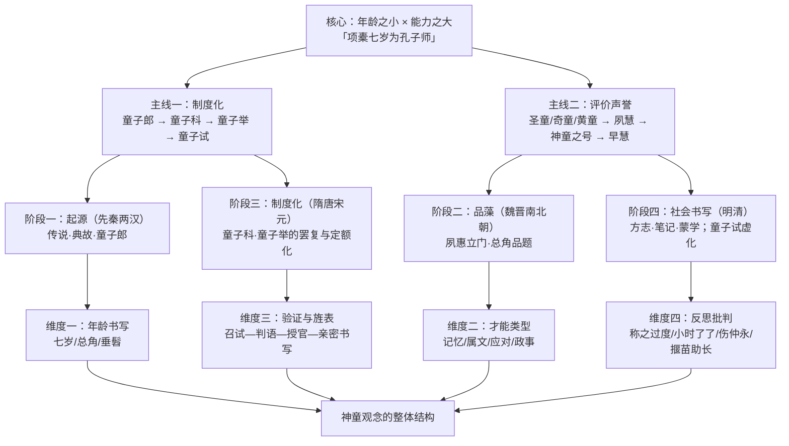

# 中国古代神童观念研究
**——基于殆知阁古籍语料的考察**

## 目录

- [一、绪论](#一绪论)
  - [1.1 研究目的与核心议题](#11-研究目的与核心议题)
  - [1.2 研究方法与文献范围](#12-研究方法与文献范围)
  - [1.3 学术史回顾与文献综述](#13-学术史回顾与文献综述)
  - [1.4 核心概念界定](#14-核心概念界定)
  - [1.5 古代神童观念的理论框架](#15-古代神童观念的理论框架)
  - [1.6 本研究的创新维度](#16-本研究的创新维度)
  - [1.7 神童观念史的分期总览](#17-神童观念史的分期总览)
- [二、先秦两汉：神童观念的起源](#二先秦两汉神童观念的起源)
  - [2.1 礼制年龄与"童子"范畴：神童观念的土壤](#21-礼制年龄与童子范畴神童观念的土壤)
  - [2.2 项橐七岁为孔子师：传说原型的生成与汉代反思](#22-项橐七岁为孔子师传说原型的生成与汉代反思)
  - [2.3 甘罗十二为上卿：才能、封赏与史家的审慎](#23-甘罗十二为上卿才能封赏与史家的审慎)
  - [2.4 两汉的"圣童"评价与童子郎制度](#24-两汉的圣童评价与童子郎制度)
  - [2.5 孝行与机辩：黄香、孔融、陆绩](#25-孝行与机辩黄香孔融陆绩)
  - [2.6 汉代神童典故的再生产](#26-汉代神童典故的再生产)
  - [2.7 本章小结](#27-本章小结)
- [三、魏晋南北朝：早慧的品藻文化](#三魏晋南北朝早慧的品藻文化)
  - [3.1 《世说新语》"夙惠"立目：早慧独立成门](#31-世说新语夙惠立目早慧独立成门)
  - [3.2 夙惠门的书写类型：神异、捷悟与生活化](#32-夙惠门的书写类型神异捷悟与生活化)
  - [3.3 王戎、钟会、卫玠：代表人物的早慧书写](#33-王戎钟会卫玠代表人物的早慧书写)
  - [3.4 赏誉门与"总角"品藻话语](#34-赏誉门与总角品藻话语)
  - [3.5 笺疏层与《晋书》：品藻话语的延续](#35-笺疏层与晋书品藻话语的延续)
  - [3.6 本章小结](#36-本章小结)
- [四、隋唐：神童科举制度的确立](#四隋唐神童科举制度的确立)
  - [4.1 童子科的制度条文](#41-童子科的制度条文)
  - [4.2 制举与童子科："常选"与"非常之才"](#42-制举与童子科常选与非常之才)
  - [4.3 兴废编年：广德二年停→大历复置→开成禁"万言童子"→大中收紧](#43-兴废编年广德二年停大历复置开成禁万言童子大中收紧)
  - [4.4 刘晏、李泌：神童入仕的典型](#44-刘晏李泌神童入仕的典型)
  - [4.5 王勃、骆宾王与初唐神童书写](#45-王勃骆宾王与初唐神童书写)
  - [4.6 名目辨析：神童举、童子科、童子举不可混同](#46-名目辨析神童举童子科童子举不可混同)
  - [4.7 本章小结](#47-本章小结)
- [五、宋元：神童的制度化与理学反思](#五宋元神童的制度化与理学反思)
  - [5.1 晏殊与杨亿：宋代神童的典型](#51-晏殊与杨亿宋代神童的典型)
  - [5.2 童子举的宋代制度](#52-童子举的宋代制度)
  - [5.3 李伯玉请罢童子科：制度的自我否定](#53-李伯玉请罢童子科制度的自我否定)
  - [5.4 《伤仲永》全文精读](#54-伤仲永全文精读)
  - [5.5 理学家的保留态度](#55-理学家的保留态度)
  - [5.6 本章小结](#56-本章小结)
- [六、明清：神童书写与社会期待](#六明清神童书写与社会期待)
  - [6.1 方志中的神童记载：前朝神童的明清书写](#61-方志中的神童记载前朝神童的明清书写)
  - [6.2 神童的科举路径：解缙、程敏政、李东阳](#62-神童的科举路径解缙程敏政李东阳)
  - [6.3 笔记中的神童叙事：社会期待的虚构与再生产](#63-笔记中的神童叙事社会期待的虚构与再生产)
  - [6.4 童子试在清代的形态：从"幼童之试"到科举初阶](#64-童子试在清代的形态从幼童之试到科举初阶)
  - [6.5 蒙学中的神童榜样：《神童诗》与神童事例的教材化](#65-蒙学中的神童榜样神童诗与神童事例的教材化)
  - [6.6 本章小结](#66-本章小结)
- [七、神童叙事的模式](#七神童叙事的模式)
  - [7.1 年龄书写：三层套语与"七岁"的约数性质](#71-年龄书写三层套语与七岁的约数性质)
  - [7.2 才能类型：记忆、创作、应对、政事的四分谱系](#72-才能类型记忆创作应对政事的四分谱系)
  - [7.3 验证链条：自荐、召试、判语、授官](#73-验证链条自荐召试判语授官)
  - [7.4 "置膝上"：跨越八百年的同构母题](#74-置膝上跨越八百年的同构母题)
  - [7.5 制度侧的验证标准：从方志条文到选举志](#75-制度侧的验证标准从方志条文到选举志)
  - [7.6 神童叙事的性别与地域注记](#76-神童叙事的性别与地域注记)
  - [7.7 本章小结](#77-本章小结)
- [八、神童的另一面](#八神童的另一面)
  - [8.1 "小时了了，大未必佳"：早慧的经典怀疑](#81-小时了了大未必佳早慧的经典怀疑)
  - [8.2 伤仲永：天赋因失学而"泯然众人"](#82-伤仲永天赋因失学而泯然众人)
  - [8.3 早慧早夭："梅花早发，不睹岁寒"](#83-早慧早夭梅花早发不睹岁寒)
  - [8.4 揠苗助长批判：反对过度教育](#84-揠苗助长批判反对过度教育)
  - [8.5 理学家的保留态度：聪慧不等于德性](#85-理学家的保留态度聪慧不等于德性)
  - [8.6 本章小结](#86-本章小结)
- [九、历史变迁与全书总结](#九历史变迁与全书总结)
  - [9.1 神童观念的演变分期](#91-神童观念的演变分期)
  - [9.2 核心脉络一：从"天赋异禀"到"制度选拔"](#92-核心脉络一从天赋异禀到制度选拔)
  - [9.3 核心脉络二：赞美与怀疑的双重传统](#93-核心脉络二赞美与怀疑的双重传统)
  - [9.4 核心脉络三：年龄书写的套语化与验证链条的固化](#94-核心脉络三年龄书写的套语化与验证链条的固化)
  - [9.5 余论：语料边界与未尽之处](#95-余论语料边界与未尽之处)
  - [9.6 制度与观念的互动：一个长时段观察](#96-制度与观念的互动一个长时段观察)
  - [9.7 本章小结](#97-本章小结)
- [十、参考文献](#十参考文献)
  - [10.1 经典与史书类](#101-经典与史书类)
  - [10.2 家训与律令类](#102-家训与律令类)
  - [10.3 类书与政书类](#103-类书与政书类)
  - [10.4 文集笔记类](#104-文集笔记类)
  - [10.5 小说戏曲类](#105-小说戏曲类)
  - [本章小结](#本章小结)
- [十一、附录](#十一附录)
  - [11.1 《世说新语·夙惠》代表条目](#111-世说新语夙惠代表条目)
  - [11.2 《临川先生文集·伤仲永》全文](#112-临川先生文集伤仲永全文)
  - [11.3 唐宋童子科诏令条文](#113-唐宋童子科诏令条文)
  - [11.4 方志神童传记选录](#114-方志神童传记选录)
  - [11.5 语料版本与考据说明](#115-语料版本与考据说明)
  - [本章小结](#本章小结)

---

## 一、绪论

### 1.1 研究目的与核心议题

《战国策·秦策五》载甘罗以项橐自荐事，这是现存文献中神童观念最早的完整表达：

> 甘罗曰："夫项橐生七岁而为孔子师，今臣生十二岁于兹矣！君其试臣，奚以遽言叱也？"

这则说辞把两个神童形象套叠在一起：七岁的项橐为圣人师，是论据；十二岁的甘罗请求出使，是论证对象。"年龄之小"与"智慧之大"的反差，在这里第一次被当作论辩的武器。神童观念的核心正在于这种反差——它挑战了"年龄等于资历、资历等于权威"的常识序列：童而为圣之师，年少而可建功。甘罗的逻辑是，既然七岁可以为孔子师，那么十二岁出使赵国又何遽不可？神童典故自诞生之日，就服务于"用人不拘长幼"的论证。

这一观念并非反儒家，而是内在于儒家年龄观的张力之中。《论语·子罕》载：

> 子曰："后生可畏，焉知来者之不如今也？四十、五十而无闻焉，斯亦不足畏也已。"

孔子提出年少者未必不如年长者，为"以年少而见重"提供了经典依据。一方面，《礼记·曲礼上》"人生十年曰幼，学……四十曰强，而仕"设定了成长的时间表；另一方面，"后生可畏"又为"提前完成"者留下了被命名的空间。所谓神童，正是在这一年龄序列上"提前"完成某一年龄段任务的儿童。汉代胡广驳"限年四十举孝廉"之议，举"甘、奇显用，年乖强仕"为例（《后汉书·胡广传》），正是以后生可畏的逻辑进入选官制度的论辩。

但神童首先是被讲述、被夸饰、被征引的对象，而非单纯的事实记录。汉代王充《论衡·实知篇》对此有自觉的批判：

> 人才早成，亦有晚就。虽未就师，家问室学。人见其幼成早就，称之过度。云项托七岁，是必十岁；云教孔子，是必孔子问之。

"称之过度"——传为七岁者实为十岁，传为"教孔子"者实为"孔子问之"。王充的批判提醒本书的研究立场：神童观念史研究的对象，是"神童如何被讲述"，而非"神童是否真实存在"。传说如何生成、如何被引用、如何被质疑，本身就是观念史的全部内容。

基于上述认识，本书的核心议题有四：其一，神童概念如何生成、如何被界定与命名——"神童""奇童""异童""圣童""黄童""早慧""夙慧"等名号构成的语义场，其分工与流变；其二，神童如何从社会评价进入国家制度——从汉代"童子郎"，到唐代"童子科"，再到宋代"童子举"、清代"童子试"，"童"的制度含义不断流变；其三，神童叙事如何被书写——年龄套语、才能谱系、验证与旌表链条构成的叙事程式，及其在正史、类书、笔记、蒙学中的传播与变异；其四，神童观念内部的自我反思——"称之过度""小时了了""伤仲永""揠苗助长"等批判话语如何与颂扬话语同构共生。

### 1.2 研究方法与文献范围

本研究所用语料为殆知阁古籍文献库官方修订版（`daizhige-org/daizhigev20`），`data` 分支，2026 年 9 月 12 日提交（短提交号 `e9e11f1`，完整哈希 `e9e11f19b7e6bd9c1284bbdab71d2a9cb94d637c`）。旧版 `garychowcmu/daizhigev20` 因文字讹误较多，已弃用。

研究方法为语料库实证。检索底本为 `~/workspace/shentong_project/matches.tsv`（61,132 行检索结果）与 `hits_per_book.tsv`；检索关键词包括神童、奇童、异童、童子科、神童科、童子举、神童举、童子试、童子郎、早慧、夙慧、夙悟、总角、垂髫、髫龄、髫年、髫龀、龆龀、过目成诵、过目不忘，以及项橐、甘罗、孔融、曹冲、刘晏、杨亿、晏殊、李泌等人物名。每条引文均回语料库原文件核对行号与上下文，逐字抄录，不改写；原文件无标点者，标点为整理者所加；凡原文件文字有讹误或异体，均在说明中指出。研究过程可复现：引文注明书名、卷次、行号，均可回查。

《新唐书·选举志》将"童子"列于岁举常选之目：

> 其科之目，有秀才，有明经，有俊士，有进士，有明法，有明字，有明算，有一史，有三史，有开元礼，有道举，有童子。而明经之别，有五经，有三经，有二经，有学究一经，有三礼，有三传，有史科。此岁举之常选也。其天子自诏者曰制举，所以待非常之才焉。

"童子"与秀才、明经、进士并列为"岁举之常选"，而制举"所以待非常之才"。值得注意的是，童子科虽列常选，其取士标准实为"越众"之非常之才——杨绾奏罢童子科的理由正是"童子越众，不在常科，同之岁贡，恐成侥幸之路"（《旧唐书·杨绾传》）。这种"常科之名、非常之实"的制度张力，是本书贯穿的线索之一，也决定了本书的研究进路：以"观念—制度—叙事"三者为纲，而不只作制度史或只作故事汇编。

神童观念的传播渠道，远不止于正史与政书。明代蒙学教材《养蒙金鉴》以年龄为纲编排历代神童事迹，其中"七岁"条下仅八字：

> 《史记》曰：项橐七岁为孔子师。

八字成典。这说明神童叙事通过蒙学教材完成代际传递，成为儿童教育的榜样库。因此，本书的文献范围除正史列传、政书选举志、诏令奏议之外，亦包括类书、笔记、文集、小说、方志、蒙学启蒙读物。时间上自先秦两汉，下至明清。体例上遵循三条铁律：凡类书辑录旧事者，注明"《古今图书集成·××典》引……"之类出处层次；传说性质的材料注明文献层次，不以后出之传说证前代之史实；比喻义、借用词一律剔除，材料薄弱处如实注明"语料未见"或"仅见孤证"，不许以常识填补空白。

### 1.3 学术史回顾与文献综述

古代的注疏、考证与反思，即是本课题"学术史"的前传。语料能支撑的部分，本书据实写出；超出语料范围的现代论著，本书不虚构、不评述。本研究以语料库实证为基础。

注疏传统对神童传说的接受与圣化，是一条线索。唐代裴骃《史记索隐》注"大项橐"：

> 〔三〕索隐音托。尊其道德，故云"大项橐"。

注家不质疑"七岁为师"的真实性，反以"尊其道德"为"大"字作解——传说在注疏传统中被彻底圣化。这说明神童形象的权威化，部分完成于经史注疏的阐释环节：注疏家不是传说的质疑者，而是传说的加冕者。

考据传统对神童传说的辨伪，是另一条线索。朱兴仲《续归田录》称"伯俙字景蕃，与晏元献俱五六岁，以神童侍仁宗于东宫"，马端临按语纠正：

> 马端临曰：按，史言晏殊以景德二年召试，年十四。仁宗以大中祥符三年生，则仁宗有生之年，殊年已十九。今谓殊与蔡伯俙俱以五六岁为神童，侍仁宗于东宫，误矣。

以纪年考证纠正神童传说的附会。神童叙事存在层累与讹传，考据家的工作正是剥离附会、核定事实。余嘉锡《世说新语笺疏》对部分条目作"后人傅会"之考证，亦属此传统。本书的文献层次意识——传说、史实、注疏、类书、笔记分层处理——即承此而来。

同时代人对神童制度的反思，构成第三条线索。宋高宗晚年对童子科成效作总结性质疑：

> 上谓辅臣曰：「朕自即位以来，童子以诵书推恩多矣，未闻有登科显名者。……」

宰执以"此等但能读诵，未必能通义理作文"应和。皇帝本人对"好神童"可能导致制度异化的自觉，与高宗朝"上有所好，下必有甚焉"的警惕一脉相承。明人彭大翼《山堂肆考》"神童"门附议，则把历代议论辑为成说：

> 世言早慧者大未必佳自孔文举小时大中大夫陈韪已有是语殆未必然葢人性颖脱者固易为善亦易为恶在所以养之耳后人不论所养而槩喜其早慧可恠哉

从汉代王充的"称之过度"，到宋代高宗的"未闻有登科显名者"，再到明清类书的"不论所养而槩喜其早慧"——对神童的怀疑与颂扬同步生长。这正是本书将"神童的另一面"单列一章的原因：批判话语不是观念史的余绪，而是观念史的内在组成部分。

### 1.4 核心概念界定

- **神童**：对年幼而才能出众者的总称性名号，既是社会评价，也是选拔名目。余嘉锡《世说新语笺疏》引《隐录》：

> 隐录云：「询总角奇秀，众谓神童。隐在会稽幽究山，与谢安、支遁游处，以弋钓啸咏为事。」

"总角奇秀"即"众谓神童"——神童首先是众人对幼慧者的集体命名，授予者是"众"而非朝廷。唐代以后，"神童"又成为荐举入仕的名目，如刘晏"年七岁，举神童，授秘书省正字"（《旧唐书·刘晏传》）。本书以"神童观念"为全书题名，指代这一观念整体。

- **奇童**："奇"强调出众、非常，多用于皇帝、名臣对幼慧者的惊叹式命名。李泌七岁入宫应试，张说试之而"贺帝得奇童"：

> 说因贺帝得奇童。

宋真宗赐蔡伯俙御诗亦有"四岁奇童出盛时"之句。"奇童"语义重心在"奇"（非常、罕见），与"神童"之"神"（神异、天授）略有分工；二者在语料中时可互换，惟"奇童"更常见于御前应对的语境。

- **早慧**："早"指时间提前，"慧"指聪慧。语料中多作"早惠"，"惠"通"慧"。孔融十岁独造李膺门，陈炜以"小时了了，大未必佳"相难，孔融反诘：

> 炜曰："夫人小而聪了，大未必奇。"融应声曰："观君所言，将不早惠乎？"膺大笑曰："高明必为伟器。"

"早慧"在此是双关：既指孔融年少聪了，也反问陈炜自身"想君小时必当了了"。宋代以降，"早慧"常与"早夭"并提——王令"死时才二十三，早慧而夭"（吕大临《吕氏杂记》），吴兴郡王"性早慧然体羸多疾"（李心传《建炎杂记》）——"早慧多夭"遂成观念史上的固定搭配。

- **夙慧**："夙"即早、素。《世说新语》三十六门专列"夙惠"一门，唐本作"夙慧"：

> 夙惠第十二
> 「夙惠」唐本作「夙慧」。

刘孝标注引《魏志》称钟会"敏惠夙成"，五岁见蒋济，济"甚异之，曰：『非常人也！』"。"夙慧"是魏晋南北朝品藻文化中对早慧的定型表达，强调"少而早成"，本书用以指代品藻语境中的早慧书写，以别于后世泛化的"早慧"。

- **童子科**：唐代礼部常科（岁举）之一，宋代沿置而称"童子举"。《新唐书·选举志》：

> 凡童子科，十岁以下能通一经及《孝经》、《论语》，卷诵文十，通者予官；通七，予出身。

限十岁以下，试一经兼《孝经》《论语》，以背诵量定等第：全通者直接授官，通七科者给出身。《宋史·选举志》："宋之科目，有进士，有诸科，有武举。常选之外，又有制科，有童子举，而进士得人为盛。"童子举与制科并列为"常选之外"的特科。**童子科**是"童子"作为岁举常选名目的制度形态，考试内容以诵经（记忆）为常格。

- **神童科**：宋代对荐举神童入仕诸名目的泛称。与"童子科"（常科）不同，"神童科"多为临时性、推荐性的恩遇名目。江西通志记邓轮兄弟：

> 邓轮字伯衡建昌人理宗朝甫七嵗举神童科十七登第授黄梅主簿陞江西运干所在有政声弟舆字伯载亦八嵗由神童科理宗朝登第授和州司户

兄弟二人分别以七岁、八岁由神童科出身，后均登第入仕——神童科是"早发"的通道而非终点。宋代士人对"神童科"亦有轻视：黄庭坚五岁已诵五经，其父欲令习神童科举，廷坚"笑曰：是甚做处"（《天中记》引）。本书严格区分"童子科"（常科）与"神童科/神童举"（荐举名目），不相混同。

- **童子试**：清代科举第一级考试的通称，此时"童"已虚化为应试者身份，与"神童"彻底分离。徐珂《清稗类钞》：

> 童试直省士子之试于郡县及提学，为童子试，俗谓为小考，或小试。应试者曰童生， 「 明《选举志》已有此称.」 虽壮丁老叟，但与试，皆得以童称之，未冠者曰幼童。

"虽壮丁老叟……皆得以童称之"——清代童子试中，"童"不再指南年幼者，而指尚未入泮的应试者（童生）。蒲松龄"弱冠应童子试"、沈咸"自少应童子试不售，郁郁至五十余岁而卒"，都是"老童生"现象的注脚。这是理解清代神童观念变迁的关键制度背景：当"童子试"成为所有读书人的共同起点，"神童"便从制度身份退回为纯粹的社会赞誉。

### 1.5 古代神童观念的理论框架

本书提炼"核心—主线—阶段—维度"模型如下。

**核心**是反差。"项橐七岁为孔子师"八字即全部信息：童为圣之师，年龄之"小"与智慧之"大"形成倒置的权威关系。一切神童书写——无论是甘罗十二为上卿、黄香"天下无双江夏黄童"，还是刘晏八岁献颂——都是这一反差结构的具体展开。反差越大，叙事张力越强，"称之过度"的夸饰机制也由此启动。

**主线**是双轨。清代汪氏注总结后汉旧法：

> 后汉之法，年幼才后者拜童子郎。若黄琬、臧洪、司马朗皆拜为郎，而任延、张堪俱号圣童，杜安号奇童，黄香号黄童，其尤异也。

（注：原文作"年幼才后者"，"后"疑为"秀"之形误，照录原文。）"拜童子郎"是制度轨，"号圣童/奇童/黄童"是评价轨。两条主线贯穿全书：一是**制度化轨迹**——汉代童子郎、唐代童子科、宋代童子举、清代童子试，"童"的制度含义不断流变，至清代彻底虚化为"童生"；二是**评价轨迹**——从"圣童"的道德评价（张堪"志美行厉"），到"夙慧"的品藻（《世说新语》立门），到"神童"的社会名号，再到"早慧"的医学化、宿命化表达（"早慧多夭"）。两轨时而交汇（如刘晏"举神童"授官、晏殊"以神童荐"赐出身），时而分离（如清代童生之"童"与神童无关）。

**阶段**有四段。起源（先秦两汉）：项橐传说、甘罗典故、童子郎制度，神童观念的逻辑起点；品藻（魏晋南北朝）：《世说新语》立"夙惠"门、总角小儿诣名士而得品题，早慧成为可被分类、品题的话语对象；制度化（隋唐宋元）：童子科的罢复、童子举的定额化与三级考试，"神童"成为国家选拔的正式名目；社会书写（明清）：方志、笔记、蒙学中的神童记忆，"神童"退为地方荣耀与教育榜样。而反思贯穿始终：汉代王充"称之过度"→汉末"小时了了，大未必佳"→宋代《伤仲永》→明清"揠苗助长"与"早慧多夭"——批判话语与颂扬话语同步生长。

**维度**有四维。年龄书写："七岁""八岁"等精确数字与"总角""垂髫""髫龀"等经典代词分层并用，数字多为约数化的叙事套语；才能类型：记忆（过目成诵）→属文（试词赋立就）→应对（应声问对）→政事（请行使赵、理财漕运），难度与规格递升；验证与旌表：举荐/自荐→召见召试→判语（"国瑞也""大异之"）→授官赐出身→亲密书写（置膝上、赐果钞），链条固定；反思批判：早慧的风险话语自成系统。制度的异化亦在维度之内：宋高宗见"诵书习射童子求试于有司者凡九人"，叹曰：

> 上曰：「上有所好，下必有甚焉。盖繇昨尝推恩一二童子，故求试者云集。此虽善事，然可以知人主好恶，不可不审也。」

"上有所好，下必有甚焉"——皇帝好神童，则求试者云集，乃至"冒称十岁以下"、"伪称童子"。制度在追捧中异化，又在异化中收紧（定额、覆试、惩长吏），这是"维度"中制度—社会互动的一环。

### 1.6 本研究的创新维度

1. 以官方修订版殆知阁古籍语料库为底本的实证研究。每条引文回原文件核对行号、逐字抄录，行号可回查；检索关键词与命中分布公开（`matches.tsv` 61,132 行、`hits_per_book.tsv`），研究过程可复现。这是对既往或凭记忆征引、或层层转引类书的神童论述在方法上的更新：每一个判断都有语料原文为凭，材料薄弱处如实注明"语料未见"或"仅见孤证"。

2. 首次系统区分"制度名目"与"社会名号"两套话语。童子科（唐常科）、神童举/神童科（荐举名目）、童子举（宋特科）、童子试（清初级考试）各有制度所指，不可混同；神童、奇童、异童、圣童、黄童则是评价性名号，其授予者是"诸儒""学中""众""京师"等舆论主体。旧说常以"神童科"统称一切，本书按语料用例逐一辨析，如王丘"十一擢童子科"与杨炯"神童举"名目有别，刘晏"举神童"亦未称"童子科"——名目之辨即制度之辨。

3. 把"反思"内在于观念史，而非作为附录。汉代王充"称之过度"的夸饰批判、"小时了了，大未必佳"的风险命题、《伤仲永》"受于人者不至"的教育论、吕本中"揠苗助长"的教育方法论，共同构成与颂扬话语同构的批判传统。例如孙思邈《千金翼方·养小儿》：

> 儿小时识悟通敏过人者多夭，则项托颜回之流是也。其预知人意回旋敏速者亦夭，则杨修、孔融之流是也。……亦由梅花早发，不睹岁寒；甘菊晚荣，终于年事。是知晚成者，寿之兆也。

早慧与早夭的联结不是迷信残余，而是古代社会对"早成"代价的系统思考："梅花早发，不睹岁寒"——发得早，未必经得住岁寒。本书以第八章专论"神童的另一面"，正是对这一批判传统的正面处理。

4. 揭示神童叙事的程式化机制。年龄书写有三层套语（精确数字"七岁""八岁"、经典代词"总角""垂髫"、圣王语汇"岐嶷"），才能有四级谱系（记忆→属文→应对→政事），验证有固定链条（举荐→召试→判语→授官→亲密书写）。如刘晏事迹：

> 刘晏，字士安，曹州南华人。年七岁，举神童，授秘书省正字。

"年X岁，举神童，授某官"三位一体的履历句式，是唐代神童叙事最标准的年龄书写，也是制度性神童书写的最小单元。程式分析使本书得以比较同一母题在不同时代的变异——如刘晏"置于膝上"与八百年后李东阳"抱置膝上"的同构，恰见叙事传统的惊人稳定性。

5. 文献层次意识贯穿全书。传说（项橐、蒲衣）、史实（甘罗、黄香）、注疏（裴骃《索隐》、李贤注）、类书辑录（《太平御览》《册府元龟》引旧事）、笔记传说（骆宾王"七岁咏鹅"实为明人笔记所载，两唐书本传仅记"少善属文"）分层处理，不以后出之传说证前代之史实。凡类书转引注明"引"，凡传说注明性质——这是对神童材料"层累"特征的方法论回应，也是本书区别于故事汇编的关键。

### 1.7 神童观念史的分期总览

本书把神童观念的演变分为六个阶段，每一阶段的核心特征与代表性证据预告如下，详细论证见第二至第八章。

**第一阶段：先秦传说原型**。神童观念的源头不是制度而是传说。《战国策·秦策五》载甘罗以项橐自荐：

> 甘罗曰："夫项橐生七岁而为孔子师，今臣生十二岁于兹矣！君其试臣，奚以遽言叱也？"

至迟战国末年，"幼而为圣人之师"已是士人共享的文化典故，"年龄之小与智慧之大"的反差在此被第一次当作论辩武器（第二章）。

**第二阶段：两汉评价与制度萌芽**。评价（士人舆论授予"圣童"诸号）与制度（"拜童子郎"）的双层结构在此形成，如1.5所引汪氏注《日知录》"后汉之法"条所示——"拜童子郎"是制度轨，"号圣童/奇童/黄童"是评价轨，正是本书"主线是双轨"的汉代形态（第二章）。

**第三阶段：魏晋品藻**。《世说新语》专列"夙惠"一门：

> 夙惠第十二
> 「夙惠」唐本作「夙慧」。

早慧成为可被分类、品题的话语对象；"总角诣名士—名士出品语"的固定场景（王浚冲、裴叔则总角诣锺士季），使神童观念完全进入士人清谈的审美场域（第三章）。

**第四阶段：隋唐科举制度化**。《新唐书·选举志》明定童子科成文标准：

> 凡童子科，十岁以下能通一经及《孝经》、《论语》，卷诵文十，通者予官；通七，予出身。

年龄上限、考试内容、授官待遇皆有成文规定——神童从"被品题的对象"变为"被考试的考生"，国家以科举垄断了神童的认证权（第四章）。

**第五阶段：宋元定额化与理学反思**。嘉定十四年诏定童子举的完成形态：

> 诏自今后童子举，每岁以三人为额，仍令礼部行下诸路州军，须管精加核实年甲挑试，结罪保明。

定额、挑试、覆试，"核实年甲"是对冒减年甲之弊的制度回应；与此同时，《伤仲永》"受于人者不至"、程母断中神童第者"非远器"，制度化的顶点恰是批判声最集中的时刻（第五章、第八章）。

**第六阶段：明清方志典范化与童子试异化**。徐珂《清稗类钞》记清代童子试之制：

> 虽壮丁老叟，但与试，皆得以童称之。

"童"从"幼童"漂移为"童生"，神童与童生彻底分离，神童观念失去专属的制度通道，其生命力退守方志传记、笔记小说与蒙学教材——《养蒙金鉴》按年龄编排历代神童事例，神童观念通过蒙学完成代际传递（第六章）。

六个阶段合观：观念的载体从传说（先秦）、舆论与官制（两汉）、品藻话语（魏晋）、科举科目（隋唐宋元），一路走向地方记忆与蒙学教材（明清）；而怀疑的话语——王充"称之过度"、陈韪"小时了了"、王安石"受于人者不至"、吕本中"揠苗助长"——从未缺席，它是观念史的内在组成部分，而非余绪。

---

## 二、先秦两汉：神童观念的起源

**神童**观念并非自古就有。中国古代对"幼而异于常童"者的命名、评价与制度安排，是在先秦的礼制年龄观与教育阶段论中孕育，在战国策士的游说之辞与两汉的史传书写中成形的。本章以语料库实证为基础，追溯神童观念的起源：从《礼记》《论语》确立的年龄标尺，到"项橐七岁为孔子师"的传说原型，再到甘罗十二拜上卿的正史典型，以及两汉"圣童"评价与**童子郎**制度的形成。本章最后以黄香、孔融、陆绩为例，呈现两汉神童"孝行"与"机辩"两种典型形象。

本章所引语料皆出自殆知阁古籍文献库官方修订版（`daizhige-org/daizhigev20`），`data` 分支，2026 年 9 月 12 日提交（短提交号 `e9e11f1`）。引文照录原文件文字，逐字核对行号；凡传说性质的材料，均在讲解中注明其文献层次。

### 2.1 礼制年龄与"童子"范畴：神童观念的土壤

讨论神童观念的起源，必须先回到先秦儒家如何理解"年龄"。在中国古代话语中，"神童"首先是在一条由礼制确立的年龄序列上"提前"完成某一年龄段任务的儿童——没有这条序列，就无所谓"早"。因此，本节先立背景。

《礼记·曲礼上》给出先秦儒家对人生阶段的经典划分：

> 人生十年曰幼，学。二十曰弱冠。三十曰壮，有室。四十曰强，而仕。五十曰艾，服官政。六十曰耆，指使。七十曰老，而传。八十九十曰耄，七年曰悼，悼与耄，虽有罪，不加刑焉。

这段话将人生以十年为一阶：十岁为"幼"，是"学"的起点；四十为"强"，是"仕"的资格年龄。年龄与学习、仕宦资格直接挂钩。后世一切关于"早慧""早达"的评价，都暗含以这条序列为标尺——所谓神童，不过是在这条时间轴上"跑得太快"的孩子。十二岁而为上卿之所以惊人，正因为他提前了整整二十八年完成了"四十而仕"的任务。

《礼记·内则》进一步为儿童设计了从六岁到二十岁的渐进式教育路线：

> 六年，教之数与方名。七年，男女不同席，不共食。八年，出入门户及即席饮食，必后长者，始教之让。九年，教之数日。十年，出就外傅，居宿于外，学书记……十有三年，学乐诵诗，舞勺，成童，舞象，学射御。二十而冠，始学礼。

六岁启蒙，七岁别席，十岁就外傅，十三学乐诵诗，二十而冠——这是一套完整的成长时间表。（校勘注：语料库原文件"十年"句作"学书记"，"记"疑为"计"之形误，此处照录原文。）值得注意的是，"七岁""十岁"在后世神童叙事中反复出现（项橐七岁、孔融十岁、甘罗十二岁），并非偶然：这些数字正是《内则》确立的文化基准年龄。讲述者在书写神童时，下意识地以礼制年龄节点为参照，强调神童"提前"了多少。

《礼记·内则》还以发式标识童子身份：

> 男女未冠笄者，鸡初鸣，咸盥漱，栉縰，拂髦，总角，衿缨，皆佩容臭，昧爽而朝，问何食饮矣。

"**总角**"——将头发总聚束结为角——是未行冠笄礼之童子的外在标志。明代《礼记大全》汇集旧注，明确释为"总角，总聚其发而结束之为角，童子之饰也"。注疏传统将发式与"童子"身份直接对应，使得"总角"在后世话语中成为儿童的稳定代称。汉代史传常用"总角"指代登场人物之幼年（如郭泰传中王柔兄弟"总角共候林宗"），它既是生理年龄的标记，也是"童子"身份的文化符号。神童叙事常常从"总角"写起，正是要先确立其"童"的身份，再写其"异于童"的言行。

最后，《论语·子罕》为"以年少而见重"提供了经典的思想依据：

> 子曰："后生可畏，焉知来者之不如今也？四十、五十而无闻焉，斯亦不足畏也已。"

孔子认为，年少者未必不如年长者，年长而无闻者反"不足畏"。这句话在神童观念史上的意义在于：神童观念并非反儒家，而是内在于儒家年龄观的张力之中。一方面，礼制为人生设定了循序渐进的时间表；另一方面，"后生可畏"又为突破这条时间表的天才留下了合法性。后世以甘罗、项橐论证"用才不拘长幼"，其思想源头正在此处。

### 2.2 项橐七岁为孔子师：传说原型的生成与汉代反思

如果说礼制年龄观是神童观念的土壤，那么"项橐七岁为孔子师"就是中国神童叙事的原型。这则传说现存最早的完整表述，出现在《战国策·秦策五》甘罗的说辞中：

> 甘罗曰："夫项橐生七岁而为孔子师，今臣生十二岁于兹矣！君其试臣，奚以遽言叱也？"

这八字——"项橐七岁为孔子师"——奠定了中国神童叙事的基本母题：年龄之"小"与智慧之"大"的反差。项橐为"童"，孔子为"圣"，童而为圣之师——神童观念的核心正在于这种倒置的权威关系。值得注意的是，这句话并非独立传记，而是甘罗说服吕不韦用他的论据：以"七岁为圣人师"的先例，论证十二岁的自己可以出使赵国。这说明至迟在战国末年，"幼而为师"已是士人共享的文化典故。文献性质上，这是战国策士的游说之辞，传说成分浓厚，不可视为史实；第二章使用它，是作为"观念"材料而非"史实"材料。

西汉刘向《新序·杂事五》记载，齐宣王以"年尚稚"拒绝任用闾丘邛，闾丘邛当即反驳：

> 闾丘邛曰："不然，昔有颛顼行年十二而治天下，秦项橐七岁为圣人师，由此观之，邛不肖耳，年不稚矣。"

在这里，项橐传说已成为挑战"以年龄取人"偏见的论辩武器。说话者将"七岁为圣人师"与"十二治天下"并列，构成一个"幼而有为"的论据链条，其逻辑是：既然七岁可为圣人之师，则我之年纪更"不稚"。可见至迟在西汉，项橐典故已从游说之辞转化为政治话语中的通用论据，神童叙事开始承担现实的论辩功能。

然而汉代思想家并非一味传述传说。东汉王充在《论衡·实知篇》中对"项托七岁教孔子"作出了理性化的解释：

> 难曰："夫项托年七岁教孔子。"
> 曰：虽无师友，亦已有所问受矣；不学书，已弄笔墨矣。儿始生产，耳目始开，虽有圣性，安能有知？项托七岁，其三四岁时，而受纳人言矣。

王充并不否认传闻本身，但他拒绝"生而知之"的神话解释，转而给出"早学"的说明：七岁能教人，是因为三四岁时已能"受纳人言"——早慧是学习起点早、积累早的结果，而非天授。这是汉代思想家对神童传说的第一次理性化处理：承认"早成"之才，否定"生知"之神。在观念史上，这是一个关键转折——神童从"神异"被拉回到"人事"的解释框架中。

王充更进一步，直指神童叙事的夸饰机制：

> 人才早成，亦有晚就。虽未就师，家问室学。人见其幼成早就，称之过度。云项托七岁，是必十岁；云教孔子，是必孔子问之。

"人见其幼成早就，称之过度"——传为七岁者实为十岁，传为"教孔子"者实为"孔子问之"。这是古代文献中对神童传说生成机制最自觉的批判：年龄被压小（七岁实为十岁），关系被夸大（问之实为教之）。王充揭示的，正是神童书写中普遍存在的传奇化倾向。这一批判的意义在于，汉代人自己已经意识到"神童"是被讲述、被夸饰出来的，而非天然如此——这为全书"神童观念的理性化"线索提供了起点。

需要补充的是，项橐并非唯一的传说原型。《太平御览》引《尸子》载："蒲衣生八岁，舜让以天下。周王太子晋生八年，而服师旷。"蒲衣八岁而舜让天下，传说性同样极强。后世类书《骈雅》总结"蒲衣、项橐、任贤、张堪，古之圣童也"，可见项橐与蒲衣同为"古之圣童"的代表。两条传说并存，说明"幼而为师/受让"是一类可复制的叙事套语，而非某个具体人物的史实。

从接受史看，项橐传说在流传中不断变异、不断被强化。司马迁转述《战国策》时在"项橐"前加一"大"字作"大项橐"，裴骃《索隐》注"尊其道德，故云'大项橐'"——注家不质疑七岁为师的真实性，反而以敬语强化其地位，可见项橐在注疏传统中已被彻底圣化。而近人辑佚显示，传说在《战国策》《淮南子》《论衡》《春秋后语》等书中流传时，年龄有"七岁""十岁"两种说法，名字有"项橐""项托"两种写法。"七岁"并非固定史实，而是叙事套语；传说经由正史复述获得权威性，又经注疏强化获得神圣性——这正是神童原型被经典化的完整链条。

### 2.3 甘罗十二为上卿：才能、封赏与史家的审慎

与项橐的传说性质不同，甘罗是进入正史列传的人物。《史记》卷七十一·樗里子甘茂列传开篇即标明其年龄：

> 甘罗者，甘茂孙也。茂既死后，甘罗年十二，事秦相文信侯吕不韦。

正史为甘罗立传，开篇第一句就是"年十二"。年龄是甘罗叙事的核心要素——他的全部功业都发生在"十二岁"这一时间点上。与《内则》"十年出就外傅"的路线对照，十二岁的甘罗本应在"学书记"的阶段，却已"事秦相"、参与国政。这种年龄与事功的错位，正是"神童"叙事在正史中的典型形态。

甘罗本人也深谙神童典故的论辩价值。当吕不韦叱其年少不能出使时，他搬出了项橐：

> 文信侯叱曰："去！我身自请之而不肯，女焉能行之？"甘罗曰："大项橐生七岁为孔子师。今臣生十二岁于兹矣，君其试臣，何遽叱乎？"

这段对话极具观念史意义：两个神童形象在此互文——项橐是论据，甘罗是论证对象。其逻辑是比例式的：七岁可为圣人师，则十二岁可出使赵国。神童叙事在此呈现出自我增殖的特征：先有传说原型（项橐），后有现实人物援引原型为自己背书（甘罗），现实人物的成功反过来又强化了原型的可信度。司马迁在"项橐"前加一"大"字作"大项橐"，裴骃《索隐》注"尊其道德，故云'大项橐'"，可见注疏传统不但不质疑七岁为师的真实性，反而以敬语强化其地位——传说经由正史的复述而获得权威性。

甘罗出使赵国成功，"割五城""得十一城"，归国后的封赏是：

> 甘罗还报秦，乃封甘罗以为上卿，复以始甘茂田宅赐之。

十二岁出使，归而拜上卿——这是神童叙事在政治层面的顶点：年龄最小而官位极高。"上卿"与"十二岁"的反差，正是后世引用甘罗典故时的情感张力所在。东汉冯衍《显志赋》以"甘罗童牙而报赵"与"唐且华颠以悟秦"对举，李贤注"童牙谓幼小也"——"童牙"对"华颠"，甘罗至此已从史传人物转化为"以幼建功"的文学典型。

然而司马迁对甘罗的评价是审慎的。论赞曰：

> 太史公曰：樗里子以骨肉重，固其理，而秦人称其智，故颇采焉。甘茂起下蔡闾阎，显名诸侯，重强齐楚。甘罗年少，然出一奇计，声称后世。虽非笃行之君子，然亦战国之策士也。

"甘罗年少，然出一奇计"——肯定其智谋；但紧接着"虽非笃行之君子"，在道德上保留距离。这种"才"与"行"分开的评价方式影响深远：后世对神童的期待始终是双重的，既要"早慧"之才，也要"笃行"之德。史家的审慎态度提醒我们，先秦两汉的神童书写并非一味颂扬，其中始终包含着对"年少得志"的道德警惕。

### 2.4 两汉的"圣童"评价与童子郎制度

进入两汉，"神童"开始从传说与策士叙事沉淀为相对稳定的社会评价与选官制度。本节呈现两个层面：一是"**圣童**"一类声誉称号的授予，二是"童子郎"的官制实践。

《后汉书》卷三十一·张堪传载：

> 张堪字君游，南阳宛人也，为郡族姓。堪早孤，让先父余财数百万与兄子。年十六，受业长安，志美行厉，诸儒号曰"圣童"。

"圣童"称号出自"诸儒"之口，是士人舆论对年少而"志美行厉"者的集体命名。值得注意的有两点：其一，张堪时年十六，"圣童"的年龄上限可达十六岁，并不限于七八岁——"童"的边界比我们想象的宽；其二，获号的理由是"早孤让财"与"志美行厉"，即**道德评价先于年龄标识**，"圣童"首先是"圣"（德行），其次才是"童"（年少）。

《后汉书》卷七十六·任延传（此传在语料所收标点本中传首有缺损，故据四库全书本补录）载：

> 任延字长孙，南阳宛人也。年十二为诸生，学于长安，明《诗》《易》《春秋》，显名太学，学中号为任圣童。

与张堪之"诸儒号曰"相应，任延十二岁在太学"显名"，"学中号为任圣童"。这里的授予者是同侪学人群体，标准是"明经"——通《诗》《易》《春秋》。可见"圣童"是汉代太学语境中的学术声誉，而非官方封号。两条材料合观："圣童"之号或出诸儒，或出学中，授予主体是士人共同体，评价标准是德行与经学，这与后世由皇帝亲试的"神童科"有本质区别——两汉的"圣童"是舆论的产物，而非制度的产物。

但两汉也确实存在以幼童为郎的制度。《后汉书》卷六十一·黄琼传附黄琬载：

> 琬字子琰。少失父。早而辩慧。……琬年七岁，在傍，曰："何不言日食之余，如月之初？"琼大惊，即以其言应诏，而深奇爱之。后琼为司徒，琬以公孙拜童子郎，辞病不就，知名京师。

黄琬七岁以"日食之余，如月之初"的机智应对见奇于祖父黄琼，后"以公孙拜童子郎"——汉代确有征拜幼童为郎的制度，黄琬因三公子孙身份被征拜（虽辞病不就）。"七岁早慧"与"拜童子郎"在同一传记中衔接，显示早慧叙事与选官制度的直接关联：早慧是"才"的证明，童子郎是"才"的制度性吸纳。清代汪氏注《日知录》总结"后汉之法，年幼才秀者拜童子郎。若黄琬、臧洪、司马朗皆拜为郎，而任延、张堪俱号圣童，杜安号奇童，黄香号黄童，其尤异也"，正可佐证"童子郎"（制度）与"圣童/奇童/黄童"（评价）的双层结构。

神童典故甚至进入了汉代选官制度的论辩。顺帝时左雄议"郡举孝廉皆限年四十以上"，胡广上疏反驳：

> 盖选举因才，无拘定制。六奇之策，不出经学；郑、阿之政，非必章奏。甘、奇显用，年乖强仕；终、贾扬声，亦在弱冠。

胡广举甘罗（十二岁为上卿）、子奇（十八岁治东阿）为例，证明"选举因才，无拘定制"——选官应因才而用，不拘年龄定制。"甘、奇显用，年乖强仕"一句中，"强仕"正出自《曲礼》"四十曰强，而仕"，胡广以神童典故直接对抗礼制年龄序列的制度化（限年四十举孝廉）。可见至迟在东汉，神童叙事已从个人传记转化为制度论辩中的论据资源。

### 2.5 孝行与机辩：黄香、孔融、陆绩

两汉神童的形象大体可分为两型：**孝行型**与**机辩型**，分别对应"德"与"才"两种期待。这一节以黄香、陆绩、孔融为例呈现。

孝行型以黄香为代表。《后汉书》卷八十上·黄香传载：

> 黄香字文强，江夏安陆人也。年九岁，失母，思慕憔悴，殆不免丧，乡人称其至孝。

九岁居母丧，"思慕憔悴，殆不免丧"——因哀毁几乎丧命，得乡里"至孝"之誉。汉代神童叙事的一大类型是"孝童"：早慧首先表现为孝行而非智巧，这与汉代"以孝治天下"的意识形态直接相关。黄香十二岁又被太守刘护"署门下孝子"，京师号曰"天下无双江夏黄童"——"**黄童**"由地域（江夏）加姓氏（黄）加"童"构成，是汉代对杰出幼童的命名方式之一，与"圣童""奇童""异童子"同属一个命名谱系，只是各有侧重："圣"重德行之高，"奇""异"重禀赋之特，"黄童"则带有地域性声誉的色彩。孝童从乡里声誉进入地方行政体系（署为门下孝子），再进入京师舆论（号为黄童），呈现出一条完整的声誉上升通道。

陆绩怀橘是孝行型的另一正史典型。《三国志·吴书》卷十一·陆绩传载：

> 绩年六嵗，于九江见袁术。术出橘，绩懐三枚，去，拜辞，堕地。术谓曰："陆郎作賔客而懐橘乎？"绩跪答曰："欲归遗母。"术大竒之。

（原文件"嵗""懐""賔""竒"为"岁""怀""宾""奇"之异体，照录。）六岁陆绩于宴席怀橘三枚，橘堕于地，袁术诘问，陆绩跪答"欲归遗母"，袁术"大奇之"。与黄香"至孝"同类，但场景更日常（怀橘）、年龄更小（六岁）。"术大奇之"与"宗族奇之""深奇爱之"句式相同——"奇之"是神童叙事中成人对幼童的标准化反应，标志着权威者对神童身份的认证。

机辩型以孔融为代表。《后汉书》卷七十·孔融传载其十岁独造李膺门，李膺门客陈炜贬抑"小时了了，大未必佳"，孔融应声反诘：

> 炜曰："夫人小而聪了，大未必奇。"融应声曰："观君所言，将不早惠乎？"膺大笑曰："高明必为伟器。"

陈炜以"小而聪了，大未必奇"贬抑孔融，孔融"应声"反诘"将不早惠乎"——以对方的逻辑反诘对方：若小而聪了则大未必奇，那么你陈炜当年想必也是"早惠"之人，何以今日如此？李膺"大笑"并许以"伟器"，完成了对神童的权威认证。这一段落呈现了神童叙事中"质疑—机辩—认证"的三段式结构："早惠"（早慧）一词在此语境中被正面使用，成为对幼童才智的肯定性命名。

"孔融让梨"则需要特别说明其文献层次。该故事不见于范晔《后汉书》正文，其最早出处是刘孝标注《世说新语·言语第二》时引用的《融别传》：

> 《融别传》曰：融四岁与兄食梨，辄引小者。人问其故，答曰："小儿法当取小者。"……众坐莫不叹息，佥曰："异童子也。"

（原文件"皆防才清称"之"防"疑为"儁"之形误，照录原文。）四岁取小梨，理由是"小儿法当取小者"——以"法"（礼法）自律，这正是"孝弟"德目的童年版本：在座者看到的不是一个聪明的孩子，而是一个"知礼"的孩子。在汉代"以孝治天下"的语境中，"知礼"比"机智"更具合法性，这也是让梨故事得以与孔融机辩并传、且流传更广的深层原因。在座者"佥曰异童子也"，则是众人对神童的集体命名，"**异童子**"与"圣童""奇童""黄童"同属汉代对异禀幼童的命名谱系。必须强调此条的文献层次：它出自孔融家传性质的《融别传》，经刘孝标注引，再经《太平御览》引《孔融列传》转述（"孔文举年四岁时，与诸兄弟共食梨，引小者，人问其故，答曰：'我小儿，法当取小。'由此宗族奇之"），文字大同小异，层层转述。同一故事在多重传记来源中反复出现，说明神童故事在汉魏至唐宋间存在文本增殖现象——故事越传越定型，细节在传写中被不断打磨。

### 2.6 汉代神童典故的再生产

项橐与甘罗在汉代经历了一个关键转化：从被讲述的传说/史事，变为可被征引的**典故**。典故化的第一步，是从当事人自用变为他人援用。西汉刘向《新序·杂事五》载，齐宣王以"年尚稚"拒绝任用闾丘邛，闾丘邛即搬出项橐反驳：

> 闾丘邛曰："不然，昔有颛顼行年十二而治天下，秦项橐七岁为圣人师，由此观之，邛不肖耳，年不稚矣。"

甘罗用项橐，是以例自荐；闾丘邛用项橐，是以例破偏见。项橐传说在此脱离了原初的游说语境，成为"年不稚"的通用论据——典故化的标志，正在于它可以被任何需要"年少可用"论证的人随时取用。

第二步，是从论辩论据进入制度论辩。东汉顺帝时左雄议"郡举孝廉皆限年四十以上"，胡广上疏反驳，举甘罗、子奇为例：

> 盖选举因才，无拘定制。六奇之策，不出经学；郑、阿之政，非必章奏。甘、奇显用，年乖强仕；终、贾扬声，亦在弱冠。

"甘、奇显用，年乖强仕"——甘罗十二岁为上卿、子奇十八岁治东阿，被压缩为八字论据，直接对抗"限年四十"的礼制化年龄序列。值得注意的是，胡广把甘罗与子奇、终军、贾谊编成一组"年少显用"的典故群："甘、奇"对"终、贾"，"年乖强仕"对"亦在弱冠"。典故一旦成群，单个例证就获得了可替换性——论辩者不需要再讲述甘罗的完整故事，只需调用"甘"字，听众自会补足"十二岁为上卿"的全部含义。在这里，甘罗不再是一个完整的人物传记，而是一个符号："甘"字代表"年少而显用"的全部论证功能。**典故化**即简化与符号化：典故越简短，调用越方便，其政治修辞的能量反而越大。

第三步，是从制度论辩进入文学修辞。东汉冯衍《显志赋》以甘罗入赋：

> 唐且华颠以悟秦，甘罗童牙而报赵。
> 李贤注："童牙谓幼小也。"

"童牙"（幼小）对"华颠"（年老），甘罗与唐且并举，构成工整的年龄对仗。甘罗至此已从史传人物转化为"以幼建功"的文学典型；而李贤注特释"童牙"为"幼小"，说明至唐代，"童牙"作为幼年意象已凝固到需要训释的地步——这正是典故完成再生产的标志：它不再依赖听众对原故事的记忆，而成为语言中自足的修辞单位。

三步合观，汉代完成了神童叙事的**再生产**循环：传说原型（项橐）→史事人物援引原型自证（甘罗）→后人援引原型与人物为通用论据（闾丘邛、胡广）→典故进入文学修辞（冯衍赋）→典故的凝固反过来强化了原型的可信度。神童观念在汉代的生命力，恰恰来自这种不断被征引、被转化的能力：每一次援引都是一次再生产，每一次再生产都让"年少可用"的观念更深地嵌入政治话语。王充的"称之过度"批判的是传说的夸饰，而典故化揭示的是另一面——即便在批判声中，神童典故依然作为有效的政治修辞被反复使用，因为它解决的是一个真实的政治问题：在"四十强而仕"的礼制序列下，如何为"提前到来"的人争取合法性。

### 2.7 本章小结

先秦两汉是神童观念的起源期。本章的考察可以归纳为四点。

第一，**礼制提供了年龄标尺**。《礼记·曲礼》"十年曰幼……四十曰强而仕"的年龄序列与《内则》六岁至二十岁的教育进程，共同构成评价"早"的基准。没有这条序列，就无所谓"提前"；神童叙事中"七岁""十岁""十二岁"的反复出现，正是以礼制年龄节点为文化参照。

第二，**传说提供了叙事原型**。"项橐七岁为孔子师"作为现存最早的神童母题，确立了"年龄之小"与"智慧之大"反差的核心结构，并通过甘罗的援引、司马迁的复述、闾丘邛的论辩，从游说之辞转化为政治话语中的通用论据。蒲衣八岁的传说与之并存，说明"幼而为师/受让"是一类可复制的叙事套语。

第三，**汉代人已经开始反思**。王充《论衡》对项橐传说的处理——"早学非生知"与"称之过度"——是古代文献中对神童传说生成机制最自觉的批判。汉代接受神童观念的同时，也生产了对它的怀疑；"神童是被讲述出来的"这一自觉，至迟在东汉已经出现。

第四，**评价与制度形成双层结构**。一方面，"圣童""奇童""黄童""异童子"等声誉称号由诸儒、学中、宗族等士人共同体授予，标准是德行与经学；另一方面，"童子郎"作为官制实践，将早慧之才吸纳进选官体系。胡广以甘罗典故反驳"限年四十举孝廉"，则显示神童叙事已进入制度论辩。而黄香、陆绩的孝行型与孔融、黄琬的机辩型，则呈现了"德"与"才"两种期待下神童形象的分化。

总之，先秦两汉的神童观念，是在礼制年龄观的土壤中，由传说原型、正史书写、士人评价与选官制度共同塑造的。它既包含对"后生可畏"的肯定，也包含王充式"称之过度"的警惕——肯定与警惕的张力，将贯穿此后两千年的神童观念史。

---

## 三、魏晋南北朝：早慧的品藻文化

汉代神童叙事多系于征验与祥瑞，而魏晋南北朝以降，早慧的书写发生了关键转向：它不再只是等待被验证的异禀，而成为士族社会中一套成熟的**品藻**话语——有名目可归类，有程式可套用，有仪式的场景（总角小儿谒见名士、名士当场出品语），有前瞻的预言（"二十年后当如何"）。《世说新语》专立"夙惠"一门，正是这一转向的标志。需要先说明一个词史事实：**"早慧"一词在《世说新语》及笺疏所引诸书中未见直接用例**，当时多作"夙惠/夙慧""明惠""敏惠"，另有"颖悟""岐嶷（早慧貌）"等评价语构成的语义场。本章所用的"早慧"，是研究者为统摄这些用语而设的分析概念。

### 3.1 《世说新语》"夙惠"立目：早慧独立成门

《世说新语笺疏》中卷下专列"夙惠第十二"，其篇题与校文如下（**笺疏层**文字，余嘉锡校语，语料L3734、L3737—L3738）：

> 夙惠第十二
>
> 「夙惠」唐本作「夙慧」。

"夙惠"门位列捷悟第十一之后、豪爽第十三之前，在三十六（八）门中独占一门。这一"立目"本身就是观念史事件：早慧不再散见于各门之中，而被抽取出来，成为一种可以被分类、被品题的独立话语对象。校语"唐本作「夙慧」"尤可玩味——后人径以"慧"训"惠"，说明"夙惠"在传抄者眼中本就是"早慧"之意，词形虽异，词义已定。

"夙惠"门以何种材料开篇，最能见出这一门类的入选标准。门下首条（**世说原文**，南朝宋刘义庆撰，语料L3735）写陈太丘二子窃听：

> 宾客诣陈太丘宿，太丘使元方、季方炊。客与太丘论议，二人进火，俱委而窃听。炊忘箸箄，饭落釜中。太丘问：「炊何不馏？」元方、季方长跪曰：「大人与客语，乃俱窃听，炊忘箸箄，饭今成糜。」太丘曰：「尔颇有所识不？」对曰：「仿佛志之。」二子俱说，更相易夺，言无遗失。太丘曰：「如此，但糜自可，何必饭也？」

白话疏通：宾客到陈太丘家投宿，太丘让儿子元方、季方烧饭。客人正与太丘谈论义理，二人添火时都放下手头活计偷听，忘了添柴续火，饭掉进釜中烧成了粥。太丘问为何饭没蒸熟，二子长跪回答：父亲与客人谈话，我们都忍不住偷听，忘了看火，饭如今成了糜粥。太丘问：你们可记得些内容吗？答道：大约都记下了。于是二子轮流复述，互相补充，言辞没有遗漏。太丘说：既然这样，吃糜粥也行，何必非吃干饭呢？

此条以"过耳不忘"的记忆型早慧为"夙惠"门定调。值得注意的是余嘉锡在**笺疏层**的案语："盖如世说之言，元方、季方年皆尚幼，故列之夙慧篇"——入选标准正在于"年皆尚幼"而"言无遗失"，年龄之小与记忆之强的反差，构成"夙惠"书写的逻辑起点。这里三层文字的分野亦须辨明：故事本文是刘义庆的**世说原文**，"故列之夙慧篇"的门类意识则出自余嘉锡的**笺疏**，后者点破了前者未明言的编纂意图。

### 3.2 夙惠门的书写类型：神异、捷悟与生活化

"夙惠"门所收条目，可辨出数种稳定的书写类型。其一是"年龄标龄＋神异评价"的定型句式，如写何晏（**世说原文**，语料L3744）：

> 何晏七岁，明惠若神，魏武奇爱之。因晏在宫内，欲以为子。晏乃画地令方，自处其中。人问其故？答曰：「何氏之庐也。」魏武知之，即遣还。

白话疏通：何晏七岁时，聪明过人如同神灵，魏武曹操非常喜爱他。因为何晏养在宫中，曹操想收他为子。何晏便在地上画个方框，自己站在框内。旁人问他为什么，他答道："这是何氏的庐舍。"曹操知道后，就把他送还何家。

"七岁"与"**明惠**若神"构成早慧书写的基本公式：确切年龄标定"早"，判断句式标定"慧"。"画地令方，自处其中"的应对，既是孩童的天真，又暗含不肯改姓易宗的坚定，遂成为可供谈论的品藻素材。刘孝注引《何晏别传》"晏小时养魏宫，七八岁便慧心大悟"，与原文互证，说明这一形象在当时已有多种文本流传。同一门内另有德行型早慧的用例，如桓玄五岁居丧"应声恸哭，酸感傍人"（语料L3781），可见"夙惠"兼包才、德两途，并非单指智巧。

其二是"捷悟"型，以应对机锋见长，如晋明帝幼年辨日远近（**世说原文**，语料L3755）：

> 晋明帝数岁，坐元帝膝上。有人从长安来，元帝问洛下消息，潸然流涕。明帝问何以致泣？具以东渡意告之。因问明帝：「汝意谓长安何如日远？」答曰：「日远。不闻人从日边来，居然可知。」元帝异之。明日集群臣宴会，告以此意，更重问之。乃答曰：「日近。」元帝失色，曰：「尔何故异昨日之言邪？」答曰：「举目见日，不见长安。」

白话疏通：晋明帝几岁时，坐在元帝膝上。有从长安来的人，元帝询问洛阳一带的消息，不禁流下眼泪。明帝问为何哭泣，元帝把东渡南来的缘由都告诉了他。接着问明帝："你觉得长安和太阳相比哪个远？"答道："太阳远。没听说有人从太阳边上来，这就可想而知了。"元帝觉得惊异。第二天聚集群臣宴会，把此事告诉大家，又重新问他一遍，他却答道："太阳近。"元帝变了脸色，说："你为什么和昨天说的不一样？"答道："抬眼能看见太阳，却看不见长安。"

两次作答皆成理，且后答翻转前说而理更直——这正是"捷悟"的精髓。"元帝异之"四个字，即是当时的品藻反应：帝王之家的父子问答，被记录、被传播，本身就是品藻文化上及皇室的证明。同为帝王幼慧，晋孝武十二岁以老子"躁胜寒，静胜热"之言折服谢安，谢安出而叹曰"上理不减先帝"（语料L3774），亦是此种"早熟的言理能力"书写的变体。

其三是生活化的类比推理，如韩康伯幼时事（**世说原文**，语料L3769）：

> 韩康伯数岁，家酷贫，至大寒，止得襦。母殷夫人自成之，令康伯捉熨斗，谓康伯曰：「且箸襦，寻作复裈。」儿云：「已足，不须复裈也。」母问其故？答曰：「火在熨斗中而柄热，今既箸襦，下亦当暖，故不须耳。」母甚异之，知为国器。

白话疏通：韩康伯几岁时，家中极贫，到大寒天，只做得起一件短袄。母亲殷夫人亲手缝制，让康伯拿着熨斗，对他说："先穿上短袄，随后再做夹裤。"孩子说："够了，不需要再做夹裤。"母亲问缘故，答道："火在熨斗里而柄是热的，如今既然穿了短袄，下面自然也会暖，所以不需要了。"母亲非常惊异，知道他将来是治国之器。

此条的特别之处在于"慧"的场景完全日常化：取暖、做衣、熨斗之柄。幼童以"火在熨斗中而柄热"类比"既著襦下亦当暖"，是完整的推理链条。而"母甚异之，知为**国器**"一句，是家庭内部的品藻——母亲既是见证人又是品题者，"国器"二字把孩子的即兴之言直接兑换成未来的政治期许。早慧书写至此，已渗入士族家庭的日常生活。

其四是记忆复述型，如张玄之、顾敷事（**世说原文**，语料L3763）：

> 司空顾和与时贤共清言，张玄之、顾敷是中外孙，年并七岁，在床边戏。于时闻语，神情如不相属。瞑于灯下，二儿共叙客主之言，都无遗失。顾公越席而提其耳曰：「不意衰宗复生此宝。」

白话疏通：司空顾和与当时的名士一同清谈，张玄之、顾敷是他的外孙和内孙，都七岁，在床边嬉戏。当时听到谈话，神情仿佛没在听。天黑在灯下，二人一同复述宾主的谈话，一点不遗漏。顾公离开座席提着他们的耳朵说："没想到衰微的宗族又生出这样的宝贝。"

两个七岁儿"神情如不相属"而"都无遗失"，复述清谈之言——这是"夙惠"门首条陈氏二子母题的复现。而顾和"不意衰宗复生此宝"一句，把幼慧与家族的兴衰直接挂钩：早慧的孩子是"衰宗"的"宝"，是宗族复兴的征兆。在门阀士族的社会结构中，对早慧的品题从来不只是个人的赞美，更是家族声望的再生产。

### 3.3 王戎、钟会、卫玠：代表人物的早慧书写

王戎的早慧形象由两条"七岁"叙事共同塑造（**世说原文**，《世说新语·雅量》第六，语料L1739—L1740）：

> 王戎七岁，尝与诸小儿游。看道边李树多子折枝。诸儿竞走取之，唯戎不动。人问之，答曰：「树在道边而多子，此必苦李。」取之，信然。名士传曰：「戎由是幼有神理之称也。」
> 魏明帝于宣武场上断虎爪牙，纵百姓观之。王戎七岁，亦往看。虎承闲攀栏而吼，其声震地，观者无不辟易颠仆。戎湛然不动，了无恐色。竹林七贤论曰：「明帝自阁上望见，使人问戎姓名而异之。」

白话疏通：王戎七岁时，曾与一群小孩游玩。看见道边李树果实多得压折枝条，孩子们都争着跑去摘，只有王戎不动。旁人问他，他答道："树长在路边而果实繁多，这一定是苦李。"摘来一尝，果然如此。另一则：魏明帝在宣武场上让人拔去老虎的爪牙，纵容百姓围观。王戎七岁，也前去观看。老虎趁机攀栏吼叫，声震大地，围观者无不退避跌倒。王戎镇定自若，毫无惧色。

一条写推理之慧，一条写镇定之度，同以"七岁"标龄。尤须注意两条末尾的**刘孝标注**引文：《名士传》曰"戎由是幼有神理之称也"，《竹林七贤论》曰"明帝自阁上望见，使人问戎姓名而异之"——"神理之称""异之"，正是与王戎同时或稍后的品藻。世说原文提供事迹，刘注补上当时的评价，二者合在一起，完整呈现了一个早慧典型被"塑造"的过程：事迹是材料，品题是封号。

钟会兄弟的早慧则以"应对之比"见长（**世说原文**，《世说新语·言语》第二，语料L366）：

> 锺毓兄弟小时，值父昼寝，因共偷服药酒。其父时觉，且托寐以观之。毓拜而后饮，会饮而不拜。既而问毓何以拜，毓曰：「酒以成礼，不敢不拜。」又问会何以不拜，会曰：「偷本非礼，所以不拜。」

白话疏通：钟毓兄弟小时候，趁父亲白天睡觉，一同偷喝药酒。父亲当时醒了，姑且装睡观察。毓行礼之后才喝，会喝酒却不行礼。过后问毓为何行礼，毓说："酒是用来成礼的，不敢不行礼。"又问会为何不行礼，会说："偷本来就不合礼，所以不行礼。"

兄弟二人同做一事而应对各成一理，"酒以成礼"对"偷本非礼"，机锋相当。刘孝注引《魏志》补了一条关键材料："会字士季，繇少子也。**敏惠**夙成。中护军蒋济着论，谓观其眸子，足以知人。会年五岁，繇遣见济。济甚异之，曰：『非常人也！』"——"敏惠夙成"是"敏惠"一词用于人物早慧的早期定型表达，"年五岁"与"非常人也"则又是一次"年龄＋品语"的完整品藻。钟会后来位极人臣而以谋反伏诛，其早慧书写中的机智与权变，已隐隐透出后来的政治性格。

卫玠的早慧书写兼有"问难"与"容止"两面。先看其总角问"梦"（**世说原文**，《世说新语·言语》第二，语料L1022）：

> 卫玠总角时问乐令「梦」，乐云「是想」。卫曰：「形神所不接而梦，岂是想邪？」乐云：「因也。未尝梦乘车入鼠穴，捣□噉铁杵，皆无想无因故也。」……卫思「因」，经日不得，遂成病。乐闻，故命驾为剖析之。卫既小差。乐叹曰：「此儿胸中当必无膏肓之疾！」

白话疏通：卫玠束发为总角的年纪时向乐令（乐广）请教"梦"是什么，乐广说"梦是意想"。卫玠说："形体与精神接触不到的东西却入了梦，难道是意想吗？"乐广说："是因缘。不曾梦见乘车进入鼠洞、捣碎铁杵来吃，都是因为无想无因的缘故。"……卫玠思考"因"的问题，整天想不通，竟成了病。乐广听说后，特意驾车前来为他剖析。卫玠病稍好转，乐广叹道："这孩子胸中一定没有膏肓之疾啊！"

"**总角**"是魏晋早慧叙事最常用的年龄标尺，指童年束发之年。幼卫玠追问梦的形神之理，"思「因」，经日不得，遂成病"——把孩童的好问写到"成病"的程度，是对其专精的极致渲染。乐广"此儿胸中当必无膏肓之疾"一句，以医喻慧，是名士对总角小儿的当面品题。值得注意的是，卫玠在世说中同时以容貌著称，"慧"与"貌"在其形象中合一，这一点《晋书·卫玠传》的"年五岁，风神秀异"（见3.5）可作互证。

刘孝注引《卫玠别传》又补出时人对卫玠的定评（**刘注层**，《世说新语·容止》第十四，语料L465）：

> 玠别传曰：「玠颖识通达，天韵标令，陈郡谢幼舆敬以亚父之礼。论者以为出王眉子、平子、武子之右。世咸谓『诸王三子，不如卫家一儿』。」

"**颖识**通达"的"颖"，即颖悟、聪颖；"诸王三子，不如卫家一儿"是时人品题的口号式表达。由此可见，"颖悟"一系的评价语在世说注文中已有用例，它与"夙惠""敏惠"共同构成魏晋品藻早慧的语义场。

### 3.4 赏誉门与"总角"品藻话语

如果说"夙惠"门收的是早慧"事迹"，那么"赏誉"门收的则是品藻"话语"本身——"总角"小儿如何被观看、被谈论、被预言。其中最典型的是"总角造名士"的仪式化场景，如王戎、裴楷总角见钟会（**世说原文**，《世说新语·赏誉》第八，语料L2685）：

> 王浚冲、裴叔则二人，总角诣锺士季。须臾去后，客问锺曰：「向二童何如？」锺曰：「裴楷清通，王戎简要。后二十年，此二贤当为吏部尚书，冀尔时天下无滞才。」晋阳秋曰：「戎为儿童，锺会异之。」

白话疏通：王浚冲（王戎）、裴叔则（裴楷）二人，在总角之年去拜见钟士季（钟会）。二人离去不久，客人问钟会："刚才那两个孩子怎么样？"钟会说："裴楷清通，王戎简要。二十年后，这两位贤者当官至吏部尚书，希望到那时天下没有被埋没的人才。"末尾所引《晋阳秋》说："王戎还是儿童时，钟会就觉得他与众不同。"

这一条是魏晋"总角品藻"的标准场景：总角小儿往见名士，名士当场出品语（"清通""简要"），并预言其二十年后的前程。品语之简（四字定终身）与预言之远（二十年），正是品藻文化的特征。余嘉锡在**笺疏层**考证此条系后人傅会——钟会死时王戎尚幼，不可能有此品题。但考证的结论恰恰反证了母题的流行：正因为"总角谒名士、名士出品语"的叙事在当时已成美谈范式，后人才会把它安到钟会与王戎头上。傅会本身，就是观念史的证据。

"目"（品题）之风，在钟会对王戎的另一条品语中更为凝练（**世说原文**，语料L2681）：

> 锺士季目王安丰：阿戎了了解人意。王隐晋书曰：「戎少清明晓悟。」

"目王安丰"即为王戎品题，"阿戎了了解人意"六字是定评。刘孝注引王隐《晋书》"戎少清明晓悟"，以史传文字佐证这一品题由来有自。由世说原文的品语，到刘注引史的佐证，三层文字在此形成互文：品藻话语一旦出口，便被注家、史家反复征引、加固。

总角品藻还有"完成式"的表达，如杨淮二子（**世说原文**，《世说新语·赏誉》第八，语料L3224）：

> 冀州刺史杨淮二子乔与髦，俱总角为成器。淮与裴頠、乐广友善，遣见之。頠性弘方，爱乔之有高韵，谓淮曰：「乔当及卿，髦小减也。」广性清淳，爱髦之有神检，谓淮曰：「乔自及卿，然髦尤精出。」淮笑曰：「我二儿之优劣，乃裴、乐之优劣。」

白话疏通：冀州刺史杨淮的两个儿子杨乔与杨髦，都在总角之年就已是"成器"之才。杨淮与裴頠、乐广交好，派儿子去拜见他们。裴頠性情弘大方正，喜爱杨乔有高远的风韵，对杨淮说："杨乔将来赶得上你，杨髦稍差一些。"乐广性情清淳，喜爱杨髦有神采检束，对杨淮说："杨乔自然赶得上你，但杨髦尤其精出。"杨淮笑道："我两个儿子的优劣，原来是裴、乐二公的优劣。"

"俱总角为成器"是总角品藻的完成式——"总角"本指幼年，"成器"则指已成就，二者并置，意为"年虽总角，已是成器"。一门两子分属裴、乐各出一评（"高韵"对"神检"），而杨淮以"我二儿之优劣，乃裴、乐之优劣"作结，把儿子的评价反转为对品题者本人的品题。品藻在此成为士族之间心照不宣的社交游戏。

总角叙事亦可与家族政治直接相关，如王衍总角代父陈事（**世说原文**，《世说新语·赏誉》第八，语料L1925）：

> 王夷甫父乂为平北将军，有公事，使行人论不得。时夷甫在京师，命驾见仆射羊祜、尚书山涛。夷甫时总角，姿才秀异，叙致既快，事加有理，涛甚奇之。既退，看之不辍，乃叹曰：「生儿不当如王夷甫邪？」羊祜曰：「乱天下者，必此子也！」

白话疏通：王夷甫（王衍）的父亲王乂任平北将军，有公事，派行人去辩论没能说服对方。当时王衍在京师，便命驾去见仆射羊祜、尚书山涛。王衍当时还是总角之年，姿容才具秀异，叙述事情既流畅又条理分明，山涛非常惊异。客人退去后，山涛目送不止，叹道："生儿子不当像王夷甫这样吗？"羊祜却说："祸乱天下的，一定是这个孩子！"

"姿才秀异"是容止与才具的复合评价；山涛"生儿不当如王夷甫邪"成为千古名评，而羊祜"乱天下者，必此子也"一句谶语式的反评，又为王衍后来在西晋之乱中的角色埋下伏笔。总角小儿代父陈事而折服名公——早慧在此不仅是谈资，更直接介入了家族的政治事务。

### 3.5 笺疏层与《晋书》：品藻话语的延续

余嘉锡的**笺疏层**不止于校勘，它通过引录他书，保存了世说原文之外的品藻话语。其中最关键的一条是引《隐录》论许询（语料L641）：

> 隐录云：「询总角奇秀，众谓神童。隐在会稽幽究山，与谢安、支遁游处，以弋钓啸咏为事。」

"总角奇秀，众谓**神童**"——这是"总角—神童"对应关系的直接证据。"总角"是年龄标尺，"奇秀"是品语，而"众谓神童"表明：在时人的观念中，总角而奇秀者，其极称即为"神童"。"神童"在这里不是后世的科举科目名，而是品藻话语的最高级形式。这条材料出自笺疏引录而非世说原文，正说明品藻话语的流传不限于一书，笺疏的辑佚工作为我们打捞起了散在的用例。

笺疏引《宋书》校《晋书》之误的一条，又保存了"颖悟"一词的原始表述（**笺疏层**，余嘉锡案语，语料L801）：

> 宋书作「瑍生而不慧，灵运幼便颖悟，玄甚异之，谓亲知曰：『我乃生瑍，瑍那得生灵运』」，是也。

谢灵运"幼便**颖悟**"，祖父谢玄"甚异之"，对亲友叹道："我竟然生了谢瑍，谢瑍怎么能生出谢灵运！"——"颖悟"是南北朝品题幼慧的常用语，"玄甚异之"则是祖父辈的当面品藻。余嘉锡以宋书原文校出晋书传抄之误，考据的副产品是为我们留下了一个可靠的"颖悟"用例，可与3.3所引卫玠"颖识通达"互证语义。

品藻话语并未随世说而终，它在唐修《晋书》的史传中得到延续。先看《晋书·谢安传》（唐房玄龄等撰，语料L6209）：

> 谢安，字安石，尚从弟也。父裒，太常卿。安年四岁时，谯郡桓彝见而叹曰：「此兒风神秀彻，后当不减王东海。」及总角，神识沈敏，风宇条暢，善行书。弱冠，诣王蒙，清言良久。

白话疏通：谢安字安石，是谢尚的从弟，父亲谢裒任太常卿。谢安四岁时，谯郡的桓彝见到他便叹道："这孩子风神秀彻，将来当不减王东海（王承）。"到了总角之年，神识沉着敏达，风度条畅，擅长行书。弱冠之年，去拜见王蒙，清谈了很久。

史传把"四岁—总角—弱冠"连成一条完整的早慧时间线："四岁"得"风神秀彻"之评并预言"不减王东海"，"及总角"则"神识沈敏"——"总角"在这里已是慧悟的标尺性年龄。而这一传文，恰与刘孝注引《文字志》"谢安字安石……桓彝见其四岁时，称之曰：『此儿风神秀彻，当继踪王东海』"（语料L228）同源，可见世说注文与晋书传文共享着同一批品藻素材，只是分属注、史两途。

《晋书·顾和传》又是一例（语料L6456）：

> 和二岁丧父，总角便有清操，族叔荣雅重之，曰：「此吾家麒麟，兴吾宗者，必此子也。」

白话疏通：顾和二岁丧父，到了总角之年便有清峻的操守，族叔顾荣很器重他，说："这是我们家的麒麟，振兴我们宗族的，一定是这个孩子。"

此条可与刘孝注引《顾和别传》对读："和总角知名，族人顾荣雅相器爱，曰『此吾家之骐骥也，必振衰族』"（语料L469）。史传作"麒麟"、别传作"骐骥"，皆以瑞兽喻总角之秀；"兴吾宗者，必此子也"与"必振衰族"，都把幼慧与宗族复兴直接绑定。总角品藻的谶语化倾向——以瑞兽为喻、以宗族为期——在注、史两层文字中完全一致，说明这套话语在魏晋至唐初的流传中高度稳定。

其他总角叙事在《晋书》中还有多种变体：王衍"总角尝造山涛，涛嗟叹良久，既去，目而送之"（《晋书·王衍传》，语料L4232），与世说赏誉条（3.4所引）同源而详略互补，"目而送之"正是行品藻之实；王允之"年在总角"佯醉吐污以脱王敦之疑，"从伯敦深智之"（笺疏引《晋中兴书》，语料L7335），写的是总角之"智"的另一面；褚裒"总角诣庾亮，亮使郭璞筮之"（《晋书·褚裒传》，语料L7062），则以"筮验"代替口评，"二十年外，吾言方验"仍是预言型品题的变体。凡此种种，都说明"总角—谒见—品题—预言"的叙事结构，在魏晋至唐初已高度仪式化。

### 3.6 本章小结

魏晋南北朝的早慧观念，可概括为一场从"征验"到"品藻"的转型。汉代神童叙事的核心是异禀的证实——年龄之小与智慧之大的反差需要被"验证"；而自《世说新语》专立"夙惠"一门始，早慧成为士族社会中一套自足的品藻话语：它有名目（夙惠门），有定型句式（"×岁"＋"明惠若神""敏惠夙成"之类的判断语），有稳定的书写类型（神异应对、捷悟辩难、记忆复述、生活推理、德行早成），有仪式化的场景（总角小儿谒名士、名士出品语并预言前程），还有一整套评价语构成的语义场（夙惠、明惠、敏惠、颖悟、岐嶷）。需要重申的是，"早慧"一词在《世说新语》及笺疏所引书中并无直接用例，当时人用"夙惠/夙慧""明惠""敏惠"言之——概念史的研究，恰须从这种词与义的错位处起步。

这一品藻文化的社会功能有二：一是对个人的"命名"，一句"清通""简要""神理"便可定终身之品；二是对家族的"期许"，顾和"不意衰宗复生此宝"、顾荣"兴吾宗者必此子也"，都把幼慧兑换成宗族复兴的征兆。而"总角"作为核心的年龄标尺，上承"年皆尚幼"的门类标准，下开"众谓神童"的极称——总角而奇秀者，时人便以"神童"名之。这一话语经刘孝注的征引、余嘉锡笺疏的辑佚，复为唐修《晋书》所吸收（谢安"及总角，神识沈敏"、卫玠"年五岁，风神秀异"、顾和"总角便有清操"），完成了从清谈品题到史传定评的转化。早慧至此，不再是一个需要被验证的奇迹，而是一种可以被谈论、被品题、被预言的社会事实——这正是魏晋南北朝留给后世神童观念的最重要的遗产。

---

## 四、隋唐：神童科举制度的确立

汉代以降，"神童"长期停留于察举征辟中的偶然恩遇，未有专设的入仕名目。至唐代，情形为之一变：**童子科**被列入礼部岁举的常选之目，有年龄、有经义、有授官待遇，成为中国历史上第一个以年龄为报考门槛的国家考试科目；与此同时，**制举**以"天子自诏、待非常之才"的非常之途，为神童保留了另一条入仕通道。本章据正史、政书、会要与诏令，考述童子科的制度条文、制举与童子科的双轨关系、童子科的兴废编年，并以刘晏、李泌、王勃、骆宾王等人物案例，辨析"神童举""童子科""童子举"诸名目的异同。

### 4.1 童子科的制度条文

《新唐书·选举志》将"童子"列于岁举科目之目，与制举"待非常之才"分属两途，为全章定下制度框架：

> 其科之目，有秀才，有明经，有俊士，有进士，有明法，有明字，有明算，有一史，有三史，有开元礼，有道举，有童子。而明经之别，有五经，有三经，有二经，有学究一经，有三礼，有三传，有史科。此岁举之常选也。其天子自诏者曰制举，所以待非常之才焉。

"其科之目"即唐代礼部岁举的科目名目，一口气列出秀才、明经、进士、明法等十余科，"童子"赫然在列；"此**岁举之常选**也"，意为以上皆为国家每年常规举行、选拔人才的常科；与之相对，"天子自诏者曰**制举**"，是皇帝临时下诏征召的非常设考试，"所以待**非常之才**"——专为非常之才而设。这段总纲为全章定调：唐代的"神童"第一次拥有了双重制度身份——童子作为常科的一目，每岁可贡；制举作为非常之途，临时"标其目"亦可网罗神童。神童入仕，自此有了名目与常格，不再是汉代察举式的偶然恩遇。

同一《选举志》载童子科最完整的条文，限年十岁以下，"卷诵文十"，全通者径予官：

> 凡童子科，十岁以下能通一经及《孝经》、《论语》，卷诵文十，通者予官；通七，予出身。

报考资格限"十岁以下"；考试内容为通晓一经兼《孝经》《论语》，每卷背诵"文十"（即十科文章，默诵无误）；全通者直接授官，通七科者给予"**出身**"（做官资格）。这是中国历史上第一条以年龄为报考门槛的国家考试条文——"十岁以下"的年龄线，将"神童"从道德赞语转化为可操作的制度标准；"通者予官"的待遇，说明国家愿意以极高的政治代价，购买"神童"这一象征资源。

《册府元龟》所载大历三年复置条文，与《新唐书》互证：

> 大历三年四月复置童子科举每岁本贯申送礼部同明经考试取十岁以下习一经兼。《论语》孝经每卷诵文十科全通者与官通七以上者与出身仍每年冬本贯申送礼部同明经举人例考试讫闻奏。

大历三年四月恢复童子科：每年由本贯（原籍）申报送礼部，"同明经考试"，仍取十岁以下，习一经兼《论语》《孝经》，每卷诵文十科，全通者授官，通七科以上者给出身；每年冬天由本贯申送，考试完毕奏闻。其中"同明经举人例"一句最关键——童子考试被纳入明经的考试程序，"每年冬本贯申送"则确立了地方推荐—中央考试的完整链条。志书总述与诏令实录在"全通者与官，通七予出身"的待遇上完全一致，足见童子科在唐代确曾作为常选运行。

### 4.2 制举与童子科："常选"与"非常之才"

《新唐书·选举志》论制举总纲，科目"随其人主临时所欲"，不列定科，与童子科的固定门槛恰成对照：

> 所谓制举者，其来远矣。自汉以来，天子常称制诏道其所欲问而亲策之。唐兴，世崇儒学，虽其时君贤愚好恶不同，而乐善求贤之意未始少怠，故自京师外至州县，有司常选之士，以时而举。而天子又自诏四方德行、才能、文学之士，或高蹈幽隐与其不能自达者，下至军谋将略、翘关拔山、绝艺奇伎莫不兼取。其为名目，随其人主临时所欲，而列为定科者，如贤良方正、直言极谏、博通坟典达于教化、军谋宏远堪任将率、详明政术可以理人之类，其名最著。而天子巡狩、行幸、封禅太山梁父，往往会见行在，其所以待之之礼甚优，而宏材伟论非常之人亦时出于其间，不为无得也。

制举源远，"天子常称制诏道其所欲问而亲策之"；唐代天子自诏征召四方德行才能之士，乃至军谋将略、绝艺奇伎兼收；科目名目"随其人主临时所欲"，虽以贤良方正、直言极谏等为著称之名，实则皇帝想问什么便设什么。与童子科"十岁以下"的固定门槛相比，制举的最大特征正是"无常科"——皇帝的个人意志就是科目标准。神童若蒙天子青眼，完全可以绕开童子科的年龄、经义程式，以"非常之才"应"非常之举"；刘晏、吴通玄诸人之"神童举"，走的正是这条路。

杜佑《通典》记制举的考试程序：无常科、殿廷亲试、糊名考校，优者"特授以美官"：

> 其制诏举人，不有常科，皆标其目而搜扬之。试之日，或在殿廷，天子亲临观之。试已，糊其名于中考之，文策高者特授以美官，其次与出身。

制举"不有常科"，每次临时"标其目"（公布科目名目）搜罗人才；考试之日在殿廷举行，天子亲自临观；考后糊名（弥封姓名）评阅；文策优异者"特授以美官"，次一等者给予出身。"殿廷亲试""糊名""特授美官"三者叠加，构成制举高于常选的政治礼遇。神童经由制举入仕，起点往往高于童子科"通者予官"的寻常授官——"神童举"与"童子科"名目之别，背后是两条待遇不同的入仕通道。

《唐大诏令集》"除制举人官敕"称登科者"延登谏垣""储书结绶皆曰显途"，可见制举入仕者多授清要：

> 昔仲尼之门以四科品第诸生所得十哲今吾征四海九州之士而登名者十有五人搜罗简拔非不勤至以今况古可谓才难是用诏爵以嘉奬其忠超擢以光明其道俾岩石之下人思自奋晁董之盛逺以为邻延登谏垣式伫匡益储书结绶皆曰显途循其袂次亦视科等服我新命朂哉逺猷可依前件

敕文以孔子四科品第弟子得"十哲"自比，言今征四海九州之士登名者十五人，"搜罗简拔非不勤至"，以古况今"可谓才难"；于是"诏爵以嘉奖其忠，超擢以光明其道"，使"延登谏垣"（进入谏官之列）以匡补时政，"储书结绶皆曰显途"（掌图书、佩印绶，都是显要之途），按名次视科等授官。制举登科即授清要，"延登谏垣"意味着一步踏入言路。早慧至此可以直接兑换为"显途"的政治资本。

太和二年刘蕡对策切直反被摈斥，则见制举"直言"品格的另一面：

> 太和二年。以左散骑常侍冯宿。太常少卿贾餗。库部郎中庞严。为考策官。第二十二人。而前进士刘蕡策果切直。不居是选。其闲指陈时事。不避贵近。言辞激切。士林感动。虽贾董无以过也。而考官有所畏忌。不敢上闻。随例摈斥。识者议之。

太和二年制举，以冯宿、贾餗、庞严为考策官；原进士刘蕡的对策果然切直，不在录取之列：他指陈时事、不避权贵，言辞激切，士林为之感动，即使汉代贾谊、董仲舒也未必能超过；但考官心存畏忌，不敢上报，按常例将其摈斥，有识之士对此议论纷纷。刘蕡一案是制举精神的试金石：制举以"直言极谏"为号召，恰恰因为它是"非常之才"的"非常之途"；但当真话触及权贵，考官"有所畏忌，不敢上闻"，制度便露出怯懦的一面。非常之途的恩宠与风险，皆系于人主与权贵的一念之间。

### 4.3 兴废编年：广德二年停→大历复置→开成禁"万言童子"→大中收紧

《唐会要》"童子"条是童子科兴废的编年总纲，自广德二年停科，至开成三年禁"万言童子"：

> 童子
> 广德二年五月二十四日敕。孝弟力田科。其每岁贡宜停。童子每岁贡者亦停。童子仍限十岁以下者。至大历三年四月二十五日敕。童子举人。取十岁以下者。习一经兼论语孝经。每卷诵文十科全通者。与出身。仍每年冬本贯申送礼部。同明经举人例考试讫闻奏。至十年五月二十五日敕。童子科宜停。开成三年十二月敕。诸道应荐万言童子等。朝廷设科取士。门目至多。有官者合诣吏曹。未仕者即归礼部。文词学艺。各尽其长。此外更或延引。则为冗长。起今以后。不得更有闻荐。俾由正路。禁绝幸门。虽有是命。而以童子为荐者。比比有之。

广德二年五月二十四日敕：孝弟力田科每岁贡停，童子每岁贡亦停，童子仍限十岁以下；大历三年四月二十五日敕复置：取十岁以下，习一经兼《论语》《孝经》，每卷诵文十科，全通者给出身，每年冬天由本贯申送礼部，同明经举人例考试后奏闻；大历十年五月二十五日敕停童子科；开成三年十二月敕：诸道所荐"**万言童子**"等，朝廷设科取士门目已多，有官者归吏部、未仕者归礼部，文词学艺各尽其长，再有延引则为冗长，从今以后不得再有荐举，使人由正路、禁绝**幸门**（幸进之门）；然而诏令虽下，以童子为荐者依然比比皆是。一部童子科兴废史就此展开：广德二年（764）停、大历三年复、大历十年再停，开成三年则连"万言童子"式的荐举也被明令禁止。最值得注意的是末句——"虽有是命，而以童子为荐者，比比有之"：制度可以停罢，社会对"神童"的追捧却禁而不止。

《册府元龟》记罢科出自礼部侍郎杨绾之奏，理由是"童子越众，不在常科"——此条所系年号疑误，须加考订：

> 二年五月罢岁贡孝悌力田及童子科从礼部侍郎杨绾奏也。绾以孝悌之行宜有实状童子越众不在常科同之岁贡恐成侥倖之路。

某年五月，罢岁贡孝悌力田及童子科，出自礼部侍郎杨绾的奏请；杨绾认为：孝悌力田之行应有实状可考，童子乃"越众"之才，本"不在常科"之列，若与岁贡常科同列，恐怕会成为侥幸得官的捷径。"童子越众，不在常科"一语，正是唐代神童争议的核心：正因为"越众"，就不该纳入每年常规选拔，否则"恐成侥幸之路"。年号考订：《册府元龟》此条系于"宝应二年"之下，然《唐会要》明载"广德二年五月二十四日敕"，《旧唐书·代宗纪》系"庚申，罢岁贡孝悌力田、童子等科"于广德二年五月，《资治通鉴》亦同，三书互证，罢科之年当为代宗广德二年（764），《册府》所题"宝应二年"疑为传刻之误，本章从三书而不用《册府》之年号。

大历十年五月再停童子科，《册府元龟》与《旧唐书·代宗纪》《唐会要》三书互证：

> 十年五月诏今年诸色举人并赴上都集（先是礼部侍郎贾至以时艰岁歉举人赴省者众权奏两都分理时礼部侍郎常衮以贡举人合谒见异於选人并合上都集举旧章也。是後不置东都贡举）。是月敕停童子科举。

大历十年五月诏：今年各色举人一并赴上都集中考试（此前礼部侍郎贾至以时局艰难、年成歉收、赴省举人众多，权且奏请两都分理；时任礼部侍郎常衮认为贡举人谒见之礼异于选人，按旧章都应集于上都，此后遂不再于东都设贡举）；同月敕停童子科举。此次停科与贡举制度的整体收缩同步："罢两都贡举，都集上都"，是在"时艰岁歉"、举人壅滞背景下的节流之举。《旧唐书·代宗纪》"罢两都贡举，都集上都，停童子科"与《唐会要》"十年五月二十五日敕"互证，时间为大历十年（775）五月无疑。

大中十年（856）宣宗整顿童子荐送：实年十一二以下、经旨全通、自能书写，揭晚唐"伪称童子"之弊：

> 其童子近日诸道所荐送者，多年齿已过，伪称童子，考其所业，又是常流。起今日后，望今天下州府荐送童子，并须实年十一、十二已下，仍须精熟一经，问皆全通，兼自能书写者。如违制条，本道长吏亦议惩法。

近来诸道荐送的童子，多已年齿超过，冒充童子，考查其所学，又只是平常之流；从今以后，望天下州府荐送童子，必须实足年龄十一、十二岁以下，还须精熟一经、有问皆能全通，并且自己能书写；如违反条例，本道长吏也要议处惩罚（《唐会要·科目杂录》所载略同，可互证）。这是童子科停罢之后神童荐举在晚唐的实态："伪称童子""又是常流"八个字，说明"神童"名号已被异化为幸进的标签。宣宗的整顿——"实年十一二以下"的年龄铁线、"问皆全通"的学业标准、"自能书写"防代笔、"惩长吏"的连坐——恰恰反证流弊之深。杨绾奏罢近百年后，神童制度的理想（越众之才）与现实（侥幸之路），竟以如此讽刺的方式重逢。

### 4.4 刘晏、李泌：神童入仕的典型

《旧唐书·刘晏传》："年七岁，举神童，授秘书省正字"——唐代"神童举"最典型的入仕记录：

> 刘晏，字士安，曹州南华人。年七岁，举神童，授秘书省正字。

刘晏，字士安，曹州南华人，年七岁时以"神童"被举荐，授官秘书省正字。"举神童"三字值得细品：它不是"举童子科"，而是以"神童"为名目的举荐。一个七岁儿童得授秘书省正字，说明"神童"的政治功能首先是象征性的：朝廷需要的不是一个七岁官员的办事能力，而是"得神童"这一祥瑞式的政治宣示。

《新唐书·刘晏传》记为"始八岁"，并补出封禅献颂、张说试之、"号神童"的细节（年龄异文照录，不调和）：

> 玄宗封泰山，晏始八岁，献颂行在，帝奇其幼，命宰相张说试之，说曰：“国瑞也。”即授太子正字。公卿邀请旁午，号神童，名震一时。天宝中，累调夏令，未尝督赋，而输无逋期。举贤良方正，补温令，所至有惠利可纪，民皆刻石以传。

玄宗封禅泰山时，刘晏刚八岁，向行在献颂，皇帝惊奇其年幼，命宰相张说考问，张说称之为"国瑞"；即授太子正字，公卿争相邀请，一时号为"神童"，名震京师。天宝年间，累任夏县令，从不督催赋税，而缴纳从无拖欠；后举"贤良方正"科，补温县令，所到之处皆有惠政可记，百姓都刻石传颂。校勘说明：刘晏举神童时的年龄，《旧唐书》作"年七岁"，《新唐书》作"始八岁"，两书小异，此处照录原文，不作调和。新唐书的叙事补足了"神童"生产的完整链条：献颂（才艺展示）→帝奇其幼（天子注意）→张说试之（宰相认证）→"国瑞"定评→授官→"号神童，名震一时"（舆论加冕）。"神童"不是考出来的，是"号"出来的——经由天子、宰相、公卿三重认证的神童，才是政治有效的神童。刘晏天宝中又"举贤良方正"，一人而兼"神童"与"制举"两途，恰是4.2节"常选—非常之才"双轨制的生动注脚。

《新唐书·李泌传》记七岁李泌入宫应试，张说试以"方圆动静"，贺帝"得奇童"：

> 李泌，字长源，魏八柱国弼六世孙，徙居京兆。七岁知为文。玄宗开元十六年，悉召能言佛、道、孔子者，相答难禁中。有员俶者，九岁升坐，词辩注射，坐人皆屈。帝异之，曰：“半千孙，固当然。”因问：“童子岂有类若者？”俶跪奏：“臣舅子李泌。”帝即驰召之。泌既至，帝方与燕国公张说观弈，因使说试其能。说请赋“方圆动静”，泌逡巡曰：“愿闻其略。”说因曰：“方若棋局，圆若棋子，动若棋生，静若棋死。”泌即答曰：“方若行义，圆若用智，动若骋材，静若得意。”说因贺帝得奇童。帝大悦曰：“是子精神，要大于身。”赐束帛，敕其家曰：“善视养之。”

李泌七岁能写文章；开元十六年，玄宗尽召能谈论佛、道、儒三家者入宫辩难，有个叫员俶的九岁儿童升坐论辩，言辞犀利，在座者都被折服；皇帝惊异，说"半千之孙，本该如此"，又问"童子中还有像你这样的吗"，员俶跪奏"臣的外甥李泌"；皇帝立即派人召李泌入宫，李泌到时，皇帝正与燕国公张说观棋，便让张说考他；张说请他以"方圆动静"为题作赋，李泌谦让说"愿先听听题意"，张说便说"方如棋局，圆如棋子，动如棋之生，静如棋之死"，李泌即答"方如行义，圆如用智，动如骋才，静如得意"；张说于是向皇帝道贺"得**奇童**"，皇帝大喜说"这孩子的精神，超过他的身体"，赏赐束帛，并告诫他家人"好好养育他"。张说以棋设题，李泌以儒家伦理（行义、用智、骋材、得意）作答，七岁儿童而能将具体物象提升为抽象义理，"是子精神，要大于身"正是此意。但需注意史源：李泌幼年这段遭遇，《旧唐书·李泌传》完全不见，仅见于《新唐书》；新唐书的增饰笔法，本身即是"神童叙事"层累的一个环节，引用时当存此一层警觉。

《资治通鉴》所记剥离了新唐书的戏剧细节，只留下政治事实：

> 初，京兆李泌，幼以才敏著闻，玄宗使与忠王游。

当初，京兆人李泌，幼年以才思敏捷闻名，玄宗让他陪伴忠王游处。通鉴这十八个字，剥离了新唐书的戏剧性细节，只留下可验证的政治事实：李泌幼年得才名→玄宗闻之→"使与忠王游"。一个七岁神童被安排陪伴皇子忠王游处，这不是教育安排，而是政治投资——神童的"早慧"被转化为皇室的人脉资本。

### 4.5 王勃、骆宾王与初唐神童书写

《旧唐书·王勃传》："六岁解属文""王氏三珠树"，未及冠应"幽素举"及第——神童而由制举入仕：

> 勃六岁解属文，构思无滞，词情英迈，与兄勔、勮，才藻相类。父友杜易简常称之曰：“此王氏三珠树也。”勃年未及冠，应幽素举及第。

王勃六岁能写文章，构思毫无滞碍，词采情致英迈，与兄长王勔、王勮才华相类；父亲的朋友杜易简常称赞说"这是王家的三株珠树"；王勃不到二十岁，应"幽素举"考中。"六岁解属文"是初唐神童书写的标准起笔；"三珠树"的比喻则把神童才华转化为家族门第的资本。关键在末句："年未及冠，应幽素举及第"——"幽素举"是唐代制举科目之一，王勃的神童之才最终兑现于制举入仕，而非童子科。

《新唐书·王勃传》增九岁作《指瑕》、"对策高第"授朝散郎，神童形象更为丰满：

> 王勃，字子安，绛州龙门人。六岁善文辞，九岁得颜师古注《汉书》读之，作《指瑕》以擿其失。麟德初，刘祥道巡行关内，勃上书自陈，祥道表于朝，对策高第。年未及冠，授朝散郎，数献颂阙下。

王勃六岁擅长文辞，九岁得到颜师古注《汉书》读后，写《指瑕》指出其错误；麟德初年，刘祥道巡行关内，王勃上书自荐，刘祥道上表朝廷，王勃对策考中高第；不到二十岁即授朝散郎，多次向朝廷献颂。新唐书的王勃形象比旧唐书更"神"：九岁能读颜师古注《汉书》并作《指瑕》"擿其失"——以童子而纠正当世最权威的经史注疏，这是神童叙事中"以小正大"的经典母题。"上书自陈→祥道表于朝→对策高第"的链条，则展示了初唐神童入仕的典型路径：地方大员的"表荐"加朝廷的"对策"，本质上仍是制举逻辑——非常之才，不走常途。

《旧唐书·骆宾王传》全文不见幼年神童事，仅记"少善属文"：

> 骆宾王，婺州义乌人。少善属文，尤妙于五言诗，尝作《帝京篇》，当时以为绝唱。然落魄无行，好与博徒游。高宗末，为长安主簿。坐赃，左迁临海丞，怏怏失志，弃官而去。文明中，与徐敬业于扬州作乱。敬业军中书檄，皆宾王之词也。敬业败，伏诛，文多散失。则天素重其文，遣使求之。有兗州人郄云卿集成十卷，盛传于世。

骆宾王，婺州义乌人，年少时擅长写文章，尤其精于五言诗，曾作《帝京篇》，当时被视为绝唱；但他落魄不羁、行为无检点，好与赌徒游处；高宗末年任长安主簿，因贪赃被贬为临海丞，怏怏不得志，弃官而去；文明年间，与徐敬业在扬州作乱，徐敬业军中的文书檄文都出自骆宾王之手；徐敬业兵败被诛，骆宾王的文章多已散失；武则天素来器重他的文才，派人搜求；有兖州人郄云卿编成十卷，盛传于世。通读本传，"神童"二字无从寻觅：正史只承认他"少善属文"，此后的人生轨迹是"落魄无行""坐赃左迁""从乱伏诛"。一个在正史中以"乱臣"收场的文人，何以在后世记忆中成为"七岁咏鹅"的神童典型？答案恰在下一条证据中。

明人蒋一葵《尧山堂外纪》载骆宾王"七岁能诗"咏鹅——仅见明人笔记，当标注为后世传说：

> 〔字宾王，义乌人，临海丞。〕
> 骆丞七岁能诗，《咏鹅》云：“鹅鹅，曲项向天歌。白毛浮绿水，红掌拨青波。”

〔骆宾王〕字宾王，义乌人，曾任临海丞；骆丞七岁就能写诗，《咏鹅》诗说："鹅，鹅，曲着脖子向天歌唱；白色的羽毛浮在绿水上，红色的脚掌拨动青色的波浪。"史源说明：此条出自明人蒋一葵《尧山堂外纪》卷二十二；两《唐书》本传均不载骆宾王幼年事（《新唐书》无传，仅艺文志著录其文集），"七岁咏鹅"仅见明人笔记，当视为后世传说，不得与刘晏"举神童"一类有正史依据的制度史实并论。恰恰因为是传说，它才更典型地暴露了"神童"观念的建构机制：骆宾王生前以"落魄""从乱"不得志，死后却因一首《咏鹅》被追认为神童——后世需要的不是一个真实的骆宾王，而是一个"七岁能诗"的符号，用以安放"诗才天授"的集体想象。

### 4.6 名目辨析：神童举、童子科、童子举不可混同

《旧唐书·王丘传》："年十一，童子举擢第""弱冠，又应制举"——一人兼历童子科与制举的标准案例：

> 丘年十一，童子举擢第，时类皆以诵经为课，丘独以属文见擢，由是知名。弱冠，又应制举，拜奉礼郎。

王丘十一岁时以"**童子举**"考中，当时同类应试者都以背诵经书为课业，王丘独以写文章被选拔，因此知名；二十岁时，又应制举，授奉礼郎（《新唐书》作"十一擢童子科""及冠，举制科中第"，互证）。"童子举擢第"四字坐实：王丘走的是童子科常科之路；"时类皆以诵经为课，丘独以属文见擢"则透露了童子科考试的常态（诵经）与变例（属文）。而"弱冠，又应制举"，则是一个标准的人生模板：童子科解决入仕资格，制举解决仕途升迁。

《旧唐书·杨炯传》："神童举，拜校书郎"——注意名目是"神童举"而非"童子科"：

> 炯幼聪敏博学，善属文。神童举，拜校书郎，为崇文馆学士。

杨炯幼年聪敏博学，擅长写文章；以"**神童举**"入仕，授校书郎，任崇文馆学士（《新唐书》作"举神童，授校书郎"，互证）。"初唐四杰"之一的杨炯，入仕名目不是"童子科"而是"神童举"，一字之差，制度属性迥异："童子科"是礼部岁举的常科之目，有年龄、有经义、有常格；"神童举"则是临时性的制举名目，"标其目而搜扬之"，因人设科。"神童举"为临时设科、"标其目而搜扬之"，杨炯以属文名世，走此途恰与其才具相配。

《旧唐书·裴耀卿传》："数岁解属文，童子举"，弱冠拜秘书正字——童子科出身而官至宰相者：

> 裴耀卿，赠户部尚书守真子也。少聪敏，数岁解属文，童子举。弱冠拜秘书正字，俄补相王府典签。

裴耀卿，是赠户部尚书裴守真的儿子，年少聪敏，数岁就能写文章，以"童子举"入仕；二十岁授秘书正字，不久补相王府典签。裴耀卿后来官至宰相，是唐代"童子举"出身者中仕途最显赫的一位。"数岁解属文，童子举"六字，浓缩了唐代神童观念的制度化成果：早慧（数岁解属文）→名目（童子举）→授官（秘书正字），一步不缺。

《旧唐书·吴通玄传》："幼应神童举"，建中初又应"文词清丽"制科登乙第——又一兼历神童举与制举之例：

> 通玄与兄通微，俱博学善属文，文彩绮丽。通玄幼应神童举，释褐秘书正字、左骁卫兵曹、大理评事。建中初，策贤良方正等科，通玄应文词清丽，登乙第，授同州司户、京兆户曹。

吴通玄与兄长吴通微，都博学善写文章，文采绮丽；通玄幼年应"神童举"，初授官为秘书正字、左骁卫兵曹、大理评事；建中初年，朝廷策试贤良方正等科，通玄应"文词清丽"科，考中乙等，授同州司户、京兆户曹（《新唐书》记略同："始，通玄举神童，补秘书正字。又擢文辞清丽科"）。吴通玄是刘晏之外又一个"神童—制举"兼历者：幼应"神童举"（注意仍是"神童举"而非"童子科"），成年后再应"文词清丽"制科。"**释褐**"秘书正字——"释褐"指脱去平民布衣、初入仕途；秘书省正字、校书郎、崇文馆学士，这一系列清望文职，就是唐代为神童准备的"标准起跑线"。

综合以上，唐代神童入仕名目有三层，不可混同：一是"童子科"/"童子举"，礼部岁举常科之目，有"十岁以下"的年龄铁线与"通一经兼《孝经》《论语》"的考试常格，王丘、裴耀卿所历是也；二是"神童举"，临时性制举名目，"标其目而搜扬之"，刘晏、杨炯、吴通玄所应是也；三是泛称的"神童""奇童"之号，如李泌之"奇童"、刘晏之"号神童"，属于舆论与恩宠的认证，未必对应具体科名。杨绾"童子越众，不在常科"一语，恰恰点破了三者之间的张力：童子科虽列"岁举之常选"，其取士标准却是"越众"的非常之格——"常科"之形与"非常"之实，正是唐代神童制度内在的、无法消解的矛盾。

### 4.7 本章小结

隋唐之际，"神童"完成了从观念到制度的关键一跃。**童子科**以"十岁以下"的年龄门槛、"通一经兼《孝经》《论语》"的内容、"通者予官，通七予出身"的待遇，将早慧转化为可报考、可量化的科目，列于"岁举之常选"；**制举**则以"天子自诏""不有常科"的非常之途，为神童保留了另一条通道。

这一制度的生命历程短暂而曲折：广德二年（764）杨绾以"童子越众，不在常科，同之岁贡，恐成侥幸之路"奏罢童子科，大历三年复置，大历十年（775）再停，开成三年明令禁绝"万言童子"之荐，大中十年（856）宣宗又不得不整顿"伪称童子"的流弊。制度屡兴屡废，而社会对神童的追捧"比比有之"、禁而不止。

人物层面，刘晏"举神童"（旧唐书作七岁、新唐书作八岁，照录不调和）、李泌"奇童"入宫、王勃"六岁解属文"而应幽素举、杨炯"神童举"拜校书郎、王丘"童子举"而弱冠再应制举、裴耀卿"童子举"而官至宰相、吴通玄"幼应神童举"而再擢文词清丽科——诸案例共同表明："神童举"与"童子科"、"童子举"名目之别，对应着制举临时设科与礼部岁举常选的制度分野，不可混同。至于骆宾王"七岁咏鹅"，仅见明人笔记，当属后世传说——它提醒我们，"神童"除制度史实的一面，还有一面是层累建构的文化记忆。从汉代的偶然征辟到唐代的科举常选，神童观念至此正式成为国家选士制度的一部分，其兴废争议与名目分殊，也为宋代以降的神童书写埋下了伏笔。

---

## 五、宋元：神童的制度化与理学反思

宋代是神童观念的转折点：一方面，神童由唐五代的个别恩遇发展为一套完整的科目制度——**童子举**，有亲试、推恩、定额、挑试覆试的完整链条；另一方面，神童的悲剧与反思也被空前地书写出来，从王安石的《伤仲永》到理学家的保留态度，神童从被"旌颖异"的荣耀符号，变成了需要"善养"而非"速成"的教育问题。本章所用引文均出自语料库已核对证据，未检得语料库中元代系统的神童制度记载，故以宋为主、如实说明。

### 5.1 晏殊与杨亿：宋代神童的典型

北宋前期最具代表性的两位神童，是太祖朝的杨亿与真宗朝的晏殊。二人一先一后，皆以幼年属文闻名，都在十岁上下经由皇帝亲试授官，成为后世臣僚口中"本朝名公儒"的典范。

《续资治通鉴长编》纪真宗朝召试晏殊之事，明确其年龄为十四岁，是晏殊神童事迹最可靠的编年记载：

> 抚州进士晏殊年十四，大名府进士姜盖年十二，皆以俊秀闻，特召试。……宰相寇准以殊江左人，欲抑之而进盖，上曰：「朝廷取士，惟才是求，四海一家，岂限遐迩？……」乃赐殊进士出身，盖同学究出身。后二日，复召殊试诗、赋、论，殊具言赋题尝所私习，上益爱其淳直，改试他题，既成，数称善。擢秘书省正字，秘阁读书，仍命直史馆陈彭年视其所学，及检察其所与游者。

这则记载信息量极大。第一，真宗以"朝廷取士，惟才是求，四海一家"破除寇准欲以"江左人"抑之的地域之限，神童选拔的"惟才是求"原则在此立下；第二，晏殊"具言赋题尝所私习"，上"益爱其淳直"，见神童选拔兼考德行，"不欺"本身成为加分项；第三，授官之后"命直史馆陈彭年视其所学，及检察其所与游者"——朝廷对神童入仕后的交游与学业持续管控，非一试即了，这正是神童"制度化"的萌芽。

然而晏殊的神童传说在流传中发生了附会，马端临以纪年考证作了纠正。《宋会要辑稿》引朱兴仲《续归田录》及马端临按语：

> 朱兴仲《续归田录》云：「伯俙字景蕃，与晏元献俱五六岁，以神童侍仁宗于东宫。……」
> 马端临曰：按，史言晏殊以景德二年召试，年十四。仁宗以大中祥符三年生，则仁宗有生之年，殊年已十九。今谓殊与蔡伯俙俱以五六岁为神童，侍仁宗于东宫，误矣。

马端临的考辨坐实两点：一是晏殊召试为景德二年、年十四，"五六岁侍东宫"纯属误传；二是神童叙事存在层累与讹传，后人将"神童"名号层层附会于名公之前。本章凡言晏殊年龄，一律从马端临考辨，不取"五六岁"之说。这也提醒我们：神童研究必须先做史料考辨，再谈观念。

晏殊之前，已有杨亿以十一岁经太宗亲试授官。《宋史》卷三百五杨亿本传载太宗所下制词，是皇帝对神童的最高规格评价：

> 七岁，能属文，对客谈论，有老成风。雍熙初，年十一，太宗闻其名，诏江南转运使张去华就试词艺，送阙下。连三日得对，试诗赋五篇，下笔立成。太宗深加赏异，命内侍都知王仁睿送至中书，又赋诗一章，宰相惊其俊异，削章为贺。翌日，下制曰：「汝方髫龀，不由师训，精爽神助，文字生知。越景绝尘，一日千里，予有望于汝也。」即授秘书省正字，特赐袍笏。

太宗制词以"文字生知"四字定性杨亿之才，又以"予有望于汝"寄予厚望。与晏殊受真宗"爱其淳直"相对，杨亿得太宗"深加赏异"，两朝皇帝对神童的态度一脉相承。此后南宋臣僚论童子设科，仍举"如杨亿、晏殊之伦，载在史册，后世歆慕"为典范——神童人物反过来成为神童制度的正当性论据，人物与制度互为表里。

再往前追溯，宋初已有七岁以**童子举**及第、终至参知政事的完整仕途。邵伯温《邵氏闻见录》记太祖朝贾黄中：

> 年七岁以童子举及第……李文公昉赠之诗曰：七岁神童古所难，贾家门户有衣冠。十人科第排头上，五部经书诵舌端。

贾黄中七岁"以童子举及第"，终官参知政事，证明宋初童子举已是入仕正途，而非虚衔。"七岁神童古所难"一句，成为宋人咏神童的代表诗句。从贾黄中（太祖朝）到杨亿（太宗朝）再到晏殊（真宗朝），宋代神童的典型谱系在开国百年内已然确立。

然而神童的荣耀并非总能兑现为终身的成就。《宋会要辑稿》引王明清《挥麈录》，记载了一个三岁神童授官、终身却"碌碌无所闻"的极端案例：

> 八年闰六月二日，诏以念书童子蔡伯俙为秘书省校书郎。伯俙始四岁，善诵书。帝赏其俊异，特有是命，仍以御书赐之。
> 王氏《挥麈录》曰：「……伏念臣先于大中祥符八年，真宗皇帝遣内臣毛昌达宣召，赐对……臣遭遇之年，方始三岁。及赐臣御诗云：「七闽山水多才俊，三岁奇童出盛时。」……」盖元丰初，计其年尚未七十。司农少卿，今之朝议大夫也。碌碌无所闻，岂非总明不及于前时耶

三岁奇童得御诗"三岁奇童出盛时"之褒，官至司农少卿（从四品的朝议大夫），在常人眼中已是成功的一生；但在王明清的价值尺度下，却是"碌碌无所闻"，并发出"岂非总明不及于前时耶"的慨叹——小时的"总明"（聪慧）未能转化为"前时"之后的成就。这正是宋代士人对"小时了了"的典型反思，与下文《伤仲永》"冺然众人"的主题遥相呼应：神童叙事的另一半，永远是"后如何"。

### 5.2 童子举的宋代制度

《宋史》卷一百五十五《选举志一》将童子举列为"常选之外"的正式科目，确立了它在宋代科目体系中的位置：

> 宋之科目，有进士，有诸科，有武举。常选之外，又有制科，有童子举，而进士得人为盛。

"常选之外"四字是关键：童子举与制科并列，不属于常科铨选，而是皇帝特设的非常之选。这一"非常"定位，既赋予神童荣耀，也埋下了制度随人主好恶而摇摆的伏笔。

制度初建时的形态，可从南宋初年对祖宗朝的追述中窥见。《宋会要辑稿》载：

> 高宗建炎二年，初试童子，祖宗朝皆天子亲试，其命官免举皆临期取旨，无常格也。

建炎二年（1128年）是南渡后童子试的重启之年，而"祖宗朝皆天子亲试""无常格"，说明北宋的童子试本质上是皇帝的个人恩遇：亲试、临期取旨，没有固定章程。这是从"恩遇"走向"制度"的起点。

然而皇帝的"好"本身会催生制度的异化。高宗绍兴三年的一段话，道破了君主好恶与制度之间的微妙关系：

> 三年三月十一日，辅臣进呈诵书习射童子求试于有司者凡九人，上曰：「上有所好，下必有甚焉。盖繇昨尝推恩一二童子，故求试者云集。此虽善事，然可以知人主好恶，不可不审也。」有旨各赐束帛，归本贯。

"上有所好，下必有甚焉"——高宗对童子求试"云集"保持警惕，将九名求试者"各赐束帛，归本贯"，不轻易推恩。这是皇帝本人对"好神童"可能导致奔竞成风的自觉，也是制度自我约束的早期表现。

制度在摇摆中逐步定型。仁宗宝元元年曾"以为无补而罢之"；元丰以后赐出身者五人，元祐时"诏礼部自今请试童子诵书，毋收接"，大观后又复其科——罢复之间，见童子举随朝政消长。孝宗淳熙八年，考试标准精细化为三等：上等"全诵六经、《孝经》、《语》、《孟》及能文"者与推恩，中等免文解两次，下等免文解一次，"覆试不合格，与赐帛"。

制度的正当性论述，也在这时被明确表述出来。嘉定五年，臣僚论女童吴志端求试事，顺带为童子设科立论：

> 四月十一日，臣僚言：「女童子吴志端令中书覆试。窃谓童子设科，所以旌颖异、储器业也。本朝名公儒，如杨亿、晏殊之伦，载在史册，后世歆慕。……」

"旌颖异、储器业"六字，是宋代官方为童子科找到的最高辩护：表彰卓异之才，为国家储备人才。而论据正是本章5.1所述的杨亿、晏殊——神童人物被征引为科目的正当性来源，人物与制度互为表里。值得注意的是，这段议论的起因是女童吴志端求试引发的礼教争议（臣僚质问"纵使尽合程度，不知他日将安所用"），而早在淳熙元年，女童林幼玉求试"所诵经书四十三件并通"，已"诏特封孺人"——女性被排除在授官序列之外，只能以"孺人"的封号作结，见制度的性别边界。

到嘉定十四年，制度完成了最后的定额化。《宋会要辑稿》载当时臣僚先以咸平年间六岁的重轲、元祐年间九岁的朱天锡为"始可以言神童"的标准，批评"迩来应是科者，或年至十二三，甚而十四五，俱冒称十岁以下"，朝廷遂下诏：

> 十四年十一月四日，臣僚言：「……咸平中有重轲六岁，召入，诵《易》精通，覆使赋诗，援笔而就，遂奖录之。元佑中，有朱天锡九岁，亦召入，取诸经试之，随问即诵，不遗一字，嘉其天禀，赐书以归。是二人者，始可以言神童。迩来应是科者，或年至十二三，甚而十四五，俱冒称十岁以下。……」诏自今后童子举，每岁以三人为额，仍令礼部行下诸路州军，须管精加核实年甲挑试，结罪保明，申礼部国子监，定以三月初七日类聚挑试。将试中合格人具申朝廷，用三月十七日赴中书后省覆试。

"每岁以三人为额"，核实年甲、结罪保明、三月初七类聚挑试、三月十七中书覆试——至此，童子举有了定额、定时、定流程的完整形态，神童选拔的"制度化"大功告成。值得注意的是，臣僚以"重轲六岁""朱天锡九岁"立标杆，将"年至十二三、甚而十四五"者斥为冒滥，可见制度越完备，对"神童"年龄真实性的审查反而越严——而这正是马端临考辨晏殊年龄的同一逻辑。

制度的细密化还体现在考试按年龄分档的记录中。《宋会要辑稿·选举十八·童子试》按"四岁五岁""六岁""七岁"等分档载录应试者：

> 童子试
> 四岁五岁
>
> 林公洽四岁，诵六经、《语》、《孟》、《孝经》、御制史赞诗赋碑铭等凡十种。
> 林公润四岁，诵《易》、《书》、《诗》、三礼篇名、《论语》、《孝经》、《春秋》、御制赞记诗赋、《孙子》、历代名贤传及杂文，排诸葛武侯方图阵凡二十一种，能开弓发箭。

四岁应试，诵书多达十种、二十一种，且"能开弓发箭"——考试的细密化已发展到按年龄分档、文武兼求的地步。从建炎"无常格"的天子亲试，到嘉定按年龄分档的类聚挑试，童子举走完了一条完整的制度化之路。

### 5.3 李伯玉请罢童子科：制度的自我否定

制度化完成仅二十余年，童子科便走到了终点。度宗咸淳二年秋七月，礼部侍郎李伯玉上言请罢，《宋史》卷四十六《度宗本纪》载：

> 壬寅，礼部侍郎李伯玉言：「人材贵乎善养，不贵速成，请罢童子科，息奔竞，以保幼稚良心。」诏自咸淳三年为始罢之。

"人材贵乎善养，不贵速成"——短短十二字，是宋代官方对童子科最彻底的否定。罢科的理由不再是财政或名额的技术问题，而是教育哲学的根本之辨：人才应当"善养"，而神童制度鼓励的恰是"速成"；"息奔竞"针对的是绍兴以来"求试云集"的异化，"保幼稚良心"则带有鲜明的理学色彩。自咸淳三年罢科，童子举在宋代制度史上画上句点。

李伯玉之议并非横空出世。早在高宗晚年，皇帝本人已对童子科的成效发出总结性质疑。《宋会要辑稿》载绍兴二十八年：

> 上谓辅臣曰：「朕自即位以来，童子以诵书推恩多矣，未闻有登科显名者。向有万顷，自言能诗，尝指金唾壶命题试之，笔阁不下，盖出其不备耳。」沈该等奏曰：「此等但能读诵，未必能通义理作文。」

"未闻有登科显名者"——这是来自最高层的绩效考核。万顷"自言能诗"，临场"指金唾壶命题"却"笔阁不下"，宰执更以"但能读诵，未必能通义理作文"一语道破童子科的软肋：诵读之才不等于义理文章之才。这段君臣问答，可与王安石《伤仲永》"受于人者不至"的论断对读：官方与士人都看到了同一点——神童之"通"，若止于记诵而不进于学问，终将落空。

数据也支持这种收紧趋势。李心传《建炎以来朝野杂记》统计三朝童子举推恩人数：

> 童子举者自真庙以来有之。高宗一朝童子求试者三十有六人，授官者五人：万顷、彭兴宗、张柔、朱虎臣、刘毂；……孝宗一朝童子求试者七十四人，而命官者七人：有吕嗣兴者，衢州人也，四岁能读书切韵，辨四声，画八卦，上召见俾面吟诗，遂授右从政郎，赐钱三百缗，令伴皇孙荣国公诵读，干道八年春也。……光宗一朝童子求试者十七人，无补官者。

高宗朝三十六人求试、授官五人；孝宗朝七十四人求试、命官七人；光宗朝十七人求试、"无补官者"——求试者众而授官者寡，且越到后期越收紧。其中吕嗣兴四岁授官、"伴皇孙荣国公诵读"，是神童恩遇的极端案例，也反衬出制度在"旌颖异"与"防冒滥"之间的摇摆。从"上有所好"的警惕，到"未闻登科显名"的质疑，再到"不贵速成"的罢科，宋代童子举完成了一次制度的自我否定。

制度虽罢，神童典范却长存于制度记忆之中。李心传《建炎以来朝野杂记》记"童子赐出身秘书省读书"一条：

> 童子赐出身秘书省读书
> 晏元献初以童子召试，遂赐出身，令秘阁读书，久之即以为正字。干道末，上踵故事，以临川王克勤敏叔为秘书省读书，制禄视正字之半。……自后未有继者。

晏殊"秘阁读书"成为后世援引的"故事"，孝宗干道末以王克勤"踵故事"，制禄视正字之半——神童的最高典范被固化为可援引的制度记忆。"自后未有继者"五字，既是对这段故事的收束，也暗含对童子科日渐式微的叹息：典范犹在，制度已远。

### 5.4 《伤仲永》全文精读

《伤仲永》是宋代对神童/**早慧**问题最著名的反思文本，收录于《临川文集》卷七十一·杂著。以下照录语料库原文，异体字不改写：

> 伤仲永
> 金谿民方仲永世耕，仲永生五年，未尝识书具，忽啼求之。父异焉，借防近与之，即书诗四句，并自为其名。其诗以飬父母、收族为意，传一乡秀才观之。自是指物作诗立就，其文理皆有可观者。邑人竒之，稍稍賔客其父，或以钱币乞之。父利其然也，日扳仲永环谒于邑人，不使学。予闻之也乆。明道中，从先人还家，于舅家见之，十二三矣。令作诗，不能称前时之闻。又七年，还自扬州，复到舅家问焉，曰：「冺然众人矣。」

（注：原文异体字照录：即"隶"，防即"旁"，飬即"养"，賔即"宾"，竒即"奇"，冺即"泯"。）

这段叙事层层推进，悲剧的因果链条极为清晰：五岁"忽啼求"书具、"指物作诗立就"，天赋已显；"邑人竒之"后转折出现——"父利其然也，日扳仲永环谒于邑人，不使学"，父亲将儿子的天赋变现为"钱币"与"賔客"之利，剥夺其受教育的机会；十二三岁"不能称前时之闻"，又七年而"冺然众人矣"。王安石用"予闻之也乆""明道中……见之""又七年……问焉"三段式亲历见闻作证，使这则"金谿民"的故事具有了纪实的分量。

叙事之后是议论，王安石借"王子曰"点出全文主旨：

> 王子曰：「仲永之通悟受之天也。其受之人也，贤于材人逺矣。卒之为众人，则其受于人者不至也。彼其受之天也，如此其贤也，不受之人，且为众人；今夫不受之天，固众人，又不受之人，得为众人而巳邪？」

（注：逺即"远"，巳即"已"，照录原文。）

这是全文的理论核心。王安石区分了"**受之天**"（天赋）与"**受之人**"（后天教育）：仲永"受之天"如此之贤，"受之人"又"贤于材人远矣"，却"卒之为众人"，原因只在"其受于人者不至也"。末句更以设问推及常人："不受之天"者本为众人，若再"不受之人"，"得为众人而已邪"——由神童个案推导出普遍的教育警示：天赋需要教育来成就，无天赋者更离不开教育。值得注意的是，王安石并未否定仲永之"通悟"，也未否定神童本身，他批判的是"父利其然""不使学"——问题不在天赋，而在教育。

颇具张力的是，写出《伤仲永》的王安石，早年也曾是神童制度的参与者。《宋会要辑稿》引《韶州府曲江志》载：

> 《韶州府曲江志》：宋谭必字子思，伍汪市人，六岁通九经。天圣间殿中丞王益出守韶州，时岭表自五季兵革之后，文风凋丧，人未有知童子举。王荆公喜其聪慧，日诵万言，遂状其事以闻。必至京师，引试称旨，特免文解，厚赐银帛以赒路费。

（注：语料库原文"喜其"下有校勘标记，从改字作"聪慧"，此处从之。）

王荆公"喜其聪慧，日诵万言，遂状其事以闻"——《伤仲永》的作者，年轻时也曾奖掖、荐举过六岁"通九经"的神童谭必。这一张力恰恰说明：王安石批判的不是童子举制度本身，而是"不使学"的教育失当。同情之理解正在于此：正因为深知神童之才的可贵，才更痛心于"受于人者不至"。

### 5.5 理学家的保留态度

需要先作一个语料说明：语料库中未检得司马光、朱熹本人以"早慧"为题的直接论述——已逐一核查《传家集》（司马光文集）、《晦庵集》（朱熹文集）、《朱子语类》、《二程文集》、《二程遗书》、《二程外书》、《家范》，"早慧"一词在诸书中均无命中。因此本节不写"朱熹曾论早慧曰"这类无法溯源的话，只收录可验证的最接近证据：程颐家传所记其母论神童、黄榦（朱熹弟子）论仲永、王令"早慧而夭"，以及朱熹论为学次第之语（仅作旁证，并注明其原语境为论读书法）。

程颐《二程文集》卷十三《上谷郡君家传》记其母侯夫人之言，是理学世家对神童价值的直接否定：

> 夫人有知人之鍳：姜应明者中神童第，人竞观之，夫人曰：「非逺器也。」后果以罪废。

（注："鍳"为"鉴"之异体，"逺"即"远"，均照录原文。）

姜应明"中神童第"，"人竞观之"，侯夫人却断言"非远器"，且"后果以罪废"为验。在理学家的价值序列中，"远器"意味着德行与器局的深远，神童的记诵之才恰恰不在此列。程颐特意将母亲这句话写入家传，表明程门家法不以神童为贵——这与真宗、太宗对神童的"嘉赏""深加赏异"形成了鲜明对比。

朱熹的弟子黄榦则直接接续了《伤仲永》的议题。《黄氏日抄》论仲永云：

> 伤仲永：金谿农家子方仲永，五歳能诗，父日携之环丐于邑人，不使读书，十二三歳而诗不及前，年二十而泯然众人矣。教之不可已如此。

黄榦将仲永的故事压缩为教育学的命题："教之不可已如此"。仲永之失，在"不使读书"；补救之道，在"教"。这与王安石"受于人者不至"的论断一脉相承，说明理学传人完全接受了《伤仲永》的框架，并将其转化为"教"不可废的正面主张。

"早慧"的悲剧还有另一面向：不是"冺然众人"，而是夭折。吕大临《吕氏杂记》记王安石门下王令（王逢原）：

> 江宁进士王令，逢原，少不羁……后改节师事王介甫，介甫雅重之。……死时才二十三，早慧而夭。

王令"见器于荆公"，王安石甚至"以夫人女弟妻之"，可谓早慧而得大儒赏识的幸运者，却"死时才二十三"，"**早慧**而夭"四字并提。在宋代士人的观念中，"早慧"与"夭"之间似乎存在某种隐秘的关联——天赋之盛，恰如灯之骤明。与仲永"冺然众人"并观，早慧的悲剧有了两种结局：或泯于众人，或夭于盛年。

最后是一条旁证。朱熹《朱子语类》论为学次第（原语境为论读书法，非专论早慧，此处仅作旁证）：

> 又曰：「读书须是件件读，理会了一件，方可换一件。这一件理会得通彻是当了，则终身更不用再理会，后来只须把出来温寻涵泳便了。若不与逐件理会，则虽读到老，依旧是生底，又却如不曾读一般，济甚事！如吃饭，不成一日都要吃得尽！须与分做三顿吃，只恁地顿顿吃去，知一生吃了多少饭！读书亦如此。」

朱熹主张为学循序渐进，"理会得一件方可换一件"，以"吃饭分做三顿"为喻，反对贪多**速成**。此条原语境是先生诲"与立等"论读书法，并非针对神童或早慧立论，故只能旁证理学对"速成"式教育的态度——而"不贵速成"，正是李伯玉请罢童子科的核心理由。理学为学的"次第"观与官方罢科的"善养"论，在此遥相呼应。

### 5.6 本章小结

宋代神童观念呈现出一幅完整的"制度化—反思"双螺旋：**童子举**从建炎"天子亲试、无常格"的恩遇形态出发，经绍兴"上有所好"的自我警惕、元丰至大观的罢复摇摆、淳熙八年的三等推恩，到嘉定十四年"每岁三人"的定额与定时挑试覆试，完成制度化；与此同时，制度内部生长出层层反思——高宗"未闻有登科显名者"之叹、李伯玉"人材贵乎善养，不贵速成"的罢科之议、王安石"受于人者不至"的仲永之伤、程门"非远器"的价值判断、黄榦"教之不可已"的教育学回应。神童从被"旌颖异、储器业"的荣耀符号，变成了需要"保幼稚良心"的教育对象。

本章写作中恪守两条考据纪律：其一，凡言晏殊年龄，一律从马端临考辨——景德二年、年十四，不取"五六岁侍东宫"之讹传，神童叙事的层累附会必须先经纪年考证的过滤；其二，语料所限之处如实注明——司马光、朱熹本人论早慧的直接言论在语料库中查无，不作无法溯源的引述；元代神童材料在语料库中较少，未见系统性的神童制度记载，故本章以宋为主。制度的自我否定（咸淳三年罢童子科）与理学的保留态度，共同为宋代神童观念画上了句号，也为后世留下了"善养"与"速成"之辨的永恒命题。

---

## 六、明清：神童书写与社会期待

明代以后，神童的制度形态发生了根本变化。宋代以来的**神童科**定制在明代不再延续，取而代之的是地方有司的荐举与皇帝的召试恩遇；清代**童子试**则退化为科举初阶考试的通称，"童"不再专指幼童。神童的书写因此更多地转向方志记忆、笔记叙事与蒙学榜样——神童观念的重心，从制度事实滑向了社会期待。本章即循此三条线索，考察明清神童书写的形态与意涵。

### 6.1 方志中的神童记载：前朝神童的明清书写

明清方志中保存了大量宋代神童科条目。这些条目虽记前朝事，却是明清人亲手书写的——以方志之笔，续神童之统。《江西通志·名胜》所载宋神童李如圭故居事迹，是宋代**童子科**荣耀叙事在明清方志中的完整保存：

> "凌云楼名胜志吉水谷村宋神童李如圭故居如圭七岁中童子科随父宦京师孝宗召见即诵尚书无逸上喜抚榻和之至终篇明日赐宴父在赐珠帘隔之燕罢撤帘以赐后再举进士官至福建安抚使乃于居第起凌云楼悬珠帘以彰君贶"

这则记载串起了一条完整的荣耀链条：七岁中童子科—孝宗召见—当殿诵《尚书·无逸》—赐宴赐珠帘—再举进士—官至福建安抚使。尤可注意的是结尾：李如圭后人"于居第起凌云楼，悬珠帘以彰君贶"。御赐的珠帘从宫廷赏物变成了家族纪念建筑的陈设，神童的荣耀被地方社会物质化、景观化了。方志在此不只是记录制度，更是在经营一种地方记忆：吉水谷村因为出过一位七岁神童，而拥有了一座可以指认的楼。

神童科的待遇在方志书写中呈现出高度的制度化面貌。《江西通志·名胜》引倪真孺记，载元丰七年神童朱天申事：

> "赐书阁在浮梁县倪真孺记元丰七年神童朱天申年十有二嵗能背诵十经秋九月其父琇挈赴阙下上书自荐既闻命试于礼部天子嘉之即命赐五经出身遂释褐赐钱五万贯乃建阁于私第鬻书蔵于其上徔弟天锡年十嵗亦能诵七经相继干泽所防恩赐与天申等"

"赐五经出身""**释褐**""赐钱五万贯"——神童科的赏赐是一套标准化的出身授予与物质赏给：出身、衣冠、买书的钱，一应俱全。而"弟天锡年十岁亦能诵七经，相继干泽，所得恩赐与天申等"，则揭示了神童在宋代如何成为一种家族事业：兄弟相继"干泽"，一门两神童。方志特意记下"赐书阁"的建筑，正与李如圭的"凌云楼"呼应——神童的物质赏赐最终都沉淀为地方上的建筑记忆。

神童与皇室的亲密身体叙事，是神童书写中一个历久不衰的母题。《江西通志·人物》载朱尹"举元丰神童科"：

> "朱尹字汤辅浮梁人举元丰神童科召入禁钦慈皇后置膝上而抚之赐金钱玉果歴潭州司户叅军零陵令辟勾当公事进比部郎中建炎间使江淮上曰卿文学政事有闻于时所以选委"

钦慈皇后"**置膝上**而抚之"，赐"金钱玉果"——皇室女性以身体的亲近（抱、抚）来确认神童的殊异，这是神童叙事中最具情感张力的场景之一。而传记的后半段同样重要：朱尹此后"歴潭州司户叅军、零陵令……进比部郎中"，皇帝至其使江淮时还称道"卿文学政事有闻于时"。神童叙事的完整性正在于此：早慧—恩遇—显宦，三段缺一不可，方志为朱尹补足了最后一段。

需要特别谨慎的是方志中明代的"童子科"条目。《广东通志·人物》载潮阳苏福事：

> "苏福潮阳人有夙慧再嵗而孤五嵗始能言自是矢口成章北山驿丞遇福拾穗陇上戏曰拾穗与神童即应声曰折梅逢驿使其警敏多此类洪武间举童子科赴京以年小令还里有司月给廪所着秋风辞纨扇行时多称之其咏朔月诗云气朔盈盈又一初嫦娥底事半分无却于无处分明有浑似先天太极圗王世贞谓湛若水恐不能到卒年十四祀之邑校"

"洪武间举童子科赴京，以年小令还里，有司月给廪"——这条记载若可信，将是明代"童子科"的孤证。但明代并无童子科定制，此处"举童子科"很可能是地方荐举神童时沿用了旧名，或为方志的误记。且《涌幢小品》所记相近事迹作"董玘"，人物归属另有异文。因此这条材料只能**存疑待考**，不可用作明代童子科的制度证据。它真正能说明的，是明代地方社会仍以"童子科"的旧名目来荐举、记忆神童，以及"月给廪""祀之邑校"这类地方优待与纪念的实在存在。

除以上四则外，方志中的神童书写还有几条值得注意的线索：邓轮兄弟"甫七岁举神童科""八岁由神童科"，后"十七登第"——神童科是"早发"的通道而非终点，及第者最终仍须走科举正途；咸淳七年进士榜中饶釡、饶鐆号"大神童""小神童"并"赐第"——"神童"成了进士榜注中的荣誉标签；浙江通志选举条目中"举神童"与"举孝廉""举博学宏词"并列——宋代"举神童"确为正式选举科目；福安缪氏子开元间以神童召见，"令试赋新月诗"，"时人莫道蛾眉小，十五团圆照满天"——皇帝当面试诗是神童叙事的核心场景；泰和"邓神童墓"，明代杨士奇立石表之——"神童"成了墓名，神童记忆以石刻的形式长久锚定于地方。

### 6.2 神童的科举路径：解缙、程敏政、李东阳

明代虽无神童科定制，却形成了一条稳定的神童恩遇通道：有司荐举—皇帝召试—命读书翰林院或文华殿—最终仍须科举登第。解缙、程敏政、李东阳三人，正是这条通道上最耀眼的名字。解缙的神童履历，在明清书写中几乎成了标杆。《解学士文集·名臣言行录》载：

> "解缙字大绅江西吉水人进士仕洪武永乐间官至翰林学士兼右春坊大学士交趾参议卒年四十七公自幼颖悟绝人五岁父教之书应口成诵七岁赋诗有老成语十岁日诵数千言终身不忘十三尽读四书诸经贯穿其义理文思溢发十九举江西乡试第一洪武二十一年会试中第七廷试读卷者以所对策言论过高抑置第三甲"

"五岁应口成诵—七岁赋诗—十岁日诵数千言—十三尽读四书诸经"——这个年龄阶梯写得极为工整，成为后世神童传记竞相模仿的模板。同书墓表更明言"人目为神童"，点出"神童"是舆论的命名。而这则履历的落点同样关键："十九举江西乡试第一"，神童的终点仍是科举正途。早慧若不能兑换为功名，在明代的价值叙事中便是不完整的。

程敏政的经历最能说明明代神童恩遇的固定流程。《大清一统志·人物》载：

> "程敏政【信子字克勤十嵗侍父官四川巡抚罗绮以神童荐英宗召试悦之诏读书翰林院成化初进士及第厯左谕徳直讲东宫学问该博为一时冠孝宗嗣位擢少詹直经筵敏政名臣子才高负文学常俯视侪"

十岁随父在蜀，巡抚罗绮"以神童荐"，英宗"召试"，"诏读书翰林院"，成化初"进士及第"——荐举、召试、翰林读书、登第，四步环环相扣。《国朝献征录》所收程敏政传与此互证，更记其"成化二年以进士第二人及第，授翰林院编修"。"读书翰林院"是明代神童区别于宋代神童科的关键：不再授官，而以最高学术机构的读书待遇来涵养储备，神童被直接纳入了翰林体系的培养序列。

李东阳的个案则把神童叙事的传奇性推到了顶点。《国朝献征录》所收杨一清撰李东阳墓志铭载：

> "公姓李氏东阳名宾之字也……生正统丁卯六月九日方三四龄辄能运笔大书至一二尺中外称神童　景皇帝召见亲抱置膝上命给纸笔书赐果钞送归六岁至八岁再召见赐赉如初送顺天府学肄业天顺丁丑授举业于华容黎文僖之门壬午年十六举顺天乡试癸未中会试甲申殿试得二甲第一入翰林庶吉士"

"中外称神童"——这是舆论的命名；景帝召见"亲抱置膝上"——这是恩遇的顶点。"抱置膝上"的书写，与唐代刘晏"置于膝上"的经典母题遥相呼应，表明这一身体叙事从唐至明一脉相承，已成为神童书写的固定修辞。而"送顺天府学肄业"则是制度的安排：三四岁的神童长大之后，仍要"授举业于华容黎文僖之门"，十六岁举乡试，一步步走完科举全程。舆论给名分，皇帝给恩遇，制度给路径——李东阳的传记把明代神童的三重面相收束得干干净净。

与三人同模式的还有任道逊。《国朝献征录》所收吴宽撰志铭载，任道逊"七岁能赋诗"，"宣德甲寅有司以神童荐于朝，年甫十二耳"：

> "公讳道逊字克诚姓任氏其先鄞人也曾祖观贵　国初长乡赋输赋后期谪戍温州遂瑞安人观贵生杰贾森公颕悟不羣七岁能赋诗作字径数尺有法宣德甲寅有司以神童荐于朝年甫十二耳　宣宗皇帝闻而奇之面试其书嘉叹俾即文华殿绩学供给甚厚未几命国子生景泰庚午初授顺天府照磨仍以书艺供奉"

"有司以神童荐—皇帝面试—文华殿绩学—供给甚厚"，又是一条完整的恩遇链条。值得注意的是任道逊以"书艺供奉"入仕：神童的一技之长（书法）本身也可成为进身之阶，神童的"慧"在此被具体化为可供役使的技能。

但并非所有士大夫家庭都追逐神童之名。《国朝献征录》所收宋濂撰曾鲁墓志铭载，曾鲁"七岁能暗诵九经，一字弗遗"，奉礼郎简正理"欲以神童举于朝"，"其父力止之"。一个"力止"，与主流的神童推崇形成了鲜明张力：过早的成名在一些士大夫眼中恰恰是值得警惕的。这条反差证据提醒我们，明清的神童热背后，始终存在着一股克制的声音。

### 6.3 笔记中的神童叙事：社会期待的虚构与再生产

以下材料均出自明清笔记小说。须先声明：它们属于**社会观念的呈现**，是时人对神童的想象、议论与再生产，**不作制度事实**引用。其中《客窗闲话》的"神童退债"条，更是一篇虚构叙事，阅读时须与史实严格区分。

《客窗闲话》卷二"神童"条，讲了一个七岁神童以智谋退债的故事：

> "神童某，不知何许人。其父为鹾商伙，负商千金，家贫无偿，托疾卧。商频来索，不过缓延而已。然积久难复，郁郁真病矣。神童时年七岁，母卒，仅依其父。每见父忧愁郁结，童亦咄咄书空，忽大笑曰：“阿翁无忧，儿有法退此债，且能使之助我家。”……（童设计以魁星像吓退债主，商反欲以女妻之）……商大悦，乃曰：“足下有宁馨儿，不患无振兴之日。我愿与结婚姻，肯为我婿，不但债可免，且亲翁养赡与令郎读书之资，我为备具。”其父喜出望外，扶床起拜，童亦拜。商欢喜而去。翌日遣媒纳彩，商即邀其父子去，重聘延名师，使童入学，而父仍司会计。于是神童之名退迩传布，采访使者闻之，贡入太学，后果大魁天下。"
> "芗厈曰：七岁儿能如是乎，已具元魁之才。彼大腹贾，直为其气焰所取，非优伶之能为力也。"

开篇即言"神童某，不知何许人"——无名无地，本就是小说笔法。七岁儿设计以魁星像吓退债主，债主反欲妻以女、资助其入学，最后"采访使者闻之，贡入太学，后果大魁天下"——情节层层传奇，结局直指"大魁天下"。芗厈的评语点破了这篇虚构的用意："已具元魁之才"。在这里，神童被想象为兼具智谋与科举命运的完人，故事服务于一个坚定的社会期待：早慧者必大魁。这正是清代笔记中神童叙事的核心功能——不是记录事实，而是再生产期待。

相形之下，《坚瓠集》"李程宠遇"条虽也属笔记，却与志铭史料互证，记录了明代两大神童的召见应对：

> "李东阳。四岁能作大字。景皇召见。抱置膝。赐上林珍菓。六岁时。程敏政以神童同受英宗召见。过宫门。不能度。上曰。书生脚短。李曰。天子门高。时御羞有蟹。上曰。螃蟹一身甲胄。程曰。凤凰遍体文章。李曰。蜘蛛满腹经纶。上又曰。鹏翅高飞。压风云于万里。程曰。鳌头独占。依日月于九霄。李曰。龙颜端拱。位天地之两间。上悦曰。他日一个宰相。一个翰林。命皆廪于翰院。"

"抱置膝"重现，君臣应对成趣："螃蟹一身甲胄"对"凤凰遍体文章"、"蜘蛛满腹经纶"，"鹏翅高飞"对"鳌头独占""龙颜端拱"——对对子以颂圣为能事，机智即忠诚。最妙的是皇帝的预言："他日一个宰相，一个翰林"——"神童—宰辅"的社会期待，借皇帝之口亲自说出。末句"命皆廪于翰院"，则把恩遇落到了"廪"这个实在的物质待遇上。笔记的书写比志铭更富传奇色彩，但两者共同塑造了"明代神童"的经典模板。

神童之名在当时是一种公共荣耀资本。《涌幢小品》"袁氏神童"条载：

> "袁氏神童
> 倭人贡。道苏州。闻袁永之之名。延见。唱和累日。赠以奇珍。时年十余岁。郡中哗传袁氏有神童。"

倭人入贡道经苏州，闻十余岁袁永之之名而"延见唱和"，"郡中哗传袁氏有神童"。神童的名声竟能抵达外国使节，足见"神童"是地方社会的公共话题：一家有神童，全郡与有荣焉。"哗传"二字，传神地写出了神童名声的传播机制——口碑、围观、荣耀共享。

而在清代的语境里，"神童"一词甚至与"童子试优等"混用。《里乘》"小卫玠"条载：

> "山右卫生，世家子也。儿时颖悟过人，温其如玉。十三岁应童子试，学使者命题面试，赏其文，以为神童，拔冠一军。且谓其学校官曰：“此小卫玠也，异日当清贵，可善视之。”由是小卫玠之名，噪于一黉。"

十三岁应童子试，学使"赏其文，以为神童"——考官的一句话，就造就了"小卫玠"之名，"噪于一黉"。这里的"神童"已不再指向某种超龄的早慧，而成了科举考官对优等考生的赞语。神童称号的评价者变成了科举体系内部的人，神童观念至此被科举考试彻底收编。

### 6.4 童子试在清代的形态：从"幼童之试"到科举初阶

清代神童观念变迁的关键制度背景，是**童子试**的变形。《清稗类钞》给出的定义开宗明义：

> "童试直省士子之试于郡县及提学，为童子试，俗谓为小考，或小试。应试者曰童生， 「 明《选举志》已有此称.」 虽壮丁老叟，但与试，皆得以童称之，未冠者曰幼童。"

"**虽壮丁老叟，但与试，皆得以童称之**"——这句话是理解清代神童观念的一把钥匙。童子试已从"幼童之试"变为科举第一级考试的通称，**童生**不限年龄，"神童"与"童生"彻底分离。此后，"神童"不再是一个考试身份，而退化为一种赞誉之词；真正的幼童考生，则只配得到"**幼童**"（"未冠者曰幼童"）这个不起眼的称呼。

童子试是清代文人共同的生命起点，早达者以之为荣耀。《履园丛话》"浮签"条记蒋攸铦（蒋砺堂）事：

> "◎浮签蒋砺堂相国以乾隆四十三年入泮，时方十龄，后中乡榜，成进士，入翰林，至道光五年大拜。偶于旧簏中检得童子试卷，上浮签一纸云：“蒋攸，年十岁，镶蓝旗，金文渊佐领下，身小，面白无须，习《易经》，坐东文场余字第二号。”"

"时方十龄"入泮，后官至大学士——"十龄入泮"成了名臣传记中的荣耀起点。而尤可玩味的是那张被珍藏的浮签："年十岁……身小，面白无须"，连考生的形貌都被详细记录。科举记忆的物化，在此达到极致：一张童子试的试卷浮签，被一位大学士珍藏终身，不时取出检看。

但童子试的另一面，是终身困顿的牢笼。《客窗闲话》记钱塘沈咸事，仅一句话：

> "又沈咸，钱塘人，自少应童子试不售，郁郁至五十余岁而卒。"

"自少应童子试不售，郁郁至五十余岁而卒"——与"十龄入泮"的蒋砺堂恰成两极。同是童子试，一边是早达的起点，一边是终身的牢笼。清代"老童生"现象的残酷，尽在这二十余字之中。

而在清代的话语里，"神童"之称已转向对科举应试能力的赞誉。《清稗类钞》记康熙朝顺天视学事：

> "康熙朝旗童应院试之多蔡修撰视学顺天，八旗子弟应院试者五百人，入泮者六十余，旗人过其半。修撰语给谏查培继曰：「初谓旗下无文章，不意成章者二百余卷，取之不尽，尚有三十卷，皆遗珠也。第二名蔡某，乃漕督士英孙，侍郎毓荣子，真神童也。年十二，通《五经》，日可成十余篇，莫谓旗下无才也。毓荣课子甚严，经史日有程，偶误，则槚楚立施。旗人课子如此，吾辈有子不教，可耻也。」"

十二岁"通《五经》，日可成十余篇"者，被称为"**真神童**"——"真"字透露出时人对泛化了的神童之称的一种辨别意识：只有这般考试实力，才配称"真"神童。而这段话的落点更值得注意："旗人课子如此，吾辈有子不教，可耻也"——"神童"之称在此成了满汉之间教育竞争的话语，汉人士大夫借旗人神童来自我警策。神童观念至此，完全服务于科举竞争的动员。

与此相关的还有几条线索：蒲松龄"弱冠应童子试，受知于学使施愚山"，后"不得志于有司"而舍去——天才如蒲松龄，亦困于童子试这一关；孙春阳明万历中"年甫弱冠，应童子试不售，遂弃举子业为贸迁之术"——童子试是人生的分岔口，不售则转向商途；吾乡李生"应童子试，年至不惑，不得入泮，遂以训蒙为业"，"不得不下气降心以就之，非其本心也"——读书人别无生计，被迫训蒙，而训蒙又被视为不得已的屈就。童子试的社会代价，由此可见一斑。

### 6.5 蒙学中的神童榜样：《神童诗》与神童事例的教材化

神童观念在明清的代际传递，主要通过**蒙学**完成。一方面是以《**神童诗**》劝学，一方面是把历代神童事例编成教材。明代修身蒙书《明心宝鉴》引《神童诗》云：

> "《神童诗》云：“寿夭莫非命，穷通各有时。迷途空役役，安分是便宜。”"

《神童诗》本是劝学的通俗韵语，在此却被引为立身格言，而落点是"安分是便宜"。这是一个意味深长的收束：蒙学一方面用神童故事激励儿童上进，另一方面又以"安分"来收束神童想象中的功利与躁动。神童榜样的激励功能，与安分守己的道德要求，在同一本蒙书里达成了妥协。

《养蒙金鉴》则按年龄编排历代神童事例，直接把神童故事做成儿童读物。其引《涌幢小品》载：

> "《涌幢小品》曰：李世屿四岁时，贵阳马御史文卿按广东，召之，见抱膝上令写，手甚小，握甚固，作字如碗口大，挥洒甚疾，盖神童也。"

"抱膝上令写"——"抱膝"母题从方志、笔记一路走进了蒙学教材。四岁的李世屿"手甚小，握甚固，作字如碗口大"，这种身体细节的描写，正是写给儿童看的：小手也能写大字。神童事例在此成为儿童教育的榜样库，神童的身体（小手、抱膝）成了可模仿、可企望的形象。

《养蒙金鉴》还引《文献通考》载宋代旧事：

> "真宗召试神童，蔡伯俙年方三岁，并赐御制诗云：七闽山水多才俊，三岁奇童出盛时。……授校书郎春宫伴读"

三岁神童召试、皇帝御制诗相赠、授校书郎——宋代神童授官之制，就这样以"古事"的形式进入了清代儿童的读物。古今神童事例并列编排，宋真宗的故事与李世屿的故事出现在同一本教材里，神童观念通过蒙学完成了跨越朝代的代际传递。儿童读着三岁神童的故事长大，地方社会对神童的期待便有了最深厚的土壤。

### 6.6 本章小结

明清两代，神童的制度形态与书写形态都发生了深刻变化，然"早慧—恩遇—显达"的观念内核始终未变。

制度上，明代不再延续神童科定制，"有司荐举—皇帝召试—命读书翰林院/文华殿"成为神童恩遇的固定通道，解缙、程敏政、李东阳、任道逊皆循此路径，最终仍须科举登第。方志中偶见的明代"童子科"条目（如苏福条），或系地方荐举沿用旧名之误记，须存疑待考，不可作制度证据。清代童子试则进一步变形为科举初阶考试的通称，"虽壮丁老叟，皆得以童称之"——神童与童生彻底分离，"神童"退化为对考试能力的赞誉之词（"真神童"），而童子试本身则成了无数读书人终身困顿的牢笼（沈咸、李生）与人生分岔口（孙春阳）。

书写上，明清方志大量收录前朝（主要是宋代）神童科条目，以方志之笔续神童之统：李如圭的凌云楼、朱天申的赐书阁、邓有兴的"神童墓"，神童的荣耀被地方社会建筑化、景观化、石刻化，成为地方记忆与家族荣耀的载体。笔记小说则生产着虚构的神童叙事——《客窗闲话》"七岁神童退债"的传奇结局直指"大魁天下"，服务于"早慧必大魁"的社会期待；《坚瓠集》让皇帝亲口说出"他日一个宰相，一个翰林"；《里乘》则让考官的一句"以为神童"造就"小卫玠"之名。这些书写须注明仅属社会观念呈现，不作制度事实。蒙学教材（《神童诗》《养蒙金鉴》）则把神童编成榜样，完成观念的代际传递，唯以"安分是便宜"稍作收束。

母题上，"置膝上/抱置膝上"的身体叙事自唐刘晏以来一脉相承，在朱尹、李东阳、李世屿的书写中反复出现；皇帝当面试诗、对对子、预言前程，仍是神童朝觐叙事的固定桥段。而曾鲁之父"力止"神童之举、《神童诗》"安分是便宜"的格言，则构成了主流神童热之外的克制声音——对过早成名与功利化的警惕。这一张力，与"早慧必大魁"的期待相映，构成了明清神童观念的完整面相。

---

## 七、神童叙事的模式

### 7.1 年龄书写：三层套语与"七岁"的约数性质

神童叙事的第一道程式是**年龄书写**。它从来不是中性的纪年，而是一套三层递进的套语：最表层是**精确数字**（"七岁""八岁""四岁""十二岁"），中间是**经典代词**（"总角""垂髫""髫年""龆龀"），最深处是**圣王语汇**（"岐嶷"）。三层可以并用，也可以单用，但每一层都在执行同一个功能：以年龄之"小"反衬智慧之"大"，把"早"本身变成论证"奇"的证据。

一切"七岁"书写的源头，是项橐为孔子师的八字成典。《养蒙金鉴》"七岁"条下引《史记》曰：

> 《史记》曰：项橐七岁为孔子师。

这八字是"七岁"作为神童年龄标记的原型表达。项橐为"童"，孔子为"圣"，童而为圣之师——年龄之小与智慧之大形成倒置的权威关系。后世神童论证自身资格时，援引的正是这个句式。甘罗十二岁请行，"大项橐生七岁为孔子师，今臣生十二岁于兹矣"——年龄数字在此是辩论的工具，而非档案的记录。值得注意的是，这句话在《养蒙金鉴》中被编在"七岁"条下：蒙学读物以年龄为纲编排条目，本身就是年龄书写高度模式化的编纂证据。

唐代正史把这套语凝固为列传开篇的固定句式。《旧唐书·刘晏传》载：

> 刘晏，字士安，曹州南华人。年七岁，举神童，授秘书省正字。

年龄数字（七岁）、选拔名目（举神童）、授官（秘书省正字）三位一体，是唐代神童叙事最标准的"履历式"书写。但同一人物在《新唐书》中的记载却作八岁：

> 刘晏，字士安，曹州南华人。玄宗封泰山，晏始八岁，献颂行在，帝奇其幼，命宰相张说试之，说曰："国瑞也。"即授太子正字。

"年七岁"与"始八岁"的差异，本身就是最有力的证据：它说明"七/八岁"并非精确纪年，而是一个**约数化的叙事套语**。修史者并不在意刘晏究竟虚岁几何，他们在意的是把这个数字放进"幼而奇"的程式里。七与八是神童叙事的众数：宋代江西邓轮兄弟，"甫七岁举神童科""亦八岁由神童科"，兄弟对举如出一辙；赵赞"七岁诵书二十七卷"，张元素"八岁试童子举"，数字在七、八之间浮动而意义不变。进一步看，年龄的下限数字是"四岁"——蔡伯俙"四岁奇童"，真德秀"四岁授书"，李东阳"四岁作径尺书"——四岁以下语料未见，说明年龄书写存在一个约定俗成的下限：再小则近乎荒诞，不足取信。

当叙事需要更典雅的表达时，精确数字会被替换为经典代词。《东观汉记·穆宗孝和皇帝》记章帝中子：

> 孝和皇帝讳肇，〔一〕章帝之中子也。〔二〕母曰梁贵人，早薨。上自岐嶷，〔三〕至于总角，孝顺聪明，宽和笃仁。

"岐嶷"出自《诗经·大雅》"克岐克嶷"，"总角"出自《诗经·氓》"总角之宴"——以经典语汇标记帝王童年，年龄书写在此服务于圣王天纵的合法性。需要剔除一个可能的误读："岐嶷"本是形容周文王幼年有知之貌的诗句，借用到帝王传记中，是把神童纳入"圣王谱系"的修辞，不是普通的年龄词。地方志中的神童传记同样使用代词层：辛全"方总角时讲河图洛书"，"总角"与"称神童"直接绑定；陈束"垂髫而前，试词赋立就"，"垂髫"本指儿童垂发，此处已完全虚化为"年幼"的代词；万姓统谱记覃光佃"方髫年，岐嶷异常人，以神童目之"，把"髫年"与"岐嶷"叠用，代词层与圣王语汇层同时出现。

三层套语的并用还见于《隋书·于仲文传》："少聪敏，髫龀就学"作幼年总述，"九岁，尝于云阳宫见周太祖"作具体事件锚点——套语负责定性，实数负责定位，分工明确。浙江通志记陈言"生而颖异，龆龀称神童，尤深于尚书"，"生而颖异"（天赋宣告）、"龆龀称神童"（年龄标记）、"尤深于尚书"（才能类型）三句并列，构成方志神童传记开篇的固定三段式。这套三段式在方志中反复出现，说明到明清时期，年龄书写已从修辞选择变成传记体裁的强制性开头。

年龄书写还有"拒绝"与"错位"的变体，恰好从反面证明模式的存在。江西通志记曾鲁"年七岁能暗诵五经，奉礼郎简正理欲以神童举于朝，其父不听"——"欲以神童举于朝，其父不听"，是罕见的"辞举"母题：连拒绝征辟都要先完成"七岁+暗诵五经"的年龄—才能宣告，说明这套书写已内化为叙事的必要条件。而民国《朝野新谭》记黄婉芳"垂髫时入家塾读书，即能过目成诵"，说明"垂髫+过目成诵"的搭配从古代沿用到近现代，且兼及女性神童叙事——套语的生命力超过了朝代与性别的边界。

### 7.2 才能类型：记忆、创作、应对、政事的四分谱系

如果说年龄书写回答的是"何时奇"，那么**才能类型**回答的是"何以奇"。语料呈现出清晰的四分谱系：**记忆型**（过目成诵）→**创作型**（属文赋诗）→**应对型**（机辩问对）→**政事型**（出使、理财），难度与规格逐级递升，验证方式也从"文本复述"转向"事功证明"。

谱系的起点是记忆。真德秀四岁事，《养蒙金鉴》记为最小叙事单元：

> 又曰：真德秀，字景元，浦城人。四岁授书，过目成诵。

"授书"（输入）加"过目成诵"（输出），八字即完整证明。记忆型才能的表述还有若干固定变体："过目不忘"（李应升）、"暗诵五经"（曾鲁，量化到"五经"）、"诵书二十七卷"（赵赞，量化到卷数）、"凡子史百家过目成诵"（覃光佃，量化到"百家"）。量化是记忆型叙事的核心修辞：记忆无法被直接观看，只能通过"量"来间接证明——卷数越多，反差越强。李应升事更进一步："过目不忘，习《戴记》，师命其自解，柝疑剖微，宿儒不及"——不仅能记，更能解，"宿儒不及"的比较级收束，道出神童叙事的常用框架：胜过成年人。记忆的终点是理解，理解的标尺是成人。

但记忆只是"常"，创作才是"异"。《钦定续通志·王邱传》载：

> 王邱，字仲山，同皎从兄子也。父同晊，终太子左庶子。邱十一，擢童子科。它童皆试诵经，邱独属文，繇是知名。

童子科的测试本以"诵经"（记忆）为常格，王邱"独属文"脱颖而出。"皆……独……"的对比句式，呈现才能类型内部的等级：**诵经为常，属文为异**。这八字是理解整个才能谱系的关键：它说明在唐代考试语境中，记忆是基准线，创作才是区分度。杨慧儿"九岁即善属文，于五经诸史过目成诵"，记忆与创作并置一句，恰是两级才能的叠加展示；陈束"垂髫而前，试词赋立就"，"立就"二字强调创作的速度——速度是创作型叙事的标志，正如"过目"是记忆型的标志。蔡伯俙的御赐诗更以"方渐能言便赋诗"作结：以身体发育的"能言"阶段反衬"赋诗"之早，把创作才能写成生理奇迹。

应对型才能的场景是"问对"：长辈设难，神童应声。孔融十岁见李膺事，《册府元龟·幼敏》载其"应声"反诘：

> 大中大夫陈炜後至，坐中以告炜，炜曰："夫人少而聪了，大未必奇。"融应声曰："观君所言，将不早慧乎！"膺大笑曰："高明必为伟器。"

"少而聪了，大未必奇"（早慧不等于大器）是设难，"应声"二字是应对型叙事的标志词——以彼之矛攻彼之盾，速度本身就是证明。黄琬七岁对日食事亦然："琬年七岁，在傍曰：'何不言日食之余，如月之初？'琼大惊，即以其言应诏"——"在傍曰—大惊—即以其言应诏"构成"旁听、插言、采纳"的固定场景。于仲文九岁见周太祖，太祖问"书有何事"，对曰"资父事君，忠孝而已"，太祖"甚嗟叹之"——问对的内容是经义（忠孝），场景是帝王召见。应对型与记忆型的区别在于：记忆是独白，应对是交锋；前者证明"学过"，后者证明"能用"。

谱系的顶端是政事型才能，其验证标准是事功而非文本。甘罗事，《养蒙金鉴》引《战国策》曰：

> 《战国策》曰：文信侯欲使张唐相燕，弗肯行。少庶子甘罗请行，文信侯叱："去之！"甘罗曰："夫项橐生七岁为孔子师，今臣生十二年于兹矣，君其试臣，奚以遽叱言也？"乃见张卿，说而行之。甘罗还报，秦封罗为上卿。

"请行—说服—封赏"的完整链条：请缨（"请行"）、说服（"说而行之"）、封赏（"封为上卿"）。注意甘罗的自荐词同时调用了年龄书写（"项橐生七岁""臣生十二年"）与验证请求（"君其试臣"）——年龄套语、才能展示、验证环节三者在此熔于一炉。刘晏的成熟形态更典型：《古今纪要》以"八岁献颂号神童"起笔，紧接"未尝督赋而输无逋期""通江淮漕渠，岁致四十万斛，关中虽水旱物不贵"，呈现"神童—能吏"的因果叙事：早慧的验证场从诗文转向赋税漕运。这说明在唐人笔下，政事才能是神童叙事的最高完成态——诗文之奇证明天赋，理财之效证明天赋没有落空。

### 7.3 验证链条：自荐、召试、判语、授官

才能必须被验证，验证必须被记录。神童叙事由此形成一条固定的**验证链条**：自荐或举荐（上书、应举）→召见、召试（皇帝或宰相亲试）→判语（官方定评）→授官、赐出身（制度性旌表）。链条越完整，叙事的合法性越强；链条中的每一个环节，都有其固定的措辞。

链条最紧凑的表达见于《唐才子传·刘慎虚》：

> 慎虚，嵩山人。姿容秀拔。九岁属文，上书，召见，拜童子郎。

"属文"（才能展示）→"上书"（自荐渠道）→"召见"（皇帝验证）→"拜童子郎"（制度性旌表），四步一气呵成，中间没有任何冗余环节。这是神童传记的"标准件"。与之对照的是举荐渠道：黄香"年十二，太守刘护召之，署门下"——地方长官的"召"是初级验证；司马朗"十二岁试经为童子郎"——"试经"点明童子郎的标准测试科目。自荐与举荐是链条的两种起点，前者主动（上书），后者被动（被召），但都通向同一个验证中心。

验证者身份本身就是旌表规格。刘晏献颂事，《古今事文类聚》载：

> 刘晏八岁献颂行在，帝竒其幼，命宰相张说试之，说曰："国瑞也。"

皇帝不直接测试，而"命宰相试之"——测试者是当朝宰相张说，这个安排本身就是最高规格的认证。而"国瑞也"三字判语，则是官方认证的定型表达：神童被定义为"国之祥瑞"，个人之奇转化为王朝之瑞。同类判语还有司马朗"试经为童子郎"后"监试者异之"——连"疑其匿年"的监考插曲都是验证叙事的一部分：质疑越严格，通过后的"异之"越有分量。黄琬事中祖父"大惊"、于仲文事中太祖"甚嗟叹之"、黄香事中"京师号曰天下无双江夏黄童"，都是判语环节的变体：从个人惊叹（大惊），到舆论命名（京师号曰），再到官方定评（国瑞也），判语的发出者级别决定旌表的规格。

旌表的最高规格是皇帝亲颁诏书。赵赞事，《养蒙金鉴》引《宋史》曰：

> 《宋史》曰：赵赞，字元辅，本名美，后改焉。七岁诵书二十七卷，应神童举。明宗诏曰："都尉之子，太尉之孙，幼能诵书，弱不好弄，克彰庭训，宜锡科名，可特赐童子及第。"仍附长兴三年礼部春榜。

才能先被量化（"诵书二十七卷"），再经应举程序，最终由皇帝特诏"特赐童子及第"，并"附长兴三年礼部春榜"——诏书全文引录，是旌表叙事的顶配写法。从刘慎虚的"拜童子郎"到赵赞的"特赐童子及第"，授官与赐出身是链条的制度性终点：神童至此被正式吸纳进官僚体系。李献臣事是同一链条的另一变体："年十二，真宗祀太清宫，迎驾进颂……上深嘉叹，令赴秘阁读书，赐进士及第"——"迎驾进颂"是迎合特定仪式的才能展示，"令赴秘阁读书"（培养）加"赐进士及第"（授出身）是双重旌表。培养环节值得注意：元代"并令入国子学教育之"、明代李东阳"命入京学"，都说明验证之后还有"教育"的尾巴——神童不仅是被选拔的对象，更是被培养的对象，旌表在此呈现为制度化的养成。

链条也有断裂的变体，从反面印证模式的强制力。张元素"八岁试童子举"，后"三十七试经义进士，犯庙讳下第，乃去学医"——"试童子举"与"试经义进士"对举，呈现两套考试体系的并行；神童举只是仕进起点，而非终点保证。这个"失败"的后续恰好说明：验证链条的终点是"入仕"，而不是"成名"；链条完成之时，神童叙事即告结束，人物进入常规官僚传记的轨道。

### 7.4 "置膝上"：跨越八百年的同构母题

在验证链条之外，还有一种特殊的旌表书写：帝后对神童的**身体亲近**。它不属于制度程序，却以高度同构的形态反复出现，构成神童叙事中最具识别度的母题——"**置膝上**"。

唐代刘晏事，《古今事文类聚》载：

> 唐刘晏以神童为秘书省正字。方十歳，上召入楼中下，贵妃置于膝上，为施粉黛，与之巾栉。上问晏曰："汝为正字，正得几字？"对曰："余字皆正，惟朋字未正。"

"置于膝上""施粉黛"的身体亲近，与"朋字未正"（"朋"字暗指朋党未正）的谐谑应对并置：验证与旌表在此合一。皇帝问的是文字，神童答的是政治——"正字"之职与"朋党"之讥在八字对答中完成转换，这是应对型才能在最高权力面前的展示。需要留意叙事的双重性：一面是"施粉黛""巾栉"的生活化、女性化书写，把神童写成可亲近的孩童；另一面是"朋字未正"的政治隐喻，把孩童写成谙熟朝争的智者。两面之间的张力，正是"置膝上"母题的魅力所在：它同时满足了"奇"（智）和"幼"（亲）两个方向的期待。

宋代朱尹事是这一母题的复刻。《江西通志》载：

> 朱尹，字汤辅，浮梁人。举元丰神童科，召入禁，钦慈皇后置膝上而抚之，赐金钱玉果。歴潭州司户叅军、零陵令，辟勾当公事，进比部郎中。

"举神童科—召入禁—置膝上—赐金钱玉果—授官"，结构与刘晏事完全同构，只是施动者由贵妃换成皇后，赏赐由"粉黛巾栉"换成"金钱玉果"。从"施粉黛"到"赐金钱玉果"，旌表的内容从身体装饰变为物质赏赐，但"膝上"的身体亲近一字不易。

八百年后，明代李东阳的叙事几乎逐字复刻这一结构。《养蒙金鉴》载：

> 又曰：李东阳，字宾之，茶陵人，以戍籍居京师。四岁作径尺书，景帝召试之，甚喜，抱置膝上，赐果钞。后两召讲《尚书》大义，称旨，命入京学。

"召试之—甚喜—抱置膝上—赐果钞—命入京学"：皇帝亲试、身体亲近、物质赏赐、入学培养，与刘晏事的"召入楼中—置于膝上—授官"同构。"抱置"比"置于"多一字"抱"，亲密程度更进一层；"赐果钞"（果品与钞币）是明代的物质形态，但功能与宋代的"金钱玉果"完全一致。

三则材料分属唐、宋、明，施动者或为贵妃、或为皇后、或为皇帝本人，但"**召见—置膝上—赏赐—授官/入学**"的结构纹丝不动。这种跨越八百年的同构说明："置膝上"不是某次偶然的史实记录，而是一个独立流传的叙事母题。它的功能是把制度性的验证（召试、授官）转化为情感性的接纳（膝上、怀抱）——神童不仅被证明有用，更被证明"可爱"；权力不仅认可其才，更以身体接纳其人。这是神童叙事中最柔软、也最程式化的一环：它出现在验证链条的末端，为冰冷的"召试—授官"程序补上一个温情的收束。

### 7.5 制度侧的验证标准：从方志条文到选举志

叙事模式的另一面是制度。方志选举门与正史选举志保存了神童举的验证标准，与传记叙事互证，构成"制度—个案"的双向印证。传记回答"某人如何被验证"，制度回答"验证的标尺是什么"。

《八闽通志·选举》载童子举条文：

> 七年庚子，童子科先一岁指挥，自今童子举，并要年十岁以下，通诵六经及语、孟全文，方许赴试。林公洽，长乐人。以四岁全通九经，特授迪功郎。何擢，怀安人。以九岁全通九经，特授迪功郎。

条文给出硬标准：年龄上限（十岁以下）加记忆量下限（六经及语、孟全文）。"十岁以下"与传记中七、八岁的众数相互印证：制度把年龄上限设在十岁，叙事把典型值落在七、八岁，标准与惯例之间留有余地。紧随其后的两个个案——"四岁全通九经""九岁全通九经"，都是**超标准**的破格旌表（"特授迪功郎"）：条文要求"六经及语孟"，个案做到"全通九经"，超越的幅度（六经→九经）与年龄的早度（四岁、九岁）共同构成"特授"的理由。制度与个案并列书写，恰好说明：标准是门槛，超越标准才是叙事。蔡伯俙"祥符中应童子科，真宗见而嘉之"，御赐诗"七闽山水多灵秀，四岁奇童出盛时"——"四岁"正是这种超标准叙事的年龄下限，皇帝亲赐诗是最高规格的旌表，诗中"奇童"二字是御笔钦定的称号。

同志另载黄鳌事，仅八字：

> 童子举：黄鳌，连江人。六岁应举，赐出身。

"举目—姓名—籍贯—年龄—结果"，这是童子举作为常规选举科目的程式化记录。八字即一人，说明到宋代，神童举已从特例变为常科，叙事也随之压缩为名录体。与传记的铺陈（召见、判语、置膝上）相比，选举志的条目删去了一切过程，只保留"应举—赐出身"的结果——制度的视角只关心入口与出口，不关心验证的戏剧性。这种文体的差异本身就有意义：同一个人群，在传记中是"故事"，在选举志中是"数据"。

正史层面的总结见于《元史·选举志二》：

> 童子举，唐、宋始著于科，然亦无常员。成宗大德三年，举童子杨山童、海童。五年，大都提举学校所举安西路张秦山……皆以其天资颖悟，超出儿辈，或能默诵经文，书写大字，或能缀缉辞章，讲说经史，并令入国子学教育之。

"无常员"三字点出童子举的举荐制特征——非常设科目，按需举荐，这与传记中"上书自荐""太守召之"的起点多样性一致。验证标准列为四项：**默诵经文**（记忆）、**书写大字**（书法）、**缀缉辞章**（创作）、**讲说经史**（讲学）——与本章 7.2 的才能四分谱系（记忆、创作、应对、政事）大致对应，只是"应对""政事"在此被替换为"书法""讲学"的学官标准。这种替换反映了制度视角与叙事视角的分工：叙事追求戏剧性（机辩、理财），制度追求可操作性（默诵、书写、缀缉、讲说）。而"并令入国子学教育之"，则是制度化的培养性旌表：与李东阳"命入京学"、李献臣"令赴秘阁读书"同属"验证—培养"链条的制度表达。传记写"召试"，选举志写"标准"，两者合观，神童从"奇闻"变为"科目"的过程清晰可见。

### 7.6 神童叙事的性别与地域注记

本节如实交代本章证据所见的两个边界：性别与地域。材料有限处不作推论，只呈现证据本身。

先说性别。全部 35 条证据中，以女性为主角的神童叙事仅见一条。民国《朝野新谭》记黄婉芳：

> 黄孝女，婉芳其名，冠梅其字。虞东之梅里人。生而颖悟，垂髫时入家塾读书，即能过目成诵，父母钟爱若掌上珠。

"垂髫+过目成诵"的套语与男性神童叙事完全相同，但称谓是"黄孝女"而非"神童"——女性早慧者的叙事归宿是"孝女"而非"神童"，其才能展示的场景是"家塾"而非朝堂、科场。宋代制度层面亦有女童求试的孤例。淳熙元年，女童林幼玉求试：

> 自置童子科以来，未有女童应试者。自淳熙元年夏，女童林幼玉求试，中书后省挑试所诵经书四十三件，并通，诏特封孺人。

"自置童子科以来，未有女童应试者"——林幼玉是首例，也是语料所见的仅有之例，其旌表是"特封孺人"（命妇封号）而非授官。嘉定五年吴志端再求试，则引发礼教争议：

> 今志端乃以女子应此科，纵使尽合程度，不知他日将安所用？况艳妆怪服，遍见朝士，所至聚观，无不骇愕。

"不知他日将安所用"一语点出根本：童子科是选官制度，女子即便"尽合程度"也无官可授。性别边界在此暴露无遗——神童叙事的验证链条（召试—授官）是为男性设计的，女性只能以"孝女""孺人"的名号被安置在链条之外。证据太少，无法展开性别视角的专门讨论，此处仅如实记录。

再说地域。本章 35 条证据中，明确出自方志的条目共七条：江西通志三条（邓轮、曾鲁、朱尹）、八闽通志两条（林公洽、何擢、黄鳌）、浙江通志一条（陈言）、山西通志一条（辛全）。江、浙、闽合计六条，山西仅一条——就本章证据整理所见，方志中的神童传记确实多见于江西、浙江、福建。《八闽通志·选举》的童子举条文（"年十岁以下，通诵六经及语、孟全文，方许赴试"）与林公洽、何擢、黄鳌三个个案并列于同一志书，恰是"制度条文—入选个案"在方志中的共存形态，也说明方志既是神童制度的记录者，也是神童记忆的生产者。但必须注明材料局限：这一分布首先反映的是语料库对方志的收录情况与本研究检索关键词的覆盖范围，不宜直接等同于历史上神童的实际地域分布。方志神童传记的密集出现，也可能与明清方志编纂中"人物"门收录标准的地域差异有关，而这一点在现有语料中无法验证。

合而言之，性别与地域是神童叙事模式研究中两个"看得见边界、看不清全貌"的维度：女性神童在语料中近乎缺席，缺席本身即是结论的一部分（叙事与制度均为男性设计）——本章年龄书写诸例（证据1–14）的主角除黄婉芳外全部为男性，验证链条诸例（证据23–35）的授官对象亦全部为男性，所谓"神童叙事模式"，实为男性经验的模式；地域分布在证据层面呈现江浙闽集中的态势，但受制于材料，只能记录现象，不能据此立论。

### 7.7 本章小结

本章以 35 条证据为基础，提炼出神童叙事的三重模式。**年龄书写**是三层套语：精确数字（以七、八岁为众数，四岁为下限）→经典代词（总角、垂髫、髫年、龆龀）→圣王语汇（岐嶷）；刘晏在《旧唐书》作"年七岁"、在《新唐书》作"始八岁"的异文，证明数字层是约数化的叙事套语而非精确纪年；数字与代词常分层并用，套语定性、实数定位；方志传记更形成"天赋宣告—年龄标记—才能类型"的开篇三段式。**才能类型**是四分谱系：记忆（过目成诵，以卷数量化）→创作（属文，"立就"标速度）→应对（应声问对，"应声"为标志词）→政事（请行、理财，以事功为验证），王邱"它童皆试诵经，邱独属文"明示了"诵经为常、属文为异"的内部等级；甘罗自荐词熔年龄套语、才能展示、验证请求于一炉，是谱系意识的自觉表达。**验证与旌表**是固定链条：自荐/举荐（上书、应举、太守召）→召见/召试（皇帝或宰相亲试、试经）→判语（大惊、嗟叹、京师号曰、国瑞也，级别递升）→授官/赐出身（童子郎、童子及第、进士及第）→培养（入国子学、京学、秘阁读书）；"上书—召见—拜童子郎"是最紧凑的表达，"命宰相试之""国瑞也"是规格最高的认证形式。

三重模式之外，"**置膝上**"母题以唐刘晏、宋朱尹、明李东阳三则跨越八百年的同构叙事，证明神童书写中存在独立于制度程序的情感性旌表程式：权力以身体接纳神童，完成从"验证其才"到"亲近其人"的转换，为冰冷的"召试—授官"程序补上温情的收束。而《八闽通志》童子举条文（十岁以下、通诵六经及语孟全文）与《元史·选举志》的四项标准（默诵、书写、缀缉、讲说），则从制度侧为叙事模式提供了互证：年龄上限、记忆量下限、测试科目，与传记中的年龄书写、才能谱系一一对应；选举志的名录体与传记的故事体，则是同一人群在两种文体中的双重存在。

合而观之，神童叙事是一个高度程式化的意义生产装置：年龄套语制造"小与大"的反差，才能谱系规定"奇"的等级序列，验证链条把个人之奇转化为王朝之瑞，亲密书写则为这套程序注入温情。理解这套模式，是解读后世一切神童书写——包括"伤仲永"式反叙事——的前提：反叙事之所以成立，恰恰因为它逐一拆解了这套模式的每一个环节。

---

## 八、神童的另一面

对神童的赞颂与对神童的怀疑，几乎同样古老。赞颂者歌颂**早慧**的神异，怀疑者则追问：早慧者长大之后如何？其天赋会不会被挥霍、被捧杀、被早夭打断？语料中，"小时了了，大未必佳"的经典命题、方仲永的"泯然众人"、"梅花早发，不睹岁寒"的医家之言、"揠苗助长"的教育批判，以及理学家对早慧的德性保留，共同构成了神童观念的另一面——一套完整的自我批判机制。本章以笔记、诗文、小说、医书、家训、墓志等多文类证据，考察这一批判传统。

### 8.1 "小时了了，大未必佳"：早慧的经典怀疑

神童观念史上最著名的一句怀疑，出自《世说新语·言语》所记孔融十岁访李膺的故事（笔记轶事类）：

> 大中大夫陈韪后至人以其语语之韪曰小时了了大未必佳文举曰想君小时必当了了韪大踧踖

故事的背景是：十岁的孔文举（孔融）凭借机敏的应答折服了满座宾客，大中大夫陈韪后至，听闻此事后当场泼冷水——"小时了了，大未必佳"，小时候聪明伶俐，长大未必有出息。孔融则机辩反击："想君小时必当了了"，您小时候想必一定"了了"吧。陈韪大为窘迫。原文未加标点，语气短促有力。值得注意的是，孔融的机辩虽然赢了当场，却并未在观念史上赢得终局：后世记住并反复征引的，恰恰是陈韪那句被讽刺过的话。它成为谈论神童风险的最经典命题——每当早慧者出现，总有人以此语为戒。"小时了了"的典故后来收录于《孔北海集》等明人别集中，以带标点文字复录（"韪曰：'小时了了，大未必佳。'"），足见其已是文人共知的成典。

然而，并非所有人都接受陈韪的论断。明人何良俊在笔记《何氏语林》卷二"夙慧第十六"中，专门为早慧辩护（明代笔记议论类）：

> 世言早慧者大未必佳自孔文举小时大中大夫陈韪已有是语殆不然夫黄帝徇齐后稷岐嶷此皆大圣人也岂后果不佳耶盖人性皆善而根有利钝若頴脱者最易为善夫既易为善则亦易为恶在所以养之耳后人不论所养而槩责之早慧吁可怪哉

白话疏通：世人说"早慧者长大未必有出息"，自孔文举小时陈韪已有此语，但恐怕不是这样。黄帝幼年就聪慧敏捷（徇齐），后稷幼年就英俊杰出（岐嶷），这些都是大圣人，难道后来就不佳了吗？人性都善，只是根器有利钝之分。像颖脱（聪颖外露）这样的人，最容易为善；但既然容易为善，也就容易为恶，关键在于后天如何"养"他。后人不讨论"养"的问题，却一概责怪早慧本身，这实在是可怪之事。

何良俊的这段议论价值在于，它把"小时了了"的问题从**天赋论**转向了**教育论**：早慧的危险不在"慧"，而在"养"。他以黄帝、后稷为反例，证明早慧与大成可以兼得；又以"既易为善则亦易为恶"说明早慧是放大器而非定数。"在所以养之耳"——决定早慧者命运的是后天的培养。这是对笼统否定早慧之论的最有力反驳。

与《何氏语林》同源而结论稍异的，是明人彭大翼类书《山堂肆考》卷一百八"人品·神童"条后附的议论（明代类书）：

> 世言早慧者大未必佳自孔文举小时大中大夫陈韪已有是语殆未必然葢人性颖脱者固易为善亦易为恶在所以养之耳后人不论所养而槩喜其早慧可恠哉

这段文字前半与何良俊同源，结尾却不同：此处批判的不是"槩责之早慧"，而是"后人不论所养而槩喜其早慧"。一字之差，矛头大转——批判的对象从"唱衰神童者"变成了"捧杀神童者"。世人只论天资、不论培养，一味欢喜早慧本身，正是捧杀神童的心态。同一句话，在笔记中用于反驳早慧否定论，在类书"神童"门下却用于批判盲目的早慧崇拜，恰好说明：围绕早慧的两种偏差（槩责与槩喜）长期并存，而"论所养"才是两家共同认定的正解。

"小时了了"在清代笔记中还有现实注脚。李延昰《三异笔谈》记了一则真人真事（清代笔记）：

> 稷堂师尝言：陈礼园孙三岁，能诵香山歌行，五岁能读江海诸赋，均无须再过。今计将冠，淹没无闻，所谓小时了了，大未必佳者也。

稷堂师（作者之师）说：陈礼园的孙子，三岁就能背诵白香山（白居易）的歌行，五岁就能读江淹的《江上之山赋》《恨赋》等名篇，读书都不需要温习第二遍。如今将近二十岁（将冠），却默默无闻、泯然于众。这正是所谓"小时了了，大未必佳"。"三岁能诵""五岁能读"而"今计将冠，淹没无闻"，陈韪的一句话，成了这位无名少年的墓志铭。经典命题在此落到实处：早慧转平庸，不再是假设，而是身边可指的人事。

### 8.2 伤仲永：天赋因失学而"泯然众人"

如果说"小时了了"还是泛泛的怀疑，那么方仲永的故事就是神童观念史上最具体的反面教材。王安石《临川先生文集·伤仲永》以散文记述其事（宋代散文）：

> 金溪民方仲永，世隶耕。仲永生五年，未尝识书具，忽啼求之。父异焉，借旁近与之，即书诗四句，并自为其名。其诗以养父母、收族为意，传一乡秀才观之。自是指物作诗立就，其文理皆有可观者。邑人奇之，稍稍宾客其父，或以钱币乞之。父利其然也，日扳仲永环谒于邑人，不使学。
> 予闻之也久，明道中，从先人还家，于舅家见之，十二三矣。令作诗，不能称前时之闻。又七年，还自扬州，复到舅家，问焉。曰："泯然众人矣。"

白话疏通：金溪百姓方仲永，世代务农。仲永五岁时，从未见过书写工具，忽然哭着索要。父亲觉得奇怪，向邻居借来给他，他立刻写下诗四句，还自己题上名字。诗的内容是奉养父母、团结同宗，传给全乡的秀才看。从此指着东西就能立刻作诗，文采义理都有可观之处。同乡人觉得奇异，渐渐把他父亲当作宾客招待，有人还用钱财求诗。他父亲认为这样有利可图，每天拉着仲永四处拜访乡人，不让他学习。王安石听说此事已久，明道年间随父亲回乡，在舅家见到仲永，那时他十二三岁。叫他作诗，已经名不副实。又过了七年，从扬州回来再到舅家，问起仲永的情况，回答说："已经完全成了普通人。"

这一叙事的杀伤力在于因果链的完整：天赋（五岁能诗）→父亲"利其然""不使学"→十二三岁"不能称前时之闻"→十九岁"泯然众人"。神童的陨落不是天谴，而是一笔人间的账：成人世界的功利心（以幼慧牟利、阻断学习）消磨了天赋。"泯然众人"四字，由此成为汉语中天才夭折于庸常的最精准表达。

清人姚鼐选王安石文入《古文辞类纂》卷六"杂说类"（清代文评选本），篇末保留了王安石的议论：

> 王子曰：仲永之通悟，受之天也。其受之天也，贤于材人远矣。卒之为众人，则其受于人者不至也。彼其受之天也，如此其贤也；不受之人，且为众人。今夫不受之天，固众人；又不受之人，得为众人而已邪？

王安石说：仲永的通达聪悟，是禀受于天的。他禀受于天的，远胜过有才能的人。他最终成为普通人，是因为他禀受于人（后天的教育）的那部分没有达到。他禀受于天的如此之好，尚且因不受于人而成为众人；那些本来就没有禀受于天、注定是众人的，如果再不受于人，又能成为什么呢？这段议论提出**受之天/受之人**的二分法：天赋再高，"受于人者不至"终为众人。这是对"唯天赋论"的根本批判——天赋只是起点，后天的"受于人"才是决定项。

仲永的故事很快进入了日常教育劝勉。宋人王庭珪《卢溪文集》卷二十《赠刘呈才序》（宋代赠序）以仲永为反面镜鉴勉励童子：

> 要当从良师友以成就子之美才

> 昔金谿方仲永生五嵗已能吟为四句诗至十二三反不如前时又七年泯然众人荆国公以谓其通悟受于天也卒之为众人则受之人者不至也子今读书视前日益有加则可以贤于仲永然后不孤余之誉子矣

白话疏通：应当追随良师益友，以成就你的美才。从前金溪方仲永，五岁就能吟诵四句诗，到了十二三岁反而比不上从前，又过了七年，泯然众人。荆国公（王安石）认为他的通悟是禀受于天，最终成为众人，是因为禀受于人者不至。你如今读书，一天比一天有进步，就可以胜过仲永，这样才不辜负我对你的赞誉。

值得注意的是，这篇赠序把仲永当作写给童子的劝学信中的"反面典型"：仲永的失败被提炼为一句教育口诀——要"从良师友"、读书"日益有加"。神童叙事的另一面，在此完成了从文学寓言到日常教育工具的转化。

### 8.3 早慧早夭："梅花早发，不睹岁寒"

与"小时了了"的平庸之忧、仲永的失学之憾并列的，是更残酷的一面：早慧与早夭的联结。唐代医书《千金翼方·养小儿》中，孙思邈以相儿论直陈此说（唐代医书）：

> 儿小时识悟通敏过人者多夭，则项托颜回之流是也。其预知人意回旋敏速者亦夭，则杨修、孔融之流是也。……亦由梅花早发，不睹岁寒；甘菊晚荣，终于年事。是知晚成者，寿之兆也。

白话疏通：小儿小时识见聪敏、超过常人的，大多早夭，项橐、颜回之类就是如此；那些能预知人意、反应敏捷的，也多夭折，杨修、孔融之类就是如此。……这就如同梅花开得太早，看不到岁末的寒冬；甘菊开得晚，却能享尽一年的时节。由此可知，大器晚成，是长寿的征兆。

"梅花早发，不睹岁寒"八字，是早慧早夭观念最凝练的表达。孙思邈把聪敏过人与夭折直接对应，甚至点出项橐（神童叙事的原型）、颜回（早夭的圣门高足）、杨修、孔融（皆以才智早死）的名单，把医学观察与历史记忆编织在一起。需要说明的是：语料中没有"慧极伤身""天妒英才"的精确字样，这些后世的固定成语不应声称出自语料；相近的观念，古人用的是"早慧多夭""梅花早发""兰摧玉折"这样的原文表述。

"兰摧玉折"四字出自明人王世贞《艺苑卮言》卷一论诗（明代文评）。王世贞列"**文章九命**"——文人九种命运，其中第七种专为早夭者设：

> 七夭折：扬乌七岁预《玄》文，九岁卒；夏侯荣七岁属文，十三岁战殁；范摅子七岁能诗，十岁卒；王子晋十五对师旷，十七上宾於帝；周不疑萧子回十七被杀；林杰六岁能文，十七岁卒；夏侯攸十八岁卒；袁着十九岁卒；邢居实二十岁卒；王勃二十一岁；何烱二十二岁；王延寿二十四岁；袁佗二十五岁；祢衡、王训、李贺俱二十六岁；卫珍、王融俱二十七岁；邵炎、陆硕俱二十八岁；沈友二十九岁；阮赡、到镜、孔熈先、刘訏、欧阳逮俱三十岁卒。兰摧玉折，信哉！

这是一份令人触目惊心的名单：从七岁参与《太玄》写作的扬雄之子扬乌，到三十岁而卒的刘訏、欧阳逮，二十四位早慧早成的文人按年龄排列，构成一部浓缩的"天才夭折史"。王世贞以"兰摧玉折，信哉"四字作结——兰摧折、玉碎裂，信然啊。早慧与夭折在此被编成系统的文人命运论，"少年早达"与"英年早逝"形成固定对照（明人徐应秋《玉芝堂谈荟》卷一"少年早达"条下即附录此名单，足见其流传之广）。

清人查慎行的挽诗，把这种观念带入具体的哀悼。查慎行为张蒿陆之贤子作挽词（清代挽诗，《敬业堂诗集》）：

> 奈何才不才分量费酌斟才者或夭折不才乃森森此枋竟谁持报施昧善淫嗟嗟张氏子质秉玉与金十五工文词长老咸叹钦二十举乡贡恒苦疾疢侵夙慧天所隲道根种何深自知不永年潇洒托清吟三十遽谢世一笑遗冠簪敛以僧伽黎反乎尸陀林其生类知道没岂无知音我作哀挽词以慰乃父心

白话疏通：奈何有才与无才的分别，难以衡量斟酌——有才者反而夭折，无才者倒繁茂丛生。这权衡的秤杆究竟谁执掌？善恶报应真是晦暗不明。唉，张氏之子，资质如玉如金。十五岁工于文词，长辈无不赞叹钦佩；二十岁中乡贡，却常被疾病侵扰。早慧是上天所定，道根种得何其深。他自知不能长寿，潇洒地寄托于清吟；三十岁骤然谢世，一笑丢下冠簪。以僧伽黎（袈裟）敛葬，归于尸陀林（坟地）。他生前近乎得道，死后岂无知音？我作这篇哀挽之词，以安慰他的父亲。

"才者或夭折，不才乃森森"——这是报施困惑最直白的表达：有才者早夭，无才者繁盛。而"**夙慧**天所隲……三十遽谢世"，把早慧与早夭直接焊接在一起：张氏子十五岁以文词惊动长老，二十岁中举，却"恒苦疾疢侵"，三十岁而卒。早慧早夭在此不是抽象命题，而是一位父亲白发人送黑发人的切肤之痛。

墓志铭文也常用早慧早夭的叙事程式。元好问为杨奂作神道碑，记其子元肇（元代墓志/传记，《还山遗稿》）：

> 元肇者在孕有异风骨不凡龆龀知读书八九岁闻君讲授即通大义寻为人讲说十二以羸疾至于不幸君丧之衋然有童乌之感

白话疏通：元肇在母腹中就有异象，风骨不凡；换牙的年纪就知读书，八九岁听父亲（杨奂）讲授就能通晓大义，不久还能为人讲说。十二岁因体弱多病而不幸夭亡，父亲痛失爱子，悲伤之中有"**童乌**"之感。

"童乌"用的是扬雄的典故：扬雄晚年丧子，其子"九岁而与我《玄》文"（参与《太玄》写作），九岁而夭。元好问以"童乌之感"写杨奂丧子之痛，说明到了元代，"童乌"已成为早慧早夭的固定典故——一位神童之死，可以直接调用另一位神童之死的典故来表达。早慧早夭的叙事，由此获得了跨越朝代的程式化表达。

### 8.4 揠苗助长批判：反对过度教育

早慧的危险不仅来自天命，也来自人为的催逼。反对"揠苗助长"式的过度教育，是神童批判传统的重要一翼。宋人刘清之编《戒子通录》卷一收录的一段话（宋代家训/理学教育论），直接以"**揠苗助长**"为喻批判急于求成的学问态度。按文中自署，此语出自吕本中：

> 学问工夫全在浃洽涵养藴畜之久左右采择一旦氷释理顺自然逄原矣非如世人强袭取之揠苖助长苦心极力卒无所得也

> 前辈尝说后生才性过人者不足畏惟读书寻思推究者为可畏耳

白话疏通：学问的功夫，全在于浸润融洽、涵养蕴蓄得长久，左右采择，一旦冰释理顺，自然逢源。不是像世人那样勉强袭取——揠苗助长，苦心极力，最终一无所得。前辈常说：后生中才性过人者不足畏，唯有读书寻思、推究义理者才真正可畏。

"揠苗助长"出自《孟子·公孙丑上》宋人揠苗的故事，吕本中将其转用于学问态度：急于求成、拔苗助长，"苦心极力，卒无所得"。更值得玩味的是第二句："才性过人者不足畏"——先天才性被明确贬抑，推崇的是"读书寻思推究"的涵养之功。这正是理学家对早慧的保留态度在教育论上的表达：天资不值得敬畏，功夫才值得敬畏。

清代小说《歧路灯》第九回借人物之口，对少年"中举过早"表达了深切的忧惧（清代小说人物议论）：

> 然中举过早，又未必不是一惧

> 篑初大器，若是这回中了，髫龄甫过即登贤书，岂不可喜？然可喜不过二分，可怕就有八分。功名一途，非有真实学问本领，总是脆弱可危。他如今十四五岁，只是一个嫩芽儿，学问是纱縠一样儿薄，骨力是冰凌一般儿脆……篑初侄今科不中，正省了早发早萎这个忧心。即下科不中也不妨。若两科不中就迟了。

> 他来又不可说破，一说破，又不免凿开混饨。总在我们为父兄的，默存其意于无忘无助之间而已。

白话疏通：然而中举过早，又未必不是一件可怕的事。篑初（谭篑初）是个大器之才，如果这次中了，刚过髫龄就登上贤书（中举），难道不可喜吗？但可喜不过两分，可怕倒有八分。功名这条路，没有真实的学问本领，总是脆弱危险的。他如今十四五岁，只是一株嫩芽，学问像纱縠一样薄，骨力像冰凌一样脆……篑初侄这次不中，正好省去了"**早发早萎**"这份忧心。就是下科不中也不妨；但如果两科都不中，那就迟了。他（篑初）那边又不能说破，一说破，反而会凿开混沌、坏了心境。全在于我们做父兄的，把这份心意默默存放在"无忘无助"之间罢了。

"早发早萎"四字，是"梅花早发"观念在科举语境中的翻版：少年得志如早开的花，也如早萎的草。"学问是纱縠一样儿薄，骨力是冰凌一般儿脆"——小说家以日常物象写少年早达的脆弱，极为生动。而"默存其意于无忘无助之间"，化用《孟子》"必有事焉而勿正，心勿忘，勿助长也"——不忘（不放弃培养）亦不助（不揠苗助长），正是反对过度教育的方法论：为父兄者要做的，是把忧心藏在心里，而不是说破、催逼。

与仲永之父"日扳仲永环谒于邑人"形成对照的，是主动"防揠苗"的家教。明人王鼎的神道碑（《国朝献征录》，明代神道碑/史传）记其父"三留先生"两度压制儿子的早慧出名：

> 公少慧甫能言教以诗应口成诵年十二能属文超悟出同学诸生上有司欲以奇童荐三留止之成化十三年举于乡十七年第进士补上饶令三留惧其年少多易时寓书训饬之

白话疏通：王鼎年少聪慧，刚会说话，教他诗就能应口背诵；十二岁能写文章，聪悟超出同窗。有司想以"**奇童**"的名义荐举他，父亲三留先生制止了。成化十三年（1477）乡试中举，十七岁中进士，补授上饶知县。三留先生担心他年少轻浮，时常写信训诫告诫他。

王鼎之父的两次干预都值得注意：一次是阻止"奇童"荐举——不让儿子过早进入"神童"的荣誉轨道；一次是"惧其年少多易"而持续"寓书训饬"——中进士之后仍不放心，继续管教。这种"防揠苗"的家教，与仲永之父以子牟利、阻断其学的做法，恰成镜像：同样面对早慧的儿子，一个选择了利用，一个选择了节制。

清人仿世说之作《新世说》卷下"夙慧"条，记方苞（方望溪）幼时事（清代仿世说笔记）：

> 方望溪四岁时，父口授诸经，即能成诵。尝早起闻鸡，父以"鸡声隔雾"命对，公应声曰："龙气成云。"八岁时偶窃效为诗，父恐耗有用之心力，止之，遂绝意不复作。

白话疏通：方望溪（方苞）四岁时，父亲口授诸经，他就能背诵。曾清晨闻鸡鸣，父亲以"鸡声隔雾"命他对句，他应声答道："龙气成云。"八岁时偶尔偷偷学着写诗，父亲担心耗费他有用的心力，制止了他，他于是断绝此念不再作诗。

方苞四岁能诵、八岁能诗，其父却"恐耗有用之心力"而禁止作诗——主动抑制早慧的外露，把心力留给"有用"之处。这种家教与王鼎之父"三留止之"同属一类：不是不培养，而是拒绝让早慧过早兑现为名声。与仲永之父"日扳仲永环谒于邑人"并列对照，三组父亲（仲永之父逐利、王鼎之父节制、方苞之父惜力）构成了一幅完整的家教光谱：早慧之子的命运，很大程度上写在父亲的选择里。

### 8.5 理学家的保留态度：聪慧不等于德性

理学家对早慧的怀疑，既不是医家的夭折论，也不是教育家的失学之叹，而是在德性层面划出界限：聪慧不等于贤德，早慧而无德，反而是祸。南宋理学家黄震的读书笔记《黄氏日抄》卷六十五"读临川集"条（南宋理学家读书笔记），以仲永故事总结出教育论断：

> 伤仲永金谿农家子方仲永五歳能诗父日携之环丐于邑人不使读书十二三歳而诗不及前年二十而泯然众人矣教之不可已如此

白话疏通：《伤仲永》：金溪农家子方仲永，五岁能诗，父亲每天带着他四处向乡人乞讨钱财，不让他读书；十二三岁时作诗已不及从前，二十岁就泯然众人了。教育不可以废止，就是这个道理。

黄震的总结只有五字——"**教之不可已**"，却把仲永的失败直接转化为理学教育论的核心命题：教育不可废止、不可不教。天赋（受之天）必须经由教育（受之人）才能成就德器，否则"泯然众人"只是时间问题。在理学家眼中，仲永的故事不是天才的悲剧，而是"不教"的必然结果。

同一位黄震，在《黄氏日抄》卷四十二读《吕后纪》时，对另一位早慧少年作出了更严厉的评判（南宋理学家史评）：

> 留侯子张辟疆年十五揣知吕后意劝丞相拜诸吕将南北军入宫居中用事虽曰早慧实留侯不肖子使非汉方兴未艾卖汉天下者尔

白话疏通：留侯张良之子张辟疆，十五岁就能揣摩吕后的心意，劝丞相拜诸吕为将，统领南北军，进入宫中居中用事。虽然说是早慧，实际上是留侯的不肖之子；要不是汉朝正处在兴盛未衰之时，他就是出卖汉家天下的人。

张辟疆十五岁即能揣摩后宫心意、设计军政布局，其聪慧机变不在任何神童之下。但在理学家黄震的价值尺度上，这种聪慧服务于非义（拥立吕氏、威胁刘汉社稷），因此"虽曰早慧，实留侯不肖子"——早慧之名虽在，贤德之实全无。"使非汉方兴未艾，卖汉天下者尔"：若非汉朝国势正盛，他就是卖国之人。理学家在此完成了对早慧最彻底的保留：**慧**与**贤**是两个维度，早慧而无德，其慧恰恰是作恶的资本。这与何良俊"既易为善则亦易为恶"的判断遥相呼应，但黄震走得更远——他给出了"慧"脱离"德"之后的具体恶果。

### 8.6 本章小结

本章考察了神童观念的另一面——一套与赞颂传统并行、甚至同样古老的批判传统，可归纳为五个层面：

其一，经典怀疑。"小时了了，大未必佳"自《世说新语》陈韪一语而成为后世谈论神童风险的最高频命题；何良俊以黄帝、后稷为反例，把问题从天赋转向"在所以养之耳"；彭大翼则借类书"神童"门批判"槩喜其早慧"的捧杀心态；清代笔记更以陈礼园之孙"三岁能诵"而"淹没无闻"的真人真事，为经典命题作了现实注脚。

其二，天赋失学。王安石《伤仲永》以"父利其然也……不使学"解释"泯然众人"，提出"受之天/受之人"的二分批判；王庭珪赠序更把仲永提炼为劝学信中的反面典型，使神童的另一面进入日常教育话语。

其三，早慧早夭。孙思邈"梅花早发，不睹岁寒"把早慧与夭折生理化；王世贞"文章九命"之"七夭折"以二十四人名单与"兰摧玉折"之叹，把早慧早夭编成系统的文人命运论；查慎行挽诗"才者或夭折，不才乃森森"写出报施困惑；元好问"童乌之感"则使早慧早夭获得跨越朝代的叙事程式。需重申：语料中未见"慧极伤身""天妒英才"的精确字样，相近观念应以"早慧多夭""梅花早发""兰摧玉折"等原文表述为准。

其四，揠苗批判。吕本中（刘清之《戒子通录》编入）以"揠苗助长"斥急于求成，断言"才性过人者不足畏"；《歧路灯》以"早发早萎"忧惧少年早达，主张为父兄者"默存其意于无忘无助之间"；王鼎之父"三留止之"、方苞之父"恐耗有用之心力"而止其作诗，则提供了主动"防揠苗"的家教实证，与仲永之父恰成对照。

其五，理学保留。黄震以仲永事总结"教之不可已"，把天赋失败转化为教育论断；又以张辟疆"虽曰早慧，实留侯不肖子"划出德性界限：聪慧不等于贤德，早慧而无德反而是祸。

综合来看，古代神童观念从来不是单向度的赞美诗。它内含一套完整的自我批判机制：早慧被同时置于"养"（后天培养）、"教"（教育不可废）、"德"（慧贤之辨）、"寿"（早发早夭）四重框架下审视。从陈韪的一句质疑，到王安石的一篇寓言，到孙思邈的医家之言，再到理学家的德性之辨——神童的另一面提醒我们：在古代中国，"神童"从来不只是一个天赋标签，更是一场关于如何对待天赋的持久争论。

---

## 九、历史变迁与全书总结

本章以前八章证据为基础，对神童观念的历时演变作一综合：先勾勒六个阶段的演变分期，再提炼三条贯穿始终的核心脉络，随后从长时段观察制度与观念的互动，如实交代语料边界与未尽之处，最后收束全书。

### 9.1 神童观念的演变分期

综合证据文件所见，神童观念的演变大致可分为六个阶段。

**第一阶段，先秦传说原型**。项橐、甘罗、蒲衣的故事构成神童观念的源头式表达，其中"项橐七岁为孔子师"是最完整的一则原型叙事。《战国策》载甘罗以之自荐：

> 甘罗曰："夫项橐生七岁而为孔子师，今臣生十二岁于兹矣！君其试臣，奚以遽言叱也？"

此语虽为策士游说之辞，却透露出关键信息：至迟战国末年，"幼而为圣人之师"已是士人共享的文化典故。这一阶段的神童停留在传说层面，功能是论辩的武器，而非选拔的对象。

**第二阶段，两汉评价与制度萌芽**。汉代出现"圣童""奇童""黄童"等评价性称号，授予者是诸儒、学中同侪等士人舆论；同时出现"童子郎"这一官制，黄琬"年七岁"以机辩见奇，"以公孙拜童子郎"。评价（称号）与制度（童子郎）两个层面并存，是汉代神童观念的基本结构。

**第三阶段，魏晋品藻**。《世说新语》专列"夙惠"一门：

> 夙惠第十二
> 「夙惠」唐本作「夙慧」。

"夙惠"独立成门，意味着早慧已成为可被分类、品题的话语对象。魏晋的早慧书写围绕名士品藻展开，"总角诣名士—名士出品语"成为固定场景，评价语程式化（"明惠若神""神识沈敏""风神秀彻"），神童观念至此完全进入士人清谈的审美场域。

**第四阶段，隋唐科举制度化**。唐代设童子科，为岁举常选，《新唐书·选举志》明定：

> 凡童子科，十岁以下能通一经及《孝经》、《论语》，卷诵文十，通者予官；通七，予出身。

年龄上限、考试内容、授官待遇皆有成文规定，神童由此从"被品题的对象"变为"被考试的考生"。与此同时，"神童举"作为临时性制举名目与常科童子科并行，刘晏、王丘、吴通玄等人兼历两途，神童选拔正式嵌入国家选官体系。

**第五阶段，宋元定额化与理学反思**。宋代童子举由"天子亲试、无常格"逐步走向精细化：淳熙八年分三等推恩，嘉定十四年更定下"每岁三人"的定额与固定的挑试、覆试流程：

> 诏自今后童子举，每岁以三人为额，仍令礼部行下诸路州军，须管精加核实年甲挑试，结罪保明。

"核实年甲""结罪保明"等语，说明冒减年甲之弊已迫使制度以繁密的程序自我防卫。与制度化同步，理学立场展开系统反思：程颐记其母侯夫人论"中神童第"者——

> 夫人有知人之鍳：姜应明者中神童第，人竞观之，夫人曰：「非逺器也。」后果以罪废。

（注："鍳"为"鉴"之异体，"逺"即"远"，照录原文。）

"非远器"三字，是理学世家对神童价值的直接否定：科举意义上的早达，不等于道德意义上的远器。王安石作《伤仲永》辨"受之天"与"受之人"，度宗朝李伯玉最终以"人材贵乎善养，不贵速成，请罢童子科，息奔竞，以保幼稚良心"为由罢科。制度化的顶点，恰是批判声最集中的时刻。

**第六阶段，明清方志典范化与童子试异化**。明代无神童科定制，但"有司以神童荐—皇帝召试—读书翰林/文华殿"的恩遇通道依然存在：程敏政十岁"以神童荐于朝，命读书翰林院"，李东阳三四岁"中外称神童"，景帝召见"亲抱置膝上"。前朝神童事迹则被明清方志反复书写为地方荣耀——江西通志记李如圭"七岁中童子科"，后人建"凌云楼"悬珠帘以彰君贶；"邓神童墓"以神童为名，杨士奇立石表之。神童由此从选拔对象变为地方记忆的载体。而清代"童子试"一词的词义发生根本漂移：

> 虽壮丁老叟，但与试，皆得以童称之。

"童子试"从"幼童之试"变为科举第一级考试的通称，"神童"与"童生"彻底分离。至此，神童观念在制度层面失去了专属的选拔通道，其生命力主要留存在方志传记、笔记小说与蒙学教材之中——《养蒙金鉴》按年龄编排历代神童事例，《神童诗》则在蒙书中被引为立身格言，神童观念通过蒙学完成代际传递。

### 9.2 核心脉络一：从"天赋异禀"到"制度选拔"

第一条脉络是神童由"天生的异禀"逐步被"制度的程序"收编的过程。两汉的"圣童"称号出自士人舆论，是对既成事实的追认；黄琬七岁应对日食之问，"琼大惊，即以其言应诏"，随后"以公孙拜童子郎"——早慧叙事与选官制度在此直接衔接，但"拜童子郎"仍属个别性的恩遇，尚无统一的考试标准。

唐代的转折在于将"越众之才"装入"常科"的框架。杨绾罢童子科的奏语点破了其中的张力：

> 绾又奏岁贡孝悌力田及童子科等，其孝悌力田，宜有实状，童子越众，不在常科，同之岁贡，恐长侥幸之路。诏停之。

"童子越众，不在常科"——童子科名义上是岁举常选，取的却是非常之才，这种"常科"与"非常"的错位，正是童子科在唐代屡罢屡复（广德二年罢、大历三年复、大历十年又停）的深层原因。制度需要"越众"的神童来装点，而"越众"本身又难以被常格化。晚唐大中十年针对"伪称童子""又是常流"的整顿——"并须实年十一、十二已下，仍须精熟一经，问皆全通，兼自能书写者"——更说明常格化一旦启动，便只能以不断追加的核验程序来维持。

宋代完成了这一收编：童子举与制科并列为"常选之外"的特科，有定额、有等第、有挑试与覆试的固定流程。太宗赐杨亿的制词是收编完成时的最高礼赞：

> 汝方髫龀，不由师训，精爽神助，文字生知。越景绝尘，一日千里，予有望于汝也。

"文字生知"四字，将天赋异禀直接认证为国家所需之才。但收编的代价是异化：高宗早就警觉"上有所好，下必有甚焉"，嘉定年间臣僚更直言应试者"或年至十二三，甚而十四五，俱冒称十岁以下"。当"七岁""十岁"成为可申报、可核验的资格条件，年龄本身就从天赋的标记变成了作弊的对象。

人物履历也印证了这条脉络。王丘"年十一，童子举擢第"之后，"弱冠，又应制举，拜奉礼郎"——童子科只是仕进的起点而非终点，神童最终仍要回到科举正途接受检验。宋代方志所记邓轮兄弟"甫七岁举神童科，十七登第"，同样呈现"神童出身—登第入仕"的衔接链条。天赋异禀被制度选拔收编之后，"神童"从一种惊奇的发现，变成一种可预期的资格。

### 9.3 核心脉络二：赞美与怀疑的双重传统

第二条脉络是贯穿始终的双重传统：对神童的赞美从未独奏，怀疑的声音几乎与赞美同时诞生。

怀疑的源头可追溯至汉代。王充在《论衡·实知篇》中对项橐传说提出双重批评：一是理性化解释，"虽无师友，亦已有所问受矣"，七岁能教人是因为三四岁时已"受纳人言"，承认早成、否定生知；二是揭露夸饰机制：

> 人才早成，亦有晚就。虽未就师，家问室学。人见其幼成早就，称之过度。云项托七岁，是必十岁；云教孔子，是必孔子问之。

"称之过度"四字，是古代文献对神童叙事生成机制最自觉的批判——神童的年龄可以被压缩，神童的事迹可以被放大。

"小时了了，大未必佳"则是怀疑传统的经典命题。《世说新语》载陈韪当面质疑十岁的孔融：

> 韪曰：小时了了，大未必佳。

孔融虽以机辩反讽（"想君小时必当了了"），此语仍成为后世谈论神童风险的最高频典故。明人何良俊进而指出，问题不在"慧"而在"养"：

> 盖人性皆善而根有利钝若頴脱者最易为善夫既易为善则亦易为恶在所以养之耳后人不论所养而槩责之早慧吁可怪哉

"颖脱者最易为善"亦"最易为恶"，关键在后天之"养"——他同时批评了两种粗率：不论所养而槩喜其早慧，以及不论所养而槩责之早慧。而三岁神童蔡伯俙的结局，则是"小时了了"最现实的注脚：王明清记其"遭遇之年，方始三岁"，授秘书省校书郎，而终身"碌碌无所闻"，发出"岂非总明不及于前时耶"之叹。

王安石《伤仲永》将怀疑推向教育学的结论。仲永"生五年"即能"指物作诗立就"，而"父利其然也，日扳仲永环谒于邑人，不使学"，终至"泯然众人矣"。篇末议论提出"受之天"与"受之人"的二分：

> 仲永之通悟，受之天也。其受之天也，贤于材人远矣。卒之为众人，则其受于人者不至也。

天赋再高，"受于人者不至"终为众人。朱熹弟子黄榦以"教之不可已如此"作结，程颐记其母断中神童第者"非远器"，皆与此一脉相承。

怀疑的另一支是"早慧—早夭"的观念联结。孙思邈《千金翼方》明言：

> 儿小时识悟通敏过人者多夭，则项托颜回之流是也。……亦由梅花早发，不睹岁寒；甘菊晚荣，终于年事。是知晚成者，寿之兆也。

"梅花早发，不睹岁寒"与"晚成者，寿之兆也"对举，将早慧纳入生命长短的隐喻系统。王世贞"文章九命"专列"七夭折"，林杰、王勃、李贺等早慧文人被编成系统名单，以"兰摧玉折，信哉"作结。赞美神童"生而颖悟"的同一套话语，也生产出"早慧而夭"的哀悼程式——赞美与怀疑，实为同一观念的两面。

### 9.4 核心脉络三：年龄书写的套语化与验证链条的固化

第三条脉络关乎书写本身：神童叙事的年龄标记日益套语化，而验证与旌表的链条日益固化。

年龄书写形成三层套语。第一层是精确数字，以"七岁"为众数："项橐七岁为孔子师"是源头，刘晏"年七岁，举神童，授秘书省正字"是正史履历的标准句式，王戎、何晏、曾鲁皆以七岁标龄。值得注意的是刘晏的年龄在两唐书中作七岁、八岁两说，这种出入恰恰说明"七/八岁"是一个约数化的叙事套语，而非精确纪年。第二层是经典代词："总角""垂髫""髫年""龆龀"本出《诗》《礼》，在神童叙事中虚化为"年幼"的代词，如"询总角奇秀，众谓神童"，总角与神童直接绑定。第三层是圣王语汇"岐嶷"，多用于帝王幼年书写。数字与代词常分层并用，构成"套语＋实数"的双重标记。

才能类型同样形成等级化的套语。记忆（"过目成诵""过目不忘"）为常，属文为异：王邱"十一擢童子科"时，"它童皆试诵经，邱独属文，繇是知名"——"皆……独……"的对比句式，明示了才能类型内部的等级。应对型才能以"应声"为标志词（孔融"应声曰"、彭印山"应声曰"），政事型才能则以事功为验证标准（甘罗"说而行之"、刘晏"通江淮漕运"）。四种才能的难度与规格递升，构成神童叙事的才能谱系。

与套语化同步，验证链条固化为固定环节：举荐（上书/应举）—召见/召试（皇帝或宰相亲试）—判语（"国瑞也""大异之"）—授官/赐出身—亲密书写（置膝上、赐果钞）与培养（入国子学、京学、翰林读书）。刘晏"八岁献颂行在"，皇帝"命宰相张说试之，说曰国瑞也"，测试者的身份（宰相）本身就是旌表的规格。李东阳"四岁作径尺书，景帝召试之，甚喜"：

> 又曰：李东阳，字宾之，茶陵人，以戍籍居京师。四岁作径尺书，景帝召试之，甚喜，抱置膝上赐果钞。后两召讲《尚书》大义，称旨，命入京学。

皇帝亲试—身体亲近（"抱置膝上"）—物质赏赐（"赐果钞"）—入学培养（"命入京学"），与唐代刘晏"置于膝上"的书写跨越八百年同构，说明这一链条一旦形成便长期稳定。明代笔记所记李东阳、程敏政受召见时君臣应对成趣（"螃蟹一身甲胄"—"凤凰遍体文章"），皇帝预言"他日一个宰相，一个翰林"，更是将"神童—宰辅"的社会期待由皇帝亲口说出，使验证链条的终端直接指向权力的许诺。

元代《元史·选举志》对童子举验证标准的概括，可视为这条链条的制度侧总结：所举童子"或能默诵经文，书写大字，或能缀缉辞章，讲说经史，并令入国子学教育之"。记忆、书法、创作、讲学四项才能类型，恰与叙事模式中的才能谱系（记忆—属文—应对）相对应；"并令入国子学教育之"则是"培养"环节的制度化表达。从汉代"深奇爱之"的一句感叹，到元代选举志的四项标准，验证从即兴的赏识变成了可操作的程序。

### 9.5 余论：语料边界与未尽之处

本研究完全基于殆知阁语料库的检索与核对，有几处材料边界须如实说明。

其一，元代神童材料较薄。《元史·选举志》仅言"童子举，唐、宋始著于科，然亦无常员"，所记大德至至顺诸朝所举童子为例举名单，制度记述远不如唐宋之详；人物方面，语料所见元代神童实例仅方志中的零星记载（如张升九岁膺荐）。元代神童观念的面貌，本研究只能勾勒轮廓，不宜作细致论断。

其二，朱熹论早慧查无直接言论。证据整理时已逐一核查《晦庵集》《朱子语类》《二程文集》《二程遗书》《二程外书》《家范》及司马光《传家集》，"早慧"一词在诸书中均无命中。本章所引朱熹论为学次第之语（"读书须是件件读，理会了一件，方可换一件"），原语境为论读书法，非专论早慧，只能作理学教育态度的旁证。理学反思一节，实际依靠的是王安石、黄榦、黄震、程颐家传等材料，朱熹本人的直接立场在语料中阙如。

其三，神童传说的层累与附会须加辨别。马端临已考证《续归田录》所云蔡伯俙与晏殊"俱以五六岁为神童，侍仁宗于东宫"为误：

> 马端临曰：按，史言晏殊以景德二年召试，年十四。仁宗以大中祥符三年生，则仁宗有生之年，殊年已十九。今谓殊与蔡伯俙俱以五六岁为神童，侍仁宗于东宫，误矣。

骆宾王"七岁咏鹅"的故事不见于两唐书本传，仅见于明人笔记《尧山堂外纪》，引用时须注明文献层次。本书各章凡涉此类材料，均已注明"传说""笔记"性质，读者亦当注意：神童观念史研究的对象是"观念"而非"史实"，传说的真伪不影响其作为观念史材料的价值，但层次必须交代清楚。

其四，女性神童材料极少。语料所见仅淳熙元年女童林幼玉求试（"中书后省挑试所诵经书四十三件，并通，诏特封孺人"）与嘉定五年吴志端求试引发礼教争议二例。"自置童子科以来，未有女童应试者"，性别边界本身即是结论的一部分，但材料太少，无法展开性别视角的专门讨论。

其五，个别后世习见的表述在语料中查无确证。全库未见"慧极伤身""天妒英才"等固定成语的精确匹配，本书写作中一律改用"早慧多夭""梅花早发，不睹岁寒""兰摧玉折"等原文表述，不以今语套古。

### 9.6 制度与观念的互动：一个长时段观察

制度与观念不是单向的决定关系，而是相互塑造。制度把观念变成"资格"——年龄上限、考试科目、授官待遇，使"神童"从惊奇的发现变为可预期的身份；观念的热度则给制度输送合法性，也带来冒滥、收紧与罢废。长时段看，二者的互动呈现出"兴—滥—疑—罢"的循环。

唐代呈现的是"错位—摇摆"型互动。广德二年（764）杨绾奏罢童子科，理由直指制度的内在错位：

> 二年五月罢岁贡孝悌力田及童子科从礼部侍郎杨绾奏也。绾以孝悌之行宜有实状童子越众不在常科同之岁贡恐成侥倖之路。

"童子越众，不在常科"——童子科名义上是岁举常选，取的却是非常之才。这种"常科之名、非常之实"的错位，使童子科在唐代屡罢屡复：广德二年罢、大历三年（773）复置、大历十年（775）再停。观念越是推崇"越众"，制度就越难把它常格化；观念的热度不减，罢了又复，复了又停，摇摆本身就是互动的形态。晚唐大中十年（856）的整顿更说明，观念热度催生"伪称童子""又是常流"的流弊，制度只能以"实年十一、十二以下""违者惩长吏"的繁密核验来回应——观念与制度在此展开了一场"热度—核验"的军备竞赛。

宋代呈现的是"罢复—收紧"型互动。仁宗朝以"以为无补而罢之"，元祐时"诏礼部自今请试童子诵书，毋收接"，大观后复科，度宗朝李伯玉最终以带有理学色彩的理由请罢：

> 壬寅，礼部侍郎李伯玉言：「人材贵乎善养，不贵速成，请罢童子科，息奔竞，以保幼稚良心。」诏自咸淳三年为始罢之。

"不贵速成""保幼稚良心"——罢科的理由从成效评估（"无补"）转向教育哲学。值得注意的是，高宗早就以"上有所好，下必有甚焉"警惕求试者"云集"，晚年更叹"未闻有登科显名者"；"旌颖异、储器业"的制度辩护（以杨亿、晏殊为典范）最终没能抵挡"不贵速成"的观念反扑。宋代的罢复循环说明：制度的存废取决于两股观念力量的消长——"好神童"的热度与"疑神童"的反思，谁占上风，制度就向谁倾斜。

清代呈现的是"脱钩"型互动。童子试词义漂移之后：

> 虽壮丁老叟，但与试，皆得以童称之。

"童子试"从"幼童之试"变为科举第一级考试的通称，神童失去了专属的制度通道；但观念并未随之消失——康熙朝十二岁通《五经》的旗童仍被称为"真神童"，学使的一句"以为神童"仍可造就地方名声。制度走了（童子试人人可应），观念留下（神童退回社会赞誉），二者从"互构"进入"脱钩"：制度不再需要神童观念来装点，神童观念也不再需要制度来认证。

三段合观，制度与观念的互动可归纳为一个长时段命题：制度兴，则观念热（唐宋童子科的授官待遇点燃了求试热）；观念热，则制度滥（冒减年甲、伪称童子）；制度滥，则观念被疑（"上有所好"的警惕、"不贵速成"的罢科）；制度罢，则观念退守（明清方志、笔记、蒙学）。观念为制度提供合法性，制度为观念提供资格与赏格；观念的过度热情会拖垮制度，制度的过度收紧又会逼退观念——两千年的神童史，正是这对矛盾不断调适的历史。

### 9.7 本章小结

收束全书，各章结论可提炼如下：第二章揭示神童观念的源头是传说而非史实——项橐、甘罗、蒲衣的故事提供"年龄之小与智慧之大反差"的基本母题，而汉代王充已对传说提出"早学非生知""称之过度"的理性化批评，怀疑传统与神童观念同龄。第三章表明魏晋将早慧纳入品藻体系，"夙惠"独立成门、"总角"成为品题的仪式场景，神童观念至此完全士人化、审美化。第四章论证隋唐以童子科将神童收编入科举制度，"十岁以下""通者予官"使天赋变为可考试的资格，而杨绾"童子越众，不在常科"点破了常科与非常之才的内在张力。第五章呈现宋代童子举的定额化（三人为额、三等推恩、挑试覆试）与理学反思（《伤仲永》、"非远器"、"以保幼稚良心"罢科）的同步到达。第六章指出明清神童观念的双重去向：一是方志与笔记中的典范化书写与地方记忆，二是"童子试"词义漂移后神童与童生的彻底分离。第七章从文体层面揭示，年龄书写的套语化与验证链条的固化使神童叙事成为可复制的程式。第八章则系统呈现怀疑传统的四个面向：早慧未必大成、天赋可因失学而泯然、早慧与早夭的观念联结、反对揠苗的家教与教育论。

综合言之，神童观念的演变可收束为三句话。第一，从"天赋异禀"到"制度选拔"：神童由士人舆论追认的异禀（两汉"圣童"），经品藻文化的审美对象（魏晋"夙慧"），被科举制度收编为可考试、可定额、可核验年甲的科目（唐宋童子科/童子举），最终在"童子试"词义漂移之后失去专属通道（明清）。第二，赞美与怀疑始终并行："小时了了"与"大未必佳"、"受之天"与"受之人"、"梅花早发"与"晚成者寿"，构成中国神童话语内在的张力结构，汉代王充的"称之过度"与宋代王安石的"受于人者不至"遥相呼应。第三，书写即观念：年龄数字的套语化（七岁为众数）、验证链条的固化（召试—判语—授官—培养），使神童叙事成为一种可复制的文体，而文体的稳定反过来巩固了观念的稳定。

神童观念的本质，是"年龄—才智—权力认证"的三维结构：年龄提供反差（愈小愈奇），才智提供内容（记忆、属文、应对、政事），权力认证（皇帝召试、名士品题、科举授官）提供合法性。三维缺一不可：无年龄反差则只是普通才子，无才智内容则只是早发育的儿童，无权力认证则只是乡里的传闻。两千年的演变，变的正是这三维之间的配比——先秦传说只有前两维，魏晋品藻强化了名士认证，隋唐以降国家以科举垄断了认证权，宋元以定额和程序将认证精细化，明清则在认证权泛化（童子试人人可应）之后，让神童观念退回方志与笔记的记忆空间。

《论语》有言："后生可畏，焉知来者之不如今也？"神童观念两千年不衰，或许正因为它触及了一个恒久的问题：一个社会如何安放那些"提前到来"的人——是惊奇、选拔、培养，还是怀疑、压制、哀悼？本研究以语料库实证为基础所呈现的，正是古人围绕这一问题留下的全部答案：既不止于赞美，也不止于怀疑。

---

## 十、参考文献

本章所收，限于正文第一至第九章实际征引或实质性讨论的文献。凡引文出处、旁证引文及正文讨论所涉及者皆列入；以语料库所见书名为准归并，不重复著录篇章名与卷次。版本一律作"殆知阁藏本"（分藏据语料库目录标示，不虚构刊本、整理者与年代）；类书、政书转引之文献，注明引文层次。

### 10.1 经典与史书类

1. 《礼记》（含《内则》《曲礼上》），[汉]郑玄注、[唐]孔颖达正义，殆知阁儒藏藏本。
2. 《礼记大全》（含《内则》），殆知阁儒藏藏本。
3. 《论语》，殆知阁儒藏藏本。
4. 《孟子》，殆知阁儒藏藏本。
5. 《诗经》，殆知阁儒藏藏本。
6. 《尚书》，殆知阁儒藏藏本。
7. 《孝经》，殆知阁儒藏藏本。
8. 《战国策》，殆知阁史藏藏本。
9. 《史记》，[汉]司马迁撰，殆知阁史藏藏本。
10. 《史记集解三家注索隐正义》（正文所引为[唐]裴骃《索隐》），殆知阁史藏藏本。
11. 《汉书》，殆知阁史藏藏本。
12. 《后汉书》，殆知阁史藏藏本。
13. 《三国志》，殆知阁史藏藏本。
14. 《东观汉记》，殆知阁史藏藏本。
15. 《晋书》，殆知阁史藏藏本。
16. 《隋书》，殆知阁史藏藏本。
17. 《旧唐书》，殆知阁史藏藏本。
18. 《新唐书》，殆知阁史藏藏本。
19. 《宋史》，殆知阁史藏藏本。
20. 《元史》，殆知阁史藏藏本。
21. 《明史》，殆知阁史藏藏本。
22. 《资治通鉴》，殆知阁史藏藏本。
23. 《续资治通鉴长编》，殆知阁史藏藏本。
24. 《古今纪要》，殆知阁史藏藏本。
25. 《钦定续通志》，殆知阁史藏藏本。
26. 《国朝献征录》，殆知阁史藏藏本。
27. 《唐才子传》，殆知阁史藏藏本。
28. 《东林列传》，殆知阁史藏藏本。
29. 《论衡》（《论衡校释》本，[汉]王充撰），殆知阁子藏藏本。
30. 《淮南子》，殆知阁子藏藏本。
31. 《尸子》（《太平御览》卷三百八十五引），殆知阁子藏藏本。
32. 《新序》，殆知阁儒藏藏本。
33. 《孔子集语》，郭沂辑，殆知阁儒藏藏本。
34. 《日知录集释》，殆知阁儒藏藏本。
35. 《八闽通志》，殆知阁史藏藏本。
36. 《江西通志》，殆知阁史藏藏本。
37. 《浙江通志》，殆知阁史藏藏本。
38. 《福建通志》，殆知阁史藏藏本。
39. 《山西通志》，殆知阁史藏藏本。
40. 《广东通志》，殆知阁史藏藏本。
41. 《大清一统志》，殆知阁史藏藏本。
42. 《韶州府曲江志》（《宋会要辑稿》引谭必条所见），殆知阁史藏藏本。
43. 《抚州临川志》（《宋会要辑稿》引谭必条所见），殆知阁史藏藏本。

### 10.2 家训与律令类

1. 《戒子通录》，刘清之编，殆知阁儒藏藏本。
2. 《明心宝鉴》，殆知阁儒藏藏本。
3. 《养蒙金鉴》，殆知阁儒藏藏本。
4. 《神童诗》（《明心宝鉴》《养蒙金鉴》引），殆知阁儒藏藏本。
5. 《人谱》，殆知阁儒藏藏本。

### 10.3 类书与政书类

1. 《通典》，殆知阁史藏藏本。
2. 《唐会要》，殆知阁史藏藏本。
3. 《宋会要辑稿》，殆知阁史藏藏本。
4. 《唐大诏令集》，殆知阁史藏藏本。
5. 《文献通考》，[宋]马端临撰（《宋会要辑稿》引其考辨），殆知阁史藏藏本。
6. 《建炎以来朝野杂记》，[宋]李心传撰（语料库或题《建炎杂记》），殆知阁史藏藏本。
7. 《册府元龟》，殆知阁子藏藏本。
8. 《太平御览》，殆知阁子藏藏本。
9. 《古今事文类聚》，殆知阁子藏藏本。
10. 《山堂肆考》，殆知阁子藏藏本。
11. 《天中记》，殆知阁子藏藏本。
12. 《骈雅》，殆知阁儒藏藏本。
13. 《万姓统谱》，殆知阁子藏藏本。
14. 《清稗类钞》，殆知阁子藏藏本。

### 10.4 文集笔记类

1. 《临川文集》，[宋]王安石撰（语料库《临川集》本亦载《伤仲永》），殆知阁集藏藏本。
2. 《古文辞类纂》，[清]姚鼐选，殆知阁集藏藏本。
3. 《卢溪文集》，[宋]王庭珪撰，殆知阁集藏藏本。
4. 《二程文集》（正文所引为程颐卷十三《上谷郡君家传》），殆知阁集藏藏本。
5. 《黄氏日抄》，[宋]黄榦撰，殆知阁儒藏藏本。
6. 《朱子语类》，[宋]朱熹撰（正文作旁证），殆知阁儒藏藏本。
7. 《庸庵集》，殆知阁集藏藏本。
8. 《敬业堂诗集》，殆知阁集藏藏本。
9. 《燕石集》，殆知阁集藏藏本。
10. 《还山遗稿》，殆知阁集藏藏本。
11. 《解学士文集》，殆知阁集藏藏本。
12. 《艺苑卮言》，[明]王世贞撰，殆知阁集藏藏本。
13. 《孔北海集》，殆知阁集藏藏本。
14. 《世说新语》，[南朝宋]刘义庆撰（刘孝标注本；注文所引《融别传》《何晏别传》《顾和别传》《卫玠别传》《名士传》《文字志》《竹林七贤论》等别传文字并见该书），殆知阁子藏藏本。
15. 《世说新语笺疏》，余嘉锡撰（笺疏引《宋书》），殆知阁子藏藏本。
16. 《新世说》，殆知阁子藏藏本。
17. 《何氏语林》，[明]何良俊撰，殆知阁子藏藏本。
18. 《邵氏闻见录》（正文或称《闻见录》），[宋]邵伯温撰，殆知阁子藏藏本。
19. 《吕氏杂记》，[宋]吕大临撰，殆知阁史藏藏本。
20. 《挥麈录》，[宋]王明清撰（《宋会要辑稿》引），殆知阁史藏藏本。
21. 《续归田录》，朱兴仲撰（《宋会要辑稿》引），殆知阁史藏藏本。
22. 《文昌杂录》（《宋会要辑稿》引谭必条所见），殆知阁史藏藏本。
23. 《坚瓠集》，殆知阁子藏藏本。
24. 《涌幢小品》，殆知阁子藏藏本。
25. 《尧山堂外纪》，殆知阁子藏藏本。
26. 《里乘》，殆知阁子藏藏本。
27. 《玉芝堂谈荟》，殆知阁子藏藏本。
28. 《三异笔谈》，殆知阁子藏藏本。
29. 《履园丛话》，殆知阁子藏藏本。
30. 《湘烟小录》，殆知阁子藏藏本。
31. 《朝野新谭》，殆知阁史藏藏本。
32. 《千金翼方》，[唐]孙思邈撰（正文所引为"养小儿"篇），殆知阁医藏藏本。

### 10.5 小说戏曲类

1. 《歧路灯》，[清]李绿园撰，殆知阁集藏藏本。
2. 《客窗闲话》，殆知阁子藏藏本。

### 本章小结

本章所收九十六种，皆为正文实际征引或实质性讨论之文献，按经典史书、家训蒙学、类书政书、文集笔记、小说戏曲五类编排。版本一律作"殆知阁藏本"，分藏据语料库目录标示，不虚构刊本、整理者与年代；类书、政书转引者注明引文层次，别传文字附于《世说新语》条下，以见其文献层次。

---

## 十一、附录

本附录所收原文，均逐字转录自本书证据文件（`evidence/`），与语料库原文逐字核对一致。每条注明语料相对路径与行号，可回查。文献层次见各条题解。

### 11.1 《世说新语·夙惠》代表条目

《世说新语》专列"夙惠"一门（唐本作"夙慧"），是魏晋南北朝将"早慧"独立成类的品藻实践。以下据笺疏本选录代表条目，属笔记/品藻材料，文献层次详见第三章考辨。

**门题与校文**（`子藏/笔记/世说新语笺疏.md`，篇题L3734，校文L3737-L3738）：

> 夙惠第十二
> 「夙惠」唐本作「夙慧」。

**夙惠门首条：陈太丘二子窃听**（`子藏/笔记/世说新语笺疏.md`，L3735）：

> 宾客诣陈太丘宿，太丘使元方、季方炊。客与太丘论议，二人进火，俱委而窃听。炊忘箸箄，饭落釜中。太丘问：「炊何不馏？」元方、季方长跪曰：「大人与客语，乃俱窃听，炊忘箸箄，饭今成糜。」太丘曰：「尔颇有所识不？」对曰：「仿佛志之。」二子俱说，更相易夺，言无遗失。太丘曰：「如此，但糜自可，何必饭也？」

**何晏七岁，明惠若神**（`子藏/笔记/世说新语笺疏.md`，L3744）：

> 何晏七岁，明惠若神，魏武奇爱之。因晏在宫内，欲以为子。晏乃画地令方，自处其中。人问其故？答曰：「何氏之庐也。」魏武知之，即遣还。

刘注引《何晏别传》："晏小时养魏宫，七八岁便慧心大悟"（笺疏L3744注）。

**晋明帝数岁辨日远近**（`子藏/笔记/世说新语笺疏.md`，L3755）：

> 晋明帝数岁，坐元帝膝上。有人从长安来，元帝问洛下消息，潸然流涕。明帝问何以致泣？具以东渡意告之。因问明帝：「汝意谓长安何如日远？」答曰：「日远。不闻人从日边来，居然可知。」元帝异之。明日集群臣宴会，告以此意，更重问之。乃答曰：「日近。」元帝失色，曰：「尔何故异昨日之言邪？」答曰：「举目见日，不见长安。」

**韩康伯数岁知"火在熨斗中而柄热"**（`子藏/笔记/世说新语笺疏.md`，L3769）：

> 韩康伯数岁，家酷贫，至大寒，止得襦。母殷夫人自成之，令康伯捉熨斗，谓康伯曰：「且箸襦，寻作复裈。」儿云：「已足，不须复裈也。」母问其故？答曰：「火在熨斗中而柄热，今既箸襦，下亦当暖，故不须耳。」母甚异之，知为国器。

**晋孝武年十二引老子对谢公**（`子藏/笔记/世说新语笺疏.md`，L3774）：

> 晋孝武年十二，时冬天，昼日不箸复衣，但箸单练衫五六重，夜则累茵褥。谢公谏曰：「圣体宜令有常。陛下昼过冷，夜过热，恐非摄养之术。」帝曰：「昼动夜静。」老子曰：「躁胜寒，静胜热。」此言夜静寒，宜重肃也。谢公出叹曰：「上理不减先帝。」

**桓南郡年五岁应声恸哭**（`子藏/笔记/世说新语笺疏.md`，L3781）：

> 桓宣武薨，桓南郡年五岁，服始除，桓车骑与送故文武别，因指与南郡：「此皆汝家故吏佐。」玄应声恸哭，酸感傍人。车骑每自目己坐曰：「灵宝成人，当以此坐还之。」灵宝，玄小字也。鞠爱过于所生。

**王戎七岁知苦李、观虎不动**（`子藏/笔记/世说新语笺疏.md`，L1739-L1740。按：此二条在《雅量》门，附存）：

> 王戎七岁，尝与诸小儿游。看道边李树多子折枝。诸儿竞走取之，唯戎不动。人问之，答曰：「树在道边而多子，此必苦李。」取之，信然。名士传曰：「戎由是幼有神理之称也。」
> 魏明帝于宣武场上断虎爪牙，纵百姓观之。王戎七岁，亦往看。虎承闲攀栏而吼，其声震地，观者无不辟易颠仆。戎湛然不动，了无恐色。竹林七贤论曰：「明帝自阁上望见，使人问戎姓名而异之。」

**钟毓兄弟小时偷服药酒**（`子藏/笔记/世说新语笺疏.md`，L366。世说原文及刘注引《魏志》）：

> 锺毓兄弟小时，值父昼寝，因共偷服药酒。其父时觉，且托寐以观之。毓拜而后饮，会饮而不拜。既而问毓何以拜，毓曰：「酒以成礼，不敢不拜。」又问会何以不拜，会曰：「偷本非礼，所以不拜。」
> 魏志曰：「会字士季，繇少子也。敏惠夙成。中护军蒋济着论，谓观其眸子，足以知人。会年五岁，繇遣见济。济甚异之，曰：『非常人也！』」

**卫玠总角时问乐令"梦"**（`子藏/笔记/世说新语笺疏.md`，L1022）：

> 卫玠总角时问乐令「梦」，乐云「是想」。卫曰：「形神所不接而梦，岂是想邪？」乐云：「因也。未尝梦乘车入鼠穴，捣□噉铁杵，皆无想无因故也。」……卫思「因」，经日不得，遂成病。乐闻，故命驾为剖析之。卫既小差。乐叹曰：「此儿胸中当必无膏肓之疾！」

### 11.2 《临川先生文集·伤仲永》全文

《伤仲永》全文据两本拼合：叙事部分据《临川集》本，议论部分（"王子曰"）据《古文辞类纂》本，皆为王安石原文，文字照录。

**叙事**（`集藏/四库别集/临川集.md`，L11236-L11238）：

> 金溪民方仲永，世隶耕。仲永生五年，未尝识书具，忽啼求之。父异焉，借旁近与之，即书诗四句，并自为其名。其诗以养父母、收族为意，传一乡秀才观之。自是指物作诗立就，其文理皆有可观者。邑人奇之，稍稍宾客其父，或以钱币乞之。父利其然也，日扳仲永环谒于邑人，不使学。
> 予闻之也久，明道中，从先人还家，于舅家见之，十二三矣。令作诗，不能称前时之闻。又七年，还自扬州，复到舅家，问焉。曰："泯然众人矣。"

**议论**（`集藏/文总集/古文辞类纂.md`，L3749。姚鼐选王安石文入卷六"杂说类"）：

> 王子曰：仲永之通悟，受之天也。其受之天也，贤于材人远矣。卒之为众人，则其受于人者不至也。彼其受之天也，如此其贤也；不受之人，且为众人。今夫不受之天，固众人；又不受之人，得为众人而已邪？

### 11.3 唐宋童子科诏令条文

**唐·唐会要：童子科沿革总纲**（`史藏/政书/唐会要.md`，L5607-L5608）：

> 童子
> 广德二年五月二十四日敕。孝弟力田科。其每岁贡宜停。童子每岁贡者亦停。童子仍限十岁以下者。至大历三年四月二十五日敕。童子举人。取十岁以下者。习一经兼论语孝经。每卷诵文十科全通者。与出身。仍每年冬本贯申送礼部。同明经举人例考试讫闻奏。至十年五月二十五日敕。童子科宜停。开成三年十二月敕。诸道应荐万言童子等。朝廷设科取士。门目至多。有官者合诣吏曹。未仕者即归礼部。文词学艺。各尽其长。此外更或延引。则为冗长。起今以后。不得更有闻荐。俾由正路。禁绝幸门。虽有是命。而以童子为荐者。比比有之。

**唐·册府元龟：大历三年复置童子科条文**（`子藏/类书/册府元龟/卷0640.md`，L32）：

> 大历三年四月复置童子科举每岁本贯申送礼部同明经考试取十岁以下习一经兼。《论语》孝经每卷诵文十科全通者与官通七以上者与出身仍每年冬本贯申送礼部同明经举人例考试讫闻奏。

**唐·旧唐书杨绾传：罢童子科奏语**（`史藏/正史/旧唐书.md`，L11971）：

> 绾又奏岁贡孝悌力田及童子科等，其孝悌力田，宜有实状，童子越众，不在常科，同之岁贡，恐长侥幸之路。诏停之。

**唐·旧唐书宣宗纪：大中十年童子荐送新规**（`史藏/正史/旧唐书.md`，L1516）：

> 其童子近日诸道所荐送者，多年齿已过，伪称童子，考其所业，又是常流。起今日后，望今天下州府荐送童子，并须实年十一、十二已下，仍须精熟一经，问皆全通，兼自能书写者。如违制条，本道长吏亦议惩法。

**宋·宋史选举志：童子举的制度定位**（`史藏/正史/宋史/卷155.md`，L27）：

> 宋之科目，有进士，有诸科，有武举。常选之外，又有制科，有童子举，而进士得人为盛。

**宋·宋会要辑稿：祖宗朝"天子亲试，无常格"**（`史藏/政书/宋会要辑稿.md`，L73039）：

> 高宗建炎二年，初试童子，祖宗朝皆天子亲试，其命官免举皆临期取旨，无常格也。

**宋·宋会要辑稿引《文献通考》：元丰—元祐—大观罢复**（`史藏/政书/宋会要辑稿.md`，L73033）：

> 童子科，元丰以后赐出身者五人。元佑时，诏礼部自今请试童子诵书，毋收接。大观后复其科，赐补官者五人。

**宋·宋会要辑稿引《文献通考》：淳熙八年分三等**（`史藏/政书/宋会要辑稿.md`，L73092）：

> 《文献通考》：孝宗淳熙八年，始诏分为三等：凡全诵六经、《孝经》、《语》、《孟》及能文，如大经义三道，《语》《孟》义各一道，或赋及诗各一首，为上等，与推恩。诵书外，能诵一经，为中等，免文解两次。止能诵六经、《语》、《孟》为下等，免文解一次。覆试不合格，与赐帛。

### 11.4 方志神童传记选录

**江西通志·李如圭七岁中童子科**（`史藏/地理/江西通志.md`，L11155）：

> 凌云楼名胜志吉水谷村宋神童李如圭故居如圭七岁中童子科随父宦京师孝宗召见即诵尚书无逸上喜抚榻和之至终篇明日赐宴父在赐珠帘隔之燕罢撤帘以赐后再举进士官至福建安抚使乃于居第起凌云楼悬珠帘以彰君贶

**江西通志·朱天申赐书阁**（`史藏/地理/江西通志.md`，L11553）：

> 赐书阁在浮梁县倪真孺记元丰七年神童朱天申年十有二嵗能背诵十经秋九月其父琇挈赴阙下上书自荐既闻命试于礼部天子嘉之即命赐五经出身遂释褐赐钱五万贯乃建阁于私第鬻书蔵于其上徔弟天锡年十嵗亦能诵七经相继干泽所防恩赐与天申等

**江西通志·朱尹举元丰神童科**（`史藏/地理/江西通志.md`，L22384）：

> 朱尹字汤辅浮梁人举元丰神童科召入禁钦慈皇后置膝上而抚之赐金钱玉果歴潭州司户叅军零陵令辟勾当公事进比部郎中建炎间使江淮上曰卿文学政事有闻于时所以选委

**江西通志·邓轮兄弟同举神童科**（`史藏/地理/江西通志.md`，L22892）：

> 邓轮字伯衡建昌人理宗朝甫七嵗举神童科十七登第授黄梅主簿陞江西运干所在有政声弟舆字伯载亦八嵗由神童科理宗朝登第授和州司户

**福建通志·福安缪氏子开元神童召试**（`史藏/地理/福建通志.md`，L21423。焦竑《笔纪》）：

> 福安缪氏子六岁能文唐开元间以神童召见令试赋新月诗应声云初出如弓未上分明挂在碧霄边时人莫道蛾眉小十五团圆照满天

**广东通志·苏福洪武间举童子科**（`史藏/地理/广东通志.md`，L26403）：

> 苏福潮阳人有夙慧再嵗而孤五嵗始能言自是矢口成章北山驿丞遇福拾穗陇上戏曰拾穗与神童即应声曰折梅逢驿使其警敏多此类洪武间举童子科赴京以年小令还里有司月给廪所着秋风辞纨扇行时多称之其咏朔月诗云气朔盈盈又一初嫦娥底事半分无却于无处分明有浑似先天太极圗王世贞谓湛若水恐不能到卒年十四祀之邑校

**大清一统志·程敏政明代神童荐举**（`史藏/地理/大清一统志.md`，L4270）：

> 程敏政【信子字克勤十嵗侍父官四川巡抚罗绮以神童荐英宗召试悦之诏读书翰林院成化初进士及第厯左谕徳直讲东宫学问该博为一时冠孝宗嗣位擢少詹直经筵敏政名臣子才高负文学常俯视侪

**江西通志·邓神童墓**（`史藏/地理/江西通志.md`，L27850）：

> 邓神童墓在泰和盘古山邓名有兴八歳能诵九经通春秋大义入太学明杨文贞立石表之

### 11.5 语料版本与考据说明

本书全部引文皆出自殆知阁古籍语料库，所用语料版本声明如下：

- 语料库名称：殆知阁古籍语料库（daizhigev20）
- 代码仓库：`daizhige-org/daizhigev20`（官方修订版）
- 分支：`data`
- 提交日期：2026-09-12
- 短提交号：`e9e11f1`
- 完整提交哈希：`e9e11f19b7e6bd9c1284bbdab71d2a9cb94d637c`

旧版 `garychowcmu/daizhigev20` 因文字讹误较多，已弃用，本书不再采用。

本书研究以语料库全文检索为基础：检索关键词约五十个（如"神童""童子""夙慧""早慧""幼慧""敏惠""总角""髫年""岐嶷""了了"等），共得检索结果 `matches.tsv` 61,132 条。凡正文引用的每一条原文，均据证据文件所载语料相对路径与行号回库逐字核对；校勘异文、缺笔字、异体字照录原样，不作现代化改写。核验记录见 `verify/FIX_LOG.md`。

本书引文的文献层次：正史、政书所载为制度与史实层；《世说新语》及刘注、余嘉锡笺疏所载为魏晋南北朝品藻层；文集、笔记所载为士人书写层；方志所载为地方记忆层；传说、笔记材料（如《太平御览》引《尸子》、志怪笔记中的神童故事）在正文中均注明其传说/笔记属性，不作史实引用。凡类书辑录旧事者，注明转引层次（如"《太平御览》引《尸子》""《宋会要辑稿》引《文献通考》"之类），以见出处。

### 本章小结

本附录收《世说新语·夙惠》代表条目十组、《伤仲永》全文（叙事据《临川集》本、议论据《古文辞类纂》本）、唐宋童子科诏令条文八条、方志神童传记八则，皆与证据文件逐字一致，并附语料版本与考据说明。语料版本声明已见绪论，本附录复述之，以备核查。
