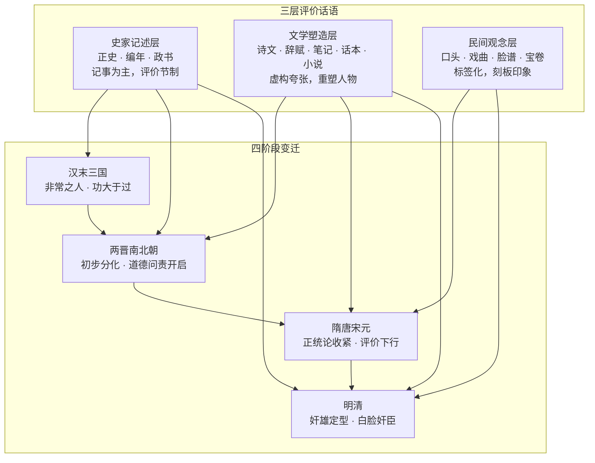

# 从非常之人到白脸奸臣：历史文献中曹操记述与评价的变迁
**——基于殆知阁古籍语料的考察**

---

## 目录

1. [一、绪论](#一绪论)
   - [1.1 研究目的与核心议题](#11-研究目的与核心议题)
   - [1.2 研究方法与文献范围](#12-研究方法与文献范围)
   - [1.3 学术史回顾与文献综述](#13-学术史回顾与文献综述)
   - [1.4 核心概念界定](#14-核心概念界定)
   - [1.5 评价变迁的理论框架](#15-评价变迁的理论框架)
   - [1.6 本研究的创新维度](#16-本研究的创新维度)

2. [二、汉末三国：同时代的曹操](#二汉末三国同时代的曹操)
   - [2.1 陈寿的盖棺论定："非常之人，超世之杰"](#21-陈寿的盖棺论定非常之人超世之杰)
   - [2.2 许劭的月旦评："治世之能臣，乱世之奸雄"](#22-许劭的月旦评治世之能臣乱世之奸雄)
   - [2.3 裴松之注引诸书中的曹操：义兵与迎帝](#23-裴松之注引诸书中的曹操义兵与迎帝)
   - [2.4 对立面的声音：陈琳檄文与《曹瞒传》](#24-对立面的声音陈琳檄文与曹瞒传)
   - [2.5 本章小结](#25-本章小结)

3. [三、两晋南北朝：评价的初步分化](#三两晋南北朝评价的初步分化)
   - [3.1 晋人的政治清算：从"扶翼刘氏"到"凶逆相寻"](#31-晋人的政治清算从扶翼刘氏到凶逆相寻)
   - [3.2 《世说新语》中的曹操：名士笔下的复杂面影](#32-世说新语中的曹操名士笔下的复杂面影)
   - [3.3 正统论话语下的曹操：范晔的"天厌汉德"与语料所限的说明](#33-正统论话语下的曹操范晔的天厌汉德与语料所限的说明)
   - [3.4 本章小结：从"非常之人"到政治贬斥——评价分化的开端](#34-本章小结从非常之人到政治贬斥评价分化的开端)

4. [四、隋唐：史论与咏史诗中的曹操](#四隋唐史论与咏史诗中的曹操)
   - [4.1 杜牧的再评价：《题荀文若传后》](#41-杜牧的再评价题荀文若传后)
   - [4.2 《赤壁》与晚唐咏史诗](#42-赤壁与晚唐咏史诗)
   - [4.3 初盛唐诗人的曹操书写](#43-初盛唐诗人的曹操书写)
   - [4.4 隋唐史论中的正统之争](#44-隋唐史论中的正统之争)
   - [4.5 笔记中的曹操轶事](#45-笔记中的曹操轶事)
   - [4.6 本章小结](#46-本章小结)

5. [五、宋元：理学正统论下的曹操](#五宋元理学正统论下的曹操)
   - [5.1 司马光的"臣光曰"：名分论与教化论](#51-司马光的臣光曰名分论与教化论)
   - [5.2 《纲目》系统的书法：从"魏王操"到"奸贼"](#52-纲目系统的书法从魏王操到奸贼)
   - [5.3 朱子学脉络中的曹操](#53-朱子学脉络中的曹操)
   - [5.4 苏轼的复杂态度](#54-苏轼的复杂态度)
   - [5.5 元代的延续：郝经《续后汉书》与揭傒斯《通鉴纲目书法序》](#55-元代的延续郝经续后汉书与揭傒斯通鉴纲目书法序)
   - [5.6 本章小结：正统论如何把曹操钉在"篡逆"柱上](#56-本章小结正统论如何把曹操钉在篡逆柱上)

6. [六、通俗文类中的曹操：传奇、笔记、话本与白话小说](#六通俗文类中的曹操传奇笔记话本与白话小说)
   - [6.1 话本中的曹操：《三国志平话》的天命论与"曹贼"定性](#61-话本中的曹操三国志平话的天命论与曹贼定性)
   - [6.2 《三国演义》（一百二十回无批本）中的曹操：从"奸雄"到"奸贼"](#62-三国演义一百二十回无批本中的曹操从奸雄到奸贼)
   - [6.3 嘉靖壬午本《三国志通俗演义》的异文价值](#63-嘉靖壬午本三国志通俗演义的异文价值)
   - [6.4 笔记与杂纂中的曹操：从唐传奇到明清笑话书](#64-笔记与杂纂中的曹操从唐传奇到明清笑话书)
   - [6.5 本章小结：从史家"奸雄"到通俗文类的"奸贼"——民间观念的定型](#65-本章小结从史家奸雄到通俗文类的奸贼民间观念的定型)

7. [七、韵文中的曹操：唐诗宋词辞赋与文学接受](#七韵文中的曹操唐诗宋词辞赋与文学接受)
   - [7.1 曹操的原作：《短歌行》《观沧海》《龟虽寿》与两朝乐志的保存](#71-曹操的原作短歌行观沧海龟虽寿与两朝乐志的保存)
   - [7.2 铜雀台意象：从遗令到怀古诗](#72-铜雀台意象从遗令到怀古诗)
   - [7.3 苏轼的赤壁书写：缺席的曹操与在场的曹操](#73-苏轼的赤壁书写缺席的曹操与在场的曹操)
   - [7.4 宋人咏史中的另一面：从"英雄"到"曹瞒"](#74-宋人咏史中的另一面从英雄到曹瞒)
   - [7.5 "建安风骨"的诗学接受：从唐诗注到宋诗论](#75-建安风骨的诗学接受从唐诗注到宋诗论)
   - [7.6 曹操诗的"雄壮"品格：朱熹与王世贞的论定](#76-曹操诗的雄壮品格朱熹与王世贞的论定)
   - [7.7 明清拟乐府："曹操体"作为可模仿的程式](#77-明清拟乐府曹操体作为可模仿的程式)
   - [7.8 本章小结](#78-本章小结)

8. [八、评价的模式：功与罪、能臣与奸雄](#八评价的模式功与罪能臣与奸雄)
   - [8.1 "非常之人"与"超世之杰"：能力话语](#81-非常之人与超世之杰能力话语)
   - [8.2 "治世之能臣，乱世之奸雄"：许劭评语的接受与变形](#82-治世之能臣乱世之奸雄许劭评语的接受与变形)
   - [8.3 "篡汉之贼"：正统论话语](#83-篡汉之贼正统论话语)
   - [8.4 "白脸奸臣"：民间观念的定型](#84-白脸奸臣民间观念的定型)
   - [8.5 本章小结：三层话语的叠加模型](#85-本章小结三层话语的叠加模型)

9. [九、历史变迁与全书总结](#九历史变迁与全书总结)
   - [9.1 四阶段变迁总览](#91-四阶段变迁总览)
   - [9.2 记述、文学、观念三层的互动机制](#92-记述文学观念三层的互动机制)
   - [9.3 未解与开放问题](#93-未解与开放问题)
   - [9.4 本章小结（全书结语）](#94-本章小结全书结语)

10. [十、参考文献](#十参考文献)
   - [一、正史类](#一、正史类-一正史类)
   - [二、编年与政书类](#二、编年与政书类-二编年与政书类)
   - [三、别集与总集类](#三、别集与总集类-三别集与总集类)
   - [四、笔记与史评类](#四、笔记与史评类-四笔记与史评类)
   - [五、小说戏曲类](#五、小说戏曲类-五小说戏曲类)

11. [十一、附录：核心文献原文精录](#十一附录核心文献原文精录)
   - [附录一：陈寿《三国志·魏书·武帝纪》篇末评语全文](#附录一：陈寿《三国志·魏书·武帝纪》篇末评语全文-附录一陈寿三国志魏书武帝纪篇末评语全文)
   - [附录二：裴松之注引孙盛《异同杂语》许劭评语条](#附录二：裴松之注引孙盛《异同杂语》许劭评语条-附录二裴松之注引孙盛异同杂语许劭评语条)
   - [附录三：杜牧《赤壁》全文](#附录三：杜牧《赤壁》全文-附录三杜牧赤壁全文)
   - [附录四：苏轼《念奴娇（赤壁怀古）》全文](#附录四：苏轼《念奴娇（赤壁怀古）》全文-附录四苏轼念奴娇赤壁怀古全文)
   - [附录五：《三国演义》第二十一回"曹操煮酒论英雄"长段](#附录五：《三国演义》第二十一回"曹操煮酒论英雄"长段-附录五三国演义第二十一回曹操煮酒论英雄长段)
   - [附录六：语料版本与考据说明](#附录六：语料版本与考据说明-附录六语料版本与考据说明)

---

## 一、绪论

### 1.1 研究目的与核心议题

曹操（155—220），字孟德，沛国谯县人，东汉末年割据北方、奠定曹魏基业的政治家、军事家、文学家。西晋初年，陈寿在《三国志·魏书·武帝纪》篇末为其作传评曰：

> 评曰汉末天下大乱雄豪并起而袁绍虎眎四州彊盛莫敌太祖运筹演谋鞭挞宇内擥申商之法术该韩白之竒防官方授材各因其器矫情任算不念旧恶终能总御皇机克成洪业者惟其明畧最优也抑可谓非常之人超世之杰矣

这段评语出自《三国志》魏志卷一·武帝纪（殆知阁藏本《三国志》第323行）。陈寿以"明略最优"肯定曹操统一北方的历史功业，称其为"**非常之人**，**超世之杰**"——这是汉末三国时代对曹操最权威的盖棺论定，也是整个曹操评价史的起点。然而，同一历史人物，在明清通俗文类中却成为"**奸雄**"的代名词。以下为小说塑造（《三国演义》第一回"宴桃园豪杰三结义"借许劭之口，非史实定谳）：

> 为首闪出一将，身长七尺，细眼长髯，官拜骑都尉，沛国谯郡人也，姓曹名操字孟德。……汝南许劭，有知人之名。操往见之，问曰：'我何如人？'劭不答。又问，劭曰：'子治世之能臣，乱世之奸雄也。'操闻言大喜。

这段文字出自《三国演义》第一回（集藏《三国演义》行181）。小说开篇即以许劭评语为曹操定调，"奸雄"由此成为后世通俗语汇中曹操的标签。从陈寿的"非常之人"到小说的"乱世之奸雄"，再到民间"白脸奸臣"的刻板印象，曹操的形象经历了近两千年的层累塑造。本研究的核心议题即是：历史文献中对曹操的**记述**与**评价**，如何从汉末的"非常之人"一步步演变为明清的"白脸奸臣"？这一演变经历了哪些关键环节，又是在哪些话语层面完成的？

为回答这一问题，本书区分三个评价话语层面：**史家记述层**（正史、编年、政书中的记事与论赞）、**文学塑造层**（诗文、辞赋、笔记、话本、小说中的书写与重构）、**民间观念层**（口头流传、戏曲、脸谱、宝卷中的刻板印象）。三层话语各有其材料性质、传播机制与评价逻辑，彼此渗透又相互区别：史家记述层提供事件与评价的基本盘，文学塑造层以虚构与夸张放大某些面向，民间观念层则将复杂评价压缩为标签。以许劭"乱世之奸雄"一语为例：它在裴松之注引《异同杂语》中是一句汉末人物品鉴，在《三国演义》第一回中是小说开篇的人物定调，在民间口头中则成为曹操的固定标签——同一句话，在三层话语中的含义与功能截然不同，若混为一谈，评价史便无从谈起。本书的目的，就是以语料库实证为基础，逐层、逐段地重建这一评价变迁的全过程，厘清每一句流行评语的文献出处与语义流变，并回答三个子问题：第一，史家记述层中的曹操评价经历了怎样的内部调整；第二，文学塑造层如何将"奸雄"话语放大为压倒性的形象；第三，民间观念层又是如何完成从"奸雄"到"白脸奸臣"的最终标签化的。

### 1.2 研究方法与文献范围

**语料版本声明**：本研究所用语料为殆知阁古籍文献库官方修订版（`daizhige-org/daizhigev20`），`data` 分支，2026 年 9 月 12 日提交（短提交号 `e9e11f1`，完整哈希 `e9e11f19b7e6bd9c1284bbdab71d2a9cb94d637c`）。旧版 `garychowcmu/daizhigev20` 因文字讹误较多，已弃用。本书所有引文均出自该版本语料，引用时注明书名、卷次与源文件行号，逐字核对，不改一字。

**文献范围**：殆知阁语料库"史藏"（正史、编年、政书）、"子藏"（笔记、史评）、"集藏"（别集、总集、演义小说）诸文类中与曹操相关的全部文献。本书以正史、编年、政书作为记述史实与评价史核心论证的依据；诗文、辞赋、笔记作为文学接受与观念传播的证据；话本、小说、戏曲、宝卷等通俗文类仅作文学呈现与观念传播的证据，不替代史实论证。各类文献在本书中的功能有明确分工：正史回答"史家如何记述与评价"，诗文辞赋回答"文人如何接受与重写"，通俗文类回答"观念如何定型与传播"，三者共同构成评价变迁的完整证据链。

**检索方法**：以约 60 个关键词对语料库作全文检索，关键词包括曹操、曹孟德、孟德、曹公、**魏武**、魏武帝、魏太祖、曹瞒、阿瞒、曹阿瞒、曹丞相、魏王、曹贼、曹氏、**奸雄**、枭雄、治世之能臣、乱世之奸雄、挟天子以令诸侯、宁我负人、宁教我负天下人、官渡、赤壁、华容、铜雀台、铜爵台、建安、建安风骨、建安七子、短歌行、观沧海、龟虽寿、对酒当歌、青梅煮酒、割发代首、梦中杀人、**篡汉**、篡逆、**代汉**、禅代、汉贼、奸臣、非常之人、超世之杰、人中之龙、老贼、曹子、魏主、武皇帝、太祖武皇帝、煮酒论英雄、髀肉复生、三顾茅庐、隆中、卧龙等，共得 120,797 条命中。全部命中按书逐条回源文件复核原文，剔除误检（如"建安"年号、"卧龙"指诸葛亮而非曹操的条目），核心引文逐字抄录并记录源文件路径与行号，凡引用皆可回查。

**分析方法**：一是分层分析，将引文按史家记述、文学塑造、民间观念三层归类，同一事件（如吕伯奢事件、许劭品评）在不同文类中的异文并列对读，观察同一素材如何在不同话语中被改写与利用；二是分期分析，按汉末三国、两晋南北朝、隋唐宋元、明清四个阶段梳理评价话语的承变，寻找每一阶段的转折性文献节点；三是语义考辨，对"奸雄""篡汉""挟天子"等关键评语作词源与语义流变的考证，以语料纠正通行误说；四是征引追踪，考察后世文献对前人评语的引用、改写与误记，还原评价话语层累生成的具体机制。凡语料未见或仅见孤证之处，本书如实注明"语料未见""仅见孤证"，不以常识填补空白。

### 1.3 学术史回顾与文献综述

关于曹操形象演变的研究，向有"从英雄到奸雄"的经典论题。本研究以语料库实证为基础，不虚构、不转述未经核实的现代学术史脉络，而直接从语料本身观察历代评价话语的自我承传：后世论曹操者，几乎无不征引前人的评语——裴松之注引孙盛《异同杂语》记许劭"治世之能臣，乱世之奸雄"之评，唐宋人论曹操多宗陈寿、孙盛之说，元明话本、小说又将这些评语化入情节。这种"评语的再征引"现象，本身就是语料中最清晰可见的评价史线索。

语料实证同时揭示出现有通行论述中若干未经核验的环节。其一，流行语的出处多被误记："挟天子以令诸侯"一语在语料中的可考出处是《三国志·武帝纪》裴松之注引《献帝春秋》所记田丰劝袁绍之谋（"若挟天子以令诸侯，四海可指麾而定"），并非曹操自述其策；"宁教我负天下人，休教天下人负我"为《三国演义》第四回小说情节的定型表述，其史源《三国志》注引《世语》仅作"宁我负人，毋人负我"，且系误杀之后语，情节亦与小说大异；"献刀刺董"故事在《三国志平话》中并不见载。其二，许劭"治世之能臣，乱世之奸雄"的评语，其文献出处必须精确标注为裴松之注引孙盛《异同杂语》（《世说新语》注亦引其佚文），不得笼统称为"史书云"。其三，《三国志平话》与《三国演义》是两种不同的书，前者为宋元话本系统，后者为明代章回小说，引用时必须按语料实际区分标注，不得混称。

正是基于这些语料层面的发现，本书采取与以往研究不同的路径：不依赖转述的二手论断，而以 120,797 条命中为底本，对每一条核心引文回源文件逐字核对；不预设"演变"的方向，而让三层话语、四阶段变迁的模型从材料中自然浮现。

需要特别说明的是，本节所谓"学术史回顾"，并非罗列未经核实的现代论著名目，而是对语料内部"评价话语的自我承传"作一鸟瞰。语料显示，历代论曹操者几乎无不征引前人：陈寿"非常之人"的定评被唐宋史论反复援引或反驳，许劭"奸雄"之语经裴注进入正史注文系统，又经话本、小说进入通俗文类，"铜雀台""赤壁"意象则在诗赋中被历代文人不断重写。这种层累征引本身，就是一部写在文献内部的评价史。本书的工作，是把这部"文献内部的评价史"从 120,797 条命中里打捞出来，以可计数的证据、可回查的引文，替代印象式的宏观叙述。下文各章将按阶段展开实证，第八章再作综合的模式提炼。

### 1.4 核心概念界定

"奸雄""篡汉""正统"等词语在近两千年的使用中语义不断流变，若不先加界定，论述极易陷入各说各话。本节所作界定，均以语料中的实际用法为依据，目的有二：一是固定本书的行文术语，使各章的判断有统一的标尺；二是揭示词语本身的历史性——如下文将反复论证的，"奸雄"从一句人物品评变为固定标签，"篡"与"代"的一字之差背后是正统立场的分野，这些语义变迁正是评价史的核心内容。

- **记述**：指文献中对曹操生平事迹的陈述性记载，以正史本纪、列传及编年史为主要载体，核心是"发生了什么"，如迎献帝都许、官渡之战、赤壁之战等事件的叙述。
- **评价**：指文献中对曹操其人其事的价值判断，以史家的论赞、评语，文人的史论、咏史诗，小说的叙述者评论为主要载体，核心是"如何看待"，如"非常之人""奸雄""汉贼"等定性之辞。
- **形象**：指文学塑造层与民间观念层中曹操的整体面貌，是记述与评价经虚构、夸张、标签化之后形成的复合体，如《三国演义》中多疑、权变的"曹阿瞒"。
- **能臣**：出自许劭评语"治世之能臣"的"能臣"一系，指肯定曹操治国理政之才的评价话语，强调其统一北方、唯才是举、节俭尚法的一面，与王沈《魏书》"文武并施"的褒美同属一脉。
- **奸雄**：出自许劭评语"乱世之奸雄"的"奸雄"一系，指否定曹操政治品格的评价话语，强调其欺君罔上、权诈残忍的一面。语料显示，"奸雄"一词的贬义色彩在通俗文类中不断强化，最终成为曹操的标签。
- **篡汉**：指以非法、不义手段夺取汉室政权的指控，含强烈的道德贬义，多见于以蜀汉为正统的论述及通俗文类中对曹操"汉贼"身份的认定。
- **代汉**：指王朝更替的客观描述，语义相对中性，如"魏代汉"的纪年表述。本书严格区分二者：论者用"篡"还是用"代"，本身即是其正统立场的表征。
- **正统**：指论者关于"谁代表历史合法性"的立场，即**正统论**。正统论是曹操评价变迁中最重要的结构性变量：以曹魏为正统者（如陈寿），曹操是开国之君；以蜀汉为正统者（如朱熹《纲目》书法），曹操是篡逆之贼。同一事件在不同正统立场下会得到完全相反的评价。
- **"白脸奸臣"**：指明清以来民间对曹操的脸谱化定型说。如实说明：在本研究语料中检索"白脸"与曹操的关联，未见戏曲脸谱或"白脸奸臣"的直接记载（《靖江宝卷》中"白脸"均指"杭州花粉搽白脸""白脸小将"，与曹操无关），故本书以《三国演义》等通俗文类中"奸臣""奸雄""曹贼"的定型为民间观念层的主要文献证据，"白脸奸臣"仅作为民间观念的通称使用，不作有文献出处之引证。

### 1.5 评价变迁的理论框架

综合语料实证，本书提炼出"**三层评价话语—四阶段变迁**"的理论模型。

**三层评价话语**，指关于曹操的评价在三种不同性质的话语中生产与流传：

一是**史家记述层**，载体为正史、编年、政书。其特点是记事为主、评价节制，论赞多作于篇末，措辞经反复斟酌。陈寿"非常之人，超世之杰"的定评即属此层，它以"明略最优"的功业论为基准，对曹操的道德瑕疵（如"不修至道"）亦不讳言，呈现的是一种功罪并陈的史家笔法。裴松之注引诸书（《魏书》的褒美、《曹瞒传》的贬斥、《世语》的异闻）同属此层，构成后世一切评价的基本材料库。

二是**文学塑造层**，载体为诗文、辞赋、笔记、话本、小说。其特点是以虚构、夸张、典型化重塑人物，评价随文类功能与作者立场而大幅摆动。以下为小说情节（《三国演义》第四回"废汉帝陈留践位"误杀吕伯奢全家后的定型表述，引用时不得作史实）：

> 操曰：'伯奢到家，见杀死多人，安肯干休？若率众来追，必遭其祸矣。'宫曰：'知而故杀，大不义也！'操曰：'宁教我负天下人，休教天下人负我。'陈宫默然。

这段文字出自《三国演义》第四回（集藏《三国演义》行294）。小说将史源中仅作"宁我负人，毋人负我"的误杀之后语，改写为蓄意补杀伯奢时的宣言，并安放在虚构的"缚而杀之"情节中——"奸雄"的文学定型正是在这类改写中完成的。唐人咏史诗、宋人词赋中的"铜雀台""赤壁"意象，同样属于此层：它们不论证史实，而塑造观念。

三是**民间观念层**，载体为口头流传、戏曲、脸谱、宝卷、谚语。其特点是将复杂的历史评价压缩为高度简化的标签与刻板印象，传播最广，也最脱离史实。"奸臣""曹贼""白脸"一类标签即属此层。如1.4所界定，"白脸奸臣"的脸谱说法在语料中未见直接记载，本书以通俗文类中的定型为其文献证据；民间观念层的存在本身，则由小说、宝卷、笔记中反复出现的贬义标签得到充分证明。值得注意的是，民间观念层并非被动接受上层话语：它对"奸雄"标签的选择性强化（如只记权诈、不记功业），反过来又会渗透进文人的笔记与诗话，形成自下而上的回流。

**四阶段变迁**，指三层话语互动之下，曹操评价重心随时代推移的四次转移：

第一阶段，**汉末三国**：同时代的曹操。史家记述层占主导，陈寿"非常之人"的定评确立，裴注汇集褒贬异文，评价总体功大于过。

第二阶段，**两晋南北朝**：评价的初步分化。孙盛等人的批判开启道德问责，《世说新语》收录曹操轶事，文学塑造层开始独立发声，"奸雄"话语的种子被播下。

第三阶段，**隋唐宋元**：史论与正统论下的收紧。唐人史论、咏史诗多面书写，宋代以后**正统论**（特别是以蜀汉为正统的史学立场）使"篡汉""汉贼"的指控获得制度性支撑，曹操的道德评价持续下行。

第四阶段，**明清**：通俗文类的定型。《三国演义》及毛宗岗评点将"奸雄"形象推向极致并固定下来，通过小说、戏曲的广泛传播，"白脸奸臣"的民间观念最终定型。

三层与四阶段的关系可用下图表示：

该模型的要点在于：评价的变迁不是单一话语的线性下滑，而是三层话语在不同阶段此消彼长、相互渗透的结果。史家记述层的影响在早期最强，随后文学塑造层接管了"奸雄"话语的生产，到明清则由民间观念层完成最终的标签化。每一阶段的转折，都可以在语料中找到具体的文献节点，下文各章将逐一实证。

### 1.6 本研究的创新维度

1. **语料版本声明与逐字核对的方法论创新**：本研究明确弃用文字讹误较多的旧版 `garychowcmu/daizhigev20`，采用殆知阁官方修订版（`daizhige-org/daizhigev20`，`data` 分支，2026-09-12 提交 `e9e11f1`），全部引文回源文件按行号逐字核对，保留异体字、不改标点，凡引用皆可回查。以往研究多转引通行点校本，讹误辗转相因；本书的语料版本声明与核对机制，使每一个论断都有可验证的文本依据。

2. **"三层评价话语—四阶段变迁"的理论模型**：本书首次将曹操评价史分解为史家记述、文学塑造、民间观念三个话语层面，并与汉末三国、两晋南北朝、隋唐宋元、明清四个阶段交叉，说明评价变迁是三层话语此消彼长、相互渗透的结果，而非单一话语的线性下滑。该模型为全书的章节结构提供了统一框架。

3. **史实与文学的严格区分**：《三国演义》的情节（如"宁教我负天下人"、煮酒论英雄、许田打围）一律标注为小说塑造，只作文学呈现与观念传播的证据，不替代史实论证；《三国志平话》与《三国演义》按语料实际区分为两种不同的书；类书辑录注明所引来源。这种文类自觉避免了将文学虚构当作史实征引的常见陷阱。

4. **以语料纠正通行误说**：本书以实证考定若干流行说法的真实出处——"挟天子以令诸侯"出自裴注引《献帝春秋》所记田丰劝袁绍之谋，非曹操自述；"宁教我负天下人"为《三国演义》第四回的定型表述，其史源《世语》仅作"宁我负人，毋人负我"；许劭"治世之能臣，乱世之奸雄"的评语须精确标注为裴注引孙盛《异同杂语》，不得笼统称"史书云"；《三国志平话》中并不见"献刀刺董"故事。这些考辨均系语料逐字核对所得。

5. **长时段、全覆盖的证据链**：从汉末陈寿的"非常之人"到明清"奸雄"定型，近两千年的评价变迁在本研究中由 120,797 条命中的语料逐段支撑，每一阶段的转折都有具体的文献节点（如孙盛批判、朱熹《纲目》书法、《三国演义》成书）作为证据，避免了以点带面、以晚概早的论证方式。

6. **材料薄弱处的如实存疑**："白脸奸臣"的脸谱说法在语料中未见直接记载，本书如实注明而不作引证；独立题名的《异同杂语》本语料未见，其佚文仅见于裴注与《世说新语》注所引，亦如实说明。这种"语料未见即明言未见"的体例，保证了全书论断与证据的严格对应。

综上，本章阐明了本书的研究目的与核心议题（1.1）、研究方法与文献范围（1.2）、以语料实证为基础的学术史立场（1.3）、核心概念界定（1.4）、"三层评价话语—四阶段变迁"的理论框架（1.5），以及本研究的六个创新维度（1.6）。本章确立的方法论原则——语料版本声明在先、引文逐字核对在先、史实与文学严格区分在先——将贯穿全书各章。下一章起，本书进入实证部分：第二章考察汉末三国同时代的曹操，即史家记述层中"非常之人"定评的形成过程。

---

## 二、汉末三国：同时代的曹操

曹操生于汉末，卒于建安二十五年（220），其功业与争议几乎全部展开于同时代人的注视之下。本章所据十七条证据，全部出自《三国志》本传及其裴松之注所引诸书——即以陈寿《三国志》为核心的正史记述层。记述者与被记述者时代相接，褒贬尚未经过后世层累的道德审判，呈现出一种后世罕见的"分裂的真实"：陈寿的**盖棺论定**是**非常之人，超世之杰**，许劭以**治世之能臣，乱世之奸雄**一言定型，王沈《魏书》极写其文武全才，陈琳檄文则斥其**赘阉遗丑****豺狼野心**。本章即循此四条线索，清理汉末三国时期曹操形象的原始地层。

### 2.1 陈寿的盖棺论定："非常之人，超世之杰"

《三国志》魏志卷一《武帝纪》篇末，陈寿为曹操所作总评，是正史对曹操评价的开端，也是后世一切"功罪论"的出发点：

> 评曰汉末天下大乱雄豪并起而袁绍虎眎四州彊盛莫敌太祖运筹演谋鞭挞宇内擥申商之法术该韩白之竒防官方授材各因其器矫情任算不念旧恶终能总御皇机克成洪业者惟其明畧最优也抑可谓非常之人超世之杰矣

这段评语共九十一字，可逐句疏通如下。"汉末天下大乱雄豪并起"点明时代背景；"而袁绍虎眎四州彊盛莫敌"，以袁绍坐拥四州、虎视天下、强盛无人能敌为参照，衬托曹操创业之难；"太祖运筹演谋鞭挞宇内"，谓曹操运筹谋划、以威权驾驭天下；"擥申商之法术"，兼取申不害、商鞅的法家治术；"该韩白之竒防"，兼备韩信、白起的用兵奇策；"官方授材各因其器"，授官任人、各依其才器；"矫情任算不念旧恶"，克制个人私情、凭谋算用人，不记旧怨；"终能总御皇机克成洪业者惟其明畧最优也"，终能总揽朝政、成就大业，全因**明略**最优；末句"抑可谓非常之人超世之杰矣"，是盖棺论定的总判。

此评的评价史意义有三。其一，它是正史定评之始。陈寿虽仕西晋，此评乃对三国人物的同时代总结；其**非常之人，超世之杰**八字，此后成为征引率最高的曹操定评关键词。其二，陈寿的肯定是有保留的肯定：全篇以**明略**最优为总纲，肯定的是统一北方的历史功业（"总御皇机克成洪业"），"非常""超世"之赞始终围绕"略"——政治军事才能——展开，不涉道德完人式的褒扬。其三，"矫情任算不念旧恶"八字为后世"奸雄"论留下了缝隙："矫情"可作"克制私情"解，亦可作"矫饰作伪"解，一字两义，正是曹操形象后世聚讼的文字根源之一。

建安十五年十二月己亥令，是曹操晚年对自己一生最重要的一次自述，裴松之注引《魏武故事》全文载之：

> 【魏武故事载公十二月己亥令曰孤始举孝防年少自以本非岩穴知名之士恐为海内人之所见凡愚欲为一郡守好作政教以建立名誉使世士明知之故在济南始除残去秽平心选举违迕诸常侍以为彊豪所忿恐致家祸故以病还去官之后年纪尚少顾视同岁中年有五十未名为老内自图之从此却去二十年待天下淸乃与同岁中始举者等耳故以四时归乡里于谯东五十里筑精舍欲秋夏读书冬春射猎求底下之地欲以泥水自蔽絶宾客徃来之望然不能得如意后征为都尉迁典军校尉意遂更欲为国家讨贼立功欲望封侯作征西将军然后题墓道言汉故征西将军曹侯之墓此其志也

这道自述令可分三层疏通。第一层追述初志：当初被举为孝廉时年纪尚轻，自认并非隐居有名之士，恐怕被海内人视为凡庸，最初的志向不过是做一任好郡守、立名誉而已；在济南任国相时铲除残暴、公正选举，开罪宦官与豪强，托病辞官。第二层写退隐之计：辞官后自忖年纪尚轻，打算再等二十年、待天下清平，遂在谯东五十里筑精舍，"欲秋夏读书冬春射猎"，"然不能得如意"。第三层是点睛之笔：后被征为都尉、迁典军校尉，志向转为为国家讨贼立功，指望封侯、做征西将军，然后在墓道上题字"汉故征西将军曹侯之墓"——"此其志也"。

己亥令是后世"本无代汉之心"论述的直接文本依据：墓题犹以"汉故"冠首——"汉故征西将军曹侯之墓"，"汉故"二字最重，至死以汉臣自命。同情曹操者据此立论：魏代汉是曹丕所为，曹操本人无篡汉之心。然论者亦可反诘：此令作于建安十五年曹操权势熏天之时，自述"本志"是否即陈寿所谓"矫情任算"，大可存疑。自述与实迹之间的张力，恰是曹操评价聚讼不已的根源之一。

魏末景元四年，钟会伐蜀前移檄蜀之将吏士民，追尊曹操曰：

> 防移檄蜀将吏士民曰往者汉祚衰微率土分崩生民之命防于泯灭太祖武皇帝神武圣哲拨乱反正拯其将坠造我区夏髙祖文皇帝应天顺民受命践祚烈祖眀皇帝奕世重光恢拓洪业

"往者汉祚衰微率土分崩生民之命防于泯灭"，谓汉室衰微、天下分崩、生民命悬一线；"太祖武皇帝神武圣哲拨乱反正拯其将坠造我区夏"，谓太祖武皇帝神武圣哲，拨乱反正，拯救将倾之局，开创我华夏基业；以下追述文帝"应天顺民受命践祚"、明帝"奕世重光恢拓洪业"。

这篇檄文代表曹魏官方在魏末对曹操的历史定位：汉室的拯救者、王业的开创者。其中**拨乱反正**四字最堪注意——在官方话语中，曹操事业的性质是"反正"而非"篡逆"。这一官方定调与后世"篡汉"指控针锋相对，也为"正统论"话语埋下源头：曹操形象的分裂，从一开始就与"谁为正统"的分裂同构。

### 2.2 许劭的月旦评："治世之能臣，乱世之奸雄"

许劭（字子将）以**月旦评**品评人物闻名。青年曹操登门求评，得八字而去，这八字成为**奸雄**一词加于曹操的最早文献定型之一。裴松之注引孙盛《异同杂语》佚文载其事：

> 孙盛异同杂语云太祖尝私入中常侍张让室让觉之乃舞手防于庭逾垣而出才武絶人莫之能害博览羣书特好兵法抄集诸家兵法名曰接要又注孙武十三篇皆传于世尝问许子将我何如人子将不答固问之子将曰子治世之能臣乱世之奸雄太祖大笑】

此条前半记曹操青年轶事：曾私自潜入中常侍张让的宅室，被发觉后在庭中舞动手臂作防御之状、翻墙而出；"才武絶人莫之能害"；"博览羣书特好兵法"，抄集诸家兵法名曰《接要》、又注《孙武十三篇》并传于世。后半记问答：曹操问许劭"我何如人"，许劭不答，坚持追问之下，许劭道出八字："子治世之能臣乱世之奸雄"，曹操大笑而受之。

八字评语的精妙在于"治世/乱世"的二分：同一人的才具，因时势而异其道德定性——治世则为**能臣**，乱世则为**奸雄**。曹操闻之大笑，不以为忤而反受之，足见其自负与旷达。此条是曹操形象"能臣/奸雄"二元结构的话语源头：后世一切"奸雄论"，上溯皆至此八字。

此处须作两点考据说明。其一，独立题名的《异同杂语》本语料未见，其佚文仅见裴松之注（本条）与《世说新语》注所引，故本章所据为裴注转引，非孙盛原书。其二，许劭评语另有一异文作"乱世之英雄，治世之奸贼"，将褒贬完全翻转，但此异文未见于本章所核对的十七条证据，故不录、不调和，存此备考。

与"奸雄"定型互为表里的，是吕伯奢事件的异文。裴松之注引孙盛《杂记》曰：

> 孙盛杂记曰太祖闻其食器声以为图已遂夜杀之既而凄怆曰宁我负人无人负我遂行】

曹操听见食器声响，以为吕伯奢一家要加害自己，当夜杀之；事后凄然感伤道："宁我负人无人负我"，遂离去。此为吕伯奢事件的异文，与《世语》所载互为异文（据本章证据归类说明）。"宁我负人无人负我"八字，凝练了曹操多疑自保、宁负天下的性格记忆，与许劭"乱世之奸雄"评形成互文：奸雄之"奸"，正在于此种极端自保的决断。此条虽仅三十六字，却是奸雄性格论流传最广的注脚。

裴松之注引《九州春秋》又载"鸡肋"之叹，是同时代人揣摩曹操心态的珍贵侧写：

> 九州春秋曰时王欲还出令曰鸡肋官属不知所谓主簿杨修便自严装人惊问修何以知之修曰夫鸡肋弃之如可惜食之无所得以比汉中知王欲还也

曹操想要退兵，发出口令"鸡肋"，属官都不知何意；主簿杨修便收拾行装准备撤退；众人惊问杨修何以知之，杨修答道："夫鸡肋弃之如可惜食之无所得以比汉中知王欲还也"——鸡肋丢掉可惜、吃起来又没什么味道，以此比况汉中，便知魏王想退兵了。

此条的价值不在史实考据，而在其心理描写的史料意义：汉中进退两难之际，一句即兴口令"鸡肋"，经杨修点破为"弃之如可惜食之无所得"，将曹操从"超世之杰"的神坛拉回为一个会犹豫、会权衡得失的凡人统帅。它与"宁我负人"的决绝形成对照：同一个曹操，既有杀伐决断的狠辣，也有进退维谷的踌躇——"鸡肋"之叹捕捉到了奸雄面具之下的人性褶皱。

### 2.3 裴松之注引诸书中的曹操：义兵与迎帝

裴松之注《三国志》征引诸家异说，于《武帝纪》下所引《魏书》《英雄记》《献帝春秋》《献帝传》《魏武故事》等，或褒或贬，或补本传之阙，共同拼贴出立体的同时代曹操。本节取其最著者三条：王沈《魏书》的全面褒美、酸枣会盟痛斥诸将、迎献帝迁都许的实录。

裴松之注引王沈《魏书》，是对曹操最全面的正面评价，可视为曹魏官方史书的定调之笔：

> 【魏书曰太祖自统御海内芟夷羣丑其行军用师大较依孙吴之法而因事设竒谲敌制胜变化如神自作兵书十万余言诸将征伐皆以新书从事临事又手为节度从令者克防违教者负败与虏对阵意思安闲如不欲战然及至决机乗胜气势盈溢故每战必克军无幸胜知人善察难以伪拔于禁乐进于行阵之间取张辽徐晃于亡虏之内皆佐命立功列为名将其余拔出细微登为牧守者不可胜数是以剏造大业文武并施御军三十余年手不舍书昼则讲武防夜则思经传登高必赋及造新诗被之管皆成乐章才力絶人手射飞鸟躬禽猛兽常于南皮一日射雉获六十三头及造作宫室缮制器械无不为之法则皆尽其意雅性节俭不好华丽后宫衣不锦绣侍御履不二采帷帐屏风坏则补纳茵蓐取温无有缘饰

此段长评可分四层疏通。其一论用兵：自总揽天下、铲除群丑；用兵大体依孙武、吴起之法而因事设奇、变化如神；自著兵书十万余言，将领征伐皆按新书行事，临事又亲手部署调度，从令者胜、违令者败；对阵时神态安闲似无战意，及至决战乘胜、气势充盈，故每战必胜、绝无侥幸。其二论知人：善于识人、难以伪装欺瞒，从行伍中提拔于禁、乐进，从降虏中擢用张辽、徐晃，皆成佐命名将，其余从微贱中提拔为牧守者数不胜数。其三论文武：开创大业、文武并施；统军三十余年手不释卷，白天讲武、夜晚读经；登高必赋，所作新诗配以管弦皆成乐章；才力绝人，能手射飞鸟、亲擒猛兽；营造宫室、修治器械，无不亲定法则、尽其心意。其四论节俭：天性节俭、不好华丽，后宫不穿锦绣、侍从鞋不双色，帷帐屏风坏了就缝补，被褥只求取暖、毫无装饰。

《魏书》为曹魏官方史书（王沈撰），此段褒美即官方定调：军事家（用兵如神）、政治家（知人善任）、文人（手不释卷、登高必赋）、节俭之主——"能臣"面相的集大成。与陈寿**明略**最优合观，正史系统对曹操的基本肯定是一致的：统一北方的功业与文武全才。而它与《曹瞒传》的敌国之笔（见2.4）恰成镜像对读：此处的"手不舍书"，在彼处是"佻易无威重"；此处的"知人善察"，在彼处是"计画胜出己者随以法诛之"。

初平元年酸枣会盟，诸军观望不前，曹操痛斥诸将并陈分道进兵之谋，是其早期以"义兵"号召、富于战略眼光的完整呈现：

> 太祖曰举义兵以诛暴乱大众已合诸君何疑向使董卓闻山东兵起倚王室之重据二周之险东向以临天下虽以无道行之犹足为患今焚烧宫室劫迁天子海内震动不知所归此天亡之时也一战而天下定矣不可失也遂引兵西将据成臯邈遣将卫兹分兵随太祖到荥阳汴水遇卓将徐荣与战不利士卒死伤甚多太祖为流矢所中所乘马被创从弟洪以马与太祖得夜遁去荣见太祖所将兵少力战尽日谓酸枣未易攻也亦引兵还太祖到酸枣诸军兵十余万日置酒高会不图进取太祖责让之因为谋曰诸君听吾计使渤海引河内之众临孟津酸枣诸将守成臯据敖仓塞轘辕大谷全制其险使袁将军率南阳之军军丹析入武关以震三辅皆高垒深壁勿与战益为疑兵示天下形势以顺诛逆可立定也今兵以义动持疑而不进失天下之望窃为诸君耻之邈等不能用

疏通其大意：曹操质问诸将，举义兵诛讨暴乱、大军已会合，为何还迟疑？假如董卓闻山东兵起，凭借王室名分、据守东西二周之险东向临制天下，即使用无道的方式行事也足以成患；如今董卓焚烧宫室、劫迁天子，海内震动、人心无归，正是天亡之时，一战可定天下，不可错失。于是曹操引兵西进、将据成皋，张邈派卫兹分兵随行，至荥阳汴水遇徐荣，交战失利、士卒死伤甚多，曹操中流矢、乘马受伤，从弟曹洪让马与他，得以连夜脱逃；徐荣见曹操兵少而力战终日，料酸枣不易攻，也引兵退还。曹操到酸枣，见诸军十余万人"日置酒高会不图进取"，当众斥责并献分道进兵之谋：袁绍引河内之众逼近孟津，酸枣诸将守成皋、据敖仓、塞轘辕大谷以全制其险；袁术率南阳之军屯丹析、入武关以震三辅；各军高垒深壁、不与敌战，多设疑兵、向天下展示形势，"以顺诛逆可立定也"。末了正色道：以义起兵却迟疑不进，失去天下人的期望，"窃为诸君耻之"；张邈等人不能采用。

此条兼具三重意义：其一，"义兵"话语——"举义兵以诛暴乱""兵以义动""以顺诛逆"，此时的曹操是讨董义兵的旗手，其政治资本是"义"，与后来的"奸雄"定型形成强烈张力；其二，战略眼光——分道进兵、据险示形之谋条理井然，已见"明略"之端倪；其三，道德勇气——当众"责让"、"窃为诸君耻之"，三十出头的青年将领敢对拥兵十余万的诸路大人公开折辱，非大魄力不能为。陈琳檄文恰恰抓住"轻进易退伤夷折衂"来翻转同一段史实——事实共享，评价翻转。

建安元年迎献帝至洛阳、迁都于许，是曹操由地方军阀转为"总御皇机"的转折点，《武帝纪》记其完整过程：

> 秋七月杨奉韩暹以天子还洛阳【献帝春秋曰天子初至洛阳幸城西故中常侍赵忠宅使张扬缮治宫室名殿曰扬安殿八月帝乃迁居】奉别屯梁太祖遂至洛阳卫京都暹遁走天子假太祖节钺录尚书事【献帝纪曰又领司隶校尉】洛阳残破董昭等劝太祖都许九月车驾出轘辕而东以太祖为大将军封武平侯自天子西迁朝廷日乱至是宗庙社稷制度始立

"秋七月，杨奉、韩暹以天子还洛阳"（注引《献帝春秋》详天子暂居赵忠旧宅、张扬缮治宫室诸事）；杨奉别屯于梁，曹操进至洛阳保卫京城，韩暹败走；天子授曹操节钺、录尚书事（注引《献帝纪》：又领司隶校尉）；洛阳残破，董昭等劝曹操迁都于许；九月车驾出轘辕东行，拜曹操为大将军、封武平侯；陈寿以"自天子西迁朝廷日乱至是宗庙社稷制度始立"作结。

陈寿以"宗庙社稷制度始立"作结，是对曹操迎帝之功的正面肯定：在正史叙事中，迎帝是"拨乱反正"的制度重建，而非"劫持"。但同一事件在对手话语中完全反转。**挟天子以令诸侯**一语的文献出处，恰见裴注引《献帝春秋》所载田丰之谋——"若挟天子以令诸侯四海可指麾而定"；袁绍则怒斥曹操"今乃背恩挟天子以令我乎"——"背恩"二字点出，在袁绍眼中"挟天子"已由"尊奉"转为"号令"。沮授预言袁绍必败，称曹操"以曹兖州之明畧又挟天子以为资"——敌方谋士亦不得不承认其优势；而沮授早年劝袁绍"宜迎大驾安宫邺都挟天子而令诸侯"则说明：迎帝本是当时谋士的通用献策，曹操只是抢先实现了它。同一"迎帝"事实，"奉天子以令不臣"与"挟天子以令诸侯"仅一字之差，评价却判若两极——这正是曹操评价史"罗生门"的起点。

### 2.4 对立面的声音：陈琳檄文与《曹瞒传》

与《魏书》的全面褒美、陈寿的"超世之杰"相对，同时代即有系统的负面书写：一是袁绍檄州郡文（陈琳作）的政治檄文之笔，一是吴人所作《曹瞒传》的敌国之笔。二者与官方褒美恰成两极，对读之下，可见同时代的曹操评价已然分裂。

陈琳为袁绍作檄州郡文，历数曹操诸罪，是汉末政治檄文对曹操最系统的负面书写。裴松之注引《魏氏春秋》载其文，此处节录其斥操主体部分的前半——先攻出身、再数"背恩"：

> 操赘阉遗丑本无令德僄狡锋侠好乱乐祸幕府昔统鹰扬扫夷凶逆续遇董卓侵官暴国于是提劒挥鼓发命东夏方收罗英雄弃瑕録用故遂与操参咨防畧谓其鹰犬之才爪牙可任至乃愚佻短虑轻进易退伤夷折衂数防师徒幕府輙复分兵命鋭修完补辑表行东郡太守兖州刺史被以虎文授以偏师奬就威柄冀获秦师一克之报而操遂乗资防扈肆行酷烈割剥元元残贤害善故九江太守边让英才后逸天下知名以直言正色论不阿謟身被枭县之戮妻孥受灰灭之咎自是士林愤痛民怨弥重一夫奋臂举州同声故躬破于徐方地夺于吕布彷徨东裔蹈据无所幕府唯彊干弱枝之义且不登叛人之党故复援旌擐甲席卷赴征金鼔响震布众破沮拯其死亡之患复其方伯之任是则幕府无德于兖土之民而有大造于操也

疏通其要：开篇即攻出身——"赘阉遗丑""本无令德"；"僄狡锋侠""好乱乐祸"。接着叙袁绍之恩：幕府昔日统率鹰扬之师、扫除凶逆，继而董卓侵官暴国，于是提剑击鼓、向东方发布号令；正当招罗英雄、不计小过，遂与曹操参谋军事，视其为鹰犬爪牙之才。不料其"愚佻短虑""轻进易退"，多次损伤军队；幕府屡次分兵增援、为其补足，表荐他为东郡太守、兖州刺史，授以虎符偏师、扶助其树立威权。曹操却"乗资防扈"，"肆行酷烈割剥元元残贤害善"：边让英才俊逸、天下知名，以直言正色、不阿谄而被枭首示众、妻孥俱灭；自此士林愤痛、民怨更深。徐州之败、吕布夺兖州，曹操彷徨东方、无所依附；幕府本着强干弱枝之义，再次举兵救其于危亡、恢复其州牧之任——"是则幕府无德于兖土之民而有大造于操也"。

前半檄文的笔法是三板斧：出身攻击（**赘阉遗丑**——以宦官养子之后讥其门第）、能力贬低（"愚佻短虑"——将酸枣会盟时的战略家写成轻进易退之徒）、恩义倒置（袁绍于操有"大造"之恩，操反"背恩"）。檄文对曹操早年事迹的叙述（讨董、东郡、兖州）与《武帝纪》本传事实大致相合，褒贬系于一念：同样的"轻进易退"，在陈寿笔下是"运筹演谋"，在陈琳笔下是"愚佻短虑"——事实共享，评价翻转。

檄文后半层层升级，由"背恩"而"专制"而"发冢"，收束于"豺狼野心"：

> 后会銮驾东反羣虏乱政时冀州方有北鄙之警匪遑离局故使从事中郎徐勋就发遣操使缮修郊庙翼卫防主而便放志専行胁迁省禁卑侮王宫败法乱纪坐召三台専制朝政爵赏由心刑戮在口所爱光五宗所恶灭三族羣谈者防显诛腹议者蒙隐戮道路以目百寮钳口尚书记朝会公卿充员品而已故太尉杨彪歴典三司享国极位操因睚眦被以非罪榜楚并兼五毒俱至触情放慝不顾宪章又议郎赵彦忠谏直言议有可纳故圣朝含听改容加锡操欲迷夺时权杜絶言路擅收立杀不俟报闻又梁孝王先帝母弟坟陵尊显松栢桑梓犹宜恭肃而操率将校吏士亲临发掘破棺裸尸畧取金宝至令圣朝流涕士民伤懐又署发丘中郎将摸金校尉所过堕突无骸不露身处三公之官而行桀虏之态殄国虐民毒流人鬼加其细政苛惨科防互设缯缴充蹊坑穽塞路举手挂纲罗动足蹈机陷是以兖豫有无聊之民帝都有嗟吁之怨歴观古今书籍所载贪残虐烈无道之臣于操为甚幕府方诘外奸未及整训加意含覆冀可弥缝而操豺狼野心潜包祸谋

后半由"背恩"而"专制"而"发冢"层层升级：銮驾东还、群贼乱政之际，冀州正有北方边警，故派徐勋传令曹操修缮郊庙、护卫幼主；曹操却"放志専行"，"胁迁省禁卑侮王宫败法乱纪坐召三台専制朝政"；"爵赏由心刑戮在口所爱光五宗所恶灭三族"；"羣谈者防显诛腹议者蒙隐戮道路以目百寮钳口"，尚书只记朝会名目、公卿不过充数；杨彪"因睚眦被以非罪"，"榜楚并兼五毒俱至"；赵彦忠谏直言、朝廷本已嘉纳，曹操为独揽大权"擅收立杀不俟报闻"；梁孝王陵墓尊显，曹操竟率将校亲临发掘，"破棺裸尸畧取金宝"，"至令圣朝流涕士民伤懐"；更设置"发丘中郎将摸金校尉"，"所过堕突无骸不露"；"身处三公之官而行桀虏之态殄国虐民毒流人鬼"；法网密布，"举手挂纲罗动足蹈机陷"，以致"兖豫有无聊之民帝都有嗟吁之怨"；总论"贪残虐烈无道之臣于操为甚"，收束于"豺狼野心潜包祸谋"。

后半檄文的指控链条是：专制朝政→钳制言路（"道路以目百寮钳口"）→发掘陵墓（"发丘中郎将摸金校尉"）→总论"贪残虐烈无道之臣于操为甚"，收束于"豺狼野心潜包祸谋"。其中二官名是否为史实须如实注明：本章所核对证据中仅见陈琳檄文这一处，未见他证，属孤证，不可遽以之为史实。其**赘阉遗丑****豺狼野心**等语汇，此后成为"奸雄"论的弹药库；与《魏书》的全面褒美恰成两极，对读之下，可见"能臣/奸雄"的分裂在同时代即已完成。

与陈琳的政治檄文并峙的，是吴人所作《曹瞒传》的敌国之笔。裴注引其文，极写曹操轻佻无威、持法峻刻：

> 曹瞒传曰太祖为人佻易无威重好音乐倡优在侧常以日达夕被服轻绡身自佩小鞶囊以盛手巾细物时或冠帢防以见賔客每与人谈论戏弄言诵尽无所隐及欢悦大笑至以头没柸案中肴膳皆沾汚巾帻其轻易如此然持法峻刻诸将有计画胜出己者随以法诛之及故人旧怨亦皆无余其所刑杀輙对之垂涕嗟痛之终无所活

"太祖为人佻易无威重"，喜好音乐，倡优在侧，常从白天到夜晚；穿轻薄丝衣，随身佩小皮囊装手巾细物，有时戴着便帽见宾客；与人谈论戏谑、言无不尽，欢悦大笑时以头埋入杯案、肴膳沾污巾帻，轻佻如此。然而执法严峻苛刻，将领有谋略胜过自己的，随即依法诛杀；故人旧怨一律清算；每次刑杀，对着受刑者垂泪嗟叹，最终一个也不宽赦。

《曹瞒传》与《魏书》形成镜像对立：彼之"雅性节俭""手不舍书"，此之"佻易无威重""好音乐倡优"；彼之"知人善察"，此之"计画胜出己者随以法诛之"。末句"对之垂涕嗟痛之终无所活"尤为传神——猫哭老鼠式的伪善，正是"奸雄"人格论的经典注脚。同传又载"割发代首"、"借粮官之首"二事，注家以"其酷虐变诈皆此之类也"作结：严与诈的两面，正是"奸雄"之"奸"的行为注脚。一为政治檄文，一为敌国传记，二者共同构成同时代负面评价的两翼。

### 2.5 本章小结

本章所据十七条证据，全部出自《三国志》本传及其裴松之注所引诸书。综合观之，汉末三国时期的曹操评价呈现出三个基本特征。

第一，定评与分歧并存。陈寿以"非常之人超世之杰"盖棺论定，以**明略**最优肯定其统一北方的历史功业，是为正史定评之始；曹魏官方则以《魏书》的全面褒美、钟会檄文的"拨乱反正"，将曹操塑造成汉室的拯救者、王业的开创者。但与此同时，许劭"治世之能臣乱世之奸雄"八字已为"奸雄"话语定下源头；陈琳檄文"赘阉遗丑""豺狼野心"、《曹瞒传》"佻易无威重""酷虐变诈"，则构成系统的负面书写。褒贬两极在同时代即已对峙，后世评价的变迁基本不出此框架。

第二，"能臣/奸雄"的二元结构在汉末三国即已奠定。许劭评语的精妙在于"治世/乱世"的二分：同一才具，因时而异其道德定性。此后论曹操者，其话语深层结构都是这一二元对子的展开：功业归于"能"，权术归于"奸"。

第三，同一事实、相反评价的"罗生门"结构已经出现。迎献帝一事，在陈寿笔下是"宗庙社稷制度始立"的拨乱反正，在袁绍、田丰、沮授口中是"挟天子以令诸侯"；酸枣会盟的"运筹演谋"，在陈琳笔下是"愚佻短虑"；《魏书》的"知人善察"，在《曹瞒传》笔下是"计画胜出己者随以法诛之"。事实共享、评价翻转——曹操形象的分裂，从一开始就内在于史料本身，而非后世层累所致。

曹操自己的声音（己亥令"汉故征西将军曹侯之墓"），则为这场聚讼提供了另一维度的参照：自述中的曹操以汉臣自命。这一自述传统成为后世同情曹操者最重要的弹药，也与"奸雄"论形成持久的张力。下一章将考察两晋南北朝时期，这种同时代的分裂如何被"正统论"与清谈品藻重新组织，走向评价的初步分化。

---

## 三、两晋南北朝：评价的初步分化

陈寿《三国志》以"非常之人，超世之杰"为曹操作盖棺之论，褒贬并见而功罪一体。然而两晋南北朝以降，随着晋承魏统、十六国各据一方、南方士族重建名教话语，对曹操的评价开始随政权立场、史家笔法与文类不同而分化：晋朝官方需要他作"扶翼刘氏"的汉室辅臣，汉赵政权需要他作"凶逆相寻"的汉贼，石勒需要他作耻与为伍的篡夺者，南朝士人则在轶事中记住一个爱才暴戾、机敏猜忌的"魏武"。值得注意的是，这一时期的分化尚属"初步"：无论褒贬，各方争论的焦点仍是曹操其人其事的政治定性，还没有发展到后世理学正统论那种系统化的道德审判。本章所用引文出自正史《晋书》《后汉书》与笔记小说类《世说新语》，均逐字照录语料原文。

### 3.1 晋人的政治清算：从"扶翼刘氏"到"凶逆相寻"

先看晋人如何书写本朝开国之祖司马懿与曹操的关系。《晋书》卷一《帝纪第一·宣帝纪》（正史）载：

> 汉建安六年，郡举上计掾。魏武帝为司空，闻而辟之。帝知汉运方微，不欲屈节曹氏，辞以风痹，不能起居。魏武使人夜往密刺之，帝坚卧不动。及魏武为丞相，又辟为文学掾，敕行者曰："若复盘桓，便收之。"帝惧而就职。

这段记载是晋代史臣为本朝太祖立传时的精心剪裁：司马懿"知汉运方微，不欲屈节曹氏"，一个"屈节"已暗含对曹氏政权的道德保留——在晋人笔下，依附曹操是需要托病推辞的"屈节"；而曹操一面"使人夜往密刺"，试其真伪，一面又以"便收之"相威胁，猜忌与笼络并见。晋室以篡魏而兴，其史官既不能全然否定曹操（否定曹操即动摇魏晋禅代的合法性链条），又必须为司马氏的"不屈"立一块道德招牌，于是便有了这种暧昧的书写。更有深意的是同传下文所记"狼顾相"与"三马同食一槽"之梦——曹操识破司马懿"非人臣也，必预汝家事"，晋史借曹操之口，为司马氏代魏作谶语式的铺垫：连曹操本人都预言了司马氏的崛起，则晋代魏便不是篡夺，而是天命。曹操在这里同时扮演了两个角色：对司马懿个人，是猜忌的权臣；对司马氏代魏，是先知的见证人。

晋朝官方对曹操的正式定性，见于《晋书》卷三《帝纪第三·武帝纪》所载泰始元年（265）受禅告天文（正史）：

> 暨汉德既衰，太祖武皇帝拨乱济时，扶翼刘氏，又用受命于汉

短短一句，确立了晋代官方话语中曹操的形象：他是"拨乱济时"、"扶翼刘氏"的汉室辅臣，而非篡逆者。这一措辞的政治逻辑十分清楚——晋受禅自魏，魏受禅自汉，曹操若被坐实为"篡汉之贼"，则曹魏政权的合法性崩塌，晋室"受命"亦无所承。因此，"扶翼刘氏"四字实为禅代合法性服务的官方修辞。它与陈寿"非常之人"的史家评价并不冲突，却把评价的重心从个人功业转向了政权谱系中的位置：曹操首先是"汉臣"，其次才是"魏武"。值得注意的是，"扶翼刘氏"的说法与历史实情之间存在明显的张力——曹操"奉天子以令不臣"是权术还是忠诚，晋人并不深究；官方定性需要的只是一个结论：魏之得国出于"受命于汉"，而非篡夺。这种选择性书写，正是政治清算的正面形态：不是骂，而是捧杀式的定性。

然而，同一"曹操"，在十六国汉赵政权的诏书中却是另一副面孔。《晋书》卷一百一《载记第一·刘元海传》（正史·载记）载刘渊建汉称王时的诏书：

> 显宗孝明皇帝、肃宗孝章皇帝累叶重晖，炎光再阐。自和安已后，皇纲渐颓，天步艰难，国统频绝。黄巾海沸于九州，群阉毒流于四海，董卓因之肆其猖勃，曹操父子凶逆相寻。故孝愍委弃万国，昭烈播越岷蜀，冀否终有泰，旋轸旧京。

刘渊为匈奴左部帅，自称汉室外甥（冒顿之后与汉和亲），建国号"汉"，自命为汉室复仇者。在这篇诏书里，曹操与董卓并列为"肆其猖勃"、"凶逆相寻"的汉贼：董卓"猖勃"于前，"曹操父子凶逆相寻"于后，汉室倾覆之罪尽归曹氏父子。与晋官方"扶翼刘氏"说针锋相对的是，刘渊把曹操钉在了"汉贼"的耻辱柱上——这是"篡汉"指控首次以政权诏书的形式提出，其用意不在考据史实，而在为汉赵政权的建立制造法理依据：既然曹操父子是汉室的仇人，那么以汉为国号的刘渊起兵，便是"复仇"的正义之举。评价至此已完全沦为政治清算的工具。诏书的修辞也值得玩味：从"黄巾海沸"到"群阉毒流"，从董卓到"曹操父子"，刘渊为汉室之亡开列了一份完整的罪人名单，而"凶逆相寻"四字把曹操与曹丕捆绑为连续作恶的父子档——"父子"连称，意在切断曹魏政权的任何合法性辩护：既然父子相继为"凶逆"，则曹魏一朝自始至终皆为非法。

同属十六国君主的石勒，态度又自不同。《晋书》卷一百四《载记第四·石勒传》（正史·载记）载其与臣下论古帝王的一段话：

> 人岂不自知，卿言亦以太过。朕若逢高皇，当北面而事之，与韩彭竞鞭而争先耳。脱遇光武，当并驱于中原，未知鹿死谁手。大丈夫行事当礌礌落落，如日月皎然，终不能如曹孟德、司马仲达父子，欺他孤兒寡妇，狐媚以取天下也。朕当在二刘之间耳，轩辕岂所拟乎！

石勒自比汉高祖、光武，自居于"二刘之间"（刘渊、刘曜），而把"曹孟德、司马仲达父子"并列为反面典型："欺他孤兒寡妇，狐媚以取天下"。所谓"孤儿寡妇"，指汉献帝母子与曹魏幼主孤儿寡母之辈——石勒的指控是：曹、司马两家得国不正，靠的是欺凌孤寡、狐媚取巧的阴谋手段，而非"礌礌落落，如日月皎然"的大丈夫行事。值得注意的是，石勒把曹操与司马懿父子并列贬斥，这恰与晋人"扶翼刘氏"的官方定性形成双重讽刺：晋室为证明自身合法而抬高曹操，石勒为标榜自身磊落而贬低曹操；曹操在两造的政治修辞中，都只是论证自身合法性的道具。石勒的表述还透露出十六国时代特有的英雄观："礌礌落落，如日月皎然"——以光明磊落为大丈夫的最高标准。在这种价值尺度下，曹操的权谋机变（"狐媚"）恰恰是反面教材。至此，"非常之人"的一体评价，已在政治清算中裂变为各取所需的褒贬两途。

### 3.2 《世说新语》中的曹操：名士笔下的复杂面影

以下引文出自南朝宋刘义庆门下编撰的《世说新语》。按本研究体例，笔记小说类材料仅作文学呈现与观念传播的证据，不替代史实论证。《世说新语》以短小轶事记汉末至东晋名士言行，其中曹操出场频繁，形象复杂：时而机敏豁达，时而暴戾猜忌，时而反为名士所戏弄。这一文类中的曹操，是南朝士人集体记忆的产物——其价值不在于还原历史上的曹操，而在于呈现南朝人愿意记住、乐于传说的曹操。

先看最著名的一则。《世说新语》"言语"篇（语料此篇题作"言语第二十一"，与通行本"言语第二"有异，此处照录语料原文——这一异文提示我们，所据语料的篇卷划分与通行本不尽相同，引文以语料原貌为准）载祢衡击鼓事：

> 祢衡被魏武谪为鼓吏正月半试鼓衡枹为渔阳掺檛渊渊有金石声四坐为之改容【典略曰衡字正平平原般人也文士传曰衡不知先所出逸才飘举少与孔融作尔汝之交时衡未满二十融已五十敬衡才秀共结殷勤不能相违以建安初北游或劝其诣京师贵游者衡懐一刺遂至漫灭竟无所诣融数与武帝牋称其才帝倾心欲见衡称疾不肯往而数有言论帝甚忿之以其才名不杀圗欲辱之乃令録为鼔吏后至八月相防大阅试鼔节作三重阁列坐宾客以帛绢制衣作一岑牟一单绞及小防鼔吏度者皆当脱其故衣着此新衣次传衡衡撃鼔为渔阳掺挝蹋地来前蹑脚足容态不常鼓声甚悲音节殊妙坐客莫不忼慨知必衡也既度不肯易衣吏呵之曰鼔吏何独不易服衡便止当武帝前先脱防次脱余衣裸身而立徐徐乃着岑牟次着单绞后乃着防毕复撃鼔掺槌而去顔色无怍武帝笑谓四坐曰本欲辱衡衡反辱孤至今冇渔阳掺挝自衡造也

祢衡恃才傲物，曹操"以其才名不杀"，却"圗欲辱之"，谪为鼓吏以折其气。不料祢衡在试鼓之日，先脱故衣、裸身而立、从容更衣，击鼓作《渔阳掺挝》，声有金石，"四坐为之改容"；末了曹操只得苦笑："本欲辱衡，衡反辱孤。"这则轶事中的曹操，爱才而不容才，欲以权势折辱名士，反被名士以气节反辱。南朝士人借此表达的，是一种对权力的精神优越感：曹操纵有权倾天下的威势，在名士的"逸才飘举"面前也不过是"孤"——一个被反辱的孤家寡人。注文所引《典略》《文士传》又补足了祢衡与孔融"作尔汝之交"的背景，把这场冲突写成了名士集团与权臣的对抗。尤堪注意的是结尾"至今冇渔阳掺挝自衡造也"一句：南朝人相信，流传至今的《渔阳掺挝》鼓曲竟创自祢衡这一击——轶事至此已不止于记言，而是参与了文化记忆的塑造。此处的曹操，已不是史家笔下的"非常之人"，而是名士话语中反衬气节的陪衬。

与"本欲辱衡"相对的，是曹操识人的一面。《世说新语·识鉴第七》载：

> 曹公少时见乔谓曰天下方乱羣雄虎争拨而理之非君乎然君实是乱世之英雄治世之奸贼恨吾老矣不见君富贵当以子孙相累
> 【续汉书曰字公祖梁国睢阳人少治礼及严氏春秋累迁尚书令严明有才略长于知人初魏武帝为诸生未知名也甚异之魏书曰见太祖曰吾见士多矣未有若君者天下将乱非命世之才不能济也能安之者其在君乎按世语曰谓太祖君未有名可交许子将太祖乃造子将子将纳焉孙盛杂语曰太祖尝问许子将我何如人固问然后子将答曰治世之能臣乱世之奸雄太祖大笑世説所言谬矣

此条的文献价值在于注文的辨析。正文作桥玄（乔玄）之语："乱世之英雄，治世之奸贼"；而注文层层引证——《续汉书》言桥玄"甚异之"，《魏书》言"能安之者其在君乎"，《世语》补交游许劭之缘起，最后引孙盛《杂语》："太祖尝问许子将：我何如人？固问，然后子将答曰：治世之能臣，乱世之奸雄。太祖大笑。"注家随即断言："世説所言谬矣。"——即正文桥玄"乱世之英雄，治世之奸贼"八字为误，真正可信的是许劭"治世之能臣，乱世之奸雄"十字。**奸雄**一词的出处与异文，在此得到南朝注家的考辨：它不是《世说》正文的桥玄语，而是孙盛《杂语》所记的许劭语。按本研究铁律，此条必须按语料实际出处标注，不得笼统称"史书云"。这一注辨本身，就是评价分化的缩影——连曹操最著名的定评八字，在南朝人手里也要争一争谁说的、哪一句为准。两句的微妙差异也值得细品："乱世之奸雄"重在乱世中的作为，"治世之奸贼"则直指其人之本质；前者尚有"能臣"一面可与之对举，后者则把曹操钉死在"贼"的身份上。南朝注家弃"贼"取"雄"，弃桥玄取许劭，恰恰说明在当时人眼中，"奸雄"仍是一个功罪参半的复杂评价，而非后世脸谱化的纯然贬斥。

《世说新语·容止第十四》的"牀头捉刀人"，则把曹操的威重与猜忌写到了极致：

> 魏武见匈奴使自以形陋不足雄逺国【魏氏春秋曰武王姿貌短小而神眀英发】使崔季珪代帝自捉刀立牀头既毕令间谍问曰魏王何如匈奴使答曰魏王雅望非常【魏志曰崔琰字季珪清河东武城人声姿髙畅眉目踈朗长四尺甚有威重】然牀头捉刀人此乃英雄也魏武闻之追杀此使

曹操自以"形陋，不足雄逺国"，让形貌堂堂的崔琰（字季珪）冒充自己接见匈奴使者，自己捉刀立于牀头。不料使者慧眼识破："魏王雅望非常，然牀头捉刀人，此乃英雄也。"曹操闻报，竟派人追杀这位使者。一句"此乃英雄也"是南朝人借异域使者之口对曹操的最高赞誉——"英雄"二字，与"奸贼""奸雄"并存于同一部书中；而"追杀此使"一笔，又把曹操的猜忌刻薄暴露无遗。注文引《魏氏春秋》"姿貌短小而神眀英发"与《魏志》崔琰"声姿髙畅……甚有威重"，以史传注轶事，足见南朝人对此条真实性的在意。这则故事后来成为千古名典，其张力正在于：曹操既是"英雄"，又是容不得"英雄"之名的猜忌者。使者之死尤其耐人寻味——曹操追杀的不是误认崔琰为魏王的无知者，而是识破真相的智者。这种"能识人而不能容人"的悖论，与祢衡条"爱才而不容才"遥相呼应，构成了南朝记忆中曹操性格的核心矛盾：神明英发与猜忌刻薄的一体两面。

士人对曹操的疏离，还有更直接的表达。《世说新语·方正第五》载：

> 南阳宗世林魏武同时而甚薄其为人不与之交及魏武作司空总朝政从容问宗曰可以交未答曰松栢之志犹存

宗承（字世林）与曹操同时，"甚薄其为人，不与之交"；及至曹操"作司空，总朝政"，从容问"可以交未"，答曰"松栢之志犹存"——以松柏喻坚贞之节，婉拒到底。在南朝重名教的价值尺度下，曹操的"为人"已被士人话语所不齿，"不与之交"成为一种道德姿态。这与祢衡条的"反辱"、捉刀条的"英雄"形成对照：同一部《世说新语》里，曹操时而是被戏弄的权臣，时而是被识破的英雄，时而是被拒之门外的"薄其为人"者。"松栢之志犹存"六字，表面是宗承自述心志，实则是借松柏之坚贞反衬曹操之"薄"——连交游都要问"可以交未"的权臣，在名士的价值序列中本就不在可交之列。南朝士人对曹操并无统一评价，有的只是因事因人而异的复杂记忆——这正是"初步分化"的如实写照。

此外，《世说新语》中曹操与杨修的字谜斗智（"门中活"为"阔"、"合"为"人一口"、"絶妙好辞"）、何晏七岁以"何氏之庐"拒为曹操之子、王敦酒后咏曹操《龟虽寿》"老骥伏枥，志在千里"等条，皆属同类轶事：或写其机敏好隐语，或写名士之后以守家门自重，或见其诗歌在东晋士人中的流传。此不一一引录，存其目以见南朝记忆之丰富。

### 3.3 正统论话语下的曹操：范晔的"天厌汉德"与语料所限的说明

关于习凿齿的正统论——即以"晋承汉统"黜魏为闰位、并有"王道不足于曹"之论——本章语料中未见可直接引录的原文，依体例不作引文论证，特此注明。语料所能支撑的南朝正统论话语，集中体现在范晔《后汉书》中。范晔为南朝宋人，其书汉魏之际，正是正统论从潜流变为显学的时代。需要说明的是，范晔的"天厌汉德"与习凿齿的"王道不足"虽同属正统论话语，方向却不尽相同：前者以天命转移为汉亡开脱个人责任，后者以王道标准黜魏为闰位；前者使曹操免于道德审判，后者则把审判推向极致。语料仅见前者，后者阙如，这一如实交代本身也是研究诚实的一部分。

《后汉书》卷九《孝献帝纪第九》（正史）以编年笔法记曹操擅权夺位之迹：

> 辛亥，镇东将军曹操自领司隶校尉，录尚书事。曹操杀侍中台崇、尚书冯硕等
> 十一月丁卯，曹操杀皇后伏氏，灭其族及二皇子
> 二十五年春正月庚子，魏王曹操薨。子丕袭位。

三条分见建安、建安十九年、建安二十五年。"自领"、"杀"等字眼不加褒贬，却把曹操"自领司隶校尉，录尚书事"、诛杀侍中尚书、杀伏皇后灭其族的全过程，如铁案般钉在编年里。范晔不作道德檄文，而以"自"字见擅权之实，以"杀"字见夺位之迹——这是南朝史家对汉魏之际的冷峻记录：不骂曹操为贼，但把"贼"的行迹写全。尤可注意的是"曹操杀皇后伏氏，灭其族及二皇子"一句：伏皇后贵为国母，曹操竟敢杀之灭族，这是汉室尊严扫地的标志性事件。范晔以编年体直书其事，不下一字断语，却让读者自见汉室之亡、曹氏之擅——这种"不评之评"，正是正史笔法的厉害处。

而范晔的盖棺之论，见于该纪篇末论赞：

> 论曰：传称鼎之为器，虽小而重，故神之所宝，不可夺移。至令负而趋者，此亦穷运之归乎！天厌汉德久矣，山阳其何诛焉！

"天厌汉德久矣"——汉之亡，非亡于曹操一人，乃天命厌汉、"穷运之归"。既然天命已转移，那么曹操取汉、曹丕受禅，都只是"负鼎而趋"的必然结果，"山阳其何诛焉"（山阳公指禅位后的汉献帝刘协，意谓连亡国之君都不必深责）。这是**天命转移论**：把王朝更替归于天道循环，而非个人道德。范晔以此为曹操开脱了"篡汉"的个人罪责——不是曹操不负责任，而是历史责任不在个人。"鼎之为器，虽小而重，故神之所宝，不可夺移"一句，以九鼎之重喻神器之不可私取；"至令负而趋者"，则叹汉室衰微至此，连鼎都被人背着跑了——"此亦穷运之归乎"，一问之中，尽是南朝史家对王朝兴亡的苍凉感。这种论调，与刘渊"凶逆相寻"的政治清算恰成对照：一个要把曹操钉上耻辱柱，一个要把他放进天命的流水席。在南朝史家笔下，曹操从道德被告变成了时代承担者。

与范晔的超然相对，晋人刘胤的一句话把"曹操先例"提炼成了普遍的政治法则。《晋书》卷八十一《列传第五十一·刘胤传》（正史）载其劝邵续语：

> 且项羽、袁绍非不强也，高祖缟冠，人应如响；曹公奉帝，而诸侯绥穆。何者？盖逆顺之理殊，自然之数定也。

"曹公奉帝，而诸侯绥穆"——曹操"奉天子以令不臣"的权术，在此被洗练为"逆顺之理"的普遍法则：奉帝即顺，顺则"人应如响""诸侯绥穆"。曹操的个人行为，由此被典范化为后世可援引的政治原理。刘胤以项羽、袁绍之"强而不奉"反衬"曹公奉帝"之效，把一场具体的政治劝说提升为"逆顺之理殊，自然之数定"的历史哲学——"奉帝"不再只是曹操个人的权谋，而成了判定政治成败的普遍标准。这与乞伏乾归以"曹孟德败袁本初于官渡……皆以权略取之"激励部众，是同一逻辑的不同面向：十六国君主们各取曹操之一端——或取其"权略"为兵法，或斥其"凶逆"为汉贼，或耻其"狐媚"为小人。评价的分化，在此达到顶点：曹操不再是一个完整的人，而是一面任人打扮的镜子。刘胤与乞伏乾归的取用尤其说明：在北方胡族政权眼中，曹操首先是一个成功的政治—军事范本，其道德形象反而是次要的。

### 3.4 本章小结：从"非常之人"到政治贬斥——评价分化的开端

两晋南北朝是曹操评价从一体走向分化的开端。陈寿"非常之人，超世之杰"的盖棺之论，在这一时期被不同的政治与文化力量拆解、重组：晋朝官方以"拨乱济时，扶翼刘氏"为曹操定性，服务于魏晋禅代的合法性；刘渊以"曹操父子凶逆相寻"行政治清算，服务于汉赵政权的复仇叙事；石勒以"欺他孤兒寡妇，狐媚以取天下"与曹、司马划清界限，服务于自身的磊落形象；南朝士人在《世说新语》的轶事里，记下"本欲辱衡，衡反辱孤"的反辱、"牀头捉刀人，此乃英雄也"的识破、"松栢之志犹存"的疏离，曹操在名士记忆中时而可笑、时而可畏、时而可鄙；范晔则以"天厌汉德久矣"把汉亡归于天命，使曹操从道德被告变为时代承担者。

分化的规律已经显现：正史的评价服务于政权合法性——谁需要曹操合法，谁就"扶翼刘氏"；谁需要曹操有罪，谁就"凶逆相寻"。笔记小说类的评价服务于士人观念——或以名节疏离之，或以机智传写之。而"奸雄"一词的异文之辨（"乱世之英雄，治世之奸贼"与"治世之能臣，乱世之奸雄"），则预示了后世评价话语的核心分歧：曹操究竟是"能臣"还是"奸贼"，是"英雄"还是"奸雄"，答案取决于立场，而非史实。

回望本章，"初步分化"的"初步"二字有三层含义：其一，贬斥尚未系统化——刘渊、石勒的指控是政治檄文式的，范晔的天命论反而为曹操开脱，尚未形成后世理学那种一贯的道德审判；其二，褒贬尚未定型——《世说新语》中的曹操时褒时贬，同一部书中"英雄"与"奸贼"并存；其三，正统论尚未登场——习凿齿式的"晋承汉统"之说在本章语料中付之阙如，南北朝的正统之争还轮不到曹操成为主角。正是这种未完成状态，使两晋南北朝成为观察评价如何从一体走向分裂的最佳窗口。

需要如实注明的是：习凿齿"王道不足"、"晋承汉统"的正统论原文，本章语料未见直接引文，故未作引文论证；南朝正统论话语在本章仅以范晔《后汉书》论赞为代表。这一缺席本身也说明：在两晋南北朝，"正统论"对曹操的系统贬斥尚未完成，它要等到唐人史论与宋代理学兴起之后，才会成为压倒性的主流话语——那是下一章的故事。

---

## 四、隋唐：史论与咏史诗中的曹操

隋唐时期，曹操的文献形象呈现出"史家续争正统、诗人咏史借古、笔记杂录轶事"的三层结构。与宋代理学定型的"奸雄"面谱不同，隋唐士人对曹操的态度远为复杂：一方面，东晋习凿齿开创的**正统论**经唐修《晋书》保存，成为后世"魏为篡逆"说的经典依据；另一方面，以杜牧为代表的晚唐文人却对曹操深表同情，以"苍生请命"为其立功。诗歌中的曹操，则同时是盛唐诗人歌咏功业的"魏武"，与晚唐诗人凭吊兴亡的"铜雀"主人。笔记传闻里，又有盗墓、多疑的负面轶事流传。这种多元并存的格局说明：在"奸雄"话语被理学定型之前，曹操的形象一直处于开放的竞争状态，史论、诗文、笔记各自生产着不同的曹操。本章所引材料性质各异，引文前均予标明，分析中严格区分史论、诗文与笔记，不以后者论证史实。

### 4.1 杜牧的再评价：《题荀文若传后》

晚唐杜牧在《樊川文集》卷六〈题荀文若传后〉中，借论荀彧之死，对曹操作出了唐代最具代表性的翻案式评价，是理解唐人曹操观的关键文本。以下为史论：

> "荀文若为操画策取兖州，比之髙、光不弃关中、河内；官渡不令还许，比楚、汉成皋。凡为筹计比拟，无不以帝王许之，海内付之。事就功毕，欲邀名于汉代，委身之道，可以为忠乎？世皆曰曹、马。且东汉崩裂纷披，都迁主播，天下大乱，操起兵东都，提献帝于徒歩困饿之中，南征北伐，仅三十年，始定三分之业。司马懿安完之代，窃发肘下，夺偷权柄，残虐狡谲，岂可与操比哉。若使操不杀伏后，不诛孔融，不囚杨彪，从容于揖譲之间，虽惭于三代，天下非操而谁可以得之者？纣杀一比干，武王断首烧尸，而灭其国。桓、灵四十年间，杀千百比干，毒流其社稷，可以血食乎？可以坛墠父天拜郊乎？假使当时无操，献帝复能正其国乎？假使操不挟献帝以令，天下英雄能与操争乎？若使无操，复何人为苍生请命乎？教盗穴墙发柜，多得金玉，已复不与同挈，得不为盗乎？何况非盗也。文若之死，宜然耶。"

杜牧由荀彧"欲邀名于汉代"之死发论，先肯定曹操"提献帝于徒歩困饿之中，南征北伐，仅三十年，始定三分之业"的功业，又以"曹、马"之辨将曹操与司马懿划清界限：司马懿是"窃发肘下，夺偷权柄"，"岂可与操比哉"。最具震撼力的是三个连续的反问——"假使当时无操，献帝复能正其国乎？假使操不挟献帝以令，天下英雄能与操争乎？若使无操，复何人为苍生请命乎？"——以"苍生请命"为曹操一生的最高判词，把"挟献帝以令"从篡逆的罪名翻转为救世的功业。杜牧也承认曹操杀伏后、诛孔融、囚杨彪之过，但以"纣杀一比干"与"桓、灵四十年间杀千百比干"对比，意在说明：曹操之过，相对于东汉末年的全面崩坏，实不足道。篇末"教盗穴墙发柜"的比喻尤为精警：荀彧既为曹操画策取天下，事成之后又想"邀名于汉代"，在杜牧看来无异于与盗同分赃而复自命清白，故断言"文若之死，宜然耶"。这是典型的史论家立场——不是考证史实，而是重估历史人物的功过天平。杜牧的再评价代表了晚唐一部分士人对曹操的同情，也折射出藩镇割据时代士人对强有力统一者的渴望，但其"曹马之辨"的政治寄托，仍需结合晚唐语境理解，不可简单视为定论。

杜牧对曹操的推重还见于其《自撰墓志铭》，他在自述生平时引用曹操论兵之语，以曹操的兵学见识自况。以下为史论（墓志铭中的读书自述）：

> "某平生好读书，为文亦不出人。曹公曰："吾读兵书战策多矣，孙武深矣。"因注其书十三篇，乃曰："上穷天时，下极人事，无以加也，后当有知之者。""

杜牧引曹操注《孙子》十三篇之语——"上穷天时，下极人事，无以加也"——并暗以"后当有知之者"自许，表明在杜牧心目中，曹操首先是一位"上穷天时，下极人事"的兵学大家。杜牧本人亦注《孙子》（《樊川文集》有《注孙子序》），他引曹操之语，既是认同曹操的兵学眼光，也是为自己的注孙子事业寻找历史知音。这与《题荀文若传后》的政治评价形成互补：一个是治国平乱的功业，一个是穷究兵学的智识。唐代文人对曹操的正面认知，正是由"功业"与"才智"两个维度共同支撑的。需要说明的是，此条是杜牧个人的文学自述，不是对曹操生平的史实论证；但它确证了曹操"注孙子"的形象在唐代士人中的流传与接受。

### 4.2 《赤壁》与晚唐咏史诗

赤壁是唐人咏曹操最集中的题材。杜牧〈赤壁〉以江边折戟起兴，将一场决定三国命运的大战收束为"东风"与"二乔"的偶然，成为唐人咏史诗的代表作。以下为咏史诗：

> "折戟沉沙铁未销，自将磨洗认前朝。东风不与周郎便，铜雀春深锁二乔。"

诗人自将江沙中拾得的断戟磨洗辨认，以实物起兴，怀想"前朝"旧事。前两句写景，后两句议论："东风不与周郎便"，把赤壁之战的胜负系于东风这一偶然因素，暗含对曹操"百万之师"功败垂成的历史感慨；"铜雀春深锁二乔"更以儿女情长收束帝王霸业——若曹操得胜，二乔将被锁于铜雀台深宫。一场改变历史的大战，在诗中化为"东风"与美人的意象，这是咏史诗以小见大的典型笔法。尤为耐人寻味的是，杜牧在此并未对曹操作道德褒贬，而是以"假如东风不便"的虚拟语气，将历史的必然性轻轻悬置：曹操的失败不是天谴，而是一阵风的偶然。这种对偶然性的敏感，恰是晚唐士人面对王朝衰运时普遍的历史感受。此诗是文学怀古，不是战史论证；但"铜雀台"自此成为曹操霸业虚幻的象征意象，被后世诗人反复征用。语料所收《樊川文集》版本此诗下无注，全库检索"折戟沉沙铁未销"仅见此一条，照录。

与杜牧同题的胡曾〈赤壁〉，则以"魏帝旗""英雄百万师"正面书写曹操的败绩。以下为咏史诗：

> "烈火西焚魏帝旗，周郎开国虎争时。交兵不假挥长劒，已挫英雄百万师。"

"魏帝旗"指曹操的旌旗，"英雄百万师"写其号称百万的大军——胡曾并不避讳以"英雄"称曹操的军队，而"交兵不假挥长劒"一句，强调周瑜未动刀兵、仅凭火攻便挫败强敌。两首《赤壁》可对读：杜牧重偶然与兴亡之感，胡曾重战争过程的戏剧性；但两者都承认曹操是值得书写的"英雄"对手，而非脸谱化的丑角。这说明在晚唐咏史诗中，曹操的"敌手"地位本身即是对其历史分量的确认。

胡曾另有〈铜雀台〉一首，化用曹操遗令妓乐登台望西陵歌舞的旧事，叹功业随逝波而去。以下为咏史诗：

> "魏武龙兴逐逝波，高台空按望陵歌。遏云声絶悲风起，翻向樽前泣翠娥。"

"魏武龙兴逐逝波"一句，以"龙兴"肯定曹操的崛起气象，又以"逐逝波"写其功业如流水东逝；"高台空按望陵歌"即铜雀台遗令之事——台上歌舞依旧，英雄已逝。"翻向樽前泣翠娥"以歌女之泣收束全诗，兴亡之感极为浓烈。值得注意的是，胡曾对曹操并无谴责之意，"龙兴"二字甚至带有敬意；他叹息的只是时间的无情——再大的功业也"逐逝波"而去。这种"不问功罪、只叹兴亡"的咏史态度，与习凿齿纠缠正统名分的史论形成对照：诗人的历史感是审美的，史家的历史感是伦理的。铜雀台遗令见于《独异志》卷中（本章4.5所引），是胡曾此诗与温庭筠"铜雀荒凉"句的共同史料来源，可见唐人咏史诗与笔记传闻之间存在题材上的互通。

胡曾〈官渡〉一首，则设想"若使许攸财用足"的反事实结局，反思曹操统一北方的功业。以下为咏史诗：

> "本初屈指定中华，官渡相持勒虎牙。若使许攸财用足，山河争得属曹家。"

此诗前两句写官渡相持之势，后两句作翻案设想：假如袁绍方面许攸的计策被充分采用，"山河"未必归属"曹家"。这种反事实的咏史方式，恰恰从反面确认了官渡之战对曹操统一北方的决定性意义——诗人设想改变结局，正因为他深知结局的重量。值得注意的是，胡曾没有把官渡之胜归于天命，而是归于人事（许攸之谋用与不用）：在唐人眼中，曹操的胜利是谋略与时势的结合，而非不可动摇的天命。这种人事本位的历史观，与杜牧"东风不与周郎便"的偶然性书写异曲同工，共同构成了晚唐咏史诗的历史哲学：大势可论，成败系于一发。晚唐咏史诗对曹操的书写，大体不出"赤壁之败"与"官渡之胜"两极：一极叹其功败垂成，一极思其统一之业，功罪之间，诗人的历史反思得以展开。

### 4.3 初盛唐诗人的曹操书写

初盛唐诗人笔下的曹操，多以"魏武"之称出现，或作功业的典故，或作怀古的寄托，整体上带有浪漫化、英雄化的色彩。需要如实交代的是：语料所收韩愈、白居易别集中未见直接涉曹操的诗文，《孟浩然集》指定关键词命中为零，以上三家按"语料未见"处理，不作虚构。以下所引，均为语料实际命中的初盛唐及晚唐诗篇。

李白〈赤壁歌送别〉以歌行体写赤壁之战，将曹操与孙刘并为争锋之"二龙"。以下为咏史诗（歌行）：

> "二龙争战决雌雄，赤壁楼船扫地空。烈火张天照云海，周瑜于此破曹公。君去沧江望一作弄澄碧，鲸鲵唐突留馀迹。一一书来报故人，我欲因一作观之壮心魄。"

"二龙争战决雌雄"开篇即把曹操与对手并列为"龙"，是盛唐诗人气魄的体现——曹操在此不是奸贼，而是与之"决雌雄"的当世之雄。"烈火张天照云海"以夸张笔法写赤壁火攻之烈，"破曹公"三字点出结局。诗中"望一作弄""因一作观"为语料原有的异文校记，照录。此诗是送别友人之作借赤壁旧事抒发"壮心"，曹操的形象服务于诗人的豪情，而非道德评判的对象。

杜甫〈丹青引赠曹将军霸〉开篇即点明画师曹霸为"魏武之子孙"，以曹操"英雄割据"之业衬托后人。以下为咏史诗：

> "将军魏武之子孙，于今为庶为清门。英雄割据虽已矣，文采风流今尚存。"

杜甫以"魏武之子孙"为曹霸的身世作保，"英雄割据"四字是对曹操一生功业的正面概括——"英雄"而"割据"，肯定其为乱世英雄；"虽已矣"三字则有盛衰之叹，转入对曹霸"文采风流"的赞美。注文亦释"英雄割据谓魏武霸业"，可见唐人对此并无疑义。此诗的另一层意味在于"文采风流今尚存"：杜甫把曹操的"文"（建安风骨）与"武"（割据霸业）并置，暗示曹操留给后世的不只是江山，还有文采。曹操作为建安文学领袖的身份，在盛唐诗人心中与政治功业同等重要。杜甫此诗作于盛唐，是曹操功业在盛唐诗人心中仍具正面光环的明证；它追念的是"霸业"，不涉及正统与篡逆的争论。

晚唐李商隐〈井络〉则从蜀汉立场出发，以"奸雄辈"指代曹魏一方。以下为咏史诗：

> "井络天彭一掌中，漫夸天设剑为峯。阵图东聚燕江口，边柝西悬雪岭松。堪叹故君成杜宇，可能先主是真龙。将来为报奸雄辈，莫向金牛访旧踪。"

此诗咏蜀，"先主是真龙"一句明言蜀汉正统，"奸雄辈"则指南下犯蜀的曹魏势力，告诫其"莫向金牛访旧踪"——不要再打蜀地的主意。这是晚唐诗人从蜀汉视角贬斥曹魏的用典，与杜牧对曹操的同情形成鲜明张力。李商隐的立场值得细究：他并非简单地道德审判曹操个人，而是站在"先主是真龙"的蜀汉正统论上，将曹魏整体视为"奸雄辈"。这种以地域与正统立场决定褒贬的写法，说明"奸雄"在晚唐已是一个可用的政治标签，但其使用仍取决于诗人的立场选择，而非不刊之论。同一时代的诗人，对曹操可以"英雄"许之，也可以"奸雄"斥之，说明唐代的曹操评价尚未被单一话语垄断，而是随着诗人的立场与题材不断摆动。

晚唐温庭筠〈过陈琳墓〉以"霸才"称陈琳之才兼喻曹操，以"铜雀荒凉"收束全诗。以下为咏史诗：

> "曾于青史见遗文，今日飘蓬过此坟。词客有灵应识我，霸才无主始怜君。石麟埋没藏春艸，铜雀荒凉对莫云。莫怪临风倍惆怅，欲将书劔学从军。"

"霸才无主"一句双关：既叹陈琳之才无主可托，也暗指曹操——这位能容陈琳檄骂之才的"霸主"已逝。笺注附载：陈琳曾为袁绍作檄骂曹，曹操见而爱其才，不加罪；又载铜雀台遗令妓乐登台歌舞事。温庭筠以"铜雀荒凉对莫云"收束，将曹操的"爱才"形象与铜雀台的荒凉并置，是晚唐诗人对曹操的双重书写：生前求贤若渴，身后台空人去。"霸才"二字用得极妙——陈琳之才是"霸才"，识拔他的曹操更是成就霸业之才；"无主"则点出晚唐士人共同的困境：有才而无明主可投。温庭筠过陈琳墓而思曹操，实是借曹操的爱才反衬当世的无人识才。此诗的感慨系于诗人的怀才不遇，是借古抒怀，不是对陈琳或曹操生平的史实考订。

此外，李白另有〈鲁郡尧祠送窦明府薄华还西京〉"生前一笑轻九鼎，魏武何悲铜雀台"之句，以铜雀台典故抒怀；〈在浔阳非所寄内〉"多君同蔡琰，流泪请曹公"之句，以蔡文姬事比拟现实，反映唐人对曹操"宽赦"一面的接受；〈比干碑〉更将曹操"南迁而创其祠"与周武王封比干墓、唐太宗尊崇并列。凡此皆属诗文中的浪漫化书写，可见盛唐诗人笔下的曹操，更多是功业与才情的象征，而非道德审判的对象。

### 4.4 隋唐史论中的正统之争

隋唐史论中关于曹操最持久的争论，是**正统论**之争：曹魏究竟是承汉而兴的正统，还是"篡逆"？这一争论的源头是东晋习凿齿的《汉晋春秋》，经唐修《晋书·习凿齿传》全文保存，成为唐宋以降正统论的经典依据。以下为史论（东晋习凿齿《汉晋春秋》论，唐修《晋书》所保存）：

> "是时温觊觎非望，凿齿在郡，著《汉晋春秋》以裁正之。起汉光武，终于晋愍帝。于三国之时，蜀以宗室为正，魏武虽受汉禅晋，尚为篡逆，至文帝平蜀，乃为汉亡而晋始兴焉。引世祖讳炎兴而为禅受，明天心不可以势力强也。"

习凿齿针对桓温"觊觎非望"而作《汉晋春秋》，立论宗旨是"明天心不可以势力强"——天命不能以武力强取。在此框架下，三国时"蜀以宗室为正"，曹操"虽受汉禅晋，尚为篡逆"，直到晋灭蜀，"乃为汉亡而晋始兴"。这是"魏为篡逆"说的理论源头：曹操的罪名不在于功业大小，而在于"以势力强"取天命。需要点明的是，习凿齿此论有强烈的现实针对性：他作此书正在桓温幕中，"裁正之"的"之"即指桓温的"非望"——以古讽今，借论魏武以警桓温。唐修《晋书》保存此论，使其成为官方史学认可的正统论述，对宋代理学家的"蜀汉正统"说有直接的开启之功。一个东晋人的现实政治批判，就这样通过唐修国史的保存，转化为此后千年的正统论经典。

习凿齿在临终上疏中对曹操的批判更为激烈，直指其"志在倾主"。以下为史论（习凿齿临终疏论，唐修《晋书》所保存）：

> "魏武超越，志在倾主，德不素积，义险冰薄，宣帝与之，情将何重！虽形屈当年，意申百世，降心全己，愤慨于下，非道服北面，有纯臣之节，毕命曹氏，忘济世之功者也。"
>
> "今若以魏有代王之德，则其道不足；有静乱之功，则孙刘鼎立。道不足则不可谓制当年，当年不制于魏，则魏未曾为天下之主；王道不足于曹，则曹未始为一日之王矣。"

前一段以"志在倾主"定曹操之罪，认为其"德不素积"，不配为"纯臣"；后一段从"王道"高度彻底否定曹魏的天下之主资格："王道不足于曹，则曹未始为一日之王矣"。习凿齿的逻辑是：有"静乱之功"不等于有"代王之德"，功业不能兑换正统名分。这一区分——"功"与"道"的二分——成为后世正统论的基本理路：承认曹操"静乱"之功，同时否定其"王道"之德。

与习凿齿的彻底否定不同，晋人陆机《辩亡论》对曹操采取"功"与"虐"并举的二元评价，经唐修《晋书·陆机传》保存。以下为史论（晋·陆机《辩亡论》，唐修《晋书》所保存）：

> "昔三方之王也，魏人据中夏，汉氏有岷、益，吴制荆、扬而掩有交、广。曹氏虽功济诸华，虐亦深矣，其人怨。"

陆机以吴人立场论三国兴亡，"曹氏虽功济诸华"肯定曹操统一北方的功绩，"虐亦深矣，其人怨"则批评其暴虐失人心。"功"与"虐"并举、功过分开的二元评价，是三国人物评价的早期典范，也为后世"功罪两分"的曹操论提供了范式。值得注意的是，陆机并不纠缠正统名分，而是从"其人怨"的民心向背立论，这与习凿齿的"王道"论构成了晋人曹操论的两种不同理路：前者是政治效果的评估，后者是伦理名分的裁断。唐修《晋书》同时保存这两种理路，说明唐代官方史学对曹操的态度本身就是复调的——既收录了"篡逆"之论，也收录了"功济诸华"之誉。这种复调性，正是唐代曹操评价尚未被单一话语收编的制度性证据。

"奸雄"一词与曹操的绑定，虽在唐代已流行，但其经典表述多经后世文献保存。司马光《资治通鉴》"臣光曰"借许劭之语论曹操，是"奸雄"定评的关键引用。以下为史论（宋人编年史论，保存汉末许劭品评）：

> "臣光曰：论者皆以为秦王坚之亡，由不杀慕容垂、姚苌故也，臣独以为不然。许劭谓魏武帝治世之能臣，乱世之奸雄。使坚治国无失其道，则垂、苌皆秦之能臣也，乌能为乱哉！"

司马光引许劭"治世之能臣，乱世之奸雄"之语，原是为论苻坚之亡，但"奸雄"二字自此与曹操永久绑定。需要明确材料性质：此条出自宋人《资治通鉴》卷一百六，非隋唐原始文献；《御批资治通鉴纲目》所辑许劭月旦评"子治世之能臣，乱世之奸雄"及周瑜"操虽托名汉相，实汉贼也"、孙权"老贼"之语，均为清人编纂所汇辑的三国故实，使用时须注明其为后世汇辑，不冒充隋唐原始文献。宋人李新奏疏"莽之文诈、操之奸雄"之语，则显示"奸雄"在宋代已成为与王莽并举的权臣代称。由唐入宋，"奸雄"话语逐渐压倒杜牧式的同情，成为曹操评价的主流，这是下一章要论述的转折。

### 4.5 笔记中的曹操轶事

唐人笔记中流传着一批关于曹操的轶事：盗墓、多疑、重伎艺轻人命，构成唐代笔记里曹操的负面形象群。以下皆为笔记传闻，是唐人志怪杂录中的文学呈现，不可当作史实论证；但它们反映了曹操形象在唐代通俗记忆中的另一面。

《独异志》卷中记曹操置发丘中郎将、"谋金校尉"，发掘天下冢墓。以下为笔记传闻：

> "曹操无道，置发丘中郎、谋金校尉数十员。天下人冢墓，无问新旧，发掘时，骸骨横暴草野，人皆悲伤。其凶酷残忍如此。"

此条以"曹操无道"开篇，"凶酷残忍如此"收束，是唐人笔记中对曹操最严厉的道德谴责。语料原文作"谋金校尉"，非常见的"摸金"写法，此处逐字照录，不擅改。这种"盗墓"的指控，在正史中并无直接对应，属于笔记传闻的夸张书写；但它与"奸雄"话语相互投射，共同塑造了曹操为达目的不择手段的形象。值得注意的是，"发丘中郎将、摸金校尉"后来成为通俗文艺中反复出现的母题，其源头正在这类唐人笔记——观念一旦进入笔记的传播渠道，便获得了脱离史实的独立生命力。分析时必须注意：此条只能作为唐代观念传播的证据，不能作为曹操曾设官盗墓的史实依据。

《独异志》卷下记曹操密语左右挟刃入室而杀之，与后世"梦中杀人"情节相近。以下为笔记传闻：

> "曹操密语左右一人曰："汝明日可挟一刃入吾室中，吾令人执汝，汝勿言，吾有重报于汝。"其人不悟，遂缄默至于死。操用此以惑众，能察人眉睫之用也。"

曹操预先授意左右挟刃入室，再借故杀之，"用此以惑众"，以立多疑残忍之威。此条可视为后世"梦中杀人"传说的唐代先声，但必须如实交代：语料检索显示，"梦中杀人""煮酒论英雄""青梅煮酒"等情节的索引命中仅见于明代小说、宝卷、笑话、谜语等后世文献，唐宋文献中未见"梦中杀人"之语。《独异志》此条并无"梦中"二字，不可与后世传说混同。这是语料实证必须坚守的界限：有几分材料，说几分话。

《唐语林》卷二记唐玄宗在宫中自称"阿瞒"（曹操小名），是曹操称谓在唐代宫廷文化中的特殊借用。以下为笔记传闻（宋初王谠所撰，此条记录唐事）：

> "开元二年春，上幸宁王第，叙家人体。乐奏前后，酒食沾赉，上不自专，皆令禀于宁王。上曰："大哥好作主人，阿瞒但谨为上客。"（原注：上禁中常自称阿瞒）"

开元二年，玄宗幸宁王第，以"阿瞒"自称、尊宁王为"大哥""主人"，原注点明"上禁中常自称阿瞒"。一位盛唐天子在宫中以曹操的小名自称，说明"阿瞒"在唐代宫廷语境中并无后世的贬义色彩，反而带有亲昵、洒脱的意味。这是观念史上有趣的细节：曹操的形象在唐代上层文化中尚未被"奸雄"面谱完全覆盖。"阿瞒"之称的去贬义化使用，与《独异志》中"曹操无道"的严厉谴责并存于同一时代，恰恰说明唐代的曹操观念是分层、分语境的：笔记志怪可以极写其残忍，宫廷日常也可以亲昵地借用其小名。同样需要注明材料性质：《唐语林》为宋初王谠所撰，此条是追记唐事的宫廷笔记，非当时的原始记录。

《大唐新语》卷十以官渡之战附会幞头（复巾）的起源，是唐人笔记中官渡之战的历史记忆。以下为笔记传闻：

> "昔袁绍与魏武帝战于官渡，军败，复巾渡河，遁相仿效，因以成俗。"

此条称袁绍官渡兵败后"复巾渡河"，众人仿效，"因以成俗"，遂成幞头之俗的起源传说。以大战附会名物起源，是笔记常见的写法，其史实可靠性存疑；但它从侧面说明，官渡之战作为曹操一生最重要的胜利，在唐代已成为尽人皆知的历史记忆，连服饰起源都要向它攀附。此外，《独异志》卷下记魏武"残人性命，重伎艺"，为求歌者之声而杀其前者，与盗墓、挟刃诸条共同构成唐代笔记里曹操"凶酷残忍"的形象群；《云溪友议》"何颙谓曹瞒必杰"条以"挟天子而号令诸侯"概括曹操一生，是"挟天子以令诸侯"话语在唐代笔记中的运用；《大唐新语》卷二记魏武帝欲使祢衡击鼓、祢衡解衣露体以对之事，唐人常以之作现实政治的殷鉴。凡此皆属笔记传闻，兹不具引，分析时同样只作文学呈现与观念传播的证据。值得总结的是，唐人笔记中的曹操呈现出"残忍"与"爱才"、"多疑"与"洒脱"并存的矛盾面貌——笔记作者并不追求形象的统一，而是有什么传闻记什么。这种不加裁剪的杂录方式，反而为我们保留了唐代曹操观念未经史论筛选的原始形态。

### 4.6 本章小结

隋唐时期的曹操形象，呈现出史论、诗文、笔记三条线索并行、评价多元而未定型的格局。在史论层，东晋习凿齿开创的正统论经唐修《晋书》保存，以"蜀以宗室为正""魏武虽受汉禅晋，尚为篡逆"为后世"魏为篡逆"说立下理论源头；陆机《辩亡论》则以"功济诸华"与"虐亦深矣"的二元评价提供另一种范式；晚唐杜牧更以《题荀文若传后》作翻案文章，以"若使无操，复何人为苍生请命乎"为曹操立功，并以"曹、马"之辨为其与司马懿划清界限。在诗文层，盛唐诗人以"魏武"称曹操，歌咏其"英雄割据"的霸业与"文采风流"的才情；晚唐咏史诗则围绕赤壁、官渡、铜雀台三大题材，在"功败垂成"与"统一之业"之间展开历史反思，李商隐"奸雄辈"的蜀汉立场与杜牧的同情形成张力。特别值得注意的是，唐诗中的曹操几乎从不承担道德审判的功能：李白取其"二龙"之雄，杜甫取其"英雄割据"之业，温庭筠取其爱才之德，胡曾取其兴亡之叹——诗人们各取所需，把曹操当作抒写自身怀抱的媒介。这种"借古人酒杯，浇自家块垒"的用法，决定了诗文中的曹操必然是多面的、流动的，也决定了它不能直接用作评价史的证据。在笔记层，《独异志》《唐语林》《大唐新语》等保存了盗墓、多疑、挟刃杀人等负面轶事，同时也有玄宗自称"阿瞒"这类去贬义化的宫廷借用。

需要强调三点方法论上的结论。第一，隋唐材料性质驳杂：正史保存的史论（习凿齿、陆机）可用于评价史的核心论证；杜牧的史论是晚唐文人的再评价，代表一家之言，其"苍生请命"说是对历史人物功过的重估，不是史实考证；咏史诗与笔记传闻只作文学呈现与观念传播的证据，不得当作史实论证——如《独异志》的盗墓、挟刃诸条，只能说明唐人如何想象曹操，不能说明曹操做过什么。第二，"奸雄"话语在唐代尚未定型：许劭"治世之能臣，乱世之奸雄"的经典表述，其流传主要依靠宋人《资治通鉴》的引用与后世类书的汇辑；唐代诗文中的曹操，更多是"魏武""英雄"而非脸谱化的奸贼，唐玄宗甚至以"阿瞒"自称。第三，语料的边界必须如实交代："梦中杀人"唐宋文献未见，仅《独异志》"挟刃杀人"条可作先声；韩愈、白居易、孟浩然语料未见涉曹诗文；《御批资治通鉴纲目》《唐语林》为后世编纂，引用时已注明。由唐入宋，随着理学正统论的强化与"奸雄"话语的定型，曹操评价将走向另一番面貌，是为下一章的内容。

---

## 五、宋元：理学正统论下的曹操

宋元两代，是曹操评价史上一次决定性的转折：**正统论**从史家的个人史法上升为笼罩整个士大夫阶层的制度性话语，曹操也由此从司马光笔下"有篡心而畏名义"的**魏武**，一步步被钉死在"**篡逆**"的耻辱柱上。本章以语料所见分五节考察这一过程：先看司马光《资治通鉴》三"臣光曰"中**名分**论与教化论的双重尺度；再看朱熹《纲目》系统如何以**书法**把曹操父子写成"**汉贼**"与"禅代作俑者"；接着考察《朱子语类》中正统论的直接宣判；然后分析苏轼在文学书写与历史评论之间的复杂态度；最后看元代郝经、揭傒斯如何把朱子正统论推向史学实践的完成。

### 5.1 司马光的"臣光曰"：名分论与教化论

（材料性质：史论——司马光自撰"臣光曰"论赞）《资治通鉴》卷六十六建安十七年条下，司马光为荀彧之死作"臣光曰"，以管仲相齐桓比荀彧佐曹操，正面承认曹操的平乱之功：

> 臣光曰：孔子之言仁也重矣，自子路、冉求、公西赤门人之高第，令尹子文、陈文子诸侯之贤大夫，皆不足以当之，而独称管仲之仁，岂非以其辅佐齐桓，大济生民乎！齐桓之行若狗彘，管仲不羞而相之，其志盖以非桓公则生民不可得而济也，汉末大乱，群生涂炭，自非高世之才不能济也。然则荀彧舍魏武将谁事哉！齐桓之时，周室虽衰，未若建安之初也。建安之初，四海荡覆，尺土一民，皆非汉有。荀彧佐魏武而兴之，举贤用能，训卒厉兵，决机发策，征伐四克，遂能以弱为强，化乱为治，十分天下而有其八，其功岂在管仲之后乎！管仲不死子纠而荀彧死汉室，其仁复居管仲之先矣！而杜牧乃以为"彧之劝魏武取兗州则比之高、光，官渡不令还许则比之楚、汉，及事就功毕，乃欲邀名于汉代，譬之教盗穴墙发匮而不与同挈，得不为盗乎？"臣以为孔子称"文胜质则史"，凡为史者记人之言，必有以文之。然则比魏武于高、光、楚、汉者，史氏之文也，岂皆彧口所言邪！用是贬彧，非其罪矣。且使魏武为帝，则彧为佐命元功，与萧何同赏矣；彧不利此而利于杀身以邀名，岂人情乎！

这段论赞是理解司马光曹操观的钥匙。司马光毫不吝惜对曹操功业的肯定——"化乱为治，十分天下而有其八"，其功"岂在管仲之后"。但全篇的重心并不在曹操，而在为荀彧"死汉室"辩护：荀彧可以像管仲辅佐齐桓一样辅佐曹操拯救生民，但当曹操有代汉之心时，荀彧必须以死守住汉家名义的界线。于是曹操的形象被精确地切割为两面：平乱的功业值得承认，僭越的名分绝不许可。**功业归功业，名分归名分**，这正是司马光名分论的基本结构，也是后世正统论者"先论才具、再定罪名"句式的源头。

（材料性质：史论——司马光自撰"臣光曰"论赞）《资治通鉴》卷六十八"臣光曰"论教化，是本章最关键的一则引文。司马光以东汉士风名节解释曹操何以终身未篡：

> 臣光曰：教化，国家之急务也，而俗吏慢之；风俗，天下之大事也，而庸君忽之。夫惟明智君子，深识长虑，然后知其为益之大而收功之远也。光武遭汉中衰，群雄糜沸，奋起布衣，绍恢前绪，征伐四方，日不暇给，乃能敦尚经术，宾延儒雅，开广学校，修明礼乐。武功既成，文德亦洽。继以孝明、孝章，遹追先志，临雍拜老，横经问道。自公卿、大夫至于郡县之吏，咸选用经明行修之人，虎贲卫士皆习《孝经》，匈奴子弟亦游太学，是以教立于上，俗成于下。其忠厚清修之士，岂唯取重于搢绅，亦见慕于众庶。愚鄙污秽之人，岂唯不容于朝廷，亦见弃于乡里。自三代既亡，风化之美，未有若东汉之盛者也。及孝和以降，贵戚擅权，嬖倖用事，赏罚无章，贿赂公行，贤愚浑殽，是非颠倒，可谓乱矣。然犹绵绵不至于亡者，上则有公卿、大夫袁安、杨震、李固、杜乔、陈蕃、李膺之徒面引廷争，用公义以扶其危，下则有布衣之士符融、郭泰、范滂、许邵之流，立私论以救其败。是以政治虽浊而风俗不衰，至有触冒斧钺，僵仆于前，而忠义奋发，继起于后，随踵就戮，视死如归。夫岂特数子之贤哉，亦光武、明、章之遗化也！当是之时，苟有明君作而振之，则汉氏之祚犹未可量也。不幸承陵夷颓敝之馀，重以桓、灵之昏虐：保养奸回，过于骨肉；殄灭忠良，甚于寇雠；积多士之愤，蓄四海之怒。于是何进召戎，董卓乘衅，袁绍之徒从而构难，遂使乘舆播越，宗庙丘墟，王室荡覆，烝民涂炭，大命陨绝，不可复救。然州郡拥兵专地者，虽互相吞噬，犹未尝不以尊汉为辞。以魏武之暴戾强伉，加有大功于天下，其蓄无君之心久矣，乃至没身不敢废汉而自立，岂其志之不欲哉？犹畏名义而自抑也。由是观之，教化安可慢，风俗安可忽哉！

司马光在此给曹操画了一幅前所未有的肖像：**"暴戾强伉""蓄无君之心久矣"**，却"没身不敢废汉而自立"，"犹畏名义而自抑"。曹操不是没有篡位之心，而是被东汉二百年教化所培育的名节风俗压制住了篡位之行。这一论断意义深远：它把曹操"终身未篡"从个人德行的偶然，转化为**教化**力量的必然证明。"名义"在这里成为一种真实的历史力量——连曹操这样的"非常之人"都必须向它低头。司马光以此立论，等于为后世提供了一套现成的解释框架：曹操的功业越大，越反衬出名义教化的伟大；而曹操本人，则被定格为"有篡心而无篡行"的矛盾体。值得注意的是，司马光始终称曹操为"魏武"，沿用的是帝王谥号式的尊称，与后世《纲目》"魏王操"的贬抑书法判然有别。

（材料性质：史论——司马光自撰"臣光曰"论赞）《资治通鉴》卷六十九"臣光曰"论正闰，司马光明确拒绝以私意裁定正统：

> 臣光曰：天生烝民，其势不能自治，必相与戴君以治之。苟能禁暴除害以保全其生，赏善罚恶使不至于乱，斯可谓之君矣。是以三代之前，海内诸侯，何啻万国，有民人、社稷者，通谓之君。合万国而君之，立法度，班号令，而天下莫敢违者，乃谓之王。王德既衰，强大之国能帅诸侯以尊天子者，则谓之霸。故自古天下无道，诸侯力争，或旷世无王者，固亦多矣。秦焚书坑儒，汉兴，学者始推五德生、胜，以秦为闰位，在木火之间，霸而不王，于是正闰之论兴矣。及汉室颠覆，三国鼎跱。晋氏失驭，五胡云扰。宋、魏以降，南北分治，各有国史，互相排黜，南谓北为索虏，北谓南为岛夷。硃氏代唐，四方幅裂，硃邪入汴，比之穷、新，运历年纪，皆弃而不数，此皆私己之偏辞，非大公之通论也。

司马光接着明言"正闰之际，非所敢知"，"非尊此而卑彼"，"但据其功业之实而言之"。这就是《通鉴》以魏纪年、称曹操为"魏武"的史法背景：不作正统的价值裁决，只据功业实录。这一立场后来成为朱熹《纲目》"黜魏"所要矫正的对象——在朱子看来，"不敢知"本身就是对名分的放弃。从曹操评价史看，司马光代表了正统论成熟前夜的最后一种克制：**以名分教化约束权臣，以功业实录宽容异代**。而朱熹要做的，恰恰是收回这种宽容。

（材料性质：史论中引用的东汉人物品评）《资治通鉴》卷一百六论前秦苻坚时，司马光顺手引用了许劭对曹操的著名品评：

> ……独以为不然。许劭谓魏武帝治世之能臣，乱世之奸雄。……

此条本论苻坚，曹操只是类比材料，不宜作曹操专题的主证。但"**奸雄**"一词经《通鉴》论赞这一正史渠道的转引，获得了经典化的身份，成为宋人论曹操时最顺手的标签——苏轼论曹操屡用"奸"字，洪迈直书"曹操为汉鬼蜮"，皆可溯源于此。一个东汉人物品鉴家的即兴之语，经由正史论赞进入士大夫的公共语汇，这正是话语塑造评价的典型机制。

### 5.2 《纲目》系统的书法：从"魏王操"到"奸贼"

（材料性质：《纲目》凡例——朱熹自撰体例）《御批资治通鉴纲目》卷首上凡例"名号"条，确立了正统论最核心的一条史法——曹魏诸帝不得称"帝"：

> ……其僣称帝曰某主某【如魏主丕之类注首如之后直书名】簒贼曰某【新莽之类】……

朱熹把僭称帝者一律降格为"某主某"，曹丕在《纲目》正文中实际书作"魏主丕"（卷十四"十二月魏主丕如洛阳营宫室"），去姓书爵，不予帝号。凡例"即位"条举例作"魏王曹丕"（"凡僣国始称帝者曰某号姓名称皇帝，注云魏王曹丕、宋王刘裕、梁王朱晃之类"），与正文"魏主丕"、凡例"魏主丕之类"三者并观，可见《纲目》对曹氏称谓的精心设计：**称"主"不称"帝"，称"王"不称"天子"，每一个字都在执行"黜魏"的判决**。这与司马光"非尊此而卑彼"的态度形成正面冲突——《通鉴》不愿作的正闰裁决，《纲目》以一字之褒贬代行之。

（材料性质：《纲目》凡例）凡例"爵异者书爵而去姓"条与"继嗣"条，把贬抑进一步推进到曹操本人身上（后一条后半为"今刋本"注所附曹操特例）：

> 凡宰相官重者书官而去姓【如相国何大将军光之类】爵异者书爵而去姓【魏公操魏王操之类】

> 又曰：凡始称王者，继世曰嗣。今刋本书魏王曹操卒，太子丕立，不曰嗣。

曹操在汉末条目中按其异姓爵位书"魏公操""魏王操"，去姓而书爵——这不是尊称，而是以爵称把他钉死在**臣子**的身份上：他再威加海内，也只是汉家的"魏王"。更严厉的是"不曰嗣"：凡例明明规定"始称王者，继世曰嗣"，曹操之死却特书"太子丕立"，"不曰嗣"，把曹氏父子的权力承袭排除在正常的继嗣书法之外。与此相印证，卷十四曹操之死书"春正月丞相冀州牧魏王曹操还至洛阳卒，太子丕立自为丞相冀州牧"——系于汉朝官爵之下，书"卒"而不书帝王之"崩"，正统论下曹操至死仍是汉臣。一套程序性的贬抑书法就此完成：**生前是汉之魏王，死后不得称崩，子孙不得称嗣**。

（材料性质：《纲目》正文——朱熹笔削之纲；《书法》宋·刘友益撰；《发明》宋·尹起莘撰）建安二十三年，少府耿纪、司直韦晃起兵讨曹操，不克而死。《纲目》正文大书：

> 二十三年春正月少府耿纪司直韦晃起兵讨魏王操不克死之

刘友益《书法》曰：

> 少府司直非贵大臣也非贵大臣而能起兵纲目所深予也故特书讨书死之所以愧党操者深矣

尹起莘《发明》曰：

> 按通鉴载操使长史王必典兵时京兆金祎与耿纪韦晃吉邈等谋杀必挟天子攻魏邈等众溃必讨斩之及参以魏志则直谓纪晃等反王必讨斩之且附注金祎于其下如此则是晃等为贼非讨贼也独范史载纪晃起兵诛操不克夷三族立义颇精今观纲目书起兵书讨操死之是以全节予纪晃与通鉴魏史畧不相似何哉陈夀志魏大抵谬妄无理要之不足深论通鉴主魏纪事故大畧未免与魏志相出入盖欲待后人折□之耳纲目正名定分取法春秋故其书法如此夫操以奸贼之资躬行弑逆簒夺汉祚人皆得而诛之岂得以强大之故末减其罪而使讨贼之义屈而不伸况晃等虽防要是汉之臣子发愤致讨纵使不克而死犹足以愧当时俛首事贼之人纲目正色书之所以扶纲常存天理示天下后世名义之正以见虽防必録虽死为荣也呜呼讨贼若此为贼者岂有容足之地哉

（以上《书法》为刘友益、《发明》为尹起莘所撰，系后世《纲目》评注，非朱熹本人之语，写作时严格区分。）

这是理学正统论对曹操最直接的一次宣判。正文以"讨"字褒奖讨操者、以"死之"全其节；刘友益的《书法》点明"愧党操者深矣"——褒耿纪即所以贬当时一切俯首事曹之人；尹起莘的《发明》更直斥"**操以奸贼之资，躬行弑逆簒夺汉祚，人皆得而诛之**"。注意"弑逆簒夺"四字：曹操生前并未废汉自立（司马光所谓"没身不敢废汉"），但在《纲目》系统的逻辑里，"蓄无君之心"加上"魏王"之爵、"九锡"之宠，已构成实质的弑逆，**罪行不必待其完成，罪名先行成立**。这正是"诛心之法"：以动机与名分定罪，而不以成败论人。从司马光的"畏名义而自抑"到尹起莘的"人皆得而诛之"，曹操在正统论话语中走完了从"未遂的篡逆者"到"既定的奸贼"的全程。

（材料性质：《纲目》正文；《书法》刘友益撰；《发明》尹起莘撰）延康元年冬十月，曹丕代汉。《纲目》正文以二字彻底否定"受禅"：

> 冬十月魏王曹丕称皇帝废帝为山阳公

刘友益《书法》曰：

> 书称书废一削传禅之説乱臣贼子始无以自文矣纲目诛心之法严矣哉

尹起莘《发明》曰：

> 天生烝民立之司牧天下不可以无君也天无二日民无二王天下不可以二君也自唐虞禅继舜禹承之循其名可以责其寔古人岂固假此以欺天下哉成汤放桀惟有慙徳武王伐纣义士非之汤武不失为圣人商周不失为正统亦惟求其实耳后世欺孤弱寡簒窃相寻考其实皆羿浞莽卓之徒而求其名乃欲髙出商周之上前史信其伪辞衰世袭其遗迹一则曰禅位二则曰受禅胡为自汉而下一何尧舜之多邪今观纲目于此直以称帝废主大书于册至于传禅之説絶不复举斯言一出诸史皆废岂纲目好为立异哉亦不过求其实而已呜呼乱臣贼子窃人家国常患于取之无名则必曲为委折以文之三家分晋田氏并齐借周人之命以自盖莾贼簒汉欲求其説而不可得乃以周公居摄称之至操丕始以□禅为文自后簒窃相继皆踵而行之其原始于曹氏之作俑也纲目既破其説然后奸伪之徒始无以为欺天下后世之具其有补于名教岂不大哉故曰纲目修而乱臣贼子惧

（《书法》《发明》作者同上，非朱熹本人之语。语料"发明"作"发眀"之异文、"□"为原文件缺字，均照录。）

"称"与"废"二字，是《纲目》正统论的顶点之笔：不书"受禅"，不书"即位"，只书"称皇帝""废帝"——曹丕的登极不是合法的权力转移，而是赤裸裸的僭称与废立。刘友益称之为"诛心之法"，尹起莘更把批判推向历史哲学层面：自曹氏"以禅为文"之后，"自后簒窃相继，皆踵而行之"，**曹操父子遂成为后世一切禅代篡夺的"作俑者"**。从此，"禅让"这一中国政治史上最神圣的合法性叙事，在曹氏身上被永久剥夺了信用。刘友益另有一条《书法》自承："纲目恶魏，然法有可□，每每特书之"——《纲目》系统对曹魏的"恶"是公开的、有意识的褒贬立场，偶然的"特书"嘉许反证其系统性的贬抑。正统论至此完成了对曹操的终极定性：**不仅是汉贼，而且是万世乱臣贼子的祖师**。

### 5.3 朱子学脉络中的曹操

（材料性质：语录——朱熹与门人问答）《朱子语类》卷一百三十六，门人问诸葛亮出处，朱熹以"名分正"为唯一标准取舍人物，顺口给曹操定了性：

> 致道问孔明出处。曰："当时只有蜀先主可与有为耳。如刘表、刘璋之徒，皆了不得。曹操自是贼，既不可从。孙权又是两间底人。只有先主名分正，故只得从之。"

"曹操自是贼"——四个字，不引经，不据史，不论功罪，只凭**名分**二字直断。在朱熹的话语里，曹操的平乱之功、用人之明、文学之盛统统不在讨论范围之内；一个人只要占据了"贼"的名分位置（不臣于汉而据汉之地），一切才具都失去道德上的可讨论性。与之相对，刘备"名分正"，便"只得从之"。这种**以名分取代功业作为评价的终极尺度**的做法，正是理学正统论与司马光史法的根本分歧：司马光还肯为曹操的"化乱为治"留一笔功业账，朱熹则把账本整个合上了。

（材料性质：语录）《朱子语类》卷一百三十六又载，朱熹把"曹氏为汉贼"说成士林共识，并把批判锋芒扩大到孙权：

> 学者皆知曹氏为汉贼，而不知孙权之为汉贼也。若孙权有意兴复汉室，自当与先主协力并谋，同正曹氏之罪。……

"学者皆知"四字值得玩味：到朱熹晚年，"曹氏为汉贼"已不是一家之言，而是"学者"的公共常识——正统论完成了对士大夫阶层的话语收编。更值得注意的是"**汉贼**"这个概念的用法：它不是一个描述曹操个人品行的道德标签，而是一个**政治身份范畴**——凡不忠于汉室正统者，无论曹、孙，一体归入。卷九十六另有一条："人谓曹操父子为汉贼，以某观之，孙权真汉贼耳。……权之奸谋，盖不可掩。"朱熹并不否认"曹操父子为汉贼"的通行判断，而是以孙权之"真"反衬之：批判孙权恰恰是为了强化而非削弱对曹氏的定性。王应麟《困学纪闻》转引朱子曰"权亦汉贼也"，并判荀彧劝曹操迎献帝为"谲而不正"——连"迎天子"这一曹操最重要的合法性资本，在正统论的显微镜下也被鉴定为权谲之术。**正统论的排斥机制一旦启动，便不断扩大打击面：曹氏是汉贼，助曹附曹者亦是汉贼，连曹操做过的"好事"也要重新定性。**

（材料性质：语录）朱熹对苏轼《孔北海赞》的激赏，见《朱子语类》卷三十五：

> 东坡议论虽不能无偏颇，其气节直是有高人处。如说孔北海曹操，使人凛凛有生气！

朱熹素来批评苏轼"议论偏颇"，却独独对《孔北海赞》中"视公如龙，视操如鬼"的激烈贬曹"凛凛有生气"地叫好。这一细节说明：苏轼那种不受理学体系约束、纯以气节发为的贬曹文字，在理学阵营内部获得了道义上的追认。正统论的话语霸权不仅来自朱熹本人的体系建构，也来自它对异质资源的收编能力——**连苏轼这样与程朱学派龃龉终身的文人，其贬曹文字也被正统论者征用为道义弹药**。

（材料性质：语录——论文及人）《朱子语类》卷一百四十，朱熹因论诗及于曹操，把贬曹推进到文学鉴赏层面：

> 因说诗，曰："曹操作诗，必说周公，如云：'山不厌高，水不厌深；周公吐哺，天下归心！'又，苦寒行云：'悲彼东山诗。'他也是做得个贼起，不惟窃国之柄，和圣人之法也窃了！"
>
> 诗见得人。如曹操虽作酒令，亦说从周公上去，可见是贼。若曹丕诗，但说饮酒。

"做得个贼起"——朱熹从诗风推断人品：曹操诗中必言周公，不是慕圣，而是"窃"圣人之法为篡夺张目；连"周公吐哺，天下归心"这样的名句，都被解读为贼心不死的自供状。"诗见得人"的批评方法至此成为正统论的延伸刑具：**曹操不仅窃国，连写诗的权利都被没收了——他笔下的周公只能是伪装，他笔下的《东山》只能是矫饰**。当贬曹深入到"作酒令亦说从周公上去"的文本细读层面，正统论便完成了对曹操形象的全方位覆盖：政治上是贼，文学上也是贼。

### 5.4 苏轼的复杂态度

（材料性质：文学作品——赋）苏轼《赤壁赋》借客之口写曹操，是宋人文学化曹操形象的经典：

> 客曰："'月明星稀，乌鹊南飞。'此非曹孟德之诗乎？西望夏口，东望武昌。山川相缪，郁乎苍苍。此非孟德之困于周郎者乎？方其破荆州，下江陵，顺流而东也，舳舻千里，旌旗蔽空，酾酒临江，横槊赋诗，固一世之雄也，而今安在哉？……"

"固一世之雄也"——苏轼不以正统义理直接定曹操之罪，而是先把他推到"一世之雄"的巅峰，再以"而今安在哉"轻轻一推，让这巅峰在宇宙的无常中归于虚无。这种写法与正统论的"定罪"逻辑完全不同：**正统论要给曹操一个永恒的道德判决，苏轼却把曹操放进时间的长河里消解掉**。赤壁之败在这里不是"汉贼受天谴"的报应叙事，而是一切英雄事业共同的归宿。与此相配，《念奴娇·赤壁怀古》以"羽扇纶巾，谈笑间、樯橹灰飞烟灭"写周瑜的胜利，反衬曹军覆灭，同样不作道德审判，只作历史兴亡之叹。（语料所见《后赤壁赋》通篇写夜游赤壁、梦鹤道士，未直接言曹操，仅可作赤壁记忆超历史化延展的补充，不计入直接证据。）

（材料性质：历史评论——论）但在史论文字里，苏轼换上了另一副面孔。《诸葛亮论》写道：

> 曹操因衰乘危，得逞其奸，孔明耻之，欲信大义于天下。当此时，曹公威震四海，东据许、兖，南牧荆、豫，孔明之恃以胜之者，独以其区区之忠信，有以激天下之心耳。夫天下廉隅节概慷慨死义之士，固非心服曹氏也，特以威劫而强臣之，闻孔明之风，宜其千里之外有响应者……

"得逞其奸"与"威震四海"并写，是宋代文人论曹操的典型句式：**道德上定罪，能力上承认**。苏轼断言天下士人"固非心服曹氏"，"特以威劫而强臣之"——曹操的统治没有道义根基，靠的只是暴力威慑；而诸葛亮"区区之忠信"却能"激天下之心"。在这里，"忠信"（名义）与"威劫"（实力）被设置为两种对立的政治资源，而前者注定胜过后者。这与司马光"畏名义而自抑"的论断异曲同工：**名义不是装饰，而是真实的政治力量**。苏轼的史论，实际上为正统论提供了独立于理学体系之外的论证。

（材料性质：历史人物赞并叙）苏轼对曹操最猛烈的一篇文字，是《孔北海赞（并叙）》。叙曰：

> 文举以英伟冠世之资，师表海内，意所予夺，天下从之，此人中龙也。而曹操阴贼险狠，特鬼蜮之雄者耳。其势决不两立，非公诛操，则操害公，此理之常。……世以成败论人物，故操得在英雄之列。而公见谓才疏意广，岂不悲哉！

赞曰：

> 晋有羯奴，盗贼之靡。欺孤如操，又羯所耻。我书《春秋》，与齐豹齿。文举在天，虽亡不死。我宗若人，尚友千祀。视公如龙，视操如鬼。

"阴贼险狠，特鬼蜮之雄者耳""视公如龙，视操如鬼"——这是北宋文人笔下对曹操最不留情面的画像。尤为关键的是那句"**世以成败论人物，故操得在英雄之列**"：苏轼直接批判了以成败论英雄的评价史观，认为曹操跻身"英雄"之列本身就是这种史观的耻辱。在正统论的话语谱系中，这句话的分量不亚于朱熹的任何一条语录——它从内部瓦解了"论功"的合法性，为"论名分"的定罪扫清了道路。难怪朱熹读了"凛凛有生气"：**苏轼以文学家的气节，说出了理学家想说而囿于体系不便说的话**。

（材料性质：拟作——代孙权之口的书信，非孙权真书）苏轼《拟孙权答曹操书》借孙权之口，把"挟天子以令诸侯"坐实为曹操的"欺孤之志"：

> 而足下乃有欺孤之志，威挟天子，以令天下，妄引历数，阴构符命，昔笑王莽之愚，今窃叹足下蹈覆车也。……荀文若与公共起艰危，一旦劝公让九锡，意便憾，使卒忧死。

"威挟天子，以令天下"——苏轼用这八个字给曹操的"奉天子以令不臣"盖棺定性：不是尊王，是"欺孤"；不是匡复，是"蹈覆车"（重蹈王莽覆辙）。并以荀彧之死（"一旦劝公让九锡，意便憾，使卒忧死"）与孔融、杨德祖之死并列为"记人之过，忘人之功"的罪证。须注明，这是文学拟作，不可当作孙权真书引用；但它的历史影响是真实的——**"挟天子"的罪名经由这篇拟作的流传，从史家的分析概念变成了文人的公共指控**。苏轼另在《管幼安贤于荀孔》中以管宁不仕为最高人格标尺，斥"曹操父子，真穿窬斗筲而已"；在《代李宗论京东盗贼状》中则引许劭"治世之能臣，乱世之奸雄"，把"奸雄"用作"因其材而用之"的政治分析概念。同一支笔下，曹操时而是"一世之雄"，时而是"鬼蜮之雄"，时而是可资任用的"奸雄"之材——**苏轼的复杂，恰恰映照出正统论收编之前，宋代士人曹操观本来的丰富光谱**。

而正统论在宋代并非只有精英话语。苏轼《东坡志林》转述王彭之言："涂巷中小儿薄劣……至说三国事，闻刘玄德败，颦蹙有出涕者；闻曹操败，即喜唱快。"苏轼据此断言"**君子小人之泽，百世不斩**"。北宋瓦市勾栏的"说话"艺术中，尊刘贬曹已形成强烈的情感结构——小儿闻刘备败而涕、闻曹操败而快。这说明：**正统论在宋代有深厚的民间情感基础，它不只是朱熹书斋里的体系，更是市井小儿的眼泪与欢呼**。精英的"汉贼"论与民间的"快唱"声，在宋代汇成了同一股贬曹的洪流。

### 5.5 元代的延续：郝经《续后汉书》与揭傒斯《通鉴纲目书法序》

（材料性质：史书自序——元·郝经撰）入元以后，朱子正统论在史学实践上结出了最丰硕的果实。郝经作《续后汉书》九十卷，自序开宗明义，以朱熹《纲目》"黜魏"为"统体始正"：

> 汉建安末，曹氏废汉自立称魏，孙氏据江左僭号称吴，昭烈以宗子继汉即位于蜀，讨贼恢复，卒莫能相一，而折入于晋。晋平阳侯相陈寿故汉吏也，汉亡仕晋，作三国志，以曹氏继汉而不与昭烈，称之曰蜀，鄙为偏霸僭伪，于是统体不正，大义不明，紊其纲维，故称号论议皆失其正。……宋丞相司马光作通鉴，始更蜀曰汉，仍以魏纪事而昭烈为僭伪。……至晦庵先生朱熹为通鉴作纲目，黜魏而以昭烈章武之元继汉，统体始正矣。……

其《义例》更明言："操既幽帝、弑后、酖杀皇子，簒弑已成……魏吴只汉之僭伪尔……今从纲目以汉昭烈、末帝为帝纪，魏吴皆降为传……自操至奂凡六主，皆削其号称姓名，同夫孙氏，皆为汉僭伪。"《昭烈皇帝纪》末《议》曰："汉得天统，莽簒而在光武，操窃而在昭烈，魏吴虽僭，犹夫吴楚也。"

从陈寿"以曹氏继汉"到司马光"仍以魏纪事"，再到朱熹"黜魏……统体始正"，郝经为三国史学写了一部正统论的进化史，而他自己则要亲手完成这进化的最后一步：**升昭烈为帝纪，降魏吴为列传，"自操至奂凡六主，皆削其号称姓名"**。曹操从"魏武帝"被还原为汉之"僭伪"，连"魏主"这样的降格称号都不再享有——在《续后汉书》的体例里，他只是一个没有帝号、没有庙号的"操"。这是宋元理学正统论在史学实践上的完成形态：**正统论不再满足于在注脚里"诛心"，而要重写整个三国史的纪传体例**。

（材料性质：序文——元·揭傒斯为刘友益《通鉴纲目书法》作序）元代文宗揭傒斯为刘友益《通鉴纲目书法》作序，把《纲目》的书法提高到"继春秋"的高度：

> 舜、禹之后，得天下者莫如汉，曹氏亲受汉禅，威加中国，卒不能夺诸葛孔明汉贼之分。……此万世之至公而不可易焉者……此纲目不得不继春秋而作……

"曹氏亲受汉禅，威加中国"——揭傒斯毫不回避曹魏政权的历史事实：禅代的程序是走完了的，统一北方的功业是真实的。但紧接着一个转折："**卒不能夺诸葛孔明汉贼之分**"——事实上的成功，丝毫不能改变"汉贼"的定性。这是对正统论最彻底的辩护：**正统不是对既成事实的追认，而是先于事实、独立于事实的道德判决**。诸葛亮《出师表》中的"汉贼"二字，经由《纲目》书法的经典化，到元代已成为"万世之至公而不可易"的绝对律令。元初理学名臣许衡在《蜀先主托孤说》中释刘备"汉室倾颓，奸臣窃命"之语，称其"词义正大，凛乎有三代之风"——"奸臣窃命"所指即曹操；元人张宪《南飞乌》更以"老乌"讽喻曹操，"老乌自谓足奸狡……东风一炬乌尾焦"，把赤壁之败、奸狡标签与铜雀台并为一诗。从史馆到诗坛，"汉贼""奸狡"的定性在元代依然有效，**正统论对曹操的判决，至此已无待申辩，成为跨越宋元的文化常识**。

### 5.6 本章小结：正统论如何把曹操钉在"篡逆"柱上

综观宋元两代，正统论对曹操的定罪经历了三个层层加码的阶段。第一阶段是**司马光的克制**：以名分论与教化论为双重尺度，承认曹操"化乱为治，十分天下而有其八"的功业，但守住"汉家名义不可逾越"的界线，曹操被定格为"蓄无君之心久矣"而"畏名义自抑"的矛盾体，仍被称为"魏武"。第二阶段是**朱熹《纲目》系统的宣判**：以"**书法**"为刑具，凡例中"魏主丕""魏公操""不曰嗣"的程序性贬抑，正文里"讨""死之""称""废"的诛心之笔，加上刘友益《书法》、尹起莘《发明》中"奸贼""弑逆簒夺""作俑者"的直斥，曹操从"未遂的篡逆者"变成"既定的奸贼"，进而成为后世一切禅代篡夺的祖师。第三阶段是**元代的完成**：郝经以九十卷《续后汉书》重写三国史体例，"自操至奂凡六主，皆削其号称姓名"；揭傒斯宣布即便"亲受汉禅，威加中国"也"卒不能夺汉贼之分"——正统论不再论证，只需宣告。

与这条主线并行的是两条副线。一是**苏轼的复杂态度**：他在《赤壁赋》中以"一世之雄"写曹操的英杰气度，在《诸葛亮论》《孔北海赞》《拟孙权答曹操书》中却以"得逞其奸""视操如鬼""威挟天子"定其罪，在政治奏状中又把"奸雄"当作可资任用的分析概念。这种复杂恰恰说明：在正统论完成收编之前，宋代士人的曹操观本是一个丰富的光谱，而正统论的胜利，正是以这道光谱的收窄为代价的。二是**民间的情感基础**：涂巷小儿"闻曹操败，即喜唱快"，说明"汉贼"之名在宋代早已沉入市井人心的泥土，正统论的话语霸权有其深厚的社会土壤。

于是，到宋元之际，曹操的形象改造基本完成：**功业可以被承认，才具可以被分析，但"篡逆"的钉子已经钉死，任凭后世如何翻案，"汉贼"二字都如影随形**。这枚钉子不是一锤打下的——司马光备好了钉子，朱熹举起了锤子，刘友益、尹起莘、郝经、揭傒斯一锤接一锤把它打进了历史的柱子。而苏轼留下的"一世之雄"，则成为这根柱子上唯一一道裂缝：后世每当有人想为曹操"翻案"，几乎都要从这四个字重新出发。

若从话语机制看，正统论的胜利依赖的是一整套环环相扣的技术装置：朱熹在**凡例**中预设"僣称帝曰某主某"的分类法，在**正文**中以"讨""称""废"等一字之褒贬执行判决，刘友益的《书法》负责阐释笔削之例，尹起莘的《发明》负责把"奸贼""作俑者"的判词说透，朱熹本人的**语录**则把"曹操自是贼"变成师门问答中的常识，最终由郝经式的**史书重写**把这套话语固化为纪传体例本身。分类法、书法、评注、语录、体例，五层装置层层嵌套，使"曹操是篡逆者"从一个需要论证的观点，变成了阅读三国史时无需思考的前提。这正是正统论最可怕的力量：**它不说服你，它替你组织语言**。

---

**本章语料说明**：本章引文均出自殆知阁古籍文献库官方修订版（`daizhige-org/daizhigev20`），`data` 分支，2026年9月12日提交（短提交号 `e9e11f1`，完整哈希 `e9e11f19b7e6bd9c1284bbdab71d2a9cb94d637c`），已用 `sed -n` 按行号回源逐字核对。凡《御批资治通鉴纲目》引文，严格区分朱熹自撰之纲与凡例、宋刘友益、宋尹起莘，不以后者署为朱熹之语。

---

## 六、通俗文类中的曹操：传奇、笔记、话本与白话小说

史家笔下的曹操再复杂，也抵不过说书人的一张嘴。本章处理的是另一套话语系统——**话本**、白话小说、传奇、笔记、笑话书、**宝卷**等通俗文类中的曹操。这些文字不以记史自任，却以其广泛的传播力，塑造了后世民间观念中那个最深入人心的曹操。本章所用材料全部出自殆知阁语料库已核对证据，每则引文前先标材料性质，分析段只谈文学塑造与观念传播，不作史实论证。行文之前，先作三项版本声明：其一，《三国志平话》与《三国演义》是两种不同的书，前者为元代话本系统（含至治新刊《全相平话三国志》），后者为明代白话长篇小说，本章严格区分标注，绝不混称；其二，语料所收《三国演义》为一百二十回**无批本**（文件头署"作者：罗贯中"），全文未见毛宗岗评语，故本章无毛评可引，回目均按此无批本实际回目；其三，流行说法中的"白脸奸臣"脸谱，在语料中未见与曹操关联的直接记载，本章如实记为"语料未见"，不作引证。

### 6.1 话本中的曹操：《三国志平话》的天命论与"曹贼"定性

元代说话艺人讲三国，开场便是一套神话框架。以下为**话本塑造**，《三国志平话》卷上开篇即以玉皇敕命解释汉室三分：

> "三国志平话卷上／江东吴土蜀地川，曹操英勇占中原。／不是三人分天下，来报高祖斩首冤。"……玉皇敕道："与仲相记，汉高祖负其功巨，却交三人分其汉朝天下：交韩信分中原为曹操，交彭越为蜀川刘备，交英布分江东长沙吴王为孙权，交汉高祖生许昌为献帝，吕后为伏皇后。交曹操占得天时，囚其献帝，杀伏皇后报……"

这段开场白出自《三国志平话》卷上（语料文件《集藏/话本/三国志平话.md》行14—15、行53）。平话以"玉皇敕命、三人分汉"的**天命论**框架统摄全书：曹操被设定为韩信转世，"占得天时"而据中原，刘备为彭越转世，孙权为英布转世，连汉献帝都是汉高祖转生来"还债"的。这是一种典型的民间历史解释——王朝分合不必问人事得失，只问天命分派。与《三国演义》"拥刘反曹"的道德框架明显不同，平话开篇的曹操是"英勇占中原"的天命之主，"英勇"二字是对其前期的正面定调；所谓"囚其献帝，杀伏皇后"，在话本逻辑里也不是奸恶，而是天命剧本中写定的情节。民间叙事自有其因果观，善恶尚在其次。尤可注意，平话的天命论实为"报应论"的一种：开篇诗"不是三人分天下，来报高祖斩首冤"，把三国分立解释为汉高祖杀功臣的历史报应，曹操的崛起于是获得了宇宙论层面的合法性——他不是篡汉的奸贼，而是奉天命来讨债的韩信。这种解释在士人史论中绝无可能，却恰是说话人取悦听众的拿手好戏。

话本中曹操的出场方式，同样别具一格。以下为**话本情节**，平话卷上写汉献帝召见曹操：

> "有一人至阶下，山呼万岁罢。帝问：'卿姓名？''某姓曹名操，字孟德。'献帝觑这汉，可敌二十个董卓，今汉天下无计奈何，须用此人。献帝赐赏曹操■目使。'若大事毕，加做天下都元帅，你在意勾当；若卿获功者，加卿为左丞相。'"

此条见《三国志平话》卷上（行205）。三点值得注意：其一，"可敌二十个董卓"的夸张笔法，是说话人惯用的数量级渲染，一个"觑"字便定了曹操的武勇身价；其二，平话让汉献帝直接以诏命授曹操讨董之任，曹操是奉诏讨贼的忠臣起点，这与演义第四回王允密谋、曹操借七宝刀行刺的曲折写法发端逻辑完全不同；其三，经全文检索，平话中"献刀""七宝刀"均为零命中——**平话无"献刀刺董"故事**，此系与演义版本差异的重要阴性证据。另，原文"曹操■目使"处有一缺字（■），照录以存阙。

然而平话的褒贬并未停留在开篇。以下为**话本塑造**，平话卷中、卷下两处对曹操的定性（前者为卷中曹操致孙权书自署，行642；后者为卷下借刘备之口，行1059）：

> "'……不宣。汉上将军兼马步都元帅正授领省大魏王曹操，谨付讨虏将军左右。'"
> "献帝怕曹操，封为大魏王，吴地立孙权为大吴王。……今来献帝懦弱，曹操弄权，诬害太子，绝汉根芽，皆是曹贼之计。"

平话一面让曹操在书信中自署"大魏王"，一面借刘备之口斥为"**曹贼**"——"曹贼"这一称谓，在通俗文类中自此获得了一种道德定性的功能：凡称"曹贼"处，皆是汉魏对立的褒贬表态。"献帝怕曹操，封为大魏王"一句，更点出平话系统的因果观：非常之封赏，出于非常之畏惧，曹操的权势在话本叙事里已被解释为"弄权"的结果。开篇"英勇占中原"的天命之主，至此完成向"曹贼"的转折，民间叙事的褒贬只在转述之间。

至治新刊《全相平话三国志》另有一套赤壁前史的塑造。以下为**话本情节**（"铜雀宫掳二乔"为小说家言，史无其事，此处仅作话本如何利用该传说推动赤壁叙事的证据）：

> "孔明振威而喝曰：'今曹操动军，远收江吴，非为皇叔之过也。尔须知曹操，长安建铜雀宫，拘刷天下美色妇人。今曹相取江吴，虏乔公二女，岂不辱元帅清名？'周瑜推衣而起，喝：'夫人归后堂！我为大丈夫，岂受人辱！即见讨虏为帅，当杀曹公。'"

此条见至治新刊本赤壁前史部分（行342）。至治本作"铜雀宫"（演义作"铜雀台"），诸葛亮以"拘刷天下美色妇人、虏乔公二女"激周瑜出兵，是话本系统最早将铜雀台传说与赤壁之战因果挂钩的形态之一；同书孙太夫人亦称"可破曹贼"，褒贬与前条一脉相承。又，同书借陈登之口"具说曹操不仁，长安建铜雀宫，选天下美色妇人，每日作乐"，更言"曹贼也尚不能并立"（行548）——以"铜雀宫选美""收蔡琰"等情节坐实曹操"不仁"，属民间话本对曹操好色、专横的**脸谱化**累积。平话系统的曹操，就这样在"天命之主"与"曹贼"之间走完了民间叙事的定型之路：前者解释其何以兴，后者解释其何以当诛。

### 6.2 《三国演义》（一百二十回无批本）中的曹操：从"奸雄"到"奸贼"

本节所据为语料库所收《三国演义》一百二十回本。重申：**语料所收为无批本，毛宗岗评语未见**——全文检索"毛宗岗""圣叹""总评""批曰"均无命中，故本章不引毛评；以下回目均按此无批本实际回目引用。

小说第一回即为曹操定调。以下为**小说塑造**（"奸雄"评语出自小说借许劭之口，非史实定谳）：

> "为首闪出一将，身长七尺，细眼长髯，官拜骑都尉，沛国谯郡人也，姓曹名操字孟德。操父曹嵩，本姓夏侯氏，因为中常侍曹腾之养子，故冒姓曹。曹嵩生操，小字阿瞒，一名吉利。操幼时，好游猎，喜歌舞，有权谋，多机变。操有叔父，见操游荡无度，尝怒之，言于曹嵩。嵩责操。操忽心生一计，见叔父来，诈倒于地，作中风之状。叔父惊告嵩，嵩急视之。操故无恙。……汝南许劭，有知人之名。操往见之，问曰：'我何如人？'劭不答。又问，劭曰：'子治世之能臣，乱世之奸雄也。'操闻言大喜。"

此为第一回"宴桃园豪杰三结义"中文（行181）。"治世之能臣，乱世之**奸雄**"八字的史源，实出裴松之注引《魏书》（孙盛《异同杂语》亦有记载），本为史家笔下的一句品藻；小说借许劭之口置于开篇，使之成为曹操出场的定调之语，"奸雄"由此成为后世通俗语汇中曹操的标签。尤可注意"操闻言大喜"——小说让曹操本人欣然领受"奸雄"之号，乱世价值观的颠倒，于此一句尽显。"小字阿瞒"亦为后世"曹阿瞒"称呼之源；本无批本中"曹阿瞒"凡三见于回目标题（第二十回、第五十八回、第七十二回），标题即已将贬称公开化。"奸雄"在小说第一回完成的，正是从史家品藻到通俗标签的转化。一个值得玩味的细节是：小说在此处还交代了曹操"本姓夏侯氏，因为中常侍曹腾之养子，故冒姓曹"的身世，以及幼时"诈倒于地，作中风之状"诳骗叔父的机变——"奸雄"的种子，在出场时便已埋下，后文的"宁教我负天下人"不过是这粒种子的开花结果。

"宁教我负天下人，休教天下人负我"——后世流传最广的"曹操名言"，其定型全出于小说。以下为**小说情节**（此语不见于《三国志》本文；《三国志·武帝纪》注引《世语》作"宁我负人，毋人负我"，且系误杀之后语；小说将其安放在误杀吕伯奢全家并补杀伯奢的虚构情节中，是后世此语最主要的流传源头，引用时不得作史实）：

> "操与宫坐久，忽闻庄后有磨刀之声。操曰：'吕伯奢非吾至亲，此去可疑，当窃听之。'二人潜步入草堂后，但闻人语曰：'缚而杀之，何如？'操曰：'是矣！今若不先下手，必遭擒获。'遂与宫拔剑直入，不问男女，皆杀之，一连杀死八口。搜至厨下，却见缚一猪欲杀。宫曰：'孟德心多，误杀好人矣！'急出庄上马而行。行不到二里，只见伯奢驴鞍前鞒悬酒二瓶，手携果菜而来，叫曰：'贤侄与使君何故便去？'操曰：'被罪之人，不敢久住。'伯奢曰：'吾已分付家人宰一猪相款，贤侄、使君何憎一宿？速请转骑。'操不顾，策马便行。行不数步，忽拔剑复回，叫伯奢曰：'此来者何人？'伯奢回头看时，操挥剑砍伯奢于驴下。宫大惊曰：'适才误耳，今何为也？'操曰：'伯奢到家，见杀死多人，安肯干休？若率众来追，必遭其祸矣。'宫曰：'知而故杀，大不义也！'操曰：'宁教我负天下人，休教天下人负我。'陈宫默然。"

此为第四回"废汉帝陈留践位"中文（行294，上下文行280—294）。小说家在此完成了一次关键的改写：史料中"宁我负人，毋人负我"本是误杀之后的一句辩解，小说却将它安放在"误杀八口"又"复回补杀伯奢"的双重虚构情节中，并以陈宫"知而故杀，大不义也"的道德谴责作陪衬。于是这句本属辩解的话，在小说语境里变成了主动的人生信条，"奸雄"的多疑与狠毒自此有了最凝练的口号式表达。后世一提到曹操几乎必引此语——通俗文类的传播力，于此可见。所谓"曹操名言"，实为小说家的制造。

第二十一回"曹操煮酒论英雄"，是小说为曹操量身打造的经典场景。以下为**小说情节**（"煮酒论英雄"为小说虚构，史无其事）：

> "操曰：'适见枝头梅子青青，忽感去年征张绣时，道上缺水，将士皆渴；吾心生一计，以鞭虚指曰：'前面有梅林。'军士闻之，口皆生唾，由是不渴。今见此梅，不可不赏。又值煮酒正熟，故邀使君小亭一会。'玄德心神方定。随至小亭，已设樽俎：盘置青梅，一樽煮酒。二人对坐，开怀畅饮。……操曰：'夫英雄者，胸怀大志，腹有良谋，有包藏宇宙之机，吞吐天地之志者也。'玄德曰：'谁能当之？'操以手指玄德，后自指，曰：'今天下英雄，惟使君与操耳！'玄德闻言，吃了一惊，手中所执匙箸，不觉落于地下。时正值天雨将至，雷声大作。玄德乃从容俯首拾箸曰：'一震之威，乃至于此。'操笑曰：'丈夫亦畏雷乎？'玄德曰：'圣人迅雷风烈必变，安得不畏？'将闻言失箸缘故，轻轻掩饰过了。操遂不疑玄德。"

此为第二十一回正文（行846起）。小说借"青梅煮酒"完成对"英雄"定义的垄断式论述——"天下英雄，惟使君与操耳"，以"望梅止渴"旧事（《世说新语》假谲篇）作引子，刘备"吃了一惊，匙箸落于地下"，又借雷声掩饰。这一场景同时完成了两件事：确立曹操"识人、试人"的智者形象，也确立了他与刘备之间"英雄相惜又相忌"的叙事关系。此情节流传之广，甚至下沉进民间宝卷：清代《靖江宝卷》以七言韵语重述，"曹操煮酒是假意，谈论英雄是真情"，"刘备闻听这一声，三魂吓得剩二魂"，与小说同源而文体不同，可见小说情节向民间宗教文类的渗透。

第七十八回为曹操盖棺，小说径以"奸雄"为其送终。以下为**小说情节**（梨树神索命、七十二疑冢、分香卖履均为小说敷演；回目标题"治风疾神医身死 传遗命奸雄数终"径称"奸雄"）：

> "操令近侍取平日所藏名香，分赐诸侍妾，且嘱曰：'吾死之后，汝等须勤习女工，多造丝履，卖之可以得钱自给。'又命诸妾多居于铜雀台中，每日设祭，必令女伎奏乐上食。又遗命于彰德府讲武城外，设立疑冢七十二：'勿令后人知吾葬处，恐为人所发掘故也。'嘱毕，长叹一声，泪如雨下。须臾，气绝而死。寿六十六岁。时建安二十五年春正月也。"
> 小说复系《邺中歌》于后："'功首罪魁非两人，遗臭流芳本一身；文章有神霸有气，岂能苟尔化为群？……向帐明知非有益，分香未可谓无情。呜呼！古人作事无巨细，寂寞豪华皆有意；书生轻议冢中人，冢中笑尔书生气！'"

"分香卖履""疑冢七十二"由此深入人心，成为后世谈论曹操临终必引的掌故。尤可注意回目标题径书"奸雄数终"——这是小说叙事者对曹操的最终定性，与第一回许劭评语首尾相应。而《邺中歌》"功首罪魁非两人，遗臭流芳本一身"则是对通俗曹操"功罪一体"评价的诗化总结："文章有神霸有气"承认其才，"遗臭流芳本一身"把功罪判给同一个人，"冢中笑尔书生气"更替曹操向后世的轻议者还了一嘴。这种"功罪一体"的论调，恰是通俗文类区别于史家"非常之人"论、又区别于理学"篡汉之贼"论的第三种声音——民间自有其衡量的尺度。

此无批本中曹操的贬抑笔法，散见各回，兹举其要：第二十回"曹阿瞒许田打围"，许田射鹿，"曹操纵马直出，遮于天子之前以迎受之"，关羽斥"操贼欺君罔上，我欲杀之，为国除害"（行822、831），以僭越之象征坐实奸臣形象；第五十六回"曹操大宴铜雀台"，孔明伪造"铜雀台赋"为证，称"操本好色之徒……操曾发誓曰：吾一愿扫平四海，以成帝业；一愿得江东二乔，置之铜雀台，以乐晚年，虽死无恨矣"，赤壁横槊时曹操酒后自承"如得江南，当娶二乔，置之台上，以娱暮年"，叙事者更引唐人杜牧《赤壁》"铜雀春深锁二乔"作实——三重塑造之下，"铜雀台锁二乔"传说在通俗文类中自此定型；第五十八回"曹阿瞒割须弃袍"，借张松之口以反语历数曹操败绩——"割须弃袍于潼关，夺船避箭于渭水"，曹操狼狈形象自此有了标志性典故。凡此种种，皆是小说家以情节为曹操"奸雄"之名填充血肉的笔法。

### 6.3 嘉靖壬午本《三国志通俗演义》的异文价值

本节所据为明代嘉靖壬午本《三国志通俗演义》（文件头题"明 罗贯中 嘉靖壬午本"）。该文件卷首附有一篇现代前言（"前言（上海古籍出版社）"，约行300起，论及毛纶、毛宗岗），系现代整理者文字，不作明代证据引用。壬午本与一百二十回本同源而文字多小异，正可作版本对勘，其异文最能见出通俗文本在流传中的增饰与定型。

先看"宁教我负天下人"的异文。以下为**小说情节**：

> "操坐久，闻庄后磨刀之声。操与宫曰：'吕伯奢非吾至亲，此去可疑，当窃听之。'二人潜步入草堂后，但闻人语曰：'缚而杀之。'操曰：'不先下手，吾死矣！'与宫拔剑直入，不问男女，皆杀之，杀死八口。搜至厨下，见缚一猪欲杀。陈宫曰：'孟德多心，误杀好人！'操曰：'可急上马！'……操将伯奢砍于驴下。宫曰：'恰才误耳，今何故也？'操曰：'伯奢到家，见杀死亲子，安肯罢休？吾等必遭祸矣。'宫曰：'非也。知而故杀，大不义也！'操曰：'宁使我负天下人，休教天下人负我！'陈宫默然。后晋恒温说：'两句言语，叫万代人骂道是：虽不流芳百世，亦可以遗臭万年。'曹操说出这两句言语，教万代人骂。"

此为壬午本吕伯奢一节（行677—681，关键句行681）。对勘一百二十回本（"宁教我负天下人"），壬午本作"**宁使我负天下人**"——一字之异（"教"／"使"），正是版本流传的常态。更可注意壬午本缀于其后的一条旧评："后晋恒温说"（"恒温"原文如此，即桓温）："两句言语，叫万代人骂道是：虽不流芳百世，亦可以遗臭万年。"小说家借古人之口，为这句"名言"预先写好了千古骂名——"教万代人骂"，可见明代刊本已自觉地把这句话当作曹操"遗臭"的罪证来经营。一句虚构的台词，在刊本流传中被不断加码，最终成为钉死"奸雄"的证词。

"青梅煮酒"在壬午本中亦自成面目。以下为**小说情节**：

> 卷之五回目："青梅煮酒论英雄"（行65）。正文："操仰面大笑曰：'适来见枝头梅子青青，忽感去年征张绣时，道上缺水，将士皆渴，被吾心生一计，以鞭虚指曰：'前面有梅林！'军士闻之，口皆生唾，由是不渴。今见此梅，不可不赏。又值缸头煮酒正熟，同邀贤弟小亭一会，以赏其情。'玄德心神方定。随至小亭，已设樽俎：盘储青梅，一樽煮酒。二人对坐，开怀畅饮。"（行1937起）

壬午本以"望梅止渴"（《世说新语》假谲篇旧事）为"青梅煮酒"的引子，较一百二十回本多"缸头煮酒正熟"一笔，细节小异而故事框架相同。两本对读，可见"煮酒论英雄"在明代已是稳定的经典桥段，刊刻者只在字句间作润色——通俗经典一旦定型，版本差异便只剩下修辞层面的出入。

"梦中杀人"的异文对勘最见版本价值。以下为**小说情节**（与一百二十回本第七十二回同一故事的异文）：

> "操常分付左右曰：'吾梦中好杀人，睡着时汝等勿近前。'一日，昼寝于帐中，落被于地，一近侍慌取覆之。操跃起，拔剑杀之，复上床睡；半晌而起，惊问：'何人杀吾近侍？'众以实对，操痛哭而厚葬之。人皆不识，以为操果是梦中杀人。惟修知人，临丧叹曰：'君乃囊之锥也！'操闻而恶之。"

此为壬午本"曹孟德忌杀杨修"一节（行5045起）。对勘一百二十回本第七十二回："人皆以为操果梦中杀人；惟修知其意，临葬时指而叹曰：'丞相非在梦中，君乃在梦中耳！'操闻而愈恶之。"同一"梦中杀人"母题下，评语一为"丞相非在梦中，君乃在梦中耳"——以"梦中／非梦中"的机锋揭穿曹操之诈；一为"君乃囊之锥也"——以"囊锥"（锥处囊中，锋芒必露）喻杨修之自露才锋。一为揭穿曹操，一为感叹杨修，版本之间的义理侧重于此可见。两本并观，"梦中杀人"作为曹操多疑奸诈的标志性虚构，在明代刊本系统中已完全定型，只是各本选择了不同的点睛之笔。

壬午本的"铜雀台"叙事链最为完整。以下为**小说情节**：

> （孔明激周瑜）"孔明曰：'操去漳河边新造一台，名曰铜雀台……曹操平生酒色之辈，酷爱妇人，久闻江东桥公有二女，长曰大桥，次曰小桥……操有誓曰：'吾一愿得天下以为帝王，扫平四海；二愿得江东二桥，置于铜雀台，以为晚年之乐，虽死无恨矣。'"（行3580；原文"大桥""小桥"为"乔"之异写）
> （宋邺郡太守晁尧臣登台诗）"堪叹当时曹孟德，欺君罔上忌多才。昆吾直上金銮殿，蔓草空余铜雀台。"（行5395）

壬午本的铜雀台叙事自成链条：掘铜雀之瑞兆起因（"昔舜母夜梦玉雀入怀，而生舜帝。今得铜雀，此吉祥之兆也，宜作高台以庆之"，行2764）—二乔传说（上引孔明语）—大宴赋诗（"时建安十五年春造铜雀台成……中央乃钢雀之台，左名玉龙之台，右名金凤之台"，行4092）—后人凭吊（上引晁尧臣诗），末以"欺君罔上"四字为曹操定性。这一传说的前史可追溯至宋代：宋人许顗《许彦周诗话》评杜牧《赤壁》"铜雀春深锁二乔"，已指出其意在"为曹公夺二乔置之铜雀台上"，并批评杜牧"社稷存亡生灵涂炭都不问，只恐捉了二乔"（语料见《说郛》引）。由宋人诗话的批评，到明代小说的铺陈作实，"铜雀台锁二乔"完成了从咏史诗意象到通俗情节的转化——而转化的枢纽，正是话本与小说。

### 6.4 笔记与杂纂中的曹操：从唐传奇到明清笑话书

唐人传奇中，"宁我负人"的句式早已出现。以下为**笔记传闻**（唐袁郊《甘泽谣·魏先生》条，语料经《太平广记》《说郛》引录，两处文字一致）：

> "至有衷其才智，动以机钤，公于国则为帅臣，私于己则曰乱盗。私于己者，必掠取财色，屠其城池。……宁我负人，曹操岂兼于天下。"

这是"宁我负人"句式在唐代传奇中已出现的确证：借魏先生论李密之口，以曹操为"私于己"的乱世之雄的典型——"公于国则为帅臣，私于己则曰乱盗"，一语道破唐人眼中曹操的双重面相。此条可作"宁教我负天下人"名言流传史的前史：小说家的"宁教我负天下人"，正是把唐代传奇中这句"宁我负人"拿来，嵌入吕伯奢故事，敷演成了千古名言。名言不是凭空制造的，它有自己的家谱。

宋人笔记则把这句话提炼成了"奸雄"的共同信条。以下为**宋人笔记**的议论（宋洪迈《容斋五笔》卷六"奸雄疾胜己者"条）：

> "奸雄疾胜己者自古奸雄得志，包藏祸心，窥伺神器，其势必嫉士大夫之胜己者，故常持'宁我负人，无人负我'之说。若蔡伯喈之值董卓，孔文举、祢正平、杨德祖之值曹操，嵇叔夜、阮嗣宗之值司马昭、师，温太真之值王处仲，谢安石、孟嘉之值桓温，皆可谓不幸矣。"

洪迈以"奸雄"立论，将"宁我负人，无人负我"概括为"自古奸雄得志……其势必嫉士大夫之胜己者"的共同信条，并以"孔文举、祢正平、杨德祖之值曹操"为"不幸"的例证。这是"奸雄曹操"论在宋代士人笔记中的形态：曹操不再是一个具体的人，而是一种政治人格类型的代表——"奸雄"成了一个可以跨朝代套用的标签（董卓、司马昭、桓温、王敦皆在其列）。小说第一回"乱世之奸雄"的定调，正是这种士人话语在通俗文类中的回响；通俗与雅正，在此完成了合流。

元人笔记保存了疑冢传说的简笔形态。以下为**笔记传闻**（元杨奂《山陵杂记》，语料经明《说郛》引录；原文无标点，照录）：

> "魏武帝临终遗命曰汝等登铜雀台常望吾西陵墓田曹操簒汉有天下殁后恐人发其塜乃设疑冡七十二在漳河之上"

"登铜雀台望西陵""疑冢七十二"，与《三国演义》第七十八回遗命同源而形态更简——小说敷演的素材来源，于此可见。笔记以"曹操簒汉有天下"起笔，定性先行，再叙疑冢传闻，冡墓传闻与道德谴责在此合流：因为"簒汉"，所以死后"恐人发其塜"；因为恐人发掘，所以有七十二疑冢。传闻自有其内在的因果逻辑，而这套逻辑正是民间理解曹操的方式。

明人冯梦龙则把"奸诈"二字说得最为直白。以下为**笑话书文字**（明冯梦龙《古今笑史·谲智部第二十一·魏武》条）：

> "魏祖少游荡，叔父数言于其父嵩。祖患之，伪败面口偏。叔父见，云'中风'。又告嵩，惊呼曰：'叔父言汝中风，已差乎？'对曰，'初不中风，但失爱于叔父，故见罔耳。'自是叔父所告，嵩皆不信。／魏武常言人欲危己，己辄心动。因语所亲小人曰：'汝怀刃密来我侧。我必说心动，执汝行刑。汝但勿言某使，无他，当厚相报。'此人信之，被执不惧，遂斩之。／啖野葛，及梦中杀人，皆诈也。独此举，三岁小儿恐亦难欺。老瞒所亲，夫岂木偶？必是此老有心，预择一极愚蠢者，谬加亲爱，而借之以实其诈耳。智囊之首、黠贼之魁乎！"

冯梦龙以"谲智"部收录曹操旧事，将"啖野葛"与"梦中杀人"一并断为"皆诈"，称曹操为"**老瞒**""**黠贼之魁**"——"黠贼之魁"四字，是明代通俗文人对曹操"奸诈"形象最直白的品评。所录"诈中风"事（"伪败面口偏"）与《三国演义》第一回曹操"诈倒于地，作中风之状"诳叔父同源，可见小说与笑话书共享着同一个民间故事池。冯梦龙的按语尤为精彩："独此举，三岁小儿恐亦难欺……必是此老有心，预择一极愚蠢者，谬加亲爱，而借之以实其诈耳"——文人以理性主义的笔法解构传说，反而让"奸诈"的标签贴得更牢：连传说本身都是诈，还有什么不是诈？

曹操典故在清代白话写作中的活用，亦见一斑。清人小说《医界镜》借人物之口云"学那曹阿瞒宛城遇张绣，割发代首罢"，以"曹阿瞒"称曹操，借"割发代首"（本《三国志》注引《曹瞒传》旧事）作剃人眉毛胡子的戏谑类比——此为全语料库中"割发代首"唯一命中，演义、平话、笔记中均未见以该词述曹操事。可见至清代，曹操的旧事已沉淀为白话写作中随手拈来的典故，"曹阿瞒"的称谓也已完全口语化、贬义化。曹操不再是历史人物，而是一个文化符号。通俗文类的终点，正是如此：当"曹阿瞒"可以脱离任何具体情节、只凭三个字就唤起一整套"奸诈"的联想时，民间观念的定型便大功告成了。

### 6.5 本章小结：从史家"奸雄"到通俗文类的"奸贼"——民间观念的定型

通俗文类中的曹操走完了一条清晰的定型之路。话本系统（《三国志平话》及至治新刊全相平话）以天命论开篇，曹操是韩信转世、"英勇占中原"的天命之主，献帝甚至亲授其讨董之任（"可敌二十个董卓"）；但叙事过半，褒贬陡转，"大魏王"的自署与"曹贼"的斥骂并存，"铜雀宫选美""不仁"的脸谱化累积最终完成了道德定性。值得注意的阴性证据是：平话系统无"献刀刺董"，亦无"宁教我负天下人"——这两大后世最深入人心的母题，平话皆未见，是《三国演义》系统的创造。

《三国演义》一百二十回本（无批本）完成了最关键的一步：第一回借许劭之口定调"乱世之奸雄"，使史家品藻转化为通俗标签；第四回制造"宁教我负天下人"的名言，使"奸雄"有了口号式的表达；第二十一回"煮酒论英雄"、第七十二回"梦中杀人"、铜雀台与二乔传说、第五十八回"割须弃袍"，则以一系列虚构场景为"奸雄"之名填充血肉；第七十八回"传遗命奸雄数终"，回目标题径书"奸雄"，与开篇首尾相应，而《邺中歌》"功首罪魁非两人，遗臭流芳本一身"更把"功罪一体"作了诗化总结。嘉靖壬午本的异文（"宁使我负天下人"对"宁教我负天下人"、"君乃囊之锥也"对"丞相非在梦中，君乃在梦中耳"、完整的铜雀台叙事链）则见出通俗文本在明代刊刻流传中的增饰与定型。

笔记杂纂提供了这条定型之路的纵深：唐人传奇《甘泽谣》已有"宁我负人"句式，是名言的前史；宋人洪迈《容斋五笔》把"宁我负人，无人负我"提炼为"奸雄"的共同信条，使曹操成为一种可跨朝代套用的政治人格类型；元人杨奂《山陵杂记》的"疑冢七十二"是小说敷演的素材源头；明人冯梦龙《古今笑史》直斥"梦中杀人，皆诈也"，以"老瞒""黠贼之魁"为曹操的奸诈盖棺；至清代《医界镜》，"曹阿瞒""割发代首"已是可以随手拈来的口语化典故。

总而言之，通俗文类把史家的"**奸雄**"（一种政治人格的品藻）道德化、脸谱化为"**奸贼**"（一种善恶二元的定罪）。"曹贼""操贼""老瞒""黠贼之魁"的称谓谱系，与"宁教我负天下人""梦中杀人""铜雀台锁二乔""七十二疑冢"的情节谱系，共同构成了民间观念中曹操的定型形象。后世一提曹操即想到"奸"，其观念根源不在史书，而在说书人、小说家、笔记文人的笔下——这正是通俗文类在曹操评价史上的历史位置。这一转化的机制也值得点明：史家的"奸雄"本是"治世之能臣"的一体两面，褒贬参半；通俗文类则通过虚构情节不断为"奸"的一面添加注脚（多疑故有"梦中杀人"，好色故有"铜雀台"，狠毒故有"宁教我负天下人"），而"能"的一面在叙事中逐渐隐没。标签一旦配齐了故事，观念便不可逆转。

最后如实说明本章材料的限度：其一，语料所收《三国演义》为无批本，毛宗岗评语未见，本章无从征引；其二，"白脸奸臣"的脸谱说法，在语料中未见与曹操关联的直接记载，不作引证；其三，语料集藏下无戏曲类目，元杂剧、三国戏中的曹操本章暂付阙如；其四，本章所有文学性引文仅作文学塑造与观念传播的证据，不作史实论证——小说家言，终究是小说家言。

---

## 七、韵文中的曹操：唐诗宋词辞赋与文学接受

史传记述曹操的功罪，韵文则塑造曹操的形象。与史家"论定"不同，诗、词、赋以意象、典故与诗学概念为媒介，让曹操在文学传统中获得史笔之外的生命。本章所用材料，皆为文学呈现与观念传播之证据，不作史实论证：曹操原作见其自我书写，唐人咏史见其形象的悲慨化，宋人赤壁书写见其形象的两极分化，"建安风骨"的诗学接受见其由政治人物向审美源头的转化，明清拟乐府则见"曹操体"作为文学程式的独立。每则引文前均标明材料性质，引文逐字照录语料原文，异文各从其本，不据通行本改字。

### 7.1 曹操的原作：《短歌行》《观沧海》《龟虽寿》与两朝乐志的保存

研究韵文中的曹操，必先从曹操本人的诗作说起。后世的文学接受，首先围绕他的原作展开：唐宋人读曹操诗，最直接的文本依据是《文选》所收的〈短歌行〉及其李善注。

**以下为曹操原作**（《文选》卷第二十七"乐府二首"之〈短歌行〉，附李善注）：

> 魏武帝魏志曰：太祖武皇帝，沛国谯人，姓曹，讳操，字孟德。少机警，有权数而任侠，举孝廉为郎，迁南顿令，封魏王，文帝追谥曰武皇帝。
>
> 短歌行
>
> 对酒当歌，人生几何！左氏传曰：俟河之清，人寿几何？譬如朝露，去日苦多。汉书，李陵谓苏武曰：人生如朝露。慨当以慷，忧思难忘。何以解忧，唯有杜康。毛诗曰：微我无酒，以遨以游。博物志曰：杜康作酒。王着与杜康绝交书曰：康字仲宁。或云皇帝时宰人，号酒泉太守。汉书，东方朔曰：臣闻消忧者，莫若酒也。青青子衿，悠悠我心。但为君故，沈吟至今。古诗曰：驰车整中带，沈吟聊踯躅。呦呦鹿鸣，食野之苹。我有嘉宾，鼓瑟吹笙。毛诗小雅文也。苹，萍也。鹿得萍草，呦呦然而鸣，相呼而食，以兴喜乐宾客，相招以盛礼也。郑玄云：苹，藾萧也。明明如月，何时可掇？忧从中来，不可断绝。言月之不可掇，由忧之不可绝也。说文曰：掇，拾取也，猪劣切。越陌度阡，枉用相存。应劭风俗通曰：里语云：越陌度阡，更为客主。长门赋曰：孔雀集而相存。契阔谈燕，心念旧恩。毛诗曰：死生契阔。汉书曰：张贺思念旧恩。月明星稀，乌鹊南飞。绕树三匝，何枝可依？月明，已见上句。喻客子无所依托也。山不厌高，海不厌深。管子曰：海不辞水，故能成其大；山不辞土，故能成其高；明主不猒人，故能成其众。周公吐哺，天下归心。韩诗外传曰：周公践天子之位七年，成王封伯禽于鲁。周公诫之曰：无以鲁国骄士。吾，文王之子、武王之弟也，成王叔父也，又相天下，吾于天下亦不轻矣。然一沐三握发，一饭三吐哺，犹恐失天下之士也。论语素王受命谶曰：河授图，天下归心。

此诗以"忧"字贯穿全篇：开篇"对酒当歌，人生几何"，以人生如朝露之短暂起兴，继而"慨当以慷，忧思难忘"，点出求贤不得之忧；中段连用《诗经》"青青子衿""呦呦鹿鸣"之典，以男女相思、嘉宾宴饮兴起对人才的渴慕；末段"月明星稀，乌鹊南飞。绕树三匝，何枝可依"，以无枝可依的乌鹊喻人才无所依托；最终归结于"山不厌高，海不厌深"与"周公吐哺，天下归心"，以周公自命，表达广纳天下贤士之志。李善注逐句征引《左传》《汉书》《毛诗》《管子》《韩诗外传》，正是唐人读此诗时的知识背景。这首诗是曹操诗中后世征引最多的一首："月明星稀，乌鹊南飞"被苏轼《赤壁赋》直接拈出（本章7.3），"周公吐哺"被朱熹概括为曹操"爱说周公"（本章7.6）。可以说，后世文学中的曹操形象，其诗学起点正在这里——一个以周公自命、以天下为忧的求贤者，而非史论中的"奸雄"。

**以下为曹操原作**（《晋书》卷二十一《乐志》所存〈碣石篇〉，即《观沧海》）：

> 碣石篇
>
> 东临碣石，以观沧海。水何淡淡，山岛竦峙。树木丛生，百草丰茂。秋风萧瑟，洪波涌起。日月之行，若出其中。星汉灿烂，若出其里。幸甚至哉，歌以咏志。《观沧海》

此为《步出夏门行》组诗之一。诗人登临碣石，俯观沧海：海水与山岛相映，草木丰茂，秋风之中洪波涌起；至"日月之行，若出其中。星汉灿烂，若出其里"，视野陡然开阔为宇宙气象，日月星辰皆似出没于沧海怀抱之中，吞吐天地的气魄跃然纸上。末以"幸甚至哉，歌以咏志"作结，为乐府旧辞的程式。此诗由唐修《晋书·乐志》在"相和歌辞"类下完整保存，是官方音乐机构对曹操乐府经典地位的确认。版本异文须特别注明：语料此本作"水何淡淡"（非常见"澹澹"）、"洪波涌起"（非常见"洪涛涌起"），逐字照录，不据通行本改字；王世贞《艺苑卮言》所引此诗作"水何澹澹""洪涛涌起"（本章7.6），正可见同一首诗在流传中的文字差异。

**以下为曹操原作**（《晋书·乐志》所存〈神龟虽寿〉，即《龟虽寿》，为《步出夏门行》组诗末章）：

> 神龟虽寿，犹有竟时。腾蛇乘雾，终为土灰。骥老伏枥，志在千里。烈士暮年，壮心不已。盈缩之期，不但在天。养怡之福，可得永年。幸甚至哉，歌以咏志。《龟虽寿》

此诗以神龟、腾蛇之必死起兴，纵有长寿之物亦"终为土灰"，继而转入"骥老伏枥，志在千里。烈士暮年，壮心不已"——年老的千里马伏在马槽边，志向仍在千里之外；有壮志的人到了暮年，雄心依然不减。这是后世引用频率最高的曹操诗句，"烈士暮年，壮心不已"遂成言志的千古典故。异文照录：语料作"骥老伏枥"（非常见"老骥伏枥"）、"不但在天"（非常见"不特在天"）。此诗作于曹操晚年，暮年壮心与政治家的自我期许交融，使"烈士暮年"成为后世理解曹操人格的重要窗口——一个至老不衰的进取者形象，由此深入人心。

**以下为曹操原作**（《宋书·乐志》所存《步出夏门行》组诗两个版本；版本甲明标"武帝词"四解，版本乙为异文系统）：

> 《碣石》、《步出夏门行》，武帝词四解：
>
> 云行雨步，超越九江之皋，临观异同。心意怀游豫，不知当复何从。经过至我碣石，心惆怅我东海。《云行》至此为艳。东临碣石，以观沧海。水何淡淡，山岛竦峙。树木丛生，百草丰茂。秋风萧瑟，洪涛涌起。日月之行，若出其中；星汉粲烂，若出其里。幸甚至哉！歌以咏志。《观沧海》，一解。
>
> 孟冬十月，北风裴回。天气肃清，繁霜霏霏。鹍鸡晨鸣，鸿雁南飞，鸷鸟潜藏，熊罴窟栖。钱袴停置，农收积场。逆旅整设，以通贾商。幸甚至哉！歌以咏志。《冬十月》，二解。
>
> 乡土不同，河朔隆寒。流澌浮漂，舟船行难。锥不入地，蘴裛深奥。水竭不流，冰坚可蹈。士隐者贫，勇侠轻非。心常叹怨，戚戚多悲。幸甚至哉！歌以咏志。《河朔寒》，三解。
>
> 神龟虽寿，犹有竟时；腾蛇乘雾，终为土灰。骥老伏枥，志在千里；烈士暮年，壮心不已。盈缩之期，不但在天；养怡之福，可得永年。幸甚至哉！歌以咏志。《神龟虽寿》，四解。

> 《碣石篇》：东临碣石，以观沧海。水何澹澹，山岛竦峙。树木丛生，百草丰茂。秋风萧瑟，洪波涌起。日月之行，若出其中。星汉粲烂，若出其里。幸甚至哉！歌以咏志。
>
> 《观沧海》。
>
> 孟冬十月，北风裴回。天气肃清，繁霜霏霏。鹍鸡晨鸣，雁过南飞。鸷乌潜藏，熊罴窟栖。钱袴停置，农收积场。逆旅整设，以通贾商。幸甚至哉！歌以咏志。《冬十月》。
>
> 乡土不同，河朔隆寒。流澌浮漂，舟船行难。锥不入地，丰籁深奥，水竭不流，冰坚可蹈。士隐者贫，勇侠轻非。心常叹怨，戚戚多悲。幸甚至哉！歌以咏志。
>
> 《土不同》。
>
> 神龟虽寿，犹有竟时；腾蛇乘雾，终为土灰。老骥伏枥，志在千里；烈士莫年，壮心不已。盈缩之期，不但在天；养怡之福，可得永年。幸甚至哉！歌以咏志。
>
> 《龟虽寿》。

《宋书·乐志》在"相和歌辞"类下保存曹操《步出夏门行》组诗两个版本。版本甲明标"武帝词"，四解俱全，并存"《云行》至此为艳"的曲辞结构信息，可见此组诗在南朝乐府演唱中的实际形态；版本乙为异文系统："水何澹澹"对"水何淡淡"，"洪波涌起"对"洪涛涌起"，"老骥伏枥"对"骥老伏枥"，"烈士莫年"对"烈士暮年"，"星汉粲烂"对"星汉灿烂"，皆可与《晋书·乐志》本及王世贞《艺苑卮言》引文互校。"骥老伏枥"与"老骥伏枥"两系并存，录入引用时须注明版本出处，不可混抄。两朝乐志并存同一组诗，说明曹操乐府在六朝官方音乐传统中的经典地位从未动摇——这正是后世"建安风骨"诗学接受的文本基础：人们心中的"建安"，首先是这些可以歌唱的句子。

### 7.2 铜雀台意象：从遗令到怀古诗

曹操遗令"分香卖履"，令妓乐登铜雀台望西陵歌舞，这一临终安排成为唐人咏史的经典题材。**铜雀台**由此从邺都的一座建筑遗迹，转化为承载"霸业成空"之叹的文学意象：诗人们登临其地，吊的不是曹操其人，而是一代雄图化为陈迹的普遍命运。

**以下为唐人怀古诗**（《刘随州集》卷五〈铜雀台〉）：

> 铜雀台
>
> 娇爱更何日髙台空数层含啼映双岫不忍防西陵漳河东流无复来百花辇路为苍苔清楼月夜长寂寞碧云日暮空徘徊君不见邺中万事非昔时古人不在今人悲春风不逐君王去草色年年旧宫路宫中歌舞已浮云空指行人往来处

此诗以铜雀台遗令为题材：开篇"娇爱更何日"，写姬妾们不知何日再能承欢；"含啼映双岫，不忍防西陵"，写宫人含泪登台，西望魏武帝陵所在的西陵，不忍远望——"防"即"望"之异体，照语料原文录入。"漳河东流无复来"，以漳河东逝喻时光不返；"百花辇路为苍苔"，写当年车驾往来的辇路已生青苔。"君不见邺中万事非昔时，古人不在今人悲"，直抒怀古之慨；结句"宫中歌舞已浮云，空指行人往来处"，以浮云喻歌舞之散，行人指点之处唯余空台。诗中的曹操是一个"已逝的君王"，情感基调是悲慨而非谴责——与史论中"奸雄"的曹操判然有别，体现了**咏史诗**"以悲慨代褒贬"的接受特点：诗人站在废墟上，为一切逝去的权力抒情，曹操只是其中最显赫的一个名字。

**以下为宋人咏史诗**（《临川文集》卷十八〈将次相州〉；按语料实际题名，诗写铜雀台，非以"铜雀台"为题）：

> 将次相州
>
> 青山如浪入漳州，铜雀台西八九丘。蝼蚁往还空垄亩，骐驎埋没几春秋。功名盖世知谁是，气力廽天到此休。何必地中余故物，魏公诸子分衣裘。

王安石赴任途中经过相州（古邺都），遥望铜雀台旧地而作。"青山如浪入漳州"，写山势如波浪涌入漳河流域；"铜雀台西八九丘"，指台西曹操诸子的陵墓丘垄。"蝼蚁往还空垄亩"，写蝼蚁往来于空旷的田垄；"骐驎埋没几春秋"，谓麒麟般的英杰亦埋没于岁月。"功名盖世知谁是，气力廽天到此休"，以旷达之语收束霸业：纵有盖世功名、回天之力，至此亦皆休止。末句"何必地中余故物，魏公诸子分衣裘"，用曹操遗令分香卖履、诸子分衣裘之事，谓身后余物何必留恋。语料异文照录："骐驎"非常见"麒麟"，"廽天"非常见"回天"（《临川集》另收此诗，题名亦作〈将次相州〉，文字作"麒麟""回天"，可互参）。与刘长卿的悲慨对照，王安石的收束更为旷达：铜雀台意象至此，已从"望陵之悲"转化为对"功名成空"的哲理式体认。

唐人咏史怀古诗中，铜雀台与赤壁是两个最稳定的"曹操记忆空间"，杜牧《赤壁》、李白《赤壁歌送别》、李白《鲁郡尧祠送窦明府薄华还西京》中涉"魏武"与铜雀台之句、胡曾《咏史诗》之〈铜雀台〉〈赤壁〉〈官渡〉、温庭筠《过陈琳墓》、李商隐《井络》等，已在第四章全文收录并核验，本章不复引。本章侧重接受史角度：可见至迟在晚唐，铜雀台、赤壁二意象已构成诗人凭吊曹操的固定题材，曹操的文学形象在很大程度上正是被这些可登临、可歌咏的"遗迹"所塑造和传播的。

### 7.3 苏轼的赤壁书写：缺席的曹操与在场的曹操

北宋文人对曹操的文学接受，以苏轼的赤壁书写为巅峰。值得注意的是，苏轼笔下的曹操时而缺席、时而在场，恰对应怀古文学的两种完成形态。

**以下为词人怀古**（《苏轼集》卷一百十五〈念奴娇（赤壁怀古）〉全文；词牌篇名按语料实际标注）：

> 大江东去，浪淘尽、千古风流人物。故垒西边，人道是、三国周郎赤壁。乱石穿空，惊涛拍岸，卷起千堆雪。江山如画，一时多少豪杰。　遥想公瑾当年，小乔初嫁了，雄姿英发。羽扇纶巾，谈笑间、强虏灰飞烟灭。故国神游，多情应笑我，早生华发。人间如梦，一尊还酹江月。

此词上片写景：大江东去，浪淘尽千古风流人物；"故垒西边，人道是、三国周郎赤壁"——苏轼所游实为黄州赤鼻矶，"人道是"三字已透露历史地理的错位，怀古本就建立在传说之上。"乱石穿空，惊涛拍岸，卷起千堆雪"，以雄奇之笔写江山如画，"一时多少豪杰"总束。下片怀人："遥想公瑾当年，小乔初嫁了，雄姿英发。羽扇纶巾，谈笑间、强虏灰飞烟灭"——周瑜羽扇纶巾的儒将风度，与"强虏"的灰飞烟灭形成对照；此处的"强虏"即指曹操的南下大军，曹操本人并不直接出场。这是一种"缺席的曹操"式文学接受：词的主角是周瑜，曹操是"千古风流人物"群像中沉默的失败者一极，以其失败反衬周郎的胜利。结句"故国神游，多情应笑我，早生华发。人间如梦，一尊还酹江月"，由怀古转入人生之叹，曹操的失败至此已内化为词人自身生命感慨的底色。

**以下为赋家怀古**（《苏轼集》卷三十三〈赤壁赋〉涉曹议论段落）：

> 苏子愀然，正襟危坐，而问客曰："何为其然也？"客曰："'月明星稀，乌鹊南飞。'此非曹孟德之诗乎？西望夏口，东望武昌。山川相缪，郁乎苍苍。此非孟德之困于周郎者乎？方其破荆州，下江陵，顺流而东也，舳舻千里，旌旗蔽空，酾酒临江，横槊赋诗，固一世之雄也，而今安在哉？况吾与子渔樵于江渚之上，侣鱼虾而友麋鹿。驾一叶之扁舟，举匏尊以相属。寄蜉蝣于天地，渺沧海之一粟。哀吾生之须臾，羡长江之无穷。挟飞仙以遨游，抱明月而长终。知不可乎骤得，托遗响于悲风。"

此段为赋中之"客"所言，是唐宋文学中对曹操诗文最著名的直接征引。"月明星稀，乌鹊南飞"引自曹操《短歌行》（本章7.1），"此非曹孟德之诗乎"一句，可见宋人读曹诗以《文选》本为直接依据。"西望夏口，东望武昌……此非孟德之困于周郎者乎"，以地理实景坐实历史；"方其破荆州，下江陵，顺流而东也，舳舻千里，旌旗蔽空"，追述曹操南下的盛势；"酾酒临江，横槊赋诗，固一世之雄也"——"横槊赋诗"的曹操形象，正由此赋而深入人心，成为后世文学接受中最富魅力的曹操定型之一。"而今安在哉"陡然一转，以曹操的盛衰起兴，引出"哀吾生之须臾，羡长江之无穷"的宇宙感慨。在这里，曹操既是"一世之雄"的历史形象，又是"而今安在"的虚无载体：文学接受将政治上的褒贬悬置，转而用曹操的一生来丈量人生的有限。这正是赋体怀古与史论的根本区别——史论问"曹操是忠是奸"，赋只问"固一世之雄者，而今安在"。

**以下为赋家续作**（《苏轼集》卷三十三〈后赤壁赋〉全文；如实说明：全文无曹操字样，属赤壁文化空间的延续书写）：

> 是岁十月之望，步自雪堂，将归于临皋。二客从予，过黄泥之坂。霜露既降，木叶尽脱。人影在地，仰见明月。顾而乐之，行歌相答。已而叹曰："有客无酒，有酒无肴，月白风清，如此良夜何？"客曰："今者薄暮，举网得鱼，巨口细鳞，状似松江之鲈，顾安所得酒乎？"归而谋诸妇。妇曰："我有斗酒，藏之久矣，以待子不时之须。"
>
> 于是携酒与鱼，复游于赤壁之下。江流有声，断岸千尺。山高月小，水落石出。曾日月之几何，而江山不可复识矣。予乃摄衣而上，履岩，披蒙茸，踞虎豹，登虬龙，攀栖鹘之危巢，俯冯夷之幽宫。盖二客不能从焉。划然长啸，草木震动，山鸣谷应，风起水涌。予亦悄然而悲，肃然而恐，凛乎其不可留也。反而登舟，放乎中流，听其所止而休焉。时夜将半，四顾寂寥，适有孤鹤，横江东来，翅如车轮，玄裳缟衣，戛然长鸣，掠予舟而西也。
>
> 须臾客去，予亦就睡，梦一道士羽衣翩跹，过临皋之下，揖予而言曰："赤壁之游乐乎？"问其姓名，俯而不答。呜呼噫嘻，我知之矣！"畴昔之夜，飞鸣而过我者，非子也耶？"道士顾笑，予亦惊悟。开户视之，不见其处。

此赋写十月之望再游赤壁：霜露既降，木叶尽脱，与前赋七月之望的"清风徐来，水波不兴"已是另一番境界。"划然长啸，草木震动，山鸣谷应"，由乐转悲转恐；"孤鹤横江东来，翅如车轮，玄裳缟衣"，境界益发空灵；末段梦遇羽衣道士，"问其姓名，俯而不答"，醒来"开户视之，不见其处"，全篇结束于似有若无的超脱之境。必须如实指出：全文无一字提及曹操。与前赋合观，苏轼的赤壁书写呈现两副面孔：前赋以曹操盛衰为历史纵深，是"论史"的怀古；后赋以孤鹤道士为超脱之境，是"忘史"的游仙。"赤壁"至此已从三国战场转化为文人精神原乡，曹操的在场与缺席，恰是怀古文学由历史而超脱的两种完成形态——在场时他是被凭吊的"一世之雄"，缺席时他是被超越的历史本身。

### 7.4 宋人咏史中的另一面：从"英雄"到"曹瞒"

与苏轼的雄阔并存，宋人咏史诗中还有一条从东吴立场贬抑曹操的线索。在这里，曹操不再是"一世之雄"，而是直呼其名的"曹瞒"，是"人苦"之"虐"的对象。同一"赤壁"题材，在宋人笔下分化为褒雄与贬抑两极，可见韵文接受史从来不是单声部的。

**以下为宋人咏史诗**（《剑南诗藁》卷三十九〈曹公〉，陆游作）：

> 曹公
>
> 二袁刘表笑谈无眼底英雄不足圗赤壁归来应叹息人间更有一周瑜

此诗前两句写曹操早年气吞群雄："二袁刘表笑谈无"，谓袁绍、袁术、刘表之流在曹操的笑谈之间即被扫平；"眼底英雄不足图"，谓天下英雄皆不足入其眼、不足与之谋——一个踌躇满志、目无余子的曹操跃然纸上。后两句陡转："赤壁归来应叹息，人间更有一周瑜"，赤壁之败归来，曹操所能做的只是叹息：人间竟然还有一个周瑜。与苏轼"固一世之雄"的肯定不同，陆游的曹操是一个自负而受挫的形象：前半生的"笑谈"群雄，恰反衬出赤壁之败的难堪。在南宋理学正统语境下，"尊刘贬曹"是主流话语，陆游此诗正可视为这一话语在咏史诗中的回声——曹操的"英雄"气概不被否认，但诗的落点是让他"叹息"，是让周瑜成为压倒他的存在。

**以下为诗话转引之宋人咏史诗**（《渔隐丛话》前集卷三十七引潘子真诗话：张俞赤壁诗、王世弼《谒吴大帝庙》诗；材料性质：诗话转引，非诗集原文直录）：

> 潘子真诗话云渺洞庭野萧萧黄鹤楼水通云梦浦人渡沔阳舟广泽侵呉壤孤城接郢丘山分三楚断溪入九江流寂寞休兵月纷纭战国秋呉生来赤壁魏武失荆州六代凭形势羣雄死冦雠凄凉帝子宅浩荡祢衡洲万里浮云暮千年故国愁武昌宫不见麋鹿自羣游蜀人张俞所赋也客有自荆湘传此诗时世弼尚未冠见之笑曰此笔力不难到因过金陵遂作谒呉大帝庙诗云人苦曹瞒虐天悲汉禄终山河分鼎峙气象发江东一旦墟京洛弥年豢幼冲炎精竟灰烬紫葢出艨艟长防资公瑾雄才得吕防招延师友议继述父兄忠旧府峨双阙惊涛涌半空风云龙虎势日月帝王宫地力因时险神谋与意通屈伸思所济逆顺审于骏足嗤交货灵牙耀即戎司盟界函谷独断保蚕丛定霸葵丘劣推心建武同长沙兆生识典午頼余风战守遗踪在登临四望中陵迁成万古世异想羣雄歌舞居民祀干戈逐虏功征帆来浦外久客怆途穷精鋭销孤劒飘零若断蓬裴回堂庑下暮叶乱江枫其词不减于张而叙事曲折过之

此条为胡仔《渔隐丛话》转引潘子真《诗话》之文，材料性质为诗话转引，然正可见宋代诗话如何以"存诗"的方式参与曹操形象的建构。张俞诗为七言律诗，"吴生来赤壁，魏武失荆州"以赤壁之战的胜负立论，"魏武"之称尚属中性。王世弼《谒吴大帝庙》则为长篇排律，以"人苦曹瞒虐，天悲汉禄终"起句：直呼"曹瞒"，斥其为"虐"民之贼；以"天悲汉禄终"将曹操置于"汉禄"终结者的位置，与下文"炎精竟灰烬"所象征的汉家正统对立。全诗站在东吴立场，铺陈孙吴"山河分鼎峙，气象发江东"的功业，以"招延师友议，继述父兄忠"颂吴，以"人苦曹瞒虐"贬曹。与苏轼"酾酒临江，横槊赋诗，固一世之雄"的赋笔对照，同一"赤壁"题材在宋人笔下分化为褒雄与贬抑两极：苏轼的曹操是历史纵深中的"一世之雄"，王世弼的曹操是正统叙事中的"虐"民"曹瞒"。韵文中的曹操形象，从来不由单一声音决定。

### 7.5 "建安风骨"的诗学接受：从唐诗注到宋诗论

曹操在文学史上的另一重身份，是"建安风骨"的开创者。**建安风骨**作为诗学概念，其内涵的每一次界定，都重塑着曹操的文学形象：在这里，曹操不再是政治人物，而是"风骨"的审美源头。

**以下为唐诗正文及后世注文**（《李太白集注》卷十八〈宣州谢朓楼饯别校书叔云〉，一作〈陪侍御叔华登楼歌〉）：

> 弃我去者昨日之日不可留乱我心者今日之日多烦忧长风万里送秋雁对此可以酣高楼蓬莱文章建安骨中间小谢又清发俱懐逸兴壮思飞欲上青天覧明月抽刀断水水更流举杯消愁愁更愁人生在世不称意明朝防发弄扁舟

此诗为李白在宣州谢朓楼饯别族叔李云之作。"弃我去者，昨日之日不可留；乱我心者，今日之日多烦忧"，以对仗起兴，抒发时光不居、烦忧难遣之慨。"长风万里送秋雁，对此可以酣高楼"，转入饯别的豪情。"蓬莱文章建安骨，中间小谢又清发"为全诗诗学宣言之所在："蓬莱文章"指李云供奉翰林如汉代蓬莱之藏书，"建安骨"则自道其诗风所宗——以建安为风骨之源，以谢朓为清新之继。集注释"建安体"云："东汉建安之末有孔融、王粲、陈琳、徐干、刘桢、应瑒、阮瑀及曹氏父子所作之诗，世谓之建安体，风骨遒上，最饶古气"，明确将"曹氏父子"列为建安体代表。这是"建安风骨"概念在唐诗注中的关键定义：曹操与曹丕、曹植父子并列，成为"风骨遒上，最饶古气"的诗体源头。政治上的"魏武"，在诗学谱系中转化为"建安骨"的开创者。

**以下为现代义证转引之盛唐诗论**（《文心雕龙义证·时序》篇义证引殷璠《河岳英灵集·集论》；如实说明：此条为现代义证转引，非唐人原文直引）：

> 殷璠《河岳英灵集序》：「贞观末标格渐高，景云中颇通远调，开元十五年后，声律风骨始备矣。」又《集论》：「璠今所集，颇异诸家，既闲新声，复晓古体，文质半取，风骚两挟，言气骨则建安为传，论宫商则太康不逮。」

盛唐选家殷璠编《河岳英灵集》，于集论中提出："言气骨则建安为传，论宫商则太康不逮"——论"气骨"，以建安为正传；论"宫商"（声律之工），则太康以下皆有不及。由此确立了"建安＝气骨"的批评范式：建安诗的价值不在声律之工，而在气骨之盛。此条系现代《文心雕龙义证》转引殷璠《河岳英灵集》序与集论之文，材料性质如实标注为转引，不冒充唐人原文直引；然其所见"建安＝气骨"的范式，正是后世论建安诗的起点。曹操作为建安诗的实际开创者，居于这一范式的源头——尽管殷璠此处未点名曹操，但"气骨"的所指，本就以曹氏父子的诗作为典范。

**以下为宋人诗论**（《沧浪集》卷一所收〈沧浪诗话〉"诗评"类条目；语料提要已说明此本以诗话置卷首之体例）：

> 黄初之后惟阮籍咏懐之作极为髙古有建安风骨晋人舍陶渊明阮嗣宗外惟左太冲髙出一时陆士衡独在诸公之下
>
> 建安之作全在气象不可寻枝摘叶灵运之诗已是彻首尾成对句矣是以不及建安也

南宋严羽《沧浪诗话》以"建安风骨"为诗之极则：其一，黄初之后，唯阮籍《咏怀》之作"极为高古，有建安风骨"，以建安为衡量后世诗作的最高标尺；其二，"建安之作全在气象，不可寻枝摘叶"，谓建安诗的价值在于整体气象，而非字句的雕琢，并以谢灵运"彻首尾成对句"为反例，断其"不及建安"。这"全在气象，不可寻枝摘叶"八字，成为后世论建安诗的经典概括。严羽以建安为"第一义"（汉魏晋与盛唐之诗），曹操作为建安诗的开创者居其源头：在诗学谱系中，曹操的"奸雄"政治形象被彻底悬置，代之以"风骨"的审美源头形象。从李白注的"风骨遒上"，经殷璠的"气骨"，至严羽的"气象"，"建安风骨"的内涵不断被重新界定，而每一次界定，都让曹操在文学史上的位置更加稳固——他不再需要为政治上的功罪辩护，因为"风骨"自有其独立于褒贬的价值。

### 7.6 曹操诗的"雄壮"品格：朱熹与王世贞的论定

宋明论者对曹操诗风的品评，又开出另一条线索："雄壮"与"爱说周公"。前者关乎风格，后者关乎人格——曹操诗中反复出现的周公，成为后世进入其内心世界的钥匙。

**以下为宋人语录论诗**（《朱子五经语类》论《诗》比兴涉曹条；材料性质：门人杨道夫所录语录体，非朱熹亲笔论著）：

> 比虽是较切然兴却意较深远也有兴而不甚深远者比而深远者又系人之高下有做得好底有拙底常防后世如魏文帝之徒作诗皆只是説风影独曹操爱説周公其诗中屡説便是那曹操意思也是较别也是乖

朱熹论《诗》之比兴，谓"比"虽较切而"兴"意较深远，兴之深浅又系乎作者之高下；及于后世作者，谓"魏文帝之徒作诗，皆只是说风影"——曹丕一派的诗不过是说风说影，浮泛无根，"独曹操爱说周公，其诗中屡说"。《短歌行》"周公吐哺，天下归心"即其显例。朱熹以"爱说周公"四字概括曹操诗的独特性，末评"便是那曹操意思，也是较别，也是乖"——"较别"是说与众不同，"乖"则暗含理学语境下对曹操"名为汉相"者的保留态度。虽为即兴论诗，却点出了曹操诗"以周公自命"的政治人格：诗中的周公情结，正是曹操自我书写中最深的一笔。后世论者多由此进入曹操的内心世界——一个反复言说周公的人，其"篡汉"与"匡汉"之间的自我定位，或许比史家的盖棺论定更为复杂。此条为杨道夫所录语录，材料性质如实标注。

**以下为明人诗论**（《艺苑卮言》卷三论汉魏乐府曹氏父子条）：

> 曹公莽莽，古直悲凉。子桓小藻，自是乐府本色。子建天才流丽，虽誉冠千古，而实逊父兄。何以故？材太高，辞太华。
>
> 魏武帝乐府："东临碣石，以观沧海。水何澹澹，山岛竦峙。秋风萧瑟洪涛涌起。日月之行，若出其中；星汉灿烂，若出其里。"其辞亦有本。相如《上林》云："视之无端，察之无涯。日出东沼，月生西陂。"马融《广成》云："天地虹洞，因无端涯。大明出东，月生西陂。"扬雄《校猎》云："出入日月，天与地沓。"然觉扬语奇，武帝语壮。又"月生西陂"语有何致，而马融复袭之？

明代文坛盟主王世贞以"曹公莽莽，古直悲凉"八字论定曹操诗风："莽莽"言其气象之阔大，"古直悲凉"言其风格之质直苍凉。尤为重要的是，王世贞明确以曹操为曹氏父子之冠："子桓小藻，自是乐府本色"，曹丕不过得乐府本色；"子建天才流丽，虽誉冠千古，而实逊父兄。何以故？材太高，辞太华"，曹植虽天才流丽、誉冠千古，实则逊于父兄，原因是"材太高，辞太华"——才华辞藻过盛反失古直。其引《观沧海》全文后，以司马相如《上林赋》、马融《广成颂》、扬雄《校猎赋》为参照，考其"其辞亦有本"，而断以"扬语奇，武帝语壮"：扬雄之语胜在奇，武帝之语胜在壮。"雄壮的曹操"遂成批评史上的定型。版本异文须注明：此条所引《观沧海》作"水何澹澹""洪涛涌起"，与《晋书·乐志》本（"水何淡淡""洪波涌起"，本章7.1）有异，各照语料原文录入，不据通行本改字——异文本身即是接受史的实证。

**以下为现代学者论述**（《文心雕龙义证·时序》篇义证引刘绶松《古典文学理论中的风格问题》；材料性质：现代学术转引，仅作文学接受史现代形态之证据）：

> 刘绶松《古典文学理论中的风格问题》：「『志深而笔长』，『梗概而多气』，是说诗人寄慨遥深，词气高亢，曹操的《步出夏门行》、《短歌行》、《苦寒行》等诗，以及当时其它诗人的一些作品，的确具有这样的风格，而这正是『世积乱离，风衰俗怨』的时代在文学创作上的反映。」这种时代风格就是后人所说的「建安风骨」或「建安风力」。它的特点是激昂慷慨。

刘绶松以刘勰《文心雕龙·时序》"建安篇什，梗概而多气"为据，将曹操《步出夏门行》《短歌行》《苦寒行》列为"建安风骨"的代表，断其特点为"激昂慷慨"，并以"世积乱离，风衰俗怨"的时代解释这一风格的生成。此条为现代义证转引刘绶松之说，材料性质如实标注为现代学术转引；另须如实说明：《苦寒行》在全库指定关键词检索中未见规范全文语料，按"语料未见"处理，本章不引其诗句。此条的意义在于表明："曹操—建安风骨"的批评链条，从李白注、殷璠、严羽、王世贞一直延续到现代文学史叙述，曹操作为"风骨"源头的形象从未中断。从刘勰"梗概而多气"到王世贞"武帝语壮"再到刘绶松"激昂慷慨"，"雄壮"作为曹操诗的批评标签，完成了从六朝到现代的漫长定型。

### 7.7 明清拟乐府："曹操体"作为可模仿的程式

曹操乐府在明清成为文人拟古的对象。当后人开始成组地模拟"幸甚至哉，歌以咏志"的程式与分章体式时，"曹操体"便成为一种独立的文学接受传统。以下诸作明确标为后人拟作，绝非曹操原作，不可混同。

**以下为明人拟乐府**（《弇州四部稿》卷四〈步出夏门行〉；材料性质：王世贞拟曹操之作，非原作）：

> 步出夏门行
>
> 六神诸山沦涟大壑北风勃来簸荡不息帝命巨鳌更负危揭冠簪东出以为碣石烛龙双眸以为日月下苞苍苍浩荡靡极幸甚至哉歌以咏志
>
> 右观沧海
>
> 孟冬十月王师振旅旌旗扬天鞞铎万舞槖駞騊駼不知纪数犀毗黄金跪而衔组归马华山放牛桃林大酺三日黔首懽霪幸甚至哉歌以咏志
>
> 右十月
>
> 西游秦中板屋以处东折宋鲁逢掖章甫断发文身以凌句吴燕赵慷慨弹铗歌呼八方异施等若五时义问休畅所底如归幸甚至哉歌以咏志
>
> 右土不同
>
> 神支牀生理中绝不如刳肠逝而见防干霄之材諡曰柽榉风雨飘飖狐鸟托处纵生而雄厥名丈夫安能百年与饮食俱幸甚至哉歌以咏志
>
> 右虽寿

王世贞拟《步出夏门行》组诗四章，分题"右观沧海""右十月""右土不同""右虽寿"（末章题名异体字照语料原文录入），借"幸甚至哉，歌以咏志"的结语程式与分章体式，写"帝命巨鳌""王师振旅""归马华山"等宏大意象。拟作的意义不在拟得像与不像，而在"可拟"本身：曹操乐府的句式、结语程式、分章结构，已成为一种可拆解、可复制的"体"。这是文学经典化的重要标志——当一种风格可以被命名、被模仿时，它便获得了独立于作者生平的生命。王世贞既是曹操诗的论定者（本章7.6"曹公莽莽"），又是曹操体的模仿者，论定与拟作之间，正见接受的完成。

**以下为清人拟乐府**（《兼济堂文集》卷十七"古乐府"类〈观沧海〉、〈龟虽寿〉；材料性质：魏裔介拟作，非原作）：

> 观沧海
>
> 沧海非东昆仑非西倬彼天汉元气混齐蓬莱三山是邪非邪银台金阙侯不乗槎润色万物震动九土沐日浴月天枢地户幸甚至哉歌以咏志
>
> 龟虽寿
>
> 神龟虽夀块然一物龙德变化超然罗蔚委蛇委蛇与时偕宜孔光则诈黄石可师逹人之理彭殇一视隤然任运哀彼代匮幸甚至哉歌以咏志

清初魏裔介"古乐府"拟作中的两章，分别拟曹操《观沧海》《龟虽寿》，题名直取曹操旧题，亦以"幸甚至哉，歌以咏志"作结。同卷另有拟〈短歌行〉，皆为拟作，不可误作曹操原作。与王世贞拟作合观，可见明清文人将曹操乐府作为拟古对象，"曹操体"已成为独立的文学接受传统：接受至此，不再是对曹操其人的道德评价，甚至不再是对其诗作的品评，而是对"曹操之诗"这一文体范式的体认与操练。从"读其诗"到"拟其体"，曹操在韵文传统中的存在方式，完成了从形象到程式的最后转化。

### 7.8 本章小结

韵文参与曹操形象建构与传播，大体经由四条路径。

其一，原作的经典化。曹操《短歌行》由《文选》李善注保存，《步出夏门行》组诗由《晋书》《宋书》两朝《乐志》并存，"对酒当歌""月明星稀""骥老伏枥""烈士暮年"等句子先于一切评价而成为经典。文本先行，是后世一切接受的前提。

其二，意象的再生产。铜雀台、赤壁成为"曹操记忆空间"：唐人刘长卿以铜雀台遗令写"宫中歌舞已浮云"的悲慨，王安石过邺都以"气力廽天到此休"作旷达收束；苏轼《念奴娇》让曹操"缺席"，以"强虏灰飞烟灭"反衬周郎，《前赤壁赋》让曹操"在场"，以"固一世之雄，而今安在"丈量人生。与此同时，陆游《曹公》、王世弼《谒吴大帝庙》从东吴立场以"曹瞒""人苦曹瞒虐"贬抑之。同一题材下褒雄与贬抑两极并存，说明韵文中的曹操形象从来不是单声部的。

其三，诗学概念的抽象化。"建安风骨"从李白注的"风骨遒上"，经殷璠的"气骨"、严羽的"气象"，到王世贞的"武帝语壮"、刘绶松的"激昂慷慨"，内涵不断被重新界定；朱熹"爱说周公"则点出曹操诗的政治人格。每一次界定，都让曹操在文学史上的位置更加稳固——他不再需要为政治上的功罪辩护，因为"风骨"自有其独立于褒贬的审美价值。

其四，文体的程式化。明清拟乐府以"幸甚至哉，歌以咏志"为程式成组拟作，"曹操体"成为可模仿的对象。接受至此，完成了从形象到程式的最后转化。

与史论的褒贬不同，韵文以"缺席"（《念奴娇》）、"尺度"（《赤壁赋》）、"风骨"（诗论）、"程式"（拟乐府）等多种方式，让曹操在文学传统中获得史家笔法之外的生命：史家问"曹操是忠是奸"，韵文只问"固一世之雄者，而今安在"。版本异文的意义亦在于此——"水何淡淡"与"水何澹澹"、"骥老伏枥"与"老骥伏枥"两系并存提醒我们，接受史建立在流动的文本之上，引用时注明版本出处、不可混抄，既是文献学的要求，也是对接受史本身的尊重。

材料边界如实说明：刘绶松所举曹操《苦寒行》，在全库指定关键词检索中未见规范全文语料，按"语料未见"处理，本章不引其诗句；"煮酒论英雄""青梅煮酒"在唐宋诗词语料中未见以此为题或用典的诗篇（仅见于明代小说等后世通俗文类，已见第六章），本章不强行比附；"梦中杀人"一类轶事在唐宋诗词中未见，不作引申。

---

# 第八章 评价的模式：功与罪、能臣与奸雄（写作底稿）

## 八、评价的模式：功与罪、能臣与奸雄

### 8.1 "非常之人"与"超世之杰"：能力话语

对曹操评价的第一层话语，是以"能"为核心的能力话语。它的起点，是陈寿《三国志》的盖棺论定。

《三国志》卷一《武帝纪》篇末，陈寿为曹操作传评曰：

> "评曰汉末天下大乱雄豪并起而袁绍虎眎四州彊盛莫敌太祖运筹演谋鞭挞宇内擥申商之法术该韩白之竒防官方授材各因其器矫情任算不念旧恶终能总御皇机克成洪业者惟其明畧最优也抑可谓非常之人超世之杰矣"

这段评语作于西晋初，是汉末以来对曹操最权威的同时代总结。陈寿以"运筹演谋，鞭挞宇内"写其军事才能，以"擥申、商之法术，该韩、白之奇策"写其法家式的治术与兵家式的谋略，以"官方授材，各因其器"写其用人之明，最终归结为"惟其明畧最优"——一个纯粹能力本位的判断。"非常之人，超世之杰"八字，是后世一切"能臣"论述的源头：评价的尺度不是道德品格，而是统一北方的历史功业。值得注意的是，陈寿虽仕于晋，仍以"克成洪业"肯定曹操，这说明在三国甫定的时代，"能"是可以独立于"忠汉/篡汉"之争而成立的评价维度。连曹操的敌人都不得不承认这种"能"。官渡战前，袁绍谋士沮授预言袁绍必败，理由是：

> "以曹兖州之明畧又挟天子以为资我虽克公孙众实疲弊而将骄主忲军之破败在此举也"

"明略"二字，与陈寿评语"惟其明畧最优"遥相呼应——敌方谋士在战前作出的冷静判断，与史家事后的盖棺论定，使用的是同一套能力话语的词汇。而"挟天子以为资"一句尤可玩味：在沮授口中，"挟天子"不是道德罪名，而是一项政治"资本"（"资"），是构成曹操"明略"的一部分。同一行为，在能力话语中是"资"，在正统论话语中是"罪"，话语的框架决定了事实的含义。

曹魏官方史书王沈《魏书》则把这种能力书写得更为具体。裴松之注引《魏书》曰：

> "其行军用师大较依孙吴之法而因事设竒谲敌制胜变化如神……知人善察难以伪拔于禁乐进于行阵之间取张辽徐晃于亡虏之内皆佐命立功列为名将……雅性节俭不好华丽后宫衣不锦绣侍御履不二采帷帐屏风坏则补纳茵蓐取温无有缘饰"

"行军用师……变化如神"写其兵法，"知人善察"一段列举于禁、乐进拔于"行阵之间"、张辽、徐晃取于"亡虏之内"，是"能臣"面相在人才政策上的具体化——与曹操本人在建安十五年求贤令中所宣示的"唯才是举"（"二三子其佐我明扬仄陋，唯才是举，吾得而用之"）互为表里；末段"雅性节俭"更把能力延伸到私德修养，甚至"后宫衣不锦绣，侍御履不二采"，以生活上的俭约反衬事业上的恢宏。与注引吴人《曹瞒传》"佻易无威重""持法峻刻"的敌国之笔对读，可见汉末三国时代对曹操的记述本身即已分化，而《魏书》代表的是"能"的正面定型——它所定型的不是一个完人，而是一个"文武并施"的创业者形象。十六国时期，乞伏乾归激励部众犹举"昔曹孟德败袁本初于官渡……皆以权略取之，岂在众乎"，正是这种能力话语在后世的延续——同一时代的人因立场而对曹操褒贬分化，但"权略"作为军事能力标签，已被抽离出来成为普遍可用的典范。

北宋司马光在《资治通鉴》中为荀彧作论，同样先承认曹操之"能"。臣光曰：

> "荀彧佐魏武而兴之，举贤用能，训卒厉兵，决机发策，征伐四克，遂能以弱为强，化乱为治，十分天下而有其八，其功岂在管仲之后乎！"

司马光以管仲相齐桓比荀彧佐曹操，"化乱为治，十分天下而有其八"是对曹操平定北方功业的正面承认，"其功岂在管仲之后乎"更把曹操的功业置于与管仲并列的高度。但这段论赞的重心其实是为荀彧"死汉室"辩护——"管仲不死子纠而荀彧死汉室，其仁复居管仲之先矣"——能力被承认，汉家名义的界线也被守住。这正是宋代士人论曹操的典型结构：先论其能，再定其罪；"能"是论述的前提，"罪"才是论述的归宿。

南宋洪迈《容斋随笔》把这种结构压缩为一句警策：

> "曹操为汉鬼蜮，君子所不道，然知人善任使，实后世之所难及。"

"为汉鬼蜮，君子所不道"是道德定罪，"知人善任使，实后世之所难及"是对其政治能力的肯定。两句并置，"能"与"罪"在同一句式中并存，说明能力话语在理学正统论的时代并未消失，而是被收编为"定罪之后"的补充论述。从陈寿的"明略最优"到洪迈的"知人善任使"，"非常之人"的能力形象贯穿了八百年，只是其道德处境不断下移：起初"能"本身即是最高评价，后来"能"必须先经过"罪"的审查才能被言说——而这一下移的过程，正是后两节要展开的正统论话语与民间观念层层覆盖的结果。

### 8.2 "治世之能臣，乱世之奸雄"：许劭评语的接受与变形

"**奸雄**"一词与曹操的绑定，始于许劭的一句月旦评。这句评语出自裴松之注引孙盛《异同杂语》：

> "尝问许子将我何如人子将不答固问之子将曰子治世之能臣乱世之奸雄太祖大笑】"

此处须先辨明出处：孙盛《异同杂语》独立题名的文本语料未见，其佚文仅见于裴松之注所引，故只能按语料实际出处标注为"裴松之注引孙盛《异同杂语》"，不得笼统称为"史书云"。这句评语的结构值得玩味："能臣"与"奸雄"对举，同一人才在不同时势下呈现两面——治世则为"能臣"，乱世则为"奸雄"，评价的标准是时势而非人品。许劭以"月旦评"闻名，其品评本是汉末士人对人物的道德裁断，但这句评语却把道德判断悬置了：它不说曹操是好人还是坏人，只说他是"非常之人"，其"能"在治世与乱世会走向完全不同的方向。而曹操闻之"大笑"，以笑受之，既不辩解也不恼怒，恰为后世"奸雄"形象添了一笔"以奸雄自许"的注脚——"奸雄"从一句外在的品评，变成了曹操自我认同的一部分。

这句评语在流传中发生了变形。《世说新语·识鉴第七》作：

> "曹公少时见乔谓曰天下方乱羣雄虎争拨而理之非君乎然君实是乱世之英雄治世之奸贼恨吾老矣不见君富贵当以子孙相累"

注意此处作"乱世之英雄，治世之奸贼"，与孙盛所记的"治世之能臣，乱世之奸雄"在语序与用词上皆有出入。注家随即引孙盛《杂语》原文以相校正，并断言：

> "孙盛杂语曰太祖尝问许子将我何如人固问然后子将答曰治世之能臣乱世之奸雄太祖大笑世説所言谬矣"

"世説所言谬矣"五字，是南朝人对这句评语史源的较真：以孙盛《杂语》为据，判《世说》所记桥玄之语为误传。这一辨析本身即是评价分化的缩影——"英雄/奸贼"与"能臣/奸雄"两组概念在流传中互窜，而注家要维护的是"能臣/奸雄"这一"正版"。但吊诡的是，"乱世之英雄，治世之奸贼"的异文恰恰在后世流传更广，可见民间记忆并不服从注家的考据，"奸贼"比"奸雄"更直白的道德指控反而更符合通俗接受的口味。

"治世之能臣，乱世之奸雄"进入正史论赞，是经由司马光《资治通鉴》卷一百六。臣光曰：

> "许劭谓魏武帝治世之能臣，乱世之奸雄。使坚治国无失其道，则垂、苌皆秦之能臣也，乌能为乱哉！"

此条本论前秦苻坚之亡，曹操只是类比材料，但"奸雄"一词经此进入正史论赞，成为宋人论曹操的常用标签。司马光的用法透露了"奸雄"概念的关键特征：它不是一个纯粹的道德贬义词，而是一个关于"治道"的政治概念——"使坚治国无失其道，则垂、苌皆秦之能臣也，乌能为乱哉！"意思是，只要为君者"治国无失其道"，"奸雄"也可以转化为"能臣"。这与许劭原语"治世之能臣，乱世之奸雄"的逻辑完全一致：时势（治道）决定"能臣"与"奸雄"的分野。

苏轼在《代李宗论京东盗贼状》中把这一逻辑用到了极致：

> 故许子将谓曹操曰："子，治世之能臣，乱世之奸雄。"

苏轼引此语论证"御得其道则奸猾尽是忠良"，把曹操标签化为可用之"材"，服务于"因其材而用之"的政治主张。在这里，"奸雄"已从道德骂名转化为政治分析概念：问题的关键不在"奸"，而在"御之有道"与否。值得注意的是，苏轼在同一时期又写下"视操如鬼"的《孔北海赞》，对曹操作最激烈的道德贬斥——"奸雄"作为分析概念与"鬼蜮"作为道德宣判，在苏轼一人身上并存，恰是宋代士人曹操观"道德定罪与能力肯定并存"的生动体现。

与此并行，"奸雄"在宋代也始终保留着道德贬义的用法。宋徽宗朝李新上奏曰"则莽之文诈、操之奸雄，掘起而萌乱矣"，以王莽、曹操并举为"奸雄"的典型，警示权臣专政之祸；洪迈《容斋五笔》"奸雄疾胜己者"条更把"宁我负人，无人负我"概括为"自古奸雄得志……其势必嫉士大夫之胜己者"的共同信条，以孔融、祢衡、杨修"值曹操"为"不幸"的例证。至此，"奸雄"完成了从一句人物品评到一种政治人格类型的转化：曹操是"奸雄"的原型，而"奸雄"又反过来成为理解曹操的框架。

这一转化在通俗文类中达到顶点。以下为**小说塑造**：《三国演义》第一回借许劭之口为曹操定调：

> "劭曰：'子治世之能臣，乱世之奸雄也。'操闻言大喜。"

小说开篇即以八字评语为曹操"定性"，"奸雄"由此成为后世通俗语汇中曹操的标签；第七十八回回目标题更径称"传遗命奸雄数终"，以"奸雄"为曹操盖棺。从许劭的一句品评，到司马光的史论征引，到小说的开篇定调，"治世之能臣，乱世之奸雄"走完了一个从人物品鉴到历史标签再到通俗符号的完整旅程。附带一提：与"奸雄"相近的"枭雄"一词，在语料中多用于刘备、周瑜等人物，未见直接用于曹操的实例，故本章不取"枭雄"作为曹操的标签，这是按语料实际作出的取舍。

### 8.3 "篡汉之贼"：正统论话语

与能力话语并行的第二层，是以名分正统为尺度的道德—政治定罪话语。它的起点不在史家的书斋，而在汉末的政治檄文。袁绍檄州郡文（陈琳作，裴松之注引《魏氏春秋》所载）历数曹操诸罪，末了断言：

> "歴观古今书籍所载贪残虐烈无道之臣于操为甚"

这篇檄文先以"赘阉遗丑"攻击曹操出身，继而罗列"肆行酷烈，割剥元元，残贤害善"（杀边让）、"发丘中郎将、摸金校尉"（发掘坟墓）诸状，最后以"贪残虐烈，无道之臣于操为甚"作结。这是汉末政治斗争中对曹操最系统的负面书写，与《魏书》的褒美恰成两极。"罪"的话语从一开始就是政治性的：它的功能不是记录事实，而是动员讨伐。

十六国时期，立场不同的政权对曹操作出了针锋相对的定性。刘渊建汉称王诏书斥"曹操父子凶逆相寻"，自命为汉室复仇者；后赵石勒与群臣论古帝王，更把曹操与司马懿父子并列为反面典型：

> "终不能如曹孟德、司马仲达父子，欺他孤兒寡妇，狐媚以取天下也。"

石勒自比汉高祖、光武，以"大丈夫行事当礌礌落落，如日月皎然"自许，而耻为曹、司马之流。"欺他孤儿寡妇，狐媚以取天下"十字，把"篡夺"的道德指控具体化为对孤儿寡妇的欺凌——"篡汉之贼"的形象在这里获得了情感上的可憎形态。与晋朝开国诏书"拨乱济时，扶翼刘氏"的官方定性对读，可见两晋南北朝时代对曹操的评价已随政权立场彻底分化：谁是"贼"，取决于谁在书写。

"篡汉之贼"话语的理论化，完成于东晋习凿齿《汉晋春秋》。唐修《晋书·习凿齿传》保存其正统论总纲曰：

> "是时温觊觎非望，凿齿在郡，著《汉晋春秋》以裁正之。起汉光武，终于晋愍帝。于三国之时，蜀以宗室为正，魏武虽受汉禅晋，尚为篡逆，至文帝平蜀，乃为汉亡而晋始兴焉。"

习凿齿立蜀汉为正统，以曹魏为篡逆，"魏武虽受汉禅晋，尚为篡逆"一句，把"受禅"的合法性彻底掏空：禅代之名不能掩篡逆之实。这是"挟天子以令诸侯""篡逆"说的理论源头，也是唐宋以降正统论的经典依据。从此，"篡汉"不再是一句政治咒骂，而成为一套有义例、有书法的史学体系。

这套体系在宋代朱熹《纲目》学中达到顶点。《御批资治通鉴纲目》卷十四（宋·尹起莘撰，此处须严格区分：为尹起莘之语，非朱熹本人之语）论耿纪、韦晃起兵讨曹操曰：

> "夫操以奸贼之资躬行弑逆簒夺汉祚人皆得而诛之岂得以强大之故末减其罪而使讨贼之义屈而不伸"

"奸贼之资""弑逆簒夺"八字，是理学正统论对曹操的直接宣判。与之配套的是一整套书法贬抑。朱熹在凡例"名号"条中明定体例：

> "凡宰相官重者书官而去姓【如相国何大将军光之类】爵异者书爵而去姓【魏公操魏王操之类】"

故曹操在汉末条目中只书"魏公操""魏王操"，以爵称限定其臣子身份——"爵异者书爵而去姓"，去的是"曹"姓，留的是"魏公""魏王"之爵，爵位越高，反衬其臣子身份越不可僭越。曹操之死书"春正月丞相冀州牧魏王曹操还至洛阳卒"，系于汉朝官爵之下，书"卒"而不书"崩"，至死仍是汉臣；其子丕继立"不曰嗣"（凡例"继嗣"条"今刋本"注："今刋本书魏王曹操卒，太子丕立，不曰嗣"），被排除在正常的继嗣书法之外。正统论至此已不满足于道德谴责，而是通过"书法"这一史家权力，对曹操进行程序性的身份剥夺：不骂一句"贼"，而让"贼"的身份从每一个字体的安排中渗透出来。

元代理学史家郝经把这套正统论推向了史学实践的完成形态。其《续后汉书》自序及《义例》曰：

> "操既幽帝、弑后、酖杀皇子，簒弑已成……自操至奂凡六主，皆削其号称姓名，同夫孙氏，皆为汉僭伪。"

郝经奉朱熹《纲目》"黜魏"为"统体始正"，以九十卷之巨重写三国史：升昭烈为帝纪，黜魏吴为列传，"自操至奂凡六主，皆削其号称姓名"。曹操从"魏武帝"被还原为汉之"僭伪"，连帝号都被程序性注销。从陈琳檄文的"无道之臣"，到习凿齿的"篡逆"，再到《纲目》"发明"的"奸贼"、郝经的"僭伪"，"篡汉之贼"的话语完成了一次从政治动员到史学义例再到史体重写的升级。

值得一提的是文学人物评论在这套话语中的位置。苏轼《孔北海赞（并叙）》以"阴贼险狠，特鬼蜮之雄"斥曹操，赞曰"视公如龙，视操如鬼"，且批判"世以成败论人物，故操得在英雄之列"的英雄史观——"英雄"本是能力话语的最高赞语，苏轼却要把曹操逐出"英雄之列"，这正是正统论话语对能力话语的正面绞杀：有"篡汉"之罪，便不配再称"英雄"。朱熹在《朱子语类》中对此特予激赏（"使人凛凛有生气"），说明苏轼的激烈贬曹在理学阵营内部获得了道义上的认同，"汉贼"由此成为跨越文学与史学的通用标签。

### 8.4 "白脸奸臣"：民间观念的定型

第三层是民间观念层。首先必须如实说明材料局限：**"白脸奸臣"的脸谱说法，在语料中未见与曹操关联的直接记载**。证据整理者曾在全库中检索"白脸"与曹操的关联，结果仅见《靖江宝卷》中"杭州花粉搽白脸""白脸小将"等与曹操无关的用例；语料集藏下亦无"戏曲"类目，未见元杂剧、三国戏文本收录。因此，"白脸奸臣"作为戏曲脸谱的定型，本研究只能记为"语料未见直接记载"，以下所能呈现的，是通俗文类中与之同源的"奸臣"观念定型过程——即民间观念如何把曹操塑造成一个符号化的奸诈之徒。需要说明的是，"脸谱化"在这里取其比喻义：指复杂历史人物被压缩为单一道德符号的过程，戏曲脸谱只是这种压缩最直观的形态，而非本研究能够实证的环节。

这一过程的核心文本是《三国演义》。以下皆为**小说情节**，引用时不得作史实。第四回吕伯奢一节，小说安放了后世流传最广的"曹操名言"：

> "操曰：'宁教我负天下人，休教天下人负我。'陈宫默然。"

此语不见于《三国志》本文——《三国志·武帝纪》注引《世语》仅作"宁我负人，毋人负我"，且系误杀之后语；小说将其安放在误杀吕伯奢全家并补杀伯奢的虚构情节中，使"宁教我负天下人"成为曹操"奸诈"人格的符号。嘉靖壬午本作"宁使我负天下人，休教天下人负我"，文字小异，并缀"后晋恒温说"旧评"遗臭万年"，可见此名言在明代刊本中已完全定型。需要说明的是，《三国志平话》中"宁教我负天下人"零命中，平话系统无此母题，这是演义系统的独创。

第七十二回"诸葛亮智取汉中 曹阿瞒兵退斜谷"，小说以"梦中杀人"刻画曹操的多疑：

> "操恐人暗中谋害己身，常分付左右：'吾梦中好杀人；凡吾睡着，汝等切勿近前。'"

"梦中杀人"为小说虚构，唐宋文献中未见；唐人笔记中最接近的是《独异志》卷下"曹操密语左右挟刃"条（"汝明日可挟一刃入吾室中……其人不悟，遂缄默至于死"），但并无"梦中"之语，不可混同。小说借杨修之口点破"丞相非在梦中，君乃在梦中耳"，坐实曹操之"奸诈"。从唐人笔记的"密语杀人"到明代小说的"梦中杀人"，"多疑残忍"的母题不断被改写、强化，最终成为曹操民间形象的核心构件。

与"奸诈"形象相配套的是一整套贬义称呼系统。第二十回"曹阿瞒许田打围"，小说以回目标题公开使用"曹阿瞒"这一贬义化称呼（本无批本中"曹阿瞒"凡三见于回目标题：第二十回、第五十八回、第七十二回）；回目中关羽斥道：

> "云长问玄德曰：'操贼欺君罔上，我欲杀之，为国除害，兄何止我？'"

"操贼""曹贼"（平话中刘备亦斥"皆是曹贼之计"）、孙权口中的"老贼"（"老贼欲废汉自立久矣"），构成通俗文类中对曹操的称呼贬抑链。值得注意的是，"阿瞒"本是曹操的小名（演义第一回："小字阿瞒，一名吉利"；唐玄宗且在宫中自称"阿瞒"），原无贬义；但在"拥刘反曹"的叙事框架中，"阿瞒"被用作一种亲昵化的贬称——直呼其小名，本身就是一种不把他当作严肃政治对手看待的轻蔑。称呼的贬抑化，是民间观念定型最日常、也最有效的机制。

第七十八回回目标题"治风疾神医身死 传遗命奸雄数终"径以"奸雄"为曹操盖棺，回中敷演"分香卖履""疑冢七十二"（元人杨奂《山陵杂记》已有"乃设疑冡七十二在漳河之上"的笔记形态），并附《邺中歌》作结。至此，小说完成了民间曹操形象的定型：多疑、奸诈、好色（铜雀台"二乔"传说）、残忍，一个高度符号化的"奸臣"。

这种民间观念在宋代已有深厚的情感基础。苏轼《东坡志林》转述王彭之言曰：

> "至说三国事，闻刘玄德败，颦蹙有出涕者；闻曹操败，即喜唱快。"

北宋"说话"场中的听众，"闻刘备败而涕，闻曹操败而快"，尊刘贬曹已形成强烈的情感结构，苏轼据此断言"君子小人之泽，百世不斩"。这说明《三国演义》的"拥刘反曹"并非罗贯中的个人发明，而是有宋代以降民间观念层的深厚积累；小说只是把这种情感结构叙事化、情节化了。

明代通俗文人则把这种观念表达得更为直白。冯梦龙《古今笑史·谲智部》收录曹操旧事并加按语，断"啖野葛"及"梦中杀人"为"皆诈"，末了评道：

> "智囊之首、黠贼之魁乎！"

"老瞒""黠贼之魁"——冯梦龙以笑话书的笔法，把曹操钉在"黠贼"的耻辱柱上。与史家"奸贼"的书法贬抑、理学家"汉贼"的义理宣判相比，"黠贼之魁"是市井化的道德快感：它不需要义例，只需要一个让"三岁小儿"都一眼可辨的坏人。民间观念层的定型至此完成：曹操不再是一个需要论证的历史人物，而是一个可以直接使用的道德符号。

### 8.5 本章小结：三层话语的叠加模型

本章梳理了曹操评价史上的三层话语。第一层是**能力话语**：以"能"为尺度，从陈寿"非常之人，超世之杰"的"明略最优"，到《魏书》的"知人善察"、司马光的"化乱为治"、洪迈的"知人善任使"，肯定的是曹操统一北方的历史功业与政治才能——这是最贴近历史事实的一层，也是最先形成的一层。第二层是**正统论话语**：以名分为尺度，从陈琳檄文的"无道之臣"，到石勒的"欺他孤儿寡妇"，到习凿齿的"篡逆"理论，到《纲目》"发明"的"奸贼"宣判与书法贬抑，再到郝经"削其号称姓名"的史体重写，否定的是曹操对待汉室的政治伦理——这是士大夫话语中最具建构性的一层，它不只评价曹操，更通过曹操确立了一套"名分"的政治哲学。第三层是**民间观念**：以通俗叙事为载体，从宋代"说话"场中"闻曹操败，即喜唱快"的情感结构，到《三国演义》"宁教我负天下人""梦中杀人"的情节定型，再到冯梦龙"黠贼之魁"的市井品评，完成的是曹操作为道德符号的脸谱化（"白脸奸臣"的戏曲脸谱本身语料未见直接记载，是这一观念层的题外延伸，只能存阙）。

三层话语的关系是叠加而非替代。同一曹操身上，"能臣"与"奸雄"可以并存——"奸雄"一词本身即是能力与道德的叠合：有"能"而无"德"，谓之"奸"；"奸"而有大才，谓之"雄"。许劭评语的精妙正在于此：它用"治世/乱世"的时势框架，把"能臣"与"奸雄"说成同一个人的两面，从而为后世一切"既肯定其才、又否定其德"的论述提供了句式。洪迈"为汉鬼蜮……然知人善任使"一句并置，正是这种叠加的宋代形态；《三国演义》第七十八回所附《邺中歌》则以诗化的方式总结了这种叠加：

> "功首罪魁非两人，遗臭流芳本一身"

"功首"与"罪魁"、"遗臭"与"流芳"系于"一身"，是通俗文类对曹操"功罪一体"评价的自觉概括。不同时代三层话语的权重不同：汉末三国以能力话语为主，正统论初具雏形（陈琳檄文的"罪"书写与《魏书》的"能"书写恰成两极）；两晋南北朝正统论随政权立场分化（晋室"扶翼刘氏"与汉赵"凶逆相寻"针锋相对）；隋唐两层并存，杜牧为"能"辩护（"提献帝于徒歩困饿之中，南征北伐"），习凿齿为"统"立论（"魏武虽受汉禅晋，尚为篡逆"），唐人笔记则已开始积累"凶酷残忍"的民间素材；宋元以降正统论占据主导，能力话语退居"定罪之后"的补充（洪迈式句式），民间观念则在通俗文类中自成系统，最终在明清小说中完成定型。理解曹操评价史，关键不在追问哪一层是"真实"的曹操，而在看清三层话语如何各自形成、又如何叠加为"从非常之人到白脸奸臣"的完整光谱——"非常之人"是第一层话语的起点，"白脸奸臣"是第三层话语的终点，而"奸雄"则是贯穿三层的枢纽。

---

# 第九章 历史变迁与全书总结（写作底稿）

## 九、历史变迁与全书总结

### 9.1 四阶段变迁总览

综合前八章的考察，曹操形象的变迁可分为四个阶段。

**第一阶段：汉末三国——官方追尊与史家定评并存。** 曹魏政权对曹操的官方定位，是汉室的拯救者与王业的开创者。景元四年钟会伐蜀移檄蜀将吏士民曰：

> "防移檄蜀将吏士民曰往者汉祚衰微率土分崩生民之命防于泯灭太祖武皇帝神武圣哲拨乱反正拯其将坠造我区夏髙祖文皇帝应天顺民受命践祚烈祖眀皇帝奕世重光恢拓洪业"

"神武圣哲，拨乱反正"八字，是曹魏官方对曹操的历史定位：汉室将坠，是曹操"拯其将坠"。与之相应，陈寿《三国志》以"非常之人，超世之杰"作传评，王沈《魏书》极写其"文武并施"。但同一时代已有对立的书写：吴人《曹瞒传》极写其"佻易无威重""持法峻刻"，陈琳檄文斥其"贪残虐烈"。汉末三国的曹操，是一个尚未被单一话语垄断的人物：官方追尊、史家定评、敌国之笔、政治檄文各自表述，"能"与"罪"的两极在当时人的笔下即已对峙。值得注意的是，即便是陈寿的定评本身也是双重的："非常之人，超世之杰"是就其"明略"（能力）而言的最高赞语，但"评曰"之前，陈寿对曹操晚年的猜忌、诛杀亦有据实书写——能力话语在起点处就不是无保留的颂扬，而是功过并陈的史家笔法。

**第二阶段：两晋南北朝——评价随政权立场分化。** 晋朝开国诏书称"太祖武皇帝拨乱济时，扶翼刘氏，又用受命于汉"，以汉室辅臣而非篡逆者立论，为禅代合法性服务；而十六国汉赵政权刘渊的建汉称王诏书则斥：

> "董卓因之肆其猖勃，曹操父子凶逆相寻。"

同一曹操，在晋室是"扶翼刘氏"的功臣，在汉赵是"凶逆相寻"的汉贼——谁是"贼"，取决于谁在书写。与此同时，孙盛等史家展开对曹操的道德批判，《世说新语》则以轶事塑造了一个"爱才而暴戾、机敏而猜忌"的曹操（祢衡击鼓、床头捉刀、杨修解字）。这一阶段的特点是：评价的政治功能压倒了对人物本身的兴趣，曹操成为各政权论证自身合法性的论据。但《世说新语》的轶事传统开辟了另一条线索：它不关心"篡汉"与否，只记录曹操作为"人"的机智、猜忌与窘态——这条去政治化的轶事线索，在唐宋笔记中延续，最终汇入小说的素材库。

**第三阶段：隋唐——史论的同情与正统论的奠基并存。** 一方面，晚唐杜牧《题荀文若传后》为曹操作翻案式的辩护：

> "操起兵东都，提献帝于徒歩困饿之中，南征北伐，仅三十年，始定三分之业……若使无操，复何人为苍生请命乎？"

"复何人为苍生请命乎"一句，是唐人同情曹操的史论立场的集中表达：以"苍生"为尺度，曹操的功业不容抹杀。另一方面，东晋习凿齿的《汉晋春秋》正统论经唐修《晋书》全文保存，"魏武虽受汉禅晋，尚为篡逆"成为唐宋以降正统论的经典依据。唐人咏史诗（杜牧《赤壁》、胡曾《咏史诗》、刘长卿《铜雀台》）则以"铜雀台""赤壁"为意象，在怀古中完成对曹操的文学接受；唐人笔记（《独异志》）已开始积累"发丘中郎将""密语杀人"等负面轶事。隋唐是曹操评价的"分水岭"：同情与批判的两条线索都已齐备，只待宋代理学为其中一条加冕。

**第四阶段：宋元——理学正统论的完成与民间观念的成熟。** 北宋司马光《资治通鉴》以名分史法称曹操为"魏武"，朱熹《纲目》则"黜魏"——书"魏公操""魏王操"，书"卒"不书"崩"，以"称""废"二字否定"受禅"。元代郝经《续后汉书》把这套正统论推向史学实践的顶点：

> "自操至奂凡六主，皆削其号称姓名，同夫孙氏，皆为汉僭伪。"

"削其号称姓名"——曹操从"魏武帝"被还原为汉之"僭伪"，正统论在史学形式上走到了尽头。与此同时，苏轼以《赤壁赋》"固一世之雄也，而今安在哉"完成对曹操的文学化收编——不直接定罪，而以宇宙无常消解一切功业；又以《孔北海赞》"视操如鬼"完成道德上的激烈贬斥。苏轼一人身上的这种分裂（文学上承认"一世之雄"，道德上斥为"鬼蜮"），正是宋代士人曹操观"能力肯定与道德定罪并存"的缩影。民间"说话"场中"闻曹操败，即喜唱快"的尊刘贬曹情感结构已经成熟。宋元两条线索汇合：精英的正统论与民间的尊刘贬曹互相印证，共同把曹操推向"汉贼"的位置——尽管精英的"汉贼"是义理的（名分），民间的"汉贼"是情感的（好恶），二者的理由不同，结论却一致。

**明清则是前一阶段的延续与定型。** 《三国演义》以"拥刘反曹"为叙事框架，把"宁教我负天下人""梦中杀人""七十二疑冢"等情节熔铸为民间曹操的定型形象；明清诗论则从文学角度给予曹操独立的评价，如王世贞《艺苑卮言》论曹氏父子曰：

> "曹公莽莽，古直悲凉。子桓小藻，自是乐府本色。子建天才流丽，虽誉冠千古，而实逊父兄。"

"曹公莽莽，古直悲凉"八字，是明代诗论对曹操诗风的经典论定，并谓曹植"实逊父兄"。这说明在"汉贼"的道德定性之外，"建安风骨"开创者的文学地位始终未被动摇——明清文人可以在道德上贬曹操为"奸雄"，同时在诗学上尊曹操为"风骨"之源。四阶段走完，"从非常之人到白脸奸臣"的变迁轨迹清晰可见：能力的肯定从未消失，但道德的定罪不断加重，民间的脸谱化最终完成。

### 9.2 记述、文学、观念三层的互动机制

本书绪论提出的"三层评价话语—四阶段变迁"模型，在此需要进一步阐明三层之间的互动机制。三层不是各自孤立演进的，它们之间存在持续的互相输送、互相塑造。

**第一，记述层向文学层的输送：史料成为小说的骨架。** 最典型的例子是许劭评语。《三国志》裴注引孙盛《异同杂语》所载"子治世之能臣，乱世之奸雄"，经司马光《通鉴》征引进入正史论赞，最终被《三国演义》第一回直接取用。以下为**小说塑造**：

> "劭曰：'子治世之能臣，乱世之奸雄也。'操闻言大喜。"

小说开篇的人物定调，取自史注中的一句品评。这说明通俗文类的"奸雄"曹操并非凭空虚构，而是有史料依据的"再编码"：小说家从史家记述中挑选最具戏剧性的标签，放大为全书的叙事框架。类似地，"割发代首""望梅止渴"等《三国志》注文旧事，也都被小说吸收、改写为情节。

**第二，文学层内部的传说增殖与文人的纠偏：以"铜雀台二乔"为线索。** 杜牧《赤壁》"铜雀春深锁二乔"本是咏史诗的浪漫想象，宋人许顗《许彦周诗话》已注意到这种"作实"的危险：

> "意谓赤壁不能纵火为曹公夺二乔置之铜雀台上也孙氏覇业系此一战社稷存亡生灵涂炭都不问只恐捉了二乔可见措大不识好恶"

许顗批评杜牧"社稷存亡生灵涂炭都不问，只恐捉了二乔"，指出把传说坐实为史实的轻率。但文人的批评并未阻止传说的增殖：元代《全相平话》以"铜雀宫掳二乔"激周瑜出兵，《三国演义》第五十六回更让孔明伪造"铜雀台赋"、让曹操酒后自承"娶二乔置之台上"，完成"传说—小说情节"的闭环。文学层内部存在一条从"诗意想象"到"叙事事实"的增殖链，文人的考据纠偏（如许顗）只能延缓而不能阻断这条链。

**第三，观念层向文学鉴赏的渗透：正统论改写诗学标准。** 朱熹论曹操诗曰：

> "他也是做得个贼起，不惟窃国之柄，和圣人之法也窃了！"

朱熹从《短歌行》"周公吐哺，天下归心"推断曹操"爱说周公"是"做得个贼起"——连圣人之法都要窃取。这是理学"诗见得人"批评在曹操身上的应用：正统论的观念先行地规定了文学鉴赏的结论。与王世贞"曹公莽莽，古直悲凉"的纯诗学品评对读，可见同一曹操诗，在正统论者眼中是"贼"的罪证，在诗论家眼中是"壮"的典范——观念层决定了文学层"看"的方式。

**第四，观念层向记述层的回灌：正统论改写史书书法。** 《纲目》凡例"名号"条明定：

> "凡宰相官重者书官而去姓【如相国何大将军光之类】爵异者书爵而去姓【魏公操魏王操之类】"

"魏公操""魏王操"的书法，不是史实的记录，而是观念的裁决：以爵称去姓的方式，把曹操永久地钉在"汉臣"的位置上。记述层看似最"客观"，实则同样接受观念层的塑造——"书法"就是观念以史家笔削的形式对记述的回灌。郝经《续后汉书》"自操至奂凡六主，皆削其号称姓名"更是把这种回灌推向极致：直接重写史书的体例。

**第五，观念层与文学层的共谋：民间情感为小说提供接受基础。** 苏轼《东坡志林》所记"涂巷小儿听说三国语"——"闻刘玄德败，颦蹙有出涕者；闻曹操败，即喜唱快"——表明在《三国演义》成书之前，尊刘贬曹的情感结构已在宋代民间成熟。小说的"拥刘反曹"不是作者的发明，而是对既有民间观念的叙事化兑现；反过来，小说的广泛流传又强化、固化了这种观念。三层之间，由此形成循环：记述提供素材，文学负责叙事，观念提供情感与价值框架，而文学的成品又回过头来成为新的"记述"（如"七十二疑冢"从笔记传说进入小说，又从小说进入大众的历史认知）。

**第六，韵文层的相对独立：诗学评价不受正统论支配。** 值得注意的是，"建安风骨"的诗学传统始终独立于正统论话语之外运行。李白"蓬莱文章建安骨"以曹氏父子为诗风所宗，严羽"建安之作全在气象"以建安为诗之极则，王世贞"曹公莽莽，古直悲凉"断曹植"实逊父兄"——在这一传统中，曹操是"风骨"的开创者，其文学地位不因"汉贼"的道德定性而动摇。苏轼《赤壁赋》"月明星稀，乌鹊南飞，此非曹孟德之诗乎"直接征引曹操《短歌行》，说明曹操原作通过《文选》等选本持续进入文人的阅读视野。这提示我们：三层话语之外，还有一条"诗学接受"的暗线，它不参与"功罪"之争，只关心"气象"与"风骨"——而这条暗线恰恰是曹操形象中最少被污染、保存得最完好的部分。

### 9.3 未解与开放问题

本研究以语料库实证为基础，只写语料能支撑的内容。以下如实说明材料的局限与尚未解决的问题，为后续研究留下接口。

**其一，"白脸奸臣"的脸谱实证付之阙如。** 如8.4节所述，语料中未见"白脸"与曹操关联的直接记载，语料集藏下亦无戏曲类目。"白脸奸臣"作为戏曲脸谱的定型，其文献依据、形成时代、与小说"奸雄"形象的关系，均超出本研究语料范围，有待补入戏曲文献后另作考察。本书书名"从非常之人到白脸奸臣"中的"白脸奸臣"，严格说是一个借自常识的概念，而非本研究实证的终点——这一点必须向读者坦白。同样，"枭雄"一词在语料中多用于刘备、周瑜等人物，未见直接用于曹操，本研究按语料实际弃用该标签，这也提示"常识中的曹操语汇"与"文献中的曹操语汇"之间存在落差。

**其二，毛宗岗评语的缺席。** 语料所收《三国演义》为120回无批本，全文无"毛宗岗""总评""批曰"等评语文字，故本研究无毛评证据。毛宗岗父子对曹操形象的评点（如"奸雄"论的发挥、"三绝"说中"奸绝"的定位）在清代影响甚大，可以说是通俗"奸雄"话语的理论化形态，但其具体文本只能留待补入毛批本语料后再作分析。本研究对明清小说的讨论因此只能止于叙事层面，未能进入评点层面，这是明清部分的一个缺口。

**其三，话本到演义的演变链条仍有缺环。** 《三国志平话》中"宁教我负天下人"零命中、"献刀刺董"零命中，这些阴性证据提示了演义系统的独创性，但从平话到嘉靖壬午本再到120回本，诸多母题的增删改易仍需更细致的版本对勘，本研究限于篇幅未能逐一展开。特别是平话开篇"曹操英勇占中原"的天命论框架与演义"拥刘反曹"框架的差异，暗示两套话本系统对曹操的根本态度本自不同，演义的"贬曹"并非话本传统的自然延续，而是罗贯中时代新的观念选择——这一判断目前只是基于阴性证据的推测，需要更多版本材料的正面支持。

**其四，若干母题的生成机制待考。** "梦中杀人"唐宋未见，"煮酒论英雄"唐宋诗词未见，曹操《苦寒行》语料未见全文——这些"不见"本身是重要的阴性证据，但母题究竟在何时、何种文类中生成，仍有待更广泛的文献普查。

**其五，早期出处多系转引。** 孙盛《异同杂语》独立题名本语料未见，许劭评语的最早出处只能系于裴注所引；"枭雄"一词在语料中多用于刘备、周瑜等人物，未见直接用于曹操——这些细节提醒我们，曹操评价史上的许多"常识"，其文献根基比想象中要薄。

**其六，名言流传史的链条可进一步深究。** 以"宁我负人"句式为例，唐代袁郊《甘泽谣》借魏先生论李密之口，已有以曹操为"私于己"典型之语：

> "至有衷其才智，动以机钤，公于国则为帅臣，私于己则曰乱盗。私于己者，必掠取财色，屠其城池。……宁我负人，曹操岂兼于天下。"

此为"宁我负人"句式在唐代传奇中已出现的确证，早于小说定型；宋代洪迈《容斋五笔》又以"宁我负人，无人负我"为"奸雄"的共同信条；至明代小说定型为"宁教我负天下人，休教天下人负我"。从唐传奇到宋笔记再到明小说，一句"名言"的流传链条大致可辨，但中间环节的文本传播路径、每次改写的动因，仍值得专文研究。本研究仅能指出链条的存在，详尽的流传史有待来者。

### 9.4 本章小结（全书结语）

本书以殆知阁古籍语料库官方修订版（`daizhige-org/daizhigev20`，`data`分支，2026年9月12日提交，短提交号`e9e11f1`）为文献基础，考察了从汉末到明清曹操记述与评价的变迁。始于陈寿"非常之人，超世之杰"的能力肯定，终于通俗文类中符号化的"奸雄"——"白脸奸臣"的戏曲脸谱虽因语料所限未能实证，但民间观念层的定型轨迹已经清晰。

全书的结论可以概括为"三层话语—四阶段变迁"模型。**三层话语**：能力话语（"能臣"：非常之人、明略最优、知人善任）、正统论话语（"奸雄/汉贼"：篡逆、奸贼、僭伪）、民间观念（符号化的奸臣：宁负天下人、梦中杀人、黠贼之魁）。三层叠加而非替代，"奸雄"一词本身即是能力与道德的叠合；此外还有一条相对独立的"诗学接受"暗线（建安风骨），它不参与功罪之争，为曹操保留了文学史上的尊严。**四阶段变迁**：汉末三国官方追尊与史家定评并存、正统论初具雏形；两晋南北朝评价随政权立场分化；隋唐史论同情与正统论奠基并存；宋元理学正统论完成、民间观念成熟；明清在通俗文类中完成定型。三层之间存在持续互动：记述向文学输送素材，文学内部增殖传说，观念渗透文学鉴赏并回灌记述书法，民间情感则为小说提供接受基础。

苏轼《赤壁赋》借客之口写曹操，前面极写其盛——"酾酒临江，横槊赋诗"，末了只一句：

> "固一世之雄也，而今安在哉？"

"一世之雄"与"今安在哉"的对照，不仅是苏轼对曹操个人的感慨，也可以移来形容曹操评价史本身：每一个时代都以为自己把握了"真实"的曹操——陈寿的"非常之人"、习凿齿的"篡逆"、朱熹的"汉贼"、小说的"奸雄"——而历史的后视镜照见的，始终是评价者自身的面孔。汉末人需要"非常之人"来解释统一，晋人需要"扶翼刘氏"来论证禅代，十六国君主需要"凶逆"来标榜自身，唐人需要"苍生请命"来寄托政治理想，宋人需要"汉贼"来确立名分，小说家需要"奸雄"来结构叙事——曹操的形象史，就是一部浓缩的中国政治文化心态史。本研究无意裁断哪一种评价更接近"真实"，而是试图呈现评价本身如何形成、如何变形、如何叠加。如果说有什么"真实"可言，那就是：曹操之为"一世之雄"，恰恰在于他为后世提供了足够丰富的材料，让每一代人都能从他身上读出自己时代最焦虑的问题——关于能力与道德、关于名分与事功、关于英雄与奸贼。这，或许就是"非常之人"穿越八百年而依然被言说的全部秘密。

---

## 十、参考文献

本表所收书目，皆为第二至第七章证据文件中实际引用的文献，按文类分为五类。版本一律为殆知阁古籍文献库藏本（`daizhige-org/daizhigev20`，`data` 分支），不另注通行整理本版次。

### 一、正史类

1. 《三国志》，[晋]陈寿撰、[宋]裴松之注，殆知阁藏本。
2. 《晋书》，[唐]房玄龄等撰，殆知阁藏本。
3. 《宋书》，[南朝宋]沈约撰，殆知阁藏本。
4. 《后汉书》，[南朝宋]范晔撰，殆知阁藏本。
5. 《续后汉书》，[元]郝经撰，殆知阁藏本。
6. 孙盛《异同杂语》，[晋]孙盛撰（仅见裴松之注引），殆知阁藏本。
7. 孙盛《杂记》，[晋]孙盛撰（仅见裴松之注引），殆知阁藏本。
8. 《英雄记》，[三国魏]王粲撰（仅见裴松之注引），殆知阁藏本。
9. 《献帝春秋》，[汉]袁晔撰（仅见裴松之注引），殆知阁藏本。
10. 《献帝纪》，撰人不详（仅见裴松之注引），殆知阁藏本。
11. 《魏武故事》，撰人不详（仅见裴松之注引），殆知阁藏本。
12. 《九州春秋》，[晋]司马彪撰（仅见裴松之注引），殆知阁藏本。
13. 《魏书》，[晋]王沈撰（仅见裴松之注引），殆知阁藏本。
14. 《曹瞒传》，撰人不详（仅见裴松之注引），殆知阁藏本。
15. 《献帝传》，撰人不详（仅见裴松之注引），殆知阁藏本。
16. 《魏氏春秋》，[晋]孙盛撰（仅见裴松之注引），殆知阁藏本。
17. 《世语》，[晋]郭颁撰（仅见裴松之注引），殆知阁藏本。

### 二、编年与政书类

1. 《资治通鉴》，[宋]司马光撰，殆知阁藏本。
2. 《御批资治通鉴纲目》，[宋]朱熹撰纲与凡例，附宋·尹起莘《发明》、宋·刘友益《书法》等评注，殆知阁藏本。
3. 《历代名臣奏议》，编者不详，殆知阁藏本。

### 三、别集与总集类

1. 《文选》，[南朝梁]萧统编、[唐]李善注，殆知阁藏本。
2. 《樊川文集》，[唐]杜牧撰，殆知阁藏本。
3. 《李太白集》，[唐]李白撰，殆知阁藏本。
4. 《李太白集注》，[清]王琦注，殆知阁藏本。
5. 《杜诗详注》，[清]仇兆鳌注，殆知阁藏本。
6. 《温飞卿诗集笺注》，[清]顾予咸笺注，殆知阁藏本。
7. 《李义山诗集》，[唐]李商隐撰，殆知阁藏本。
8. 《咏史诗》，[唐]胡曾撰，殆知阁藏本。
9. 《刘随州集》，[唐]刘长卿撰，殆知阁藏本。
10. 《河岳英灵集》，[唐]殷璠撰（仅见《文心雕龙义证》转引），殆知阁藏本。
11. 《苏轼集》，[宋]苏轼撰，殆知阁藏本。
12. 《东坡乐府》，[宋]苏轼撰，殆知阁藏本。
13. 《临川文集》，[宋]王安石撰，殆知阁藏本。
14. 《剑南诗藁》，[宋]陆游撰，殆知阁藏本。
15. 《沧浪集》，[宋]严羽撰，殆知阁藏本。
16. 《渔隐丛话》，[宋]胡仔撰，殆知阁藏本。
17. 《玉笥集》，[元]张宪撰，殆知阁藏本。
18. 《揭傒斯全集》，[元]揭傒斯撰，殆知阁藏本。
19. 《鲁斋集》，[元]许衡撰，殆知阁藏本。
20. 《艺苑卮言》，[明]王世贞撰，殆知阁藏本。
21. 《弇州四部稿》，[明]王世贞撰，殆知阁藏本。
22. 《兼济堂文集》，[清]魏裔介撰，殆知阁藏本。
23. 《文心雕龙义证》，[现代]范文澜撰，殆知阁藏本。
24. 《古典文学理论中的风格问题》，[现代]刘绶松撰（仅见《文心雕龙义证》转引），殆知阁藏本。

### 四、笔记与史评类

1. 《世说新语》，[南朝宋]刘义庆撰、[南朝宋]刘孝标注，殆知阁藏本。（注文转引《续汉书》《典略》《文士传》等，皆据注文）
2. 《独异志》，[唐]李冗撰，殆知阁藏本。
3. 《云溪友议》，[唐]范摅撰，殆知阁藏本。
4. 《大唐新语》，[唐]刘肃撰，殆知阁藏本。
5. 《唐语林》，[宋]王谠撰，殆知阁藏本。
6. 《甘泽谣》，[唐]袁郊撰，殆知阁藏本。
7. 《太平广记》，[宋]李昉等编，殆知阁藏本。
8. 《容斋随笔》，[宋]洪迈撰，殆知阁藏本。
9. 《容斋续笔》，[宋]洪迈撰，殆知阁藏本。
10. 《容斋五笔》，[宋]洪迈撰，殆知阁藏本。
11. 《困学纪闻》，[宋]王应麟撰，殆知阁藏本。
12. 《东坡志林》，[宋]苏轼撰，殆知阁藏本。
13. 《许彦周诗话》，[宋]许顗撰（仅见《说郛》引），殆知阁藏本。
14. 《山陵杂记》，[元]杨奂撰（仅见《说郛》引），殆知阁藏本。
15. 《说郛》，[元]陶宗仪编，殆知阁藏本。
16. 《古今笑史》，[明]冯梦龙撰，殆知阁藏本。
17. 《朱子语类》，[宋]黎靖德编，殆知阁藏本。
18. 《朱子五经语类》，[宋]杨道夫录，殆知阁藏本。

### 五、小说戏曲类

1. 《三国志平话》，元代话本，不题撰人，殆知阁藏本。
2. 《全相平话三国志》（至治新刊），元代话本，不题撰人，殆知阁藏本。
3. 《三国演义》，[明]罗贯中撰（语料为一百二十回无批本），殆知阁藏本。
4. 《三国志通俗演义》（嘉靖壬午本），[明]罗贯中撰，殆知阁藏本。
5. 《医界镜》，[清]儒林医隐撰，殆知阁藏本。
6. 《靖江宝卷》，[清]撰人不详，殆知阁藏本。

---

## 十一、附录：核心文献原文精录

以下六则附录均为本研究核心引文的全文或长段精录，引文逐字照录殆知阁语料原文（保留异体字与异文标记，不据通行本改字），每则注明书名卷次与源文件行号，可回源核查。

### 附录一：陈寿《三国志·魏书·武帝纪》篇末评语全文

> 评曰汉末天下大乱雄豪并起而袁绍虎眎四州彊盛莫敌太祖运筹演谋鞭挞宇内擥申商之法术该韩白之竒防官方授材各因其器矫情任算不念旧恶终能总御皇机克成洪业者惟其明畧最优也抑可谓非常之人超世之杰矣

**出处**：《三国志》魏志卷一·武帝纪（陈寿评语）；源文件 `./史藏/正史/三国志.md` 第 323 行；证据文件 `ch2_汉末三国.md` 第 13 条（本条原文共 91 字）。

### 附录二：裴松之注引孙盛《异同杂语》许劭评语条

> 孙盛异同杂语云太祖尝私入中常侍张让室让觉之乃舞手防于庭逾垣而出才武絶人莫之能害博览羣书特好兵法抄集诸家兵法名曰接要又注孙武十三篇皆传于世尝问许子将我何如人子将不答固问之子将曰子治世之能臣乱世之奸雄太祖大笑】

**出处**：《三国志》魏志卷一·武帝纪（裴松之注引孙盛《异同杂语》）；源文件 `./史藏/正史/三国志.md` 第 294 行；证据文件 `ch2_汉末三国.md` 第 1 条（本条原文共 103 字）。按：独立题名的《异同杂语》本语料未见，其佚文仅见于裴松之注与《世说新语》注所引。

### 附录三：杜牧《赤壁》全文

> 折戟沉沙铁未销，自将磨洗认前朝。东风不与周郎便，铜雀春深锁二乔。

**出处**：《樊川文集》卷四，篇名〈赤壁〉；源文件 `./集藏/四库别集/樊川文集.md`，行 865–867；证据文件 `ch4_隋唐.md` 第 1 条。按：语料所收《樊川文集》版本此诗下无注。

### 附录四：苏轼《念奴娇（赤壁怀古）》全文

> 大江东去，浪淘尽、千古风流人物。故垒西边，人道是、三国周郎赤壁。乱石穿空，惊涛拍岸，卷起千堆雪。江山如画，一时多少豪杰。　遥想公瑾当年，小乔初嫁了，雄姿英发。羽扇纶巾，谈笑间、强虏灰飞烟灭。故国神游，多情应笑我，早生华发。人间如梦，一尊还酹江月。

**出处**：《苏轼集》卷一百十五，篇名〈念奴娇（赤壁怀古）〉；源文件 `./集藏/四库别集/苏轼集.md`，行 27999–28001；证据文件 `ch7_韵文.md` 第 6 条。按：同词亦见《东坡乐府》（源文件 `./集藏/四库别集/东坡乐府.md`，行 106–108），该本作"樯橹灰飞烟灭"（证据文件 `ch5_宋元.md` 第 13 条），异文并存，各照语料原文录入。

### 附录五：《三国演义》第二十一回"曹操煮酒论英雄"长段

> 操曰："适见枝头梅子青青，忽感去年征张绣时，道上缺水，将士皆渴；吾心生一计，以鞭虚指曰：'前面有梅林。'军士闻之，口皆生唾，由是不渴。今见此梅，不可不赏。又值煮酒正熟，故邀使君小亭一会。"玄德心神方定。随至小亭，已设樽俎：盘置青梅，一樽煮酒。二人对坐，开怀畅饮。……操曰："夫英雄者，胸怀大志，腹有良谋，有包藏宇宙之机，吞吐天地之志者也。"玄德曰："谁能当之？"操以手指玄德，后自指，曰："今天下英雄，惟使君与操耳！"玄德闻言，吃了一惊，手中所执匙箸，不觉落于地下。时正值天雨将至，雷声大作。玄德乃从容俯首拾箸曰："一震之威，乃至于此。"操笑曰："丈夫亦畏雷乎？"玄德曰："圣人迅雷风烈必变，安得不畏？"将闻言失箸缘故，轻轻掩饰过了。操遂不疑玄德。

**出处**：《三国演义》第二十一回"曹操煮酒论英雄 关公赚城斩车胄"；源文件 `./集藏/演义/三国演义.md`，行 846 起（第二十一回正文）；证据文件 `ch6_通俗文类.md` 第 9 条。**版本说明**：语料所收《三国演义》为一百二十回无批本，文件头署"作者：罗贯中"，全文检索"毛宗岗""圣叹""总评""批曰"均无命中，故本研究无毛宗岗评语证据（证据文件 `ch6_通俗文类.md` 缺失材料说明第 1 条）。

### 附录六：语料版本与考据说明

1. **语料版本**：本研究所用语料为殆知阁古籍文献库官方修订版（`daizhige-org/daizhigev20`），`data` 分支，2026 年 9 月 12 日提交（短提交号 `e9e11f1`，完整哈希 `e9e11f19b7e6bd9c1284bbdab71d2a9cb94d637c`）。旧版 `garychowcmu/daizhigev20` 因文字讹误较多，已弃用，本研究一律不用。

2. **检索方法**：以约 60 个关键词（如曹操、曹孟德、孟德、曹公、魏武、奸雄、治世之能臣、乱世之奸雄、煮酒论英雄、铜雀台、赤壁等）在语料库中作全文检索，共得 120,797 条命中；逐条回源文件核验后，按第二至第七章的研究框架摘录证据。

3. **引文核对**：本书所引原文，皆由证据整理员用 `sed -n` 按源文件实际行号截取，逐字抄录，保留语料异体字与异文标记，不改标点、不据通行本改字；嵌入的注文照录。凡引文均注明书名、卷次（或回目、篇名）与源文件行号，可逐条回源复核。

4. **材料性质标注**：正史、编年、政书用于记述史实与评价史核心论证；传奇、笔记、话本、白话小说、宝卷、诗文仅作文学呈现与观念传播证据，不替代史实论证。《三国演义》材料一律标注为小说塑造；《三国志平话》与《三国演义》严格区分，不混称。

5. **缺失声明**：语料所收《三国演义》为无批本，故无毛宗岗评语证据；语料中未见戏曲文本收录，戏曲中的曹操暂付阙如；"白脸奸臣"脸谱说法在语料中未见与曹操关联的直接记载，不作引证。以上缺失均按"语料未见"如实处理，不虚构。

